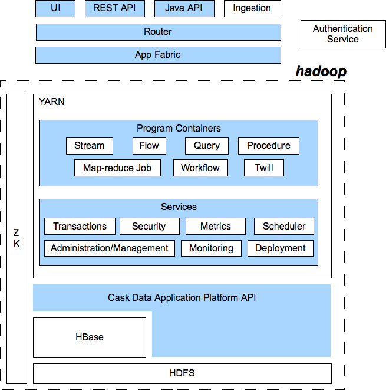

.. ==============================
.. Cask Data Application Platform
.. ==============================

|(Cask)|

Cask Data Application Platform
------------------------------

Why is Hadoop hard?
.................................

Though Apache Hadoop |(TM)| has demonstrated its value in many use-cases, developers spend too much time
working with infrastructure issues instead of their core concerns. As a consequence,
Hadoop will never be a mainstream technology for data applications unless that can be changed.

If you are building a data application and managing enterprise-scale data, 
you will need to address:

- Consistency of data
- Scalability of performance and storage
- Monitoring and management
- Security of access and modification
- and so forth...

Consistency of data can be handled by using a platform providing transactions. 
Scalability requires elastic scale.
Monitoring and management requires logging, metrics and a testing and debugging framework.
Security requires authentication and the handling of credentials.

To do all of this, you'll need to build an entire platform that provides an infrastructure for Hadoop.

A Platform for Data Applications 
................................

The Cask Data Application Platform (DAP) is an application server providing such a
platform for the development, deployment and management of data applications and the
management of data.

Out-of-the-box, its features include transaction management, dataset abstractions, QoS,
performance, scalability, security, metrics and log collection, service discovery and a 
web-based management dashboard.

DAP's container model allows for the integration of different processing paradigms with these
features. It provides a common environment, the abstraction of a unified API, the lifecycle management
and a programming model for data applications and their data. 

You can run applications ranging from simple Map-reduce jobs through complete ETL (extract, transform, load) 
pipelines all the way up to complex, enterprise-scale data-intensive applications. 
Developers can build and test their applications end-to-end in a full-stack single-node
installation. Cask DAP can be run either standalone, deployed within the Enterprise or hosted in the Cloud. 

How It Works
--------------------------------

Cask DAP functions as a middle-tier application platform. As seen in the diagram below,
it provides an interface (using either HTTP REST or Java APIs) to clients through a Router 
along with services and features that run inside YARN containers in Hadoop.

These services and features include:

- **Dataset Abstractions:** with transactions provided by using Cask Tephra, these 
  abstractions provide generic, reusable Java implementations of common data patterns;

- **Streams:** the realtime means for bringing data from external systems into the Server;

- **Realtime Processing using Flows:** developer-implemented, real-time Stream processors,
  comprised of one or more *Flowlets* wired together into a directed acyclic graph;

- **Batch Processing:** using Map-reduce Jobs and Workflow Schedules, as in conventional
  Hadoop systems;

- **Ad-Hoc SQL Queries:** for datasets that implement methods for obtaining the schema
  and scanning the data record by record, you can access and query data using SQL;

- **Stored Procedures:** allowing synchronous calls into the Server from an external system
  and the performance of server-side processing on-demand, similar to a stored procedure in
  a traditional database;

- **Metrics, Logging and Monitoring:** system and user-defined metrics, along with standard
  SLF4J logs, a testing framework and the ability to attach a remote debugger;

- **Management Dashboard:** available for deploying, querying and managing the Server;

- **Different Runtimes:** single-node (useful for learning, prototyping and testing),
  Sandbox (hosted in the cloud) and Enterprise;

- **YARN containers:** services are run in YARN containers in Hadoop, providing access to
  HBase and HDFS, and the scalability and performance of Hadoop without the complexity. 

Getting Started
--------------------------------

You can get started with Cask DAP by building directly from the latest source code::

  git clone https://github.com/cask/dap.git
  cd dap
  mvn clean package

After the build completes, you will have a distribution of the Cask DAP Single-node SDK under the
``dap-distribution/target/`` directory.  

(To build for installation on a Hadoop Cluster, see the 
`Cask Building and Installation Guide <http://cask.com/developers/docs/dap/current/en/install.html>`__,
a copy of which is included in the source distribution in ``/docs/developer-guide/source/install.rst``.)

Take the ``dap-<version>.tar.gz`` file and unzip it into a suitable location.

Step 1: Installation and Startup
................................
Start the Cask DAP from a command line in the SDK directory:...

Step 2: The Dashboard
......................
When you first open the Dashboard, you'll be greeted by:...

Step 3: Inject Data
...................
Click on the Flow name (LogAnalyticsFlow),...
 
Step 4: Query Procedure
......................................
Now let’s see the results of our event....
 
Step 5: Modify the Code
......................................
Now let’s try something different....
 
Step 6: Redeploy and Restart
......................................
We now need to stop the existing Application. ...

Step 7: Checkout the Results
......................................
Click on the name of the Procedure ...

Step 8: Stop the Server
......................................
To stop the Server...

Where to Go Next
----------------

Now that you've had a look at Cask DAP SDK, take a look at:

- Examples, located in the ``/examples`` directory of the Cask DAP SDK;
- Selected Examples (demonstrating basic features of the Cask DAP) are located on-line, at
  <http://cask.com/developers/docs/dap/current/en/examples.html
- Developer Guides, located in the source distribution in ``/docs/developer-guide/source``
  or online at `<http://cask.com/developers/docs/dap/current/en/index.html>`__;

How to Contribute
-----------------

Interested in helping to improve Cask DAP? We welcome all contributions, whether in filing detailed
bug reports, submitting pull requests for code changes and improvements, or by asking questions and
assisting others on the mailing list.

Bug Reports & Feature Requests
..............................

Bugs and tasks are tracked in a public JIRA issue tracker. Details on access will be forthcoming.

Pull Requests
.............
We have a simple pull-based development model with a consensus-building phase, similar to Apache's
voting process. If you’d like to help make Cask DAP better by adding new features, enhancing existing
features, or fixing bugs, here's how to do it:

#. If you are planning a large change or contribution, discuss your plans on the ``cask-dap-dev``
   mailing list first.  This will help us understand your needs and best guide your solution in a
   way that fits the project.
#. Fork Cask DAP into your own GitHub repository.
#. Create a topic branch with an appropriate name.
#. Work on the code to your heart's content.
#. Once you’re satisfied, create a pull request from your GitHub repo (it’s helpful if you fill in
   all of the description fields).
#. After we review and accept your request, we’ll commit your code to the cask/dap
   repository.

Thanks for helping to improve Cask DAP!

Mailing List
............

Cask DAP User Group and Development Discussions: `cask-dap-dev@googlegroups.com 
<https://groups.google.com/d/forum/cask-dap-dev>`__

License and Trademarks
----------------------

Licensed under the Apache License, Version 2.0 (the "License"); you may not use this file except
in compliance with the License. You may obtain a copy of the License at

http://www.apache.org/licenses/LICENSE-2.0

Unless required by applicable law or agreed to in writing, software distributed under the License
is distributed on an "AS IS" BASIS, WITHOUT WARRANTIES OR CONDITIONS OF ANY KIND, either express
or implied. See the License for the specific language governing permissions and limitations under
the License.

Cask, Cask DAP and Cask Data Application Platform are trademarks of Cask, Inc. All rights reserved.

Apache, Apache HBase, and HBase are trademarks of The Apache Software Foundation. Used with permission. 
No endorsement by The Apache Software Foundation is implied by the use of these marks.

.. |(TM)| unicode:: U+2122 .. trademark sign
   :trim:

.. |(Cask)| image:: docs/_images/Cask_DAP.png

