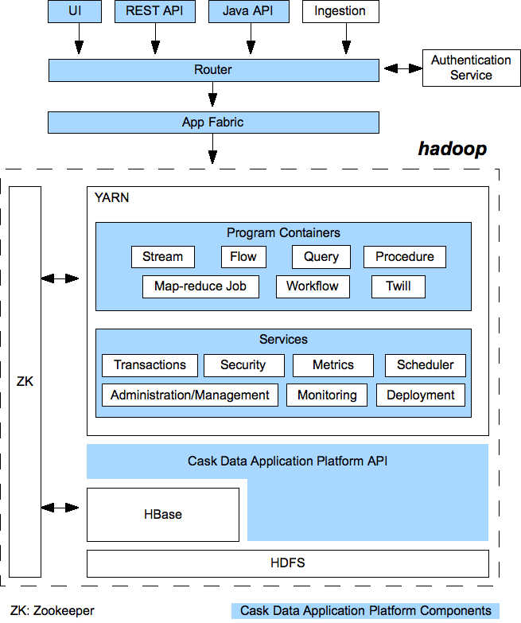

.. ==============================
.. Cask Data Application Platform
.. ==============================

|(Cask)|

Cask Data Application Platform
------------------------------

Why is Hadoop hard?
.................................

Though Apache Hadoop |(TM)| has demonstrated its value in many use-cases, developers spend too much time
working with infrastructure issues instead of their core concerns. As a consequence,
Hadoop will never be a mainstream technology for data applications unless that can be changed.

If you are building a data application and managing enterprise-scale data, 
you will need to address:

- Consistency of data
- Scalability of performance and storage
- Monitoring and management
- Security of access and modification
- and so forth...

Consistency of data can be handled by using a platform providing transactions. 
Scalability requires elastic scale.
Monitoring and management requires logging, metrics and a testing and debugging framework.
Security requires authentication and the handling of credentials.

To do all of this, you'll need to build an entire platform that provides an infrastructure for Hadoop.

A Platform for Data Applications 
................................

The Cask Data Application Platform (CDAP) is an application server providing such a
platform for the development, deployment and management of data applications and the
management of data.

Out-of-the-box, its features include transaction management, dataset abstractions, QoS,
performance, scalability, security, metrics and log collection, service discovery and a 
web-based management dashboard.

CDAP provides abstractions over Hadoop that do not require understanding the implementation or the 
complexity of Hadoop, HBase or Zookeeper. It provides independence of Hadoop versions, and runs on
any distribution of Hadoop.

CDAP's container model allows for the integration of different processing paradigms with these
features. It provides a common environment, the abstraction of a unified API, the lifecycle management
and a programming model for data applications and their data. You can package, deploy and 
manage applications as a single unit.

You can run applications ranging from simple MapReduce Jobs through complete ETL (extract, transform, and load) 
pipelines all the way up to complex, enterprise-scale data-intensive applications. 
Developers can build and test their applications end-to-end in a full-stack, single-node
installation. CDAP can be run either standalone, deployed within the Enterprise or hosted in the Cloud.

How It Works
--------------------------------

CDAP functions as a middle-tier application platform. As seen in the diagram below,
it provides an interface (using either HTTP REST or Java APIs) to clients through a Router 
along with services and features that run inside YARN containers in Hadoop.

These services and features include:

- **Dataset Abstractions:** with transactions provided by using Cask Tephra, these 
  abstractions provide generic, reusable Java implementations of common data patterns;

- **Streams:** the realtime means for bringing data from external systems into the Server;

- **Realtime Processing using Flows:** developer-implemented, real-time Stream processors,
  comprised of one or more *Flowlets* wired together into a directed acyclic graph;

- **Batch Processing:** using MapReduce Jobs and Workflow Schedules, as in conventional
  Hadoop systems;

- **Ad-Hoc SQL Queries:** for datasets that implement methods for obtaining the schema
  and scanning the data record by record, you can access and query data using SQL;

- **Stored Procedures:** allowing synchronous calls into the Server from an external system
  and the performance of server-side processing on-demand, similar to a stored procedure in
  a traditional database;

- **Metrics, Logging and Monitoring:** system and user-defined metrics, along with standard
  SLF4J logs, a testing framework and the ability to attach a remote debugger;

- **Management Dashboard:** available for deploying, querying and managing the Server;

- **Different Runtimes:** single-node (useful for learning, prototyping and testing),
  Sandbox (hosted in the cloud) and Enterprise;

- **YARN containers:** services are run in YARN containers in Hadoop, providing access to
  HBase and HDFS, giving the scalability and performance of Hadoop without the complexity. 

Getting Started
--------------------------------

You can get started with CDAP by building directly from the latest source code::

  git clone https://github.com/cask/cdap.git
  cd cdap
  mvn clean package

After the build completes, you will have a distribution of the CDAP Single-node SDK under the
``cdap-distribution/target/`` directory.  

[To build for installation on a Hadoop Cluster, see the 
`CDAP Building and Installation Guide <http://cask.com/developers/docs/cdap/current/en/install.html>`__,
a copy of which is included in the source distribution in ``/docs/developer-guide/source/install.rst``.]

Take the ``cdap-<version>.tar.gz`` file and unzip it into a suitable location.

Step 1: Installation and Startup
................................
Start the CDAP Server from a command line in the SDK directory::

	$ bin/server.sh start

Or, on Windows::

	> bin\server.bat start

View the Server Dashboard in a browser window::

	http://localhost:9999

Take the tour: you will be guided through the Dashboard, injecting HTTP log events and 
querying a Procedure to get a count of status codes.

Step 2: The Dashboard
.....................
When you first open the Dashboard, you'll be greeted with:

.. image:: /docs/_images/overview.png
   :width: 4in
   :align: center
   
Click on the name of the Application (**ResponseCodeAnalytics**) to view the running Application. 
The Application has each of the Server's components:

- Collect: a Stream *logEventStream*
- Process: a Flow *LogAnalyticsFlow*
- Store: a Table *statusCodeTable*
- Query: a Procedure *StatusCodeProcedure*

Notice that Collect and Store elements are named using "camel-case",
while Process and Query elements are named using "leading-case"; the former indicates
the code is using an instance of a class,
while the latter indicates that the code is implementing a class.

Step 3: Inject Data
...................
Click on the Flow name (**LogAnalyticsFlow**), and you will be guided through clicking on a Stream icon
to add an Event to the Flow. We've pre-populated the injector with an Apache log line such as
(broken to fit)::

	165.225.156.91 - - [09/Jan/2014:21:28:53 -0400] "GET /index.html HTTP/1.1" 
         200 225 "http://cask.com" "Mozilla/4.08 [en] (Win98; I ;Nav)"

Once you inject the Event, if you leave the dialog box open, you can see it passing through the Flow 
on the real-time graph of *Events Per Second*. (Depending on the load on your computer, it might take 
as long as a second for the event to show up.) Close the dialog when you're done and click on the Application 
link in the upper-left corner to return to the Application Overview.

Step 4: Query Procedure
.......................
Now let's see the results of our event.

Click on the name of the Procedure (**StatusCodeProcedure**) to go to the Query view. You will be guided
through entering a method name (``getCounts``) and the method results will be returned, such as::

	{"200":1}

This indicates that for status code *200* ("The request has succeeded"), 1 event was received.
If you performed more than one injection, your results will be different. The total should
match the number of injections you made.

Step 5: Modify The Code
.......................
Now let's try something different. In addition to being able to count the number of hits on
different status codes, we'd like to be able to list all the unique client IP addresses and their counts.

We'll update the code, stop the Application, redeploy it, restart its Flow and Procedure,
and inject additional events. We'll test our modifications to the Procedure to see new statistics.

To build the example, we've included a `maven <http://maven.apache.org>`_ file. It's located in
the Application's source code directory (``/examples/ResponseCodeAnalytics``). Run (from within the source
code directory ``/examples/ResponseCodeAnalytics``) the command::

	mvn clean package

to build the .JAR file for deploying the application.

(On Windows, `these instructions <http://maven.apache.org/guides/getting-started/windows-prerequisites.html>`__
may help with problems using maven.)

Open the source file (*ResponseCodeAnalyticsApp.java*) in your preferred editor,
and make the following changes.

After the line ``private OutputEmitter<Integer> output;`` insert this code::

	// Emitter for emitting client IP address to the next Flowlet
	@Output("clientIps")
	private OutputEmitter<String> outputClientIP;

This will define an emitter *clientIps* that we'll send the client IPs out on.

After the line ``output.emit(Integer.parseInt(matcher.group(6)));`` insert::

	// Emit the IP address to the next connected Flowlet
	outputClientIP.emit(matcher.group(1));

This will implement the emitter *clientIps* and send the client IP address to the
downstream Flowlet.

Add to the class ``LogCountFlowlet`` the following ``count`` method::

    // Annotation indicates that this method can process incoming data
    @ProcessInput
    public void count(String ip) {
    
      // Increment the number of occurrences of the client IP address by 1
      statusCodes.increment(Bytes.toBytes("clientIPKey"), Bytes.toBytes(ip), 1L);
    }

This new method that will count IP address occurrences.

To the class ``StatusCodeProcedure``, add the following ``getClientIPCounts`` method::

    @Handle("getClientIPCounts")
    public void getClientIPCounts(ProcedureRequest request, 
                                  ProcedureResponder responder) throws IOException {
      Map<String, Long> statusCountMap = new HashMap<String, Long>();
      Row row = statusCodes.get(Bytes.toBytes("clientIPKey"));

      // Get the row using the row key
      if (row != null) {
      
        // Get the number of occurrences of each client IP address
        for (Map.Entry<byte[], byte[]> colValue : row.getColumns().entrySet()) {
          statusCountMap.put(Bytes.toString(colValue.getKey()), 
                             Bytes.toLong(colValue.getValue()));
        }
      }
      // Send response in JSON format
      responder.sendJson(statusCountMap);
    }

The new ``getClientIPCounts`` method that will query the Dataset (storage) for the IP address occurrences.

After you make your code changes to *ResponseCodeAnalyticsApp.java*, you can build the .JAR file by running::

	mvn clean package

Step 6: Redeploy and Restart
............................
We now need to stop the existing Application. Bring up the Application's Overview (by clicking on the
*Overview* button in  the left sidebar, and selecting the Application's name from the list, 
or by clicking on the Application name *ResponseCodeAnalytics*, if it is in the top title bar,
if you are in an Element detail). Click the **Stop** buttons on the right side of the
*Process* and *Query* sections. This will stop the Flow and Procedure. You can tell by the
labels underneath the names of the Flow and Procedures.

Now, redeploy the Application. Return to the Server Overview (via the *Overview* button) and click the
*Load An App* button. Browse for the .JAR file (located in 
``/examples/ResponseCodeAnalytics/target``, and select it. The Application will be deployed.

Restart the Flow and Procedure by clicking on the Application name to return to the 
Application's overview, and click the *Start* buttons for both the ``LogAnalyticsFlow`` and the ``StatusCodeProcedure``.

Inject an event or two by following the practice described in `Step 3: Inject Data`_ to generate new entries with client IP
addresses in the DataStore.

Step 7: Checkout the Results
............................
Click on the name of the Procedure (**StatusCodeProcedure**) to go to the Query view.
This time, use the method you added (``getClientIPCounts``) to find out the unique client IP addresses
and their counts::

	{"165.225.156.91":1}

Of course, if you have performed additional injections, your results will be different.
The total should match the number of injections you made after you restarted the application.

Step 8: Stop the Server
.......................
To stop the CDAP Server when you are finished::

	$ bin/server.sh stop

Or, on Windows::

	> bin\server.bat stop

Where to Go Next
----------------

Now that you've had a look at CDAP SDK, take a look at:

- Examples, located in the ``/examples`` directory of the CDAP SDK;
- Selected Examples (demonstrating basic features of the CDAP) are located on-line, at
  <http://cask.com/developers/docs/cdap/current/en/examples.html
- Developer Guides, located in the source distribution in ``/docs/developer-guide/source``
  or online at `<http://cask.com/developers/docs/cdap/current/en/index.html>`__;

How to Contribute
-----------------

Interested in helping to improve CDAP? We welcome all contributions, whether in filing detailed
bug reports, submitting pull requests for code changes and improvements, or by asking questions and
assisting others on the mailing list.

Bug Reports & Feature Requests
..............................

Bugs and tasks are tracked in a public JIRA issue tracker. Details on access will be forthcoming.

Pull Requests
.............
We have a simple pull-based development model with a consensus-building phase, similar to Apache's
voting process. If you’d like to help make CDAP better by adding new features, enhancing existing
features, or fixing bugs, here's how to do it:

#. If you are planning a large change or contribution, discuss your plans on the ``cask-cdap-dev``
   mailing list first.  This will help us understand your needs and best guide your solution in a
   way that fits the project.
#. Fork CDAP into your own GitHub repository.
#. Create a topic branch with an appropriate name.
#. Work on the code to your heart's content.
#. Once you’re satisfied, create a pull request from your GitHub repo (it’s helpful if you fill in
   all of the description fields).
#. After we review and accept your request, we’ll commit your code to the cask/cdap
   repository.

Thanks for helping to improve CDAP!

Mailing List
............

CDAP User Group and Development Discussions: `cask-cdap-dev@googlegroups.com 
<https://groups.google.com/d/forum/cask-cdap-dev>`__

License and Trademarks
----------------------

Licensed under the Apache License, Version 2.0 (the "License"); you may not use this file except
in compliance with the License. You may obtain a copy of the License at

http://www.apache.org/licenses/LICENSE-2.0

Unless required by applicable law or agreed to in writing, software distributed under the License
is distributed on an "AS IS" BASIS, WITHOUT WARRANTIES OR CONDITIONS OF ANY KIND, either express
or implied. See the License for the specific language governing permissions and limitations under
the License.

Cask, CDAP, Cask DAP and Cask Data Application Platform are trademarks of Cask, Inc. All rights reserved.

Apache, Apache HBase, and HBase are trademarks of The Apache Software Foundation. Used with permission. 
No endorsement by The Apache Software Foundation is implied by the use of these marks.

.. |(TM)| unicode:: U+2122 .. trademark sign
   :trim:

.. |(Cask)| image:: docs/_images/CDAP.png

