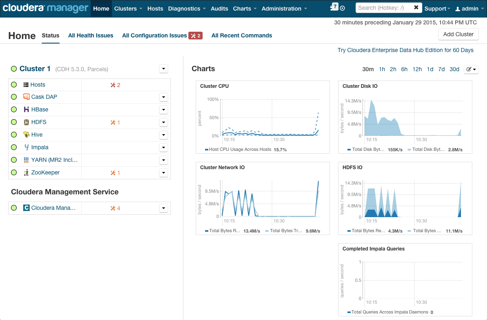

.. meta::
    :author: Cask Data, Inc.
    :copyright: Copyright © 2016 Cask Data, Inc.

:section-numbering: true

.. _admin-installation-cloudera:

===================================
Installation using Cloudera Manager
===================================

.. include:: ../_includes/installation/installation-steps-images.txt

Preparing the Cluster
=====================

Roles and Dependencies
----------------------
The CDAP CSD (`Custom Service Descriptor 
<http://www.cloudera.com/content/www/en-us/documentation/enterprise/latest/topics/cm_mc_addon_services.html#concept_qbv_3jk_bn_unique_1>`__)
consists of four mandatory roles and two optional roles:

.. list-table::
   :widths: 20 80
   :header-rows: 1

   * - CSD Role
     - Description
   * - CDAP Master Service
     - Service for managing runtime, lifecycle and resources of CDAP applications
   * - CDAP Gateway/Router Service
     - Service supporting REST endpoints for CDAP
   * - CDAP Kafka Service
     - Metrics and logging transport service, using an embedded version of *Kafka*
   * - CDAP UI Service
     - User interface for managing CDAP applications
   * - CDAP Security Auth Service
     - Performs client authentication for CDAP when security is enabled (*optional*)
   * - Gateway
     - `Cloudera Manager Gateway Role 
       <http://www.cloudera.com/content/www/en-us/documentation/enterprise/latest/topics/cm_mc_managing_roles.html>`__
       that installs the CDAP client tools (such as the *CDAP CLI*) and configuration (*optional*)

These roles map to the :ref:`CDAP components <admin-manual-cdap-components>` of the same name.

- Note that the *CDAP Gateway/Router Service* is not a `Cloudera Manager Gateway Role 
  <http://www.cloudera.com/content/www/en-us/documentation/enterprise/latest/topics/cm_mc_managing_roles.html>`__
  but is instead another name for the CDAP Router Service.

- As CDAP depends on HDFS, YARN, HBase, ZooKeeper, and (optionally) Hive and Spark, it must be placed
  on a cluster host with full client configurations for these dependent services. 

- The CDAP Master role must be co-located on a cluster host with an HDFS Gateway, a YARN
  Gateway, an HBase Gateway, and |---| optionally |---| Hive or Spark Gateways.

- Note that these Gateways are redundant if you are co-locating the CDAP Master role 
  on a cluster host (or hosts, in the case of a deployment with high availability) with
  actual services, such as the HDFS Namenode, the YARN resource manager, or the HBase
  Master.

- All services run as the ``'cdap'`` user installed by the parcel.

.. Node.js Installation
.. --------------------
.. include:: /../target/_includes/cloudera-installation.rst
    :start-after: .. _cloudera-install-node-js:
    :end-before: .. _cloudera-install-packaging:

.. Hadoop Configuration
.. --------------------
.. include:: ../_includes/installation/hadoop-configuration.txt

You can make these changes `using Cloudera Manager 
<http://www.cloudera.com/content/www/en-us/documentation/enterprise/latest/topics/cm_mc_mod_configs.html>`__.
You will be prompted to restart the stale services after making changes.

.. HDFS Permissions
.. ----------------
.. include:: ../_includes/installation/hdfs-permissions.txt

Downloading and Distributing Packages
=====================================

.. _cloudera-installation-download:

Downloading and Installing CSD
------------------------------
To install CDAP on a cluster managed by Cloudera, we have available a Custom Service
Descriptor (CSD) which you can install onto your CM server. This adds CDAP to the list of
available services which CM can install. 

.. _cloudera-compatibility-matrix:

+---------------------------------------------------------------------------------------+
| Supported Cloudera Manager (CM) and Cloudera Data Hub (CDH) Distributions             |
+------------+-----------------------+---------------------+----------------------------+
| CM Version | CDH Version           | CSD Version         |  CDAP Parcel Version       |
+============+=======================+=====================+============================+
| 5.5        | 5.5.x                 | 3.3.x               | *Matching CSD major.minor* | 
+------------+-----------------------+---------------------+----------------------------+
| 5.5        | 5.4.x                 | 3.1.x through 3.3.x | *Matching CSD major.minor* |
+------------+-----------------------+---------------------+----------------------------+
| 5.5        | no greater than 5.3.x | 3.0.x through 3.3.x | *Matching CSD major.minor* |
+------------+-----------------------+---------------------+----------------------------+
|                                                                                       |
+------------+-----------------------+---------------------+----------------------------+
| 5.4        | 5.4.x                 | 3.1.x through 3.3.x | *Matching CSD major.minor* | 
+------------+-----------------------+---------------------+----------------------------+
| 5.4        | no greater than 5.3.x | 3.0.x through 3.3.x | *Matching CSD major.minor* | 
+------------+-----------------------+---------------------+----------------------------+
|                                                                                       |
+------------+-----------------------+---------------------+----------------------------+
| 5.3        | no greater than 5.3.x | 3.0.x through 3.1.x | *Matching CSD major.minor* |
+------------+-----------------------+---------------------+----------------------------+
| 5.2        | no greater than 5.2.x | 3.0.x through 3.1.x | *Matching CSD major.minor* |
+------------+-----------------------+---------------------+----------------------------+
| 5.1        | no greater than 5.1.x | *Not supported*     | |---|                      | 
+------------+-----------------------+---------------------+----------------------------+

**Notes:**

- Cloudera Manager supports `a version of CDH no greater than its own 
  <http://www.cloudera.com/documentation/enterprise/latest/topics/pcm_cdh_cm.html>`__
  (for example, CM version 5.1 supports CDH versions less than or equal to 5.1).
  
- The version of the CDAP Parcel that is used should match the CSD major.minor version.

**Steps:**

#. Download the CDAP CSD by `downloading the JAR file 
   <http://cask.co/resources/#cdap-integrations>`__.
   Details on CSDs and Cloudera Manager Extensions are `available online 
   <https://github.com/cloudera/cm_ext/wiki>`__.

   .. _cloudera-installation-csd:

#. Install the CSD following the instructions at Cloudera's website on `Add-on Services
   <http://www.cloudera.com/content/cloudera/en/documentation/core/latest/topics/cm_mc_addon_services.html>`__, 
   using the instructions given for the case of installing software in the form of a parcel.
   In this case, you install the CSD first and then install the parcel second.

.. _cloudera-installation-download-distribute-parcel:

Downloading and Installing Parcels
----------------------------------
Download and distribute the CDAP-|version| parcel. Complete instructions on parcels are
available at `Cloudera's website
<http://www.cloudera.com/content/cloudera/en/documentation/core/latest/topics/
cm_ig_parcels.html>`__, but in summary these are the steps:
   
1. Installing the CSD adds the corresponding Cask parcel repository for you; however, you can 
   `customize the list of repositories 
   <http://www.cloudera.com/content/cloudera/en/documentation/core/latest/topics/cm_ig_parcels.html#cmug_topic_7_11_5_unique_1>`__
   searched by Cloudera Manager if you need to;
#. `Download 
   <http://www.cloudera.com/content/cloudera/en/documentation/core/latest/topics/cm_ig_parcels.html#concept_vwq_421_yk_unique_1__section_cnx_b3y_bm_unique_1>`__
   the parcel to your Cloudera Manager server;
#. `Distribute 
   <http://www.cloudera.com/content/cloudera/en/documentation/core/latest/topics/cm_ig_parcels.html#concept_vwq_421_yk_unique_1__section_sty_b3y_bm_unique_1>`__
   the parcel to all the servers in your cluster; and
#. `Activate 
   <http://www.cloudera.com/content/cloudera/en/documentation/core/latest/topics/cm_ig_parcels.html#concept_vwq_421_yk_unique_1__section_ug1_c3y_bm_unique_1>`__
   the parcel.

**Notes:**

- If the Cask parcel repository is inaccessible to your cluster, please see :ref:`these
  suggestions <faqs-cloudera-direct-parcel-access>`.
- The CDAP parcels are hosted at a repository determined by the CDAP version.
  For instance, the CDAP |short-version| parcel metadata is accessed by Cloudera Manager at this URL:
  
  .. parsed-literal::
  
    \http://repository.cask.co/parcels/cdap/|short-version|\ /manifest.json

Installing CDAP Services
========================

These instructions show how to use the Cloudera Manager Admin Console *Add Service* Wizard
to install and start CDAP. Note that the screens of the wizard will vary depending on
which version of Cloudera Manager and CDAP you are using.

.. _cloudera-add-a-service:

Add CDAP Service
----------------
Start from the Cloudera Manager Admin Console's *Home* page, selecting *Add a Service* from the menu for your cluster:

.. figure:: ../_images/cloudera/cloudera-csd-01.png
   :figwidth: 100%
   :width: 800px
   :align: center
   :class: bordered-image

   **Cloudera Manager:** Starting the *Add Service* Wizard.

.. _cloudera-add-service-wizard:

Add Service Wizard: Selecting CDAP
----------------------------------

Use the *Add Service* Wizard and select *Cask DAP*.

.. figure:: ../_images/cloudera/cloudera-csd-02.png
   :figwidth: 100%
   :width: 800px
   :align: center
   :class: bordered-image

   **Add Service Wizard:** Selecting CDAP (Cask DAP) as the service to be added.

Add Service Wizard: Specifying Dependencies
-------------------------------------------

The **Hive dependency** is for the CDAP "Explore" component, which is enabled by default.
Note that if you do not select Hive, you will need to disable CDAP Explore in a later page
when you review these changes.

.. figure:: ../_images/cloudera/cloudera-csd-03.png
   :figwidth: 100%
   :width: 800px
   :align: center
   :class: bordered-image

   **Add Service Wizard, Page 1:** Setting the dependencies (in this case, including Hive).
   

Add Service Wizard: Customize Role Assignments
----------------------------------------------

**Customize Role Assignments:** Ensure the CDAP Master role is assigned to hosts colocated
with service *or* gateway roles for HBase, HDFS, YARN, and (optionally) Hive and Spark.

.. figure:: ../_images/cloudera/cloudera-csd-04.png
   :figwidth: 100%
   :width: 800px
   :align: center
   :class: bordered-image

   **Add Service Wizard, Page 3:** When customizing Role Assignments, the *CDAP Security
   Auth Service* can be added later, if required.
   

Add Service Wizard: Customize Role Assignments
----------------------------------------------

.. figure:: ../_images/cloudera/cloudera-csd-04b.png
   :figwidth: 100%
   :width: 800px
   :align: center
   :class: bordered-image

   **Add Service Wizard, Page 3:** Assigning the CDAP Master Role to a host with the
   HBase, HDFS, YARN, Hive, and Spark Gateway roles. It could also be on a host with
   running services instead.

Add Service Wizard: Customize Role Assignments
----------------------------------------------

.. figure:: ../_images/cloudera/cloudera-csd-04c.png
   :figwidth: 100%
   :width: 800px
   :align: center
   :class: bordered-image

   **Add Service Wizard, Page 3:** Completing assignments with CDAP Gateway client
   added to all nodes of the cluster including those with CDAP roles.
   

Add Service Wizard: Customize Role Assignments
----------------------------------------------

.. figure:: ../_images/cloudera/cloudera-csd-05.png
   :figwidth: 100%
   :width: 800px
   :align: center
   :class: bordered-image

   **Add Service Wizard, Page 3:** Completed role assignments.
   

Add Service Wizard: Reviewing Configuration
-------------------------------------------

**App Artifact Dir:** This should initially point to the bundled system artifacts included
in the CDAP parcel directory. If you have modified ``${PARCELS_ROOT}`` for your instance
of Cloudera Manager, please update this setting (*App Artifact Dir*) to match. You may
want to customize this directory to a location outside of the CDAP Parcel.

**Explore Enabled:** This needs to be disabled if you **didn't** select Hive earlier.

**Kerberos Auth Enabled:** This is needed if running on a secure Hadoop cluster.

**Router Bind Port, Router Server Port:** These two ports should match; *Router Server
Port* is used by the CDAP UI to connect to the CDAP Router service.

.. figure:: ../_images/cloudera/cloudera-csd-06.png
   :figwidth: 100%
   :width: 800px
   :align: center
   :class: bordered-image

   **Add Service Wizard, Page 4:** Reviewing changes and (initial) configuration.

**Additional CDAP configuration properties** can be added after using the Cloudera Manager's 
*Safety Valve* Advanced Configuration Snippets. Documentation of the available CDAP
properties is in the :ref:`appendix-cdap-site.xml`.

**Additional environment variables** can be set after, as required, using the Cloudera Manager's
"Cask DAP Service Environment Advanced Configuration Snippet (Safety Valve)".

At this point, the CDAP installation is configured and is ready to be installed. Review
your settings before continuing to the next step, which will install and start CDAP.

.. _cloudera-starting-services:

Starting CDAP Services
======================

Add Service Wizard: First Run of Commands
-----------------------------------------
Executing commands to install and automatically start CDAP services.

.. figure:: ../_images/cloudera/cloudera-csd-07.png
   :figwidth: 100%
   :width: 800px
   :align: center
   :class: bordered-image

   **Add Service Wizard, Page 5:** Finishing first run of commands to install and start CDAP.
   

Add Service Wizard: Completion Page
-----------------------------------

.. figure:: ../_images/cloudera/cloudera-csd-08.png
   :figwidth: 100%
   :width: 800px
   :align: center
   :class: bordered-image

   **Add Service Wizard, Page 7:** Congratulations screen, though there is still work to be done.

Cluster Home Page: Status Tab
-----------------------------

   **Cluster Home Page, Status Tab:** Showing all CDAP services running. *Gateway* is not an actual service.

Cluster Home Page: Configuring for Spark
----------------------------------------
**Including Spark:** If you are including Spark, the *Environment Advanced Configuration*
needs to contain the location of the Spark libraries, typically as
``SPARK_HOME=/opt/cloudera/parcels/CDH/lib/spark``.

**Additional environment variables** are set using the Cloudera Manager's
"Cask DAP Service Environment Advanced Configuration Snippet (Safety Valve)". 

.. figure:: ../_images/cloudera/cloudera-csd-10.png
   :figwidth: 100%
   :width: 800px
   :align: center
   :class: bordered-image

   **Cluster Home Page, Configuration Tab:** Adding *SPARK_HOME* environmental value using the *Service Environment
   Advanced Configuration Snippet (Safety Valve)*.

Cluster Home Page: Configuring for Spark
----------------------------------------
You will then have a stale configuration and need to restart the CDAP services.

.. figure:: ../_images/cloudera/cloudera-csd-11.png
   :figwidth: 100%
   :width: 800px
   :align: center
   :class: bordered-image

   **Cluster Home Page, Status Tab:** Stale configuration that requires restarting.

Cluster Home Page: Restarting CDAP
----------------------------------------

.. figure:: ../_images/cloudera/cloudera-csd-12.png
   :figwidth: 100%
   :width: 800px
   :align: center
   :class: bordered-image

   **Cluster Stale Configurations:** Restarting CDAP services.

Cluster Home Page: CDAP Services Restarted
------------------------------------------

.. figure:: ../_images/cloudera/cloudera-csd-13.png
   :figwidth: 100%
   :width: 800px
   :align: center
   :class: bordered-image

   **Cluster Stale Configurations:** CDAP services after restart.

.. _cloudera-verification:

Verification
============

Service Checks in Cloudera Manager
----------------------------------
After the Cloudera Manager Admin Console's *Add Service* Wizard completes, *Cask DAP* will
show in the list for the cluster where you installed it. You can select it, and go to the
*Cask DAP* page, with *Quick Links* and *Status Summary*. The lights of the *Status
Summary* should all turn green, showing completion of startup. 

The *Quick Links* includes a link to the **CDAP UI**, which by default is running on
port ``9999`` of the host where the UI role instance is running.

   **Cloudera Manager:** CDAP (Cask DAP) added to the cluster.
   
.. _cloudera-cdap-ui:

.. include:: /_includes/installation/smoke-test-cdap.txt

Advanced Topics
===============

.. _cloudera-configuration-security:

.. Enabling Perimeter Security
.. ---------------------------
.. include:: /../target/_includes/cloudera-configuration.rst
    :start-after: .. _cloudera-configuration-eps:

.. _cloudera-configuration-enabling-kerberos:

Enabling Kerberos
-----------------
For Kerberos-enabled Hadoop clusters:

- The ``'cdap'`` user needs to be granted HBase permissions to create tables.
  As the ``hbase`` user, issue the command::
 
    $ echo "grant 'cdap', 'RWCA'" | hbase shell

- The ``'cdap'`` user must be able to launch YARN containers, either by adding it to the YARN
  ``allowed.system.users`` or by adjusting the YARN ``min.user.id`` to include the ``cdap`` user.
  (Search for the YARN configuration ``allowed.system.users`` in Cloudera Manager, and then add
  the ``cdap`` user to the whitelist.)

Upgrading CDAP
--------------

Upgrading Patch Release Versions
................................
When a new compatible CDAP parcel is released, it will be available via the Parcels page
in the Cloudera Manager UI.

#. Stop all flows, services, and other programs in all your applications.

#. Stop CDAP services.

#. Use the Cloudera Manager UI to download, distribute, and activate the parcel on all
   cluster hosts.

#. Start CDAP services.

Upgrading Major/Minor Release Versions
......................................
Upgrading between major versions of CDAP involves the additional steps of upgrading the
CSD, and running the included CDAP Upgrade Tool. Upgrades between multiple Major/Minor
versions must be done consecutively, and a version cannot be skipped unless otherwise
noted.

The following is the generic procedure for Major/Minor version upgrades:

#. Stop all flows, services, and other programs in all your applications.

#. Stop CDAP services.

#. Ensure your installed version of the CSD matches the target version of CDAP. For
   example, CSD version 3.0.* is compatible with CDAP version 3.0.*.  Download `the latest
   version of the CSD <http://cask.co/resources/#cdap-integrations>`__.

#. Use the Cloudera Manager UI to download, distribute, and activate the corresponding
   CDAP parcel version on all cluster hosts.

#. Before starting services, run the Upgrade Tool to update any necessary CDAP table
   definitions. From the CDAP Service page, select "Run CDAP Upgrade Tool" from the
   Actions menu.

#. Start the CDAP services.  At this point it may be necessary to correct for any changes in
   the CSD.  For example, if new CDAP services were added or removed, you must add or
   remove role instances as necessary. Check the :ref:`release-specific upgrade notes
   <cloudera-release-specific-upgrade-notes>` below for any specific instructions.
   
#. After CDAP services have started, run the Post-Upgrade tool to perform any necessary
   upgrade steps against the running services.  From the CDAP Service page, select "Run CDAP
   Post-Upgrade Tasks."

#. To upgrade existing ETL applications created using the 3.2.x versions of ``cdap-etl-batch`` or 
   ``cdap-etl-realtime``, there is are :ref:`separate instructions on doing so <cdap-apps-etl-upgrade>`.

#. You must recompile and then redeploy your applications prior to using them.

Upgrading CDH
-------------

.. _cloudera-release-specific-upgrade-notes:

These steps cover upgrading the version of CDH of an existing CDAP installation.
As the different versions of CDH can use different versions of HBase, upgrading from
one version to the next can require that the HBase coprocessors be upgraded to the correct
version. The table below lists the different coprocessor package names managed by CDAP
for each version of CDH. If the version changes, you need to check that the version being
used has changed as described below.

+-------------+-------------------------------------+
| CDH Version | CDAP HBase Coprocessor Package Name |
+=============+=====================================+
| 5.5         | ``hbase10cdh550``                   |
+-------------+-------------------------------------+
| 5.4         | ``hbase10cdh``                      |
+-------------+-------------------------------------+
| 5.3         | ``hbase98``                         |
+-------------+-------------------------------------+
| 5.2         | ``hbase98``                         |
+-------------+-------------------------------------+
| 5.1         | |---|                               |
+-------------+-------------------------------------+

**For example:** CDH 5.3 ships with HBase 0.98 while CDH 5.4 ships with HBase 1.0. We support
CDH 5.4 as of CDAP 3.1.0 |---| however, upgrading the underlying CDH version is only supported
since CDAP 3.2.0. Therefore, before upgrading from CDH 5.3 to CDH 5.4, upgrade CDAP to version
3.2.0 or greater, following the normal upgrade procedure. Start CDAP at least once to make sure
it works properly, before you upgrade to CDH 5.4.

**It is important to perform these steps as described, otherwise the coprocessors may not
get upgraded correctly and HBase regionservers may crash.** In the case where something
goes wrong, see these troubleshooting instructions for :ref:`problems while upgrading CDH
<faqs-cloudera-troubleshooting-upgrade-cdh>`.

**Upgrade Steps**

1. If using Cloudera Manager (CM), stop all CDAP application and services
   as CM will have auto-started CDAP::
   
    $ for i in `ls /etc/init.d/ | grep cdap` ; do sudo service $i stop ; done

#. Disable all CDAP tables; from an HBase shell, run the command::

    > disable_all 'cdap.*'
    
#. Upgrade to the new version of CDH.
#. Stop all CDAP services, as CM will have (again) auto-started CDAP::

    $ for i in `ls /etc/init.d/ | grep cdap` ; do sudo service $i stop ; done

#. Run the CDAP Upgrade Tool, as the user that runs CDAP Master (the CDAP user)::

    $ /opt/cdap/master/bin/svc-master run co.cask.cdap.data.tools.UpgradeTool upgrade_hbase
    
#. Check if the coprocessor JARs for all CDAP tables have been upgraded to the correct version
   :ref:`as listed above <cloudera-release-specific-upgrade-notes>` by checking that 
   the coprocessor classnames are using the correct package |---| for example, if
   upgrading from CDH 5.3 to 5.4, the new coprocessor package is ``hbase10cdh`` and a
   classname using it would be
   ``co.cask.cdap.data2.transaction.coprocessor.hbase10cdh.DefaultTransactionProcessor``.
  
   Running this command in an HBase shell will give you table attributes::
  
    > describe 'cdap_system:app.meta'
    
   The resulting output will show the coprocessor classname; in this case, we are looking for
   the inclusion of ``hbase10cdh`` in the name::
  
    'cdap_system:app.meta', {TABLE_ATTRIBUTES => {coprocessor$1 =>
    'hdfs://server.example.com/cdap/cdap/lib/
    coprocessorb5cb1b69834de686a84d513dff009908.jar|co.cask.cdap.data2.transaction.
    coprocessor.hbase10cdh.DefaultTransactionProcessor|1073741823|', METADATA =>
    {'cdap.version' => '3.1.0...

   Note that some CDAP tables do not have any coprocessors. You only need to verify tables
   that **have** coprocessors.

#. Enable all CDAP tables; from an HBase shell, run this command::

    > enable_all 'cdap.*'
    
#. Start CDAP::

    $ for i in `ls /etc/init.d/ | grep cdap` ; do sudo service $i start ; done
