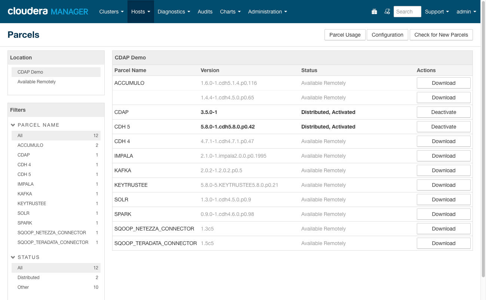
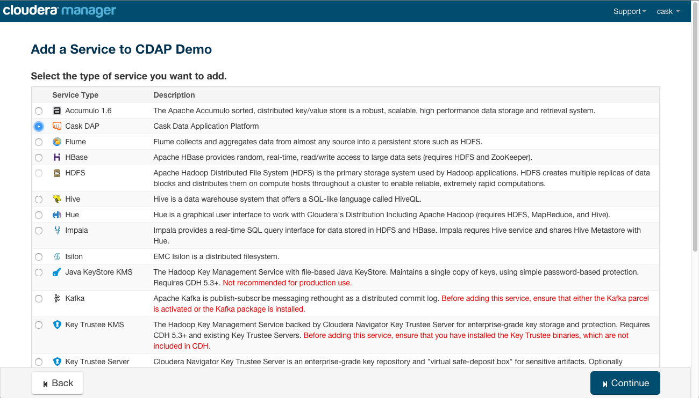
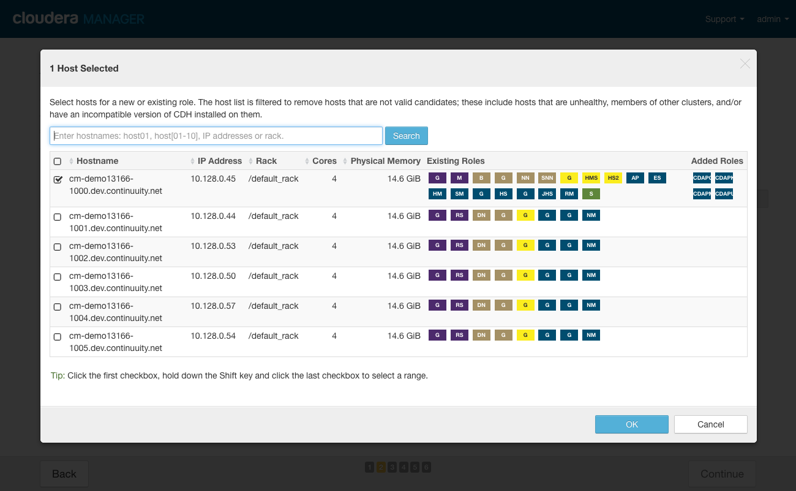
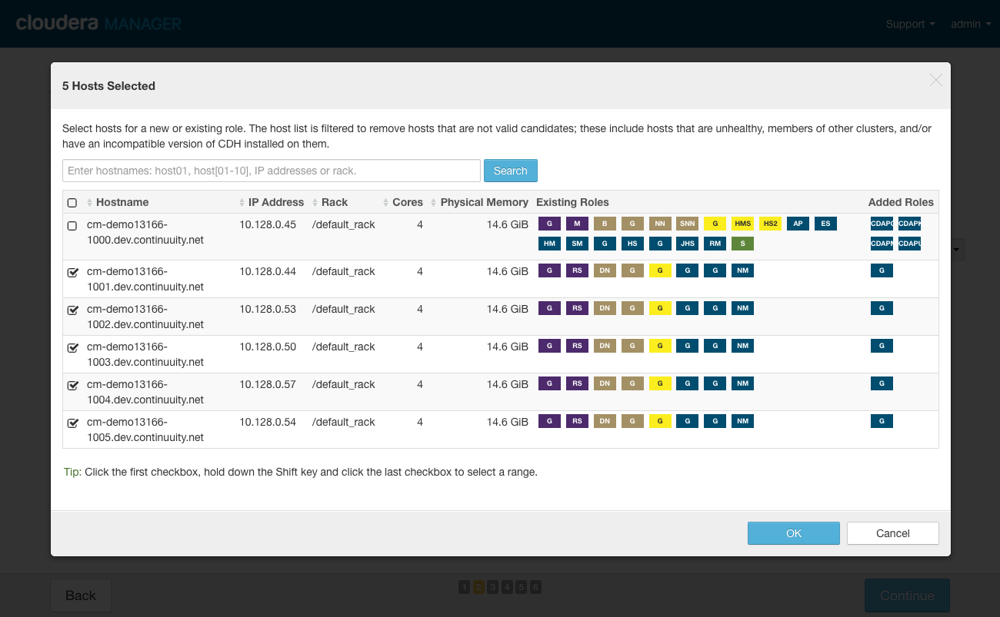
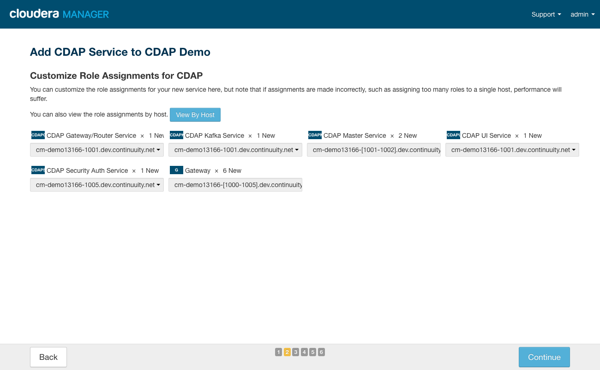
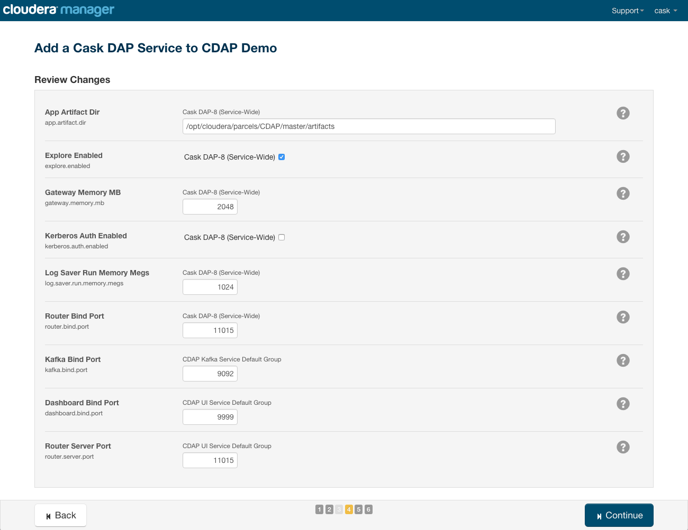
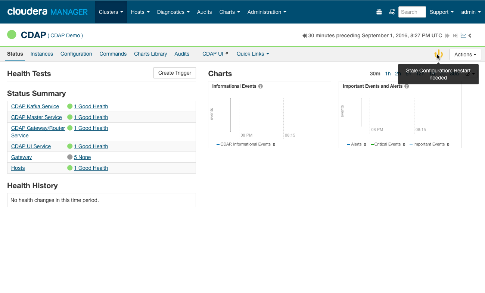
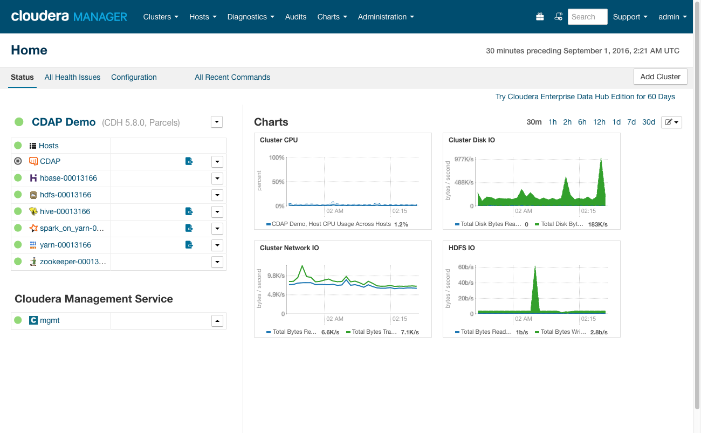
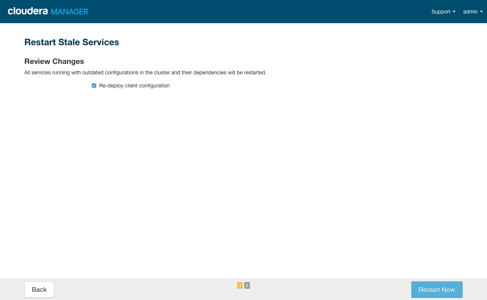

.. meta::
    :author: Cask Data, Inc.
    :copyright: Copyright © 2016 Cask Data, Inc.

:section-numbering: true

.. _admin-installation-cloudera:

===================================
Installation using Cloudera Manager
===================================

.. include:: ../_includes/installation/installation-steps-images.txt

Preparing the Cluster
=====================

Roles and Dependencies
----------------------
The CDAP CSD (`Custom Service Descriptor 
<http://www.cloudera.com/content/www/en-us/documentation/enterprise/latest/topics/cm_mc_addon_services.html#concept_qbv_3jk_bn_unique_1>`__)
consists of four mandatory roles and two optional roles:

.. list-table::
   :widths: 20 80
   :header-rows: 1

   * - CSD Role
     - Description
   * - CDAP Master Service
     - Service for managing runtime, lifecycle and resources of CDAP applications
   * - CDAP Gateway/Router Service
     - Service supporting REST endpoints for CDAP
   * - CDAP Kafka Service
     - Metrics and logging transport service, using an embedded version of *Kafka*
   * - CDAP UI Service
     - User interface for managing CDAP applications
   * - 
     - 
   * - CDAP Security Auth Service
     - Performs client authentication for CDAP when security is enabled (*optional*)
   * - Gateway
     - `Cloudera Manager Gateway Role 
       <http://www.cloudera.com/content/www/en-us/documentation/enterprise/latest/topics/cm_mc_managing_roles.html>`__
       that installs the CDAP client tools (such as the *CDAP CLI*) and configuration (*optional*)

These roles map to the :ref:`CDAP components <admin-manual-cdap-components>` of the same name.

- As CDAP depends on HDFS, YARN, HBase, ZooKeeper, and (optionally) Hive and Spark, it must be installed
  on cluster host(s) with full client configurations for these dependent services. 

- The CDAP Master Service role (or *CDAP Master*) must be co-located on a cluster host with an HDFS Gateway, a YARN
  Gateway, an HBase Gateway, and |---| optionally |---| Hive or Spark Gateways.

- Note that these Gateways are redundant if you are co-locating the CDAP Master role 
  on a cluster host (or hosts, in the case of a deployment with high availability) with
  actual services, such as the HDFS Namenode, the YARN resource manager, or the HBase
  Master.

- Note that the CDAP Gateway/Router Service is not a `Cloudera Manager Gateway Role 
  <http://www.cloudera.com/content/www/en-us/documentation/enterprise/latest/topics/cm_mc_managing_roles.html>`__
  but is instead another name for the CDAP Router Service.
  
- CDAP also provides its own Gateway role that can be used to install CDAP client
  configurations on other hosts of the cluster.

- All services run as the ``'cdap'`` user installed by the parcel.

.. Hadoop Configuration
.. --------------------
.. include:: ../_includes/installation/hadoop-configuration.txt

#. Add additional entries to the YARN Application Classpath for Spark jobs.

   If you plan on running Spark programs from CDAP, CDAP requires that additional entries be added to
   the YARN application classpath, as the Spark installed on Cloudera Manager clusters
   is a "Hadoop-less" build and does not include Hadoop jars required by Spark.

   To resolve this, go to the CM page for your cluster, click on the YARN service, click on
   the configuration tab, and then enter ``mapreduce.application.classpath`` in the search box.
   You will see entries similar to these::

     $HADOOP_MAPRED_HOME/*

     $HADOOP_MAPRED_HOME/lib/*

     $MR2_CLASSPATH

   Copy all the entries to the ``yarn.application.classpath`` configuration for YARN on your Cluster. 
   The ``yarn.application.classpath`` setting can be found by searching as mentioned above.

   Add the entries required by scrolling to the last entry in the classpath form,
   clicking the "+" button to add a new text box entry field at the end. Once you have
   added all the entries from the ``mapreduce.application.classpath`` to the
   ``yarn.application.classpath``, click on *Save*.

You can make these changes `using Cloudera Manager
<http://www.cloudera.com/content/www/en-us/documentation/enterprise/latest/topics/cm_mc_mod_configs.html>`__.
Please restart the stale services upon seeing a prompt to do so after making the above
changes.

.. HDFS Permissions
.. ----------------
.. include:: ../_includes/installation/hdfs-permissions.txt

Downloading and Distributing Packages
=====================================

.. _cloudera-installation-download:

Downloading and Installing CSD
------------------------------
To install CDAP on a cluster managed by Cloudera, we have available a Custom Service
Descriptor (CSD) which you can install onto your CM server. This adds CDAP to the list of
available services which CM can install. 

.. _cloudera-compatibility-matrix:

+---------------------------------------------------------------------------+
| Supported Cloudera Manager (CM) and Cloudera Data Hub (CDH) Distributions |
+------------+-----------------------+--------------------------------------+
| CM Version | CDH Version           | CDAP Parcel / CSD Version            |
+============+=======================+======================================+
| 5.8        | 5.8.x                 | |short-version-x|                    |
+------------+-----------------------+--------------------------------------+
|                                                                           |
+------------+-----------------------+--------------------------------------+
| 5.7        | 5.7.x                 | 3.4.x through |short-version-x|      |
+------------+-----------------------+--------------------------------------+
| 5.7        | 5.5.x through 5.6.x   | 3.3.x through |short-version-x|      |
+------------+-----------------------+--------------------------------------+
| 5.7        | 5.4.x                 | 3.1.x through |short-version-x|      |
+------------+-----------------------+--------------------------------------+
| 5.7        | no greater than 5.3.x | 3.0.x through |short-version-x|      |
+------------+-----------------------+--------------------------------------+
|                                                                           |
+------------+-----------------------+--------------------------------------+
| 5.6        | 5.5.x through 5.6.x   | 3.3.x through |short-version-x|      |
+------------+-----------------------+--------------------------------------+
| 5.6        | 5.4.x                 | 3.1.x through |short-version-x|      |
+------------+-----------------------+--------------------------------------+
| 5.6        | no greater than 5.3.x | 3.0.x through |short-version-x|      |
+------------+-----------------------+--------------------------------------+
|                                                                           |
+------------+-----------------------+--------------------------------------+
| 5.5        | 5.5.x                 | 3.3.x through |short-version-x|      |
+------------+-----------------------+--------------------------------------+
| 5.5        | 5.4.x                 | 3.1.x through |short-version-x|      |
+------------+-----------------------+--------------------------------------+
| 5.5        | no greater than 5.3.x | 3.0.x through |short-version-x|      |
+------------+-----------------------+--------------------------------------+
|                                                                           |
+------------+-----------------------+--------------------------------------+
| 5.4        | 5.4.x                 | 3.1.x through |short-version-x|      |
+------------+-----------------------+--------------------------------------+
| 5.4        | no greater than 5.3.x | 3.0.x through |short-version-x|      |
+------------+-----------------------+--------------------------------------+
|                                                                           |
+------------+-----------------------+--------------------------------------+
| 5.3        | no greater than 5.3.x | 3.0.x through 3.1.x                  |
+------------+-----------------------+--------------------------------------+
| 5.2        | no greater than 5.2.x | 3.0.x through 3.1.x                  |
+------------+-----------------------+--------------------------------------+
| 5.1        | no greater than 5.1.x | *Not supported*                      | 
+------------+-----------------------+--------------------------------------+

.. _cloudera-compatibility-matrix-end:

**Notes:**

- Cloudera Manager supports `a version of CDH no greater than its own 
  <http://www.cloudera.com/documentation/enterprise/latest/topics/pcm_cdh_cm.html>`__
  (for example, CM version 5.1 supports CDH versions less than or equal to 5.1).
  
- The version of the CDAP Parcel that is used should match the CSD major.minor version.

**Steps:**

#. Download the CDAP CSD by `downloading the JAR file 
   <http://cask.co/downloads/#cloudera>`__.
   Details on CSDs and Cloudera Manager Extensions are `available online 
   <https://github.com/cloudera/cm_ext/wiki>`__.

   .. _cloudera-installation-csd:

#. Install the CSD following the instructions at Cloudera's website on `Add-on Services
   <http://www.cloudera.com/content/cloudera/en/documentation/core/latest/topics/cm_mc_addon_services.html>`__, 
   using the instructions given for the case of installing software in the form of a parcel.
   In this case, you install the CSD first and then install the parcel second.

.. _cloudera-installation-download-distribute-parcel:

Downloading and Installing Parcels
----------------------------------
Download and distribute the CDAP-|version| parcel. Complete instructions on parcels are
available at `Cloudera's website
<http://www.cloudera.com/content/cloudera/en/documentation/core/latest/topics/
cm_ig_parcels.html>`__, but in summary these are the steps:
   
1. Installing the CSD adds the corresponding Cask parcel repository for you; however, you can 
   `customize the list of repositories 
   <http://www.cloudera.com/content/cloudera/en/documentation/core/latest/topics/cm_ig_parcels.html#cmug_topic_7_11_5_unique_1>`__
   searched by Cloudera Manager if you need to;
#. `Download 
   <http://www.cloudera.com/content/cloudera/en/documentation/core/latest/topics/cm_ig_parcels.html#concept_vwq_421_yk_unique_1__section_cnx_b3y_bm_unique_1>`__
   the parcel to your Cloudera Manager server;
#. `Distribute 
   <http://www.cloudera.com/content/cloudera/en/documentation/core/latest/topics/cm_ig_parcels.html#concept_vwq_421_yk_unique_1__section_sty_b3y_bm_unique_1>`__
   the parcel to all the servers in your cluster; and
#. `Activate 
   <http://www.cloudera.com/content/cloudera/en/documentation/core/latest/topics/cm_ig_parcels.html#concept_vwq_421_yk_unique_1__section_ug1_c3y_bm_unique_1>`__
   the parcel.

   **Cloudera Manager:** CDAP Parcels *Distributed, Activated* on a cluster.
   
**Notes:**

- If the Cask parcel repository is inaccessible to your cluster, please see :ref:`these
  suggestions <faqs-cloudera-direct-parcel-access>`.
- The CDAP parcels are hosted at a repository determined by the CDAP version.
  For instance, the CDAP |short-version| parcel metadata is accessed by Cloudera Manager at 
  :cask-repository-parcels-cdap:`this URL: <manifest.json>`
  
  .. parsed-literal::
  
    \http://repository.cask.co/parcels/cdap/|short-version|\ /manifest.json

Installing CDAP Services
========================

These instructions show how to use the Cloudera Manager Admin Console *Add Service* Wizard
to install and start CDAP. Note that the screens of the wizard will vary depending on
which version of Cloudera Manager and CDAP you are using.

.. _cloudera-add-a-service:

Add CDAP Service
----------------
Start from the Cloudera Manager Admin Console's *Home* page, selecting *Add Service* from the menu for your cluster:

.. figure:: ../_images/cloudera/cloudera-csd-01.png
   :figwidth: 100%
   :width: 800px
   :align: center
   :class: bordered-image

   **Cloudera Manager:** Starting the *Add Service* Wizard.

.. _cloudera-add-service-wizard:

Add Service Wizard: Selecting CDAP
----------------------------------

Use the *Add Service* Wizard and select *CDAP*.

   **Add Service Wizard:** Selecting CDAP as the service to be added.

Add Service Wizard: Specifying Dependencies
-------------------------------------------

The **Hive dependency** is for the CDAP "Explore" component, which is enabled by default.
Note that if you do not select Hive, you will need to disable CDAP Explore in a later page
when you review these changes.

.. figure:: ../_images/cloudera/cloudera-csd-03.png
   :figwidth: 100%
   :width: 800px
   :align: center
   :class: bordered-image

   **Add Service Wizard, Page 1:** Setting the dependencies (in this case, including Hive).
   

Add Service Wizard: Customize Role Assignments
----------------------------------------------

**Customize Role Assignments:** Ensure the CDAP Master role is assigned to hosts colocated
with service *or* gateway roles for HBase, HDFS, YARN, and (optionally) Hive and Spark.

.. figure:: ../_images/cloudera/cloudera-csd-04.png
   :figwidth: 100%
   :width: 800px
   :align: center
   :class: bordered-image

   **Add Service Wizard, Page 2:** When customizing Role Assignments, the *CDAP Security
   Auth Service* can be added later, if required.
   

Add Service Wizard: Customize Role Assignments
----------------------------------------------

   **Add Service Wizard, Page 2 (dialog):** Assigning the CDAP Master Role to a host with the
   HBase, HDFS, YARN, Hive, and Spark Gateway roles. It could also be on a host with
   running services instead.

Add Service Wizard: Customize Role Assignments
----------------------------------------------

   **Add Service Wizard, Page 2 (dialog):** Completing assignments with the CDAP Gateway client
   added to other nodes of the cluster; it can be added to nodes with CDAP roles.
   

Add Service Wizard: Customize Role Assignments
----------------------------------------------

   **Add Service Wizard, Page 2:** Completed role assignments.
   
.. _cloudera-installation-add-service-wizard-configuration:

Add Service Wizard: Reviewing Configuration
-------------------------------------------

**App Artifact Dir:** This should initially point to the bundled system artifacts included
in the CDAP parcel directory. If you have modified ``${PARCELS_ROOT}`` for your instance
of Cloudera Manager, please update this setting (*App Artifact Dir*) to match. You may
want to customize this directory to a location outside of the CDAP Parcel.

**Explore Enabled:** This needs to be disabled if you **didn't** select Hive earlier.

**Kerberos Auth Enabled:** This is needed if running on a secure Hadoop cluster.

**Router Bind Port, Router Server Port:** These two ports should match; *Router Server
Port* is used by the CDAP UI to connect to the CDAP Router service.

   **Add Service Wizard, Page 4:** Reviewing changes and (initial) configuration.

**Additional CDAP configuration properties** can be added using Cloudera Manager's 
*Safety Valve Advanced Configuration Snippets.* Documentation of the available CDAP
properties is in the :ref:`appendix-cdap-site.xml`.

**Additional environment variables** can be set, as required, using Cloudera Manager's
*CDAP Service Environment Advanced Configuration Snippet (Safety Valve).* See the example below for
:ref:`configuring Spark <cloudera-configuring-spark>`.

.. Environment variables
.. ---------------------
.. include:: /../target/_includes/cloudera-starting.rst
    :start-after: .. _cloudera-starting-services-java-heapmax:
    :end-before: .. end_of_list

At this point, the CDAP installation is configured and is ready to be installed. Review
your settings before continuing to the next step, which will install and start CDAP.

.. _cloudera-starting-services:

Starting CDAP Services
======================

Add Service Wizard: First Run of Commands
-----------------------------------------
Executing commands to install and automatically start CDAP services.

.. figure:: ../_images/cloudera/cloudera-csd-07.png
   :figwidth: 100%
   :width: 800px
   :align: center
   :class: bordered-image

   **Add Service Wizard, Page 5:** Finishing first run of commands to install and start CDAP.
   

Add Service Wizard: Completion Page
-----------------------------------

.. figure:: ../_images/cloudera/cloudera-csd-08.png
   :figwidth: 100%
   :width: 800px
   :align: center
   :class: bordered-image

   **Add Service Wizard, Page 6:** Congratulations screen, though there is still work to be done.

Cluster Home Page: Status Tab
-----------------------------

   **Cluster Home Page, Status Tab:** Showing all CDAP services running. *Gateway* is not an actual service.

   **Cloudera Manager Home Page:** Showing CDAP installed on the cluster as a service.

.. _cloudera-configuring-spark:

Cluster Home Page: Configuring for Spark
----------------------------------------
**Including Spark:** If you are including Spark, the *Environment Advanced Configuration*
needs to contain the location of the Spark libraries, typically as
``SPARK_HOME=/opt/cloudera/parcels/CDH/lib/spark``.

**Additional environment variables** are set using the Cloudera Manager's
"CDAP Service Environment Advanced Configuration Snippet (Safety Valve)".

.. figure:: ../_images/cloudera/cloudera-csd-10.png
   :figwidth: 100%
   :width: 800px
   :align: center
   :class: bordered-image

   **Cluster Home Page, Configuration Tab:** Adding *SPARK_HOME* environmental value using the *Service Environment
   Advanced Configuration Snippet (Safety Valve)*.

Cluster Home Page: Configuring for Spark
----------------------------------------
You will then have a stale configuration and need to restart the CDAP services.

.. figure:: ../_images/cloudera/cloudera-csd-11.png
   :figwidth: 100%
   :width: 800px
   :align: center
   :class: bordered-image

   **Cluster Home Page, Status Tab:** Stale configuration that requires restarting.

Cluster Home Page: Restarting CDAP
----------------------------------------

   **Cluster Stale Configurations:** Restarting CDAP services.

.. figure:: ../_images/cloudera/cloudera-csd-12.2.png
   :figwidth: 100%
   :width: 800px
   :align: center
   :class: bordered-image

   **Cluster Stale Configurations:** Restarting CDAP services.

Cluster Home Page: CDAP Services Restarted
------------------------------------------

   **Cluster Stale Configurations:** CDAP services after restart.

.. _cloudera-verification:

Verification
============

Service Checks in Cloudera Manager
----------------------------------
After the Cloudera Manager Admin Console's *Add Service* Wizard completes, *CDAP* will
show in your cluster's list of services. 

   **Cloudera Manager:** CDAP added to the cluster.

You can select it, and go to the *CDAP* page, with *Quick Links* and *Status Summary*. The
lights of the *Status Summary* should all turn green, showing completion of startup.
(**Note:** *Gateway* is not an actual service, and does not show a green status indicator.)

The *Quick Links* includes a link to the **CDAP UI**, which by default is running on
port ``11011`` of the host where the UI role instance is running.

   **Cloudera Manager:** CDAP page showing available services and their status.
   
.. _cloudera-cdap-ui:

.. include:: /_includes/installation/smoke-test-cdap.txt

.. _cloudera-installation-advanced-topics:

Advanced Topics
===============

.. _cloudera-configuration-security:

.. Enabling Perimeter Security
.. ---------------------------
.. include:: /../target/_includes/cloudera-configuration.rst
    :start-after: .. _cloudera-configuration-eps:

.. _cloudera-configuration-enabling-kerberos:

Enabling Kerberos
-----------------
For Kerberos-enabled Hadoop clusters:

- The ``cdap`` user needs to be granted HBase permissions to create tables.
  As the ``hbase`` user, issue the command::
 
    $ echo "grant 'cdap', 'RWCA'" | hbase shell

- The ``cdap`` user must be able to launch YARN containers, either by adding it to the YARN
  ``allowed.system.users`` or by adjusting the YARN ``min.user.id`` to include the ``cdap`` user.
  (Search for the YARN configuration ``allowed.system.users`` in Cloudera Manager, and then add
  the ``cdap`` user to the whitelist.)
  
- If you are converting an existing CDAP cluster to being Kerberos-enabled, then you may
  run into Yarn usercache directory permission problems. A non-Kerberos cluster with
  default settings will run CDAP containers as the user ``yarn``. A Kerberos cluster will
  run them as the user ``cdap``. When converting, the usercache directory that Yarn
  creates will already exist and be owned by a different user. On all datanodes, run this
  command, substituting in the correct value of the YARN parameter ``yarn.nodemanager.local-dirs``::
    
    rm -rf <YARN.NODEMANAGER.LOCAL-DIRS>/usercache/cdap
  
  (As ``yarn.nodemanager.local-dirs`` can be a comma-separated list of directories, you may
  need to run this command multiple times, once for each entry.)
  
  If, for example, the setting for ``yarn.nodemanager.local-dirs`` is ``/yarn/nm``, you would use::
  
    rm -rf /yarn/nm/usercache/cdap

  Restart CDAP after removing the usercache(s).

.. _cloudera-configuration-integration-sentry:

Enabling Sentry
---------------
To use CDAP with Cloudera clusters using Sentry authorization, refer to the steps at
:ref:`Apache Sentry Configuration <apache-sentry-configuration>`

The properties described there can be set from within Cloudera Manager by searching for them in the
configuration for each component; particularly, Sentry and Hive.

.. _cloudera-configuration-highly-available:

Enabling CDAP HA
----------------
In addition to having a :ref:`cluster architecture <admin-manual-install-deployment-architectures-ha>`
that supports HA (high availability), these additional configuration steps need to be followed and completed:

CDAP Components
...............
For each of the CDAP components listed below (Master, Router, Kafka, UI, Authentication Server), these
comments apply:

- Sync the configuration files (such as ``cdap-site.xml`` and ``cdap-security.xml``) on all the nodes. 
- While the default *bind.address* settings (``0.0.0.0``, used for ``app.bind.address``,
  ``data.tx.bind.address``, ``router.bind.address``, and so on) can be synced across hosts,
  if you customize them to a particular IP address, they will |---| as a result |---| be
  different on different hosts. This can be controlled by the settings for an individual *Role Instance*.

CDAP Master
...........
The CDAP Master service primarily performs coordination tasks and can be scaled for redundancy. The
instances coordinate amongst themselves, electing one as a leader at all times.

- Using the Cloudera Manager UI, add additional *Role Instances* of the role type ``CDAP Master
  Service`` to additional machines.
- Ensure each machine has all required Gateway roles.
- Start each ``CDAP Master Service`` role.

CDAP Router
...........
The CDAP Router service is a stateless API endpoint for CDAP, and simply routes requests to the
appropriate service. It can be scaled horizontally for performance. A load balancer, if
desired, can be placed in front of the nodes running the service.

- Using the Cloudera Manager UI, add *Role Instances* of the role type ``CDAP Gateway/Router
  Service`` to additional machines.
- Start each ``CDAP Gateway/Router Service`` role.

CDAP Kafka
..........
- Using the Cloudera Manager UI, add *Role Instances* of the role type ``CDAP Kafka Service``
  to additional machines.
- Two properties govern the Kafka setting in the cluster:

  - The **list of Kafka seed brokers** is generated automatically, but the
    replication factor (``kafka.default.replication.factor``) is not set
    automatically. Instead, it needs to be set manually.
  - The **replication factor** is used to replicate Kafka messages across
    multiple machines to prevent data loss in the event of a hardware
    failure.

- The recommended setting is to run **at least two** Kafka brokers with a **minimum replication
  factor of two**; set this property to the maximum number of tolerated machine failures
  plus one (assuming you have that number of machines). For example, if you were running
  five Kafka brokers, and would tolerate two of those failing, you would set the
  replication factor to three. The number of Kafka brokers listed should always be equal to
  or greater than the replication factor.
- Start each ``CDAP Kafka Service`` role.

CDAP UI
.......
- Using the Cloudera Manager UI, add *Role Instances* of the role type ``CDAP UI Service``
  to additional machines.
- For Cloudera Manager, the CDAP UI and the CDAP Router currently need to be colocated on
  the same node.
- Start each ``CDAP UI Service`` role. 

CDAP Authentication Server
..........................
- Using the Cloudera Manager UI, add *Role Instances* of the role type ``CDAP Security Auth
  Service`` (the CDAP Authentication Server) to additional machines.
- Start each ``CDAP Security Auth Service`` role.  
- Note that when an unauthenticated request is made in a secure HA setup, a list of all
  running authentication endpoints will be returned in the body of the request.
