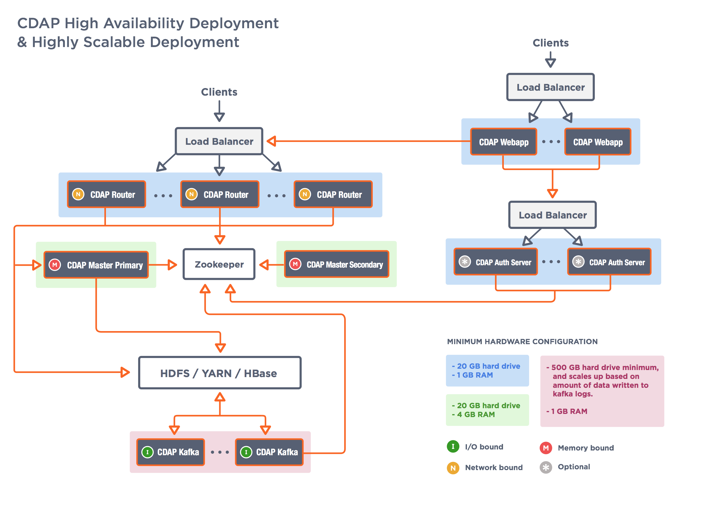

.. meta::
    :author: Cask Data, Inc.
    :copyright: Copyright © 2014-2015 Cask Data, Inc.

.. _install:

============================================
Installation and Configuration
============================================

.. Note: this file is included in quick-start.rst; check any edits in this file with it!

Introduction
------------

This manual is to help you install and configure Cask Data Application Platform (CDAP). It provides the
`system <#system-requirements>`__, 
`network <#network-requirements>`__, and
`software requirements <#software-prerequisites>`__,
`packaging options <#packaging>`__, and
instructions for
`installation <#installation>`__ and
`verification <#verification>`__ of
the CDAP components so they work with your existing Hadoop cluster. 
There are specific instructions for :ref:`upgrading existing CDAP installations<install-upgrade>`.

These are the CDAP components:

- **CDAP UI:** User interface—the *Console*—for managing CDAP applications;
- **CDAP Router:** Service supporting REST endpoints for CDAP;
- **CDAP Master:** Service for managing runtime, lifecycle and resources of CDAP applications;
- **CDAP Kafka:** Metrics and logging transport service, using an embedded version of *Kafka*; and
- **CDAP Authentication Server:** Performs client authentication for CDAP when security is enabled.

Before installing the CDAP components, you must first install a Hadoop cluster
with *HDFS*, *YARN*, *HBase*, and *ZooKeeper*. In order to use the ad-hoc querying capabilities
of CDAP, you will also need *Hive*. All CDAP components can be installed on the
same boxes as your Hadoop cluster, or on separate boxes that can connect to the Hadoop services.

Our recommended installation is to use two boxes for the CDAP components; the
`hardware requirements <#hardware-requirements>`__ are relatively modest,
as most of the work is done by the Hadoop cluster. These two
boxes provide high availability; at any one time, one of them is the leader
providing services while the other is a follower providing failover support.

Some CDAP components run on YARN, while others orchestrate “containers” in the Hadoop cluster.
The CDAP Router service starts a router instance on each of the local boxes and instantiates
one or more gateway instances on YARN as determined by the gateway service configuration.

We have specific
`hardware <#hardware-requirements>`_,
`network <#network-requirements>`_ and
`prerequisite software <#software-prerequisites>`_ requirements detailed
`below <#system-requirements>`__
that need to be met and completed before installation of the CDAP components.

System Requirements
-------------------

.. _install-hardware-requirements:

Hardware Requirements
.....................
Systems hosting the CDAP components must meet these hardware specifications,
in addition to having CPUs with a minimum speed of 2 GHz:

+---------------------------------------+--------------------+-----------------------------------------------+
| CDAP Component                        | Hardware Component | Specifications                                |
+=======================================+====================+===============================================+
| **CDAP UI**                           | RAM                | 1 GB minimum, 2 GB recommended                |
+---------------------------------------+--------------------+-----------------------------------------------+
| **CDAP Router**                       | RAM                | 2 GB minimum, 4 GB recommended                |
+---------------------------------------+--------------------+-----------------------------------------------+
| **CDAP Master**                       | RAM                | 2 GB minimum, 4 GB recommended                |
+---------------------------------------+--------------------+-----------------------------------------------+
| **CDAP Kafka**                        | RAM                | 1 GB minimum, 2 GB recommended                |
+                                       +--------------------+-----------------------------------------------+
|                                       | Disk Space         | *CDAP Kafka* maintains a data cache in        |
|                                       |                    | a configurable data directory.                |
|                                       |                    | Required space depends on the number of       |
|                                       |                    | CDAP applications deployed and running        |
|                                       |                    | in the CDAP and the quantity                  |
|                                       |                    | of logs and metrics that they generate.       |
+---------------------------------------+--------------------+-----------------------------------------------+
| **CDAP Authentication Server**        | RAM                | 1 GB minimum, 2 GB recommended                |
+---------------------------------------+--------------------+-----------------------------------------------+

Network Requirements
....................
CDAP components communicate over your network with *HBase*, *HDFS*, and *YARN*.
For the best performance, CDAP components should be located on the same LAN,
ideally running at 1 Gbps or faster. A good rule of thumb is to treat CDAP
components as you would *Hadoop DataNodes*.  

Software Prerequisites
......................
You'll need this software installed:

- Java runtime (on CDAP and Hadoop nodes)
- Node.js runtime (on CDAP nodes)
- Hadoop and HBase (and optionally Hive) environment to run against
- CDAP nodes require Hadoop and HBase client installation and configuration. 
  **Note:** No Hadoop services need to be running.

.. highlight:: console

.. _install-java-runtime:

Java Runtime
++++++++++++
The latest `JDK or JRE version 1.7.xx or 1.8.xx <http://www.java.com/en/download/manual.jsp>`__
for Linux, Windows, or Mac OS X must be installed in your environment; we recommend the Oracle JDK.

To check the Java version installed, run the command::

  $ java -version
  
CDAP is tested with the Oracle JDKs; it may work with other JDKs such as 
`Open JDK <http://openjdk.java.net>`__, but it has not been tested with them.

Once you have installed the JDK, you'll need to set the JAVA_HOME environment variable.

.. _install-node.js:

Node.js Runtime
+++++++++++++++
You can download the appropriate version of Node.js from `nodejs.org <http://nodejs.org>`__:

#. The version of Node.js must be from |node-js-version|; we recommend |recommended-node-js-version|.
#. Download the appropriate binary ``.tar.gz`` from
   `nodejs.org/download/ <http://nodejs.org/dist/>`__.

#. Extract somewhere such as ``/opt/node-[version]/``
#. Build node.js; instructions that may assist are available at
   `github <https://github.com/joyent/node/wiki/Installing-Node.js-via-package-manager>`__
#. Ensure that ``nodejs`` is in the ``$PATH``. One method is to use a symlink from the installation:
   ``ln -s /opt/node-[version]/bin/node /usr/bin/node``

.. _install-hadoop-hbase:

Hadoop/HBase Environment
++++++++++++++++++++++++

For a distributed enterprise, you must install these Hadoop components:

+---------------+-------------------+-----------------------------------------------------+
| Component     | Source            | Supported Versions                                  |
+===============+===================+=====================================================+
| **HDFS**      | Apache Hadoop     | 2.0.2-alpha through 2.6.0                           |
+               +-------------------+-----------------------------------------------------+
|               | CDH or HDP        | (CDH) 5.0.0 through 5.4.4 or (HDP) 2.0, 2.1, or 2.2 |
+               +-------------------+-----------------------------------------------------+
|               | MapR              | 4.1 (with MapR-FS)                                  |
+---------------+-------------------+-----------------------------------------------------+
| **YARN**      | Apache Hadoop     | 2.0.2-alpha through 2.6.0                           |
+               +-------------------+-----------------------------------------------------+
|               | CDH or HDP        | (CDH) 5.0.0 through 5.4.4 or (HDP) 2.0, 2.1, or 2.2 |
+               +-------------------+-----------------------------------------------------+
|               | MapR              | 4.1                                                 |
+---------------+-------------------+-----------------------------------------------------+
| **HBase**     | Apache            | 0.96.x, 0.98.x, and 1.0.x                           |
+               +-------------------+-----------------------------------------------------+
|               | CDH or HDP        | (CDH) 5.0.0 through 5.4.4 or (HDP) 2.0, 2.1, or 2.2 |
+               +-------------------+-----------------------------------------------------+
|               | MapR              | 4.1 (with Apache HBase)                             |
+---------------+-------------------+-----------------------------------------------------+
| **ZooKeeper** | Apache            | Version 3.4.3 through 3.4.5                         |
+               +-------------------+-----------------------------------------------------+
|               | CDH or HDP        | (CDH) 5.0.0 through 5.4.4 or (HDP) 2.0, 2.1, or 2.2 |
+               +-------------------+-----------------------------------------------------+
|               | MapR              | 4.1                                                 |
+---------------+-------------------+-----------------------------------------------------+
| **Hive**      | Apache            | Version 0.12.0 through 0.13.1                       |
+               +-------------------+-----------------------------------------------------+
|               | CDH or HDP        | (CDH) 5.0.0 through 5.4.4 or (HDP) 2.0, 2.1, or 2.2 |
+               +-------------------+-----------------------------------------------------+
|               | MapR              | 4.1                                                 |
+---------------+-------------------+-----------------------------------------------------+

**Note:** Components versions shown in this table are those that we have tested and are
confident of their suitability and compatibility. Later versions of components may work,
but have not necessarily have been either tested or confirmed compatible.

**Note:** Certain CDAP components need to reference your *Hadoop*, *HBase*, *YARN* (and
possibly *Hive*) cluster configurations by adding your configuration to their class paths.

**Note:** ZooKeeper's ``maxClientCnxns`` must be raised from its default.  We suggest setting it to zero
(unlimited connections). As each YARN container launched by CDAP makes a connection to ZooKeeper, 
the number of connections required is a function of usage.

.. _deployment-architectures:

Deployment Architectures
........................

.. rubric:: CDAP Minimal Deployment

**Note:** Minimal deployment runs all the services on single host.

.. image:: ../_images/cdap-minimal-deployment.png
   :width: 8in
   :align: center

------------

.. rubric:: CDAP High Availability and Highly Scalable Deployment

**Note:** Each component in CDAP is horizontally scalable. This diagram presents the high
availability and highly scalable deployment. The number of nodes for each component can be
changed based on the requirements.

Preparing the Cluster
---------------------
.. _install-preparing-the-cluster:

To prepare your cluster so that CDAP can write to its default namespace,
create a top-level ``/cdap`` directory in HDFS, owned by an HDFS user ``yarn``::

  $ sudo -u hdfs hadoop fs -mkdir /cdap && hadoop fs -chown yarn /cdap

In the CDAP packages, the default HDFS namespace is ``/cdap`` and the default HDFS user is
``yarn``. If you set up your cluster as above, no further changes are required.

.. _install-preparing-the-cluster-defaults:

If your cluster is not setup with these defaults, you'll need to 
:ref:`edit your CDAP configuration <install-configuration>` once you have downloaded and installed
the packages, and prior to starting services.

.. _install-packaging:

Packaging
---------
CDAP components are available as either Yum ``.rpm`` or APT ``.deb`` packages. There is
one package for each CDAP component, and each component may have multiple services.
Additionally, there is a base CDAP package with three utility packages (for HBase
compatibility) installed which creates the base configuration and the ``cdap`` user. We
provide packages for *Ubuntu 12* and *CentOS 6*.

Available packaging types:

- RPM: Yum repo
- Debian: APT repo
- Tar: For specialized installations only

**Note:** If you are using `Chef <https://www.getchef.com>`__ to install CDAP, an
`official cookbook is available <https://supermarket.getchef.com/cookbooks/cdap>`__.

Preparing Package Managers
--------------------------

.. _install-rpm-using-yum:

RPM using Yum
.............
Download the Cask Yum repo definition file:
   
.. container:: highlight

  .. parsed-literal::
    |$| sudo curl -o /etc/yum.repos.d/cask.repo |http:|//repository.cask.co/centos/6/x86_64/cdap/|short-version|/cask.repo

This will create the file ``/etc/yum.repos.d/cask.repo`` with:

.. parsed-literal::
  [cask]
  name=Cask Packages
  baseurl=http://repository.cask.co/centos/6/x86_64/cdap/|short-version|
  enabled=1
  gpgcheck=1

Add the Cask Public GPG Key to your repository:

.. container:: highlight

  .. parsed-literal::
    |$| sudo rpm --import |http:|//repository.cask.co/centos/6/x86_64/cdap/|short-version|/pubkey.gpg

Update your Yum cache::

  $ sudo yum makecache

.. end_install-rpm-using-yum

Debian using APT
................
Download the Cask APT repo definition file:

.. container:: highlight

  .. parsed-literal::
    |$| sudo curl -o /etc/apt/sources.list.d/cask.list |http:|//repository.cask.co/ubuntu/precise/amd64/cdap/|short-version|/cask.list

This will create the file ``/etc/apt/sources.list.d/cask.list`` with:

.. parsed-literal::
  deb [ arch=amd64 ] |http:|//repository.cask.co/ubuntu/precise/amd64/cdap/|short-version| precise cdap

Add the Cask Public GPG Key to your repository:

.. container:: highlight

  .. parsed-literal::
    |$| curl -s |http:|//repository.cask.co/ubuntu/precise/amd64/cdap/|short-version|/pubkey.gpg | sudo apt-key add -

Update your APT-cache::

  $ sudo apt-get update

.. end_install-debian-using-apt

Installation
------------
Install the CDAP packages by using one of these methods:

Using Chef:

  If you are using `Chef <https://www.getchef.com>`__ to install CDAP, an `official
  cookbook is available <https://supermarket.getchef.com/cookbooks/cdap>`__.

Using Yum::

  $ sudo yum install cdap-gateway cdap-kafka cdap-master cdap-security cdap-ui

Using APT::

  $ sudo apt-get install cdap-gateway cdap-kafka cdap-master cdap-security cdap-ui

Do this on each of the boxes that are being used for the CDAP components; our
recommended installation is a minimum of two boxes.

This will download and install the latest version of CDAP with all of its dependencies. 

.. _install-configuration:

Configuration
-------------

CDAP packages utilize a central configuration, stored by default in ``/etc/cdap``.

When you install the CDAP base package, a default configuration is placed in
``/etc/cdap/conf.dist``. The ``cdap-site.xml`` file is a placeholder
where you can define your specific configuration for all CDAP components.
The ``cdap-site.xml.example`` file shows the properties that usually require customization
for all installations.

.. _install-alternatives:

Similar to Hadoop, CDAP utilizes the ``alternatives`` framework to allow you to
easily switch between multiple configurations. The ``alternatives`` system is used for ease of
management and allows you to to choose between different directories to fulfill the
same purpose.

Simply copy the contents of ``/etc/cdap/conf.dist`` into a directory of your choice
(such as ``/etc/cdap/conf.mycdap``) and make all of your customizations there.
Then run the ``alternatives`` command to point the ``/etc/cdap/conf`` symlink
to your custom directory.

Configure the ``cdap-site.xml`` after you have installed the CDAP packages.

.. _install-configuration-options:

To configure your particular installation, follow one of these two approaches:

1. Modify ``cdap-site.xml``, using ``cdap-site.example`` as a model to follow.

   To make alterations to your configuration, create (or edit if existing) an `.xml` file
   ``conf/cdap-site.xml`` (see the :ref:`appendix-cdap-site.xml`) and set appropriate
   properties.

#. Add these properties to ``cdap-site.xml``; they are the minimal required configuration:

  .. literalinclude:: ../../../../cdap-distributions/src/etc/cdap/conf.dist/cdap-site.xml.example
     :language: xml
     :lines: 18-

Depending on your installation, you may want to set these properties:

.. highlight:: xml

- If you want to use **an HDFS directory with a name** other than ``/cdap``:

  1. Create the HDFS directory you want to use, such as ``/myhadoop/myspace``.
  #. Create an ``hdfs.namespace`` property for the HDFS directory in ``conf/cdap-site.xml``::

       <property>
         <name>hdfs.namespace</name>
         <value>/myhadoop/myspace</value>
         <description>Default HDFS namespace</description>
       </property>

  #. Ensure that the default HDFS user ``yarn`` owns that HDFS directory.

- If you want to use **a different HDFS user** than ``yarn``:

  1. Check that there is |---| and create if necessary |---| a corresponding user on all machines
     in the cluster on which YARN is running (typically, all of the machines).
  #. Create an ``hdfs.user`` property for that user in ``conf/cdap-site.xml``::

       <property>
         <name>hdfs.user</name>
         <value>my_username</value>
         <description>User for accessing HDFS</description>
       </property>

  #. Check that the HDFS user owns the HDFS directory described by ``hdfs.namespace`` on all machines.

- Set the ``router.server.address`` property in ``conf/cdap-site.xml`` to the **hostname of the CDAP Router**.
  The CDAP UI uses this property to connect to the Router::

      <property>
        <name>router.server.address</name>
        <value>{router-host-name}</value>
      </property>

.. _install-configuring-explore-service:

- To use the **ad-hoc querying capabilities of CDAP,** enable the CDAP Explore Service in
  ``conf/cdap-site.xml`` (by default, it is disabled)::

    <property>
      <name>cdap.explore.enabled</name>
      <value>true</value>
      <description>Enable Explore functionality</description>
    </property>

  This feature cannot be used unless the cluster has a correct version of Hive installed.
  See the section on :ref:`Hadoop/HBase Environment <install-hadoop-hbase>`.
  To use this feature on secure Hadoop clusters, please see these instructions on
  :ref:`installing secure Hadoop. <install-secure-hadoop>`

  **Note:** Some versions of Hive contain a bug that may prevent the CDAP Explore Service from starting
  up. See `CDAP-1865 <https://issues.cask.co/browse/CDAP-1865>`__ for more information about the issue.
  If the CDAP Explore Service fails to start and you see a ``javax.jdo.JDODataStoreException: Communications link failure``
  in the log, try adding this property to the Hive ``hive-site.xml`` file::

    <property>
      <name>datanucleus.connectionPoolingType</name>
      <value>DBCP</value>
    </property>

.. highlight:: console

.. _install-secure-hadoop:

Secure Hadoop
.............
When running CDAP on top of a secure Hadoop cluster (using Kerberos
authentication), the CDAP processes will need to obtain Kerberos credentials in order to
authenticate with Hadoop, HBase, ZooKeeper, and (optionally) Hive.  In this case, the setting for
``hdfs.user`` in ``cdap-site.xml`` will be ignored and the CDAP processes will be identified by the
default authenticated Kerberos principal.

**Note:** CDAP support for secure Hadoop clusters is limited to CDH 5.0.0 through CDH 5.4.5,
and HDP 2.0 through 2.2.

In order to configure **CDAP for Kerberos authentication:**

- Create a Kerberos principal for the user running CDAP.  The principal name should be in
  the form ``username/hostname@REALM``, creating a separate principal for each host where a CDAP process 
  will run.  This prevents simultaneous login attempts from multiple hosts from being mistaken for
  a replay attack by the Kerberos KDC.
- Generate a keytab file for each CDAP Master Kerberos principal, and place the file as
  ``/etc/security/keytabs/cdap.keytab`` on the corresponding CDAP Master host.  The file should
  be readable only by the user running the CDAP Master process.
- Edit ``/etc/cdap/conf/cdap-site.xml`` on each host running a CDAP process, substituting the Kerberos
  primary (user) for ``<cdap-principal>``, and your Kerberos authentication realm for ``EXAMPLE.COM``,
  when adding these two properties:

  .. highlight:: xml

  ::

    <property>
      <name>cdap.master.kerberos.keytab</name>
      <value>/etc/security/keytabs/cdap.service.keytab</value>
    </property>

    <property>
      <name>cdap.master.kerberos.principal</name>
      <value><cdap-principal>/_HOST@EXAMPLE.COM</value>
    </property>

- The ``<cdap-principal>`` is shown in the commands that follow as ``cdap``; however, you
  are free to use a different appropriate name.

  .. highlight:: console

- The ``/cdap`` directory needs to be owned by the ``<cdap-principal>``; you can set
  that by running the following command as the ``hdfs`` user::
  
    $ hadoop fs -mkdir /cdap && hadoop fs -chown cdap /cdap
    
- When running on a secure HBase cluster, as the ``hbase`` user, issue the command::

    $ echo "grant 'cdap', 'ACRW'" | hbase shell

- When CDAP Master is started, it will login using the configured keytab file and principal.

In order to configure **CDAP Explore Service for secure Hadoop:**

.. highlight:: xml

- To allow CDAP to act as a Hive client, it must be given ``proxyuser`` permissions and allowed from all hosts. 
  For example: set the following properties in the configuration file ``core-site.xml``, where ``cdap`` is a system 
  group to which the ``cdap`` user is a member::

    <property>
      <name>hadoop.proxyuser.hive.groups</name>
      <value>cdap,hadoop,hive</value>
    </property>
    <property>
      <name>hadoop.proxyuser.hive.hosts</name>
      <value>*</value>
    </property>

- To execute Hive queries on a secure cluster, the cluster must be running the MapReduce ``JobHistoryServer`` 
  service. Consult your distribution documentation on the proper configuration of this service.
- To execute Hive queries on a secure cluster using the CDAP Explore Service, the Hive MetaStore service 
  must be configured for Kerberos authentication. Consult your distribution documentation on the proper 
  configuration of the Hive MetaStore service.

With all these properties set, the CDAP Explore Service will run on secure Hadoop clusters.

.. _install-ulimit:

ULIMIT Configuration
....................
When you install the CDAP packages, the ``ulimit`` settings for the CDAP user are
specified in the ``/etc/security/limits.d/cdap.conf`` file. On Ubuntu, they won't take
effect unless you make changes to the ``/etc/pam.d/common-session file``. You can check
this setting with the command ``ulimit -n`` when logged in as the CDAP user.
For more information, refer to the ``ulimit`` discussion in the `Apache HBase Reference
Guide <https://hbase.apache.org/book.html#ulimit>`__.

.. highlight:: console

.. _install-tmp-files:

Writing to Temp Files
.....................
There are two temp directories utilized by CDAP (both specified in :ref:`appendix-cdap-site.xml`):

- ``app.temp.dir`` (default: ``/tmp``)
- ``kafka.log.dir`` (default: ``/tmp/kafka-logs``)

The CDAP user **must** be able to write to both of these directories, as they are used for
deploying applications and for operating CDAP.

Configuring Security
....................
For instructions on enabling CDAP Security, see :doc:`CDAP Security <security>`;
and in particular, see the instructions for 
:ref:`configuring the properties of cdap-site.xml <enabling-security>`.

Configuring Hortonworks Data Platform
.....................................
Beginning with `Hortonworks Data Platform (HDP) 2.2 <http://hortonworks.com>`__, the
MapReduce libraries are in HDFS. This requires an addition be made to the file
``cdap-env.sh`` to indicate the version of HDP::

  export OPTS="${OPTS} -Dhdp.version=<version>" 
  
where ``<version>`` matches the HDP version of the cluster. The build iteration must be
included, so if the cluster version of HDP is ``2.2.6.0-2800``, use::

  export OPTS="${OPTS} -Dhdp.version=2.2.6.0-2800" 

The file ``cdap-env.sh`` is located in the configuration directory, as described above
under :ref:`Configuration <install-alternatives>`.

.. highlight:: xml

In addition, the property ``app.program.jvm.opts`` must be set in the ``cdap-site.xml``::

  <property>
    <name>app.program.jvm.opts</name>
    <value>-XX:MaxPermSize=128M ${twill.jvm.gc.opts} -Dhdp.version=<version></value>
    <description>Java options for all program containers</description>
  </property>
  
Using the same example as above, substituting ``2.2.6.0-2800`` for ``<version>``, as::

  <property>
    <name>app.program.jvm.opts</name>
    <value>-XX:MaxPermSize=128M ${twill.jvm.gc.opts} -Dhdp.version=2.2.6.0-2800</value>
    <description>Java options for all program containers</description>
  </property>

.. _install-starting-services:

.. highlight:: console

Starting Services
-----------------
When all the packages and dependencies have been installed, and the configuration
parameters set, you can start the services on each of the CDAP boxes by running the
command::

  $ for i in `ls /etc/init.d/ | grep cdap` ; do sudo service $i restart ; done

When all the services have completed starting, the CDAP UI should then be
accessible through a browser at port ``9999``. 

The URL will be ``http://<host>:9999`` where ``<host>`` is the IP address of
one of the machines where you installed the packages and started the services.

.. _install-highly-available:

Making CDAP Highly-available
---------------------------------
Repeat these steps on additional boxes.  The configurations needed to support high-availability are:

- ``kafka.seed.brokers``: ``127.0.0.1:9092,...`` 
  
  - Kafka brokers list (comma separated)
  
- ``kafka.default.replication.factor``: 2

  - Used to replicate Kafka messages across multiple machines to prevent data loss in 
    the event of a hardware failure.
  - The recommended setting is to run at least two Kafka servers.
  - Set this to the number of Kafka servers.

.. _install-health-check:

Getting a Health Check
----------------------

.. include:: ../operations/index.rst 
   :start-after: .. _operations-health-check:

.. _install-verification:

Verification
------------
To verify that the CDAP software is successfully installed and you are able to use your
Hadoop cluster, run an example application.
We provide in our SDK pre-built ``.JAR`` files for convenience.

#. Download and install the latest `CDAP Software Development Kit (SDK)
   <http://cask.co/downloads/#cdap>`__.
#. Extract to a folder (``CDAP_HOME``).
#. Open a command prompt and navigate to ``CDAP_HOME/examples``.
#. Each example folder has a ``.jar`` file in its ``target`` directory.
   For verification, we will use the ``WordCount`` example.
#. Open a web browser to the CDAP UI.
   It is located on port ``9999`` of the box where you installed CDAP.
#. On the UI, click the button *Add App*.
#. Find the pre-built ``WordCount-``\ |literal-release|\ ``.jar`` using the dialog box to navigate to
   ``CDAP_HOME/examples/WordCount/target/``. 
#. Once the application is deployed, instructions on running the example can be found at the
   :ref:`WordCount example. <examples-word-count>`
#. You should be able to start the application, inject sentences, and retrieve results.
#. When finished, you can stop and remove the application as described in the section on
   :ref:`cdap-building-running`.

.. _install-upgrade:

Upgrading an Existing Version
---------------------------------
When upgrading an existing CDAP installation from a previous version, you will need
to make sure the CDAP table definitions in HBase are up-to-date.

These steps will stop CDAP, update the installation, run an upgrade tool for the table definitions,
and then restart CDAP.

These steps will upgrade from CDAP 3.1.x to 3.2.x. If you are on an earlier version of CDAP,
please follow the upgrade instructions for the earlier versions and upgrade first to 3.1.x before proceeding.

.. highlight:: console

1. Stop all flows, services, and other programs in all your applications.

#. Stop all CDAP processes::

     $ for i in `ls /etc/init.d/ | grep cdap` ; do sudo service $i stop ; done

#. Update the CDAP file definition lists by running either of these methods:
 
   - Using Yum:

     .. include:: installation.rst 
        :start-after: Download the Cask Yum repo definition file:
        :end-before:  .. end_install-rpm-using-yum

   - Using APT:

     .. include:: installation.rst 
        :start-after: Download the Cask APT repo definition file:
        :end-before:  .. end_install-debian-using-apt

#. Update the CDAP packages by running either of these methods:

   - Using Yum (on one line)::

       $ sudo yum install cdap cdap-gateway \
             cdap-hbase-compat-0.96 cdap-hbase-compat-0.98 \
             cdap-hbase-compat-1.0 cdap-hbase-compat-1.0-cdh \
             cdap-kafka cdap-master cdap-security cdap-ui

   - Using APT (on one line)::

       $ sudo apt-get install cdap cdap-gateway \
             cdap-hbase-compat-0.96 cdap-hbase-compat-0.98 \
             cdap-hbase-compat-1.0 cdap-hbase-compat-1.0-cdh \
             cdap-kafka cdap-master cdap-security cdap-ui

#. If you are upgrading a secure Hadoop cluster, you should authenticate with ``kinit``
   before the next step (running the upgrade tool)::

     $ kinit -kt <keytab> <principal>

#. Run the upgrade tool, as the user that runs CDAP Master (the CDAP user)::

     $ /opt/cdap/master/bin/svc-master run co.cask.cdap.data.tools.UpgradeTool upgrade
     
   Note that once you have upgraded an instance of CDAP, you cannot reverse the process; down-grades
   to a previous version are not possible.
   
   The Upgrade Tool will produce output similar to the following, prompting you to continue with the upgrade:
   
    .. container:: highlight

      .. parsed-literal::    
    
        UpgradeTool - version |short-version|-xxxxx.

        upgrade - Upgrades CDAP to |short-version|
          The upgrade tool upgrades the following:
          1. User Datasets
              - Upgrades the coprocessor jars for tables
              - Migrates the metadata for PartitionedFileSets
          2. System Datasets
          3. UsageRegistry Dataset Type
          Note: Once you run the upgrade tool you cannot rollback to the previous version.
        Do you want to continue (y/n)
        y
        Starting upgrade ...

   You can run the tool in a non-interactive fashion by using the ``force`` flag, in which case
   it will run unattended and not prompt for continuing::
   
     $ /opt/cdap/master/bin/svc-master run co.cask.cdap.data.tools.UpgradeTool upgrade force

#. Restart the CDAP processes::

     $ for i in `ls /etc/init.d/ | grep cdap` ; do sudo service $i start ; done

.. _install-troubleshooting:

Troubleshooting
---------------------------------

- If you have YARN configured to use LinuxContainerExecutor (see the setting for
  ``yarn.nodemanager.container-executor.class``), the ``cdap`` user needs to be present on
  all Hadoop nodes.

- If you are using a LinuxContainerExecutor, and the UID for the ``cdap`` user is less than
  500, you will need to add the ``cdap`` user to the allowed users configuration for the
  LinuxContainerExecutor in Yarn by editing the ``/etc/hadoop/conf/container-executor.cfg``
  file. Change the line for ``allowed.system.users`` to::

    allowed.system.users=cdap
