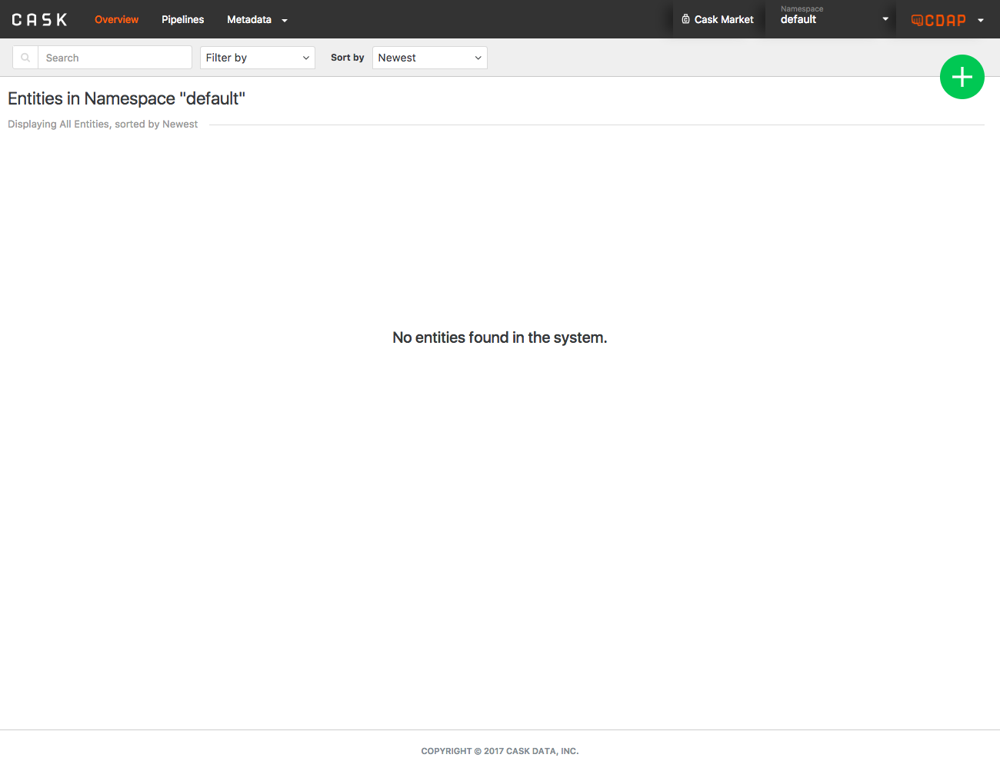

.. meta::
    :author: Cask Data, Inc.
    :copyright: Copyright © 2014 Cask Data, Inc.

.. _cdap-console:

==================================================================
CDAP Console
==================================================================

The **CDAP Console** is available for deploying, querying and managing the Cask Data
Application Platform in all modes of CDAP except an 
:ref:`In-memory CDAP. <in-memory-data-application-platform>`

Here is a screen-capture of the CDAP Console running on a Distributed CDAP.

Down the left sidebar, underneath the **Cask** logo, are five buttons: *Application, Collect
Process, Store,* and *Query.* These buttons gives you access to CDAP Console facilities for
managing each of these CDAP components.

In the far upper-right are two buttons: the *Metrics* and *Services* buttons, which take
you to their respective explorers.

A detailed *How-To Guide* covering using the CDAP Console 
will be available
at `Guides and Tutorials for CDAP. <http://cask.co/guides/>`__

.. is available