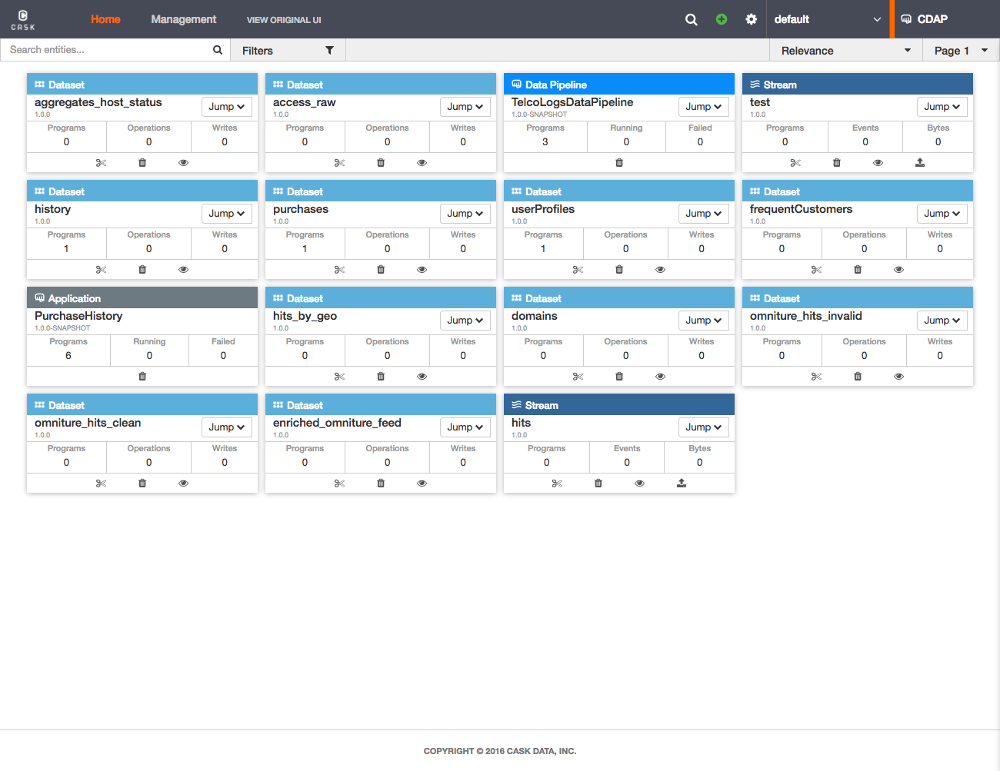
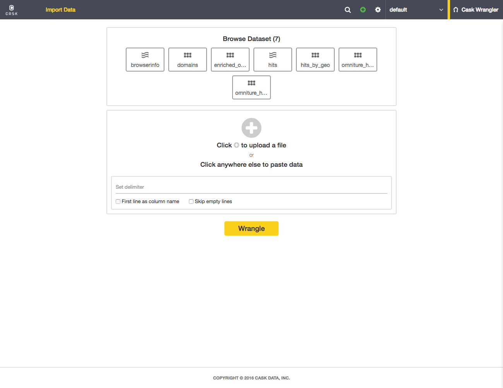

.. meta::
    :author: Cask Data, Inc.
    :copyright: Copyright © 2014-2016 Cask Data, Inc.

.. _cdap-console:
.. _cdap-ui:

=======
CDAP UI
=======

The **CDAP UI** is available for deploying, querying and managing the Cask Data
Application Platform in all modes of CDAP except as an 
:ref:`in-memory CDAP <in-memory-data-application-platform>`.

Here is a screen-capture of the CDAP UI running on a Distributed CDAP:

.. figure:: ../_images/console/console_01_overview.png
   :figwidth: 100%
   :width: 800px
   :align: center
   :class: bordered-image

   **CDAP UI:** Showing the *Home* page

Across the top, are three buttons: *Development*, *Operations*, and *Management*. These
buttons gives you access to CDAP UI facilities for managing each of the categories.

In the upper-left is a menu for setting the namespace. In the upper-right is a menu
with access to the main Cask Website, Support, and logging out.

On the **Development** page, datasets and applications are displayed. The **Operations** page
gives you views of current system and user metrics, with customizable dashboards. The
**Management** page provides features and controls for administering the CDAP installation.

.. _cdap-ui-beta:

.. rubric:: CDAP 4.0 New Beta UI

Beginning with CDAP 4.0, a new beta UI was added. The new UI is has not yet reached
feature parity with the original UI, and is still under development.

It includes access to: the Cask Market, with use cases, pipelines, applications, plugins,
datapacks, and drivers; the Resource Centre, which provides wizards for adding streams,
drivers, applications, Hydrator pipelines, and plugins; and access to CDAP extensions
including Cask Hydrator, Cask Tracker, and Cask Wrangler.

Here are screen-captures of the new CDAP Beta UI running on a Distributed CDAP:

   **CDAP Beta UI:** The *Home* page, after an application and programs have been deployed

.. figure:: ../_images/ui/ui-02-market.png
   :figwidth: 100%
   :width: 800px
   :align: center
   :class: bordered-image

   **CDAP Beta UI:** The new *Cask Market* and *Resource Center*
   

.. figure:: ../_images/ui/ui-03-management.png
   :figwidth: 100%
   :width: 800px
   :align: center
   :class: bordered-image

   **CDAP Beta UI:** The *Management* page, *YARN* tab

   **CDAP Beta UI:** The *Cask Wrangler* extension, a new CDAP extension for interactive data preparation.
   
