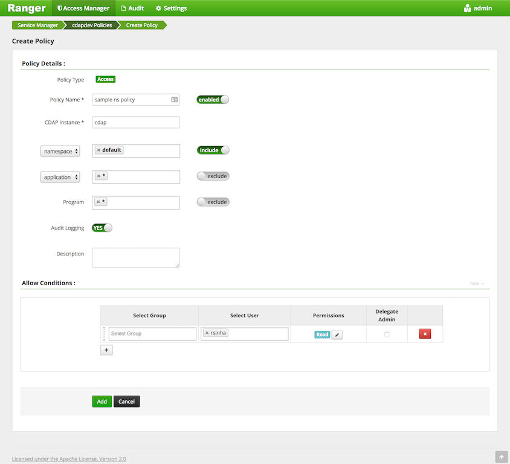

.. meta::
    :author: Cask Data, Inc.
    :copyright: Copyright © 2016-2017 Cask Data, Inc.

.. _admin-authorization:

=============
Authorization
=============

Authorization allows users to enforce fine-grained access control on CDAP entities:
namespaces, artifacts, applications, programs, datasets, streams, and secure keys. All
operations on these entities |---| listing, viewing, creating, updating, managing,
deleting |---| are governed by authorization policies.

.. _security-enabling-authorization:

Enabling Authorization
======================
To enable authorization in :term:`Distributed CDAP <distributed cdap>`, add these
properties to :ref:`cdap-site.xml <appendix-cdap-default-security>`:

.. list-table::
   :widths: 20 80
   :header-rows: 1

   * - Parameter
     - Value
   * - ``security.authorization.enabled``
     -  true
   * - ``security.authorization.extension.jar.path``
     - Absolute path of the JAR file to be used as the authorization extension. This file
       must be present on the local file system of the CDAP Master. In an HA environment, it
       should be present on the local file system of all CDAP Master hosts.
   * - ``security.authorization.extension.extra.classpath`` (Optional)
     - Extra classpath for security extension

Authorization in CDAP only takes effect once :ref:`perimeter security
<admin-perimeter-security>` is also enabled by setting ``security.enabled`` to ``true``.
Additionally, Kerberos must be enabled on the cluster and for CDAP by setting
``kerberos.auth.enabled`` to ``true`` since CDAP Authorization depends on Kerberos.

These additional properties can also be optionally modified to configure authorization:

- ``security.authorization.cache.max.entries``
- ``security.authorization.cache.ttl.secs``

Please refer to :ref:`cdap-defaults.xml <appendix-cdap-default-security>` for
documentation on these configuration settings.

Authorization in CDAP is implemented as :ref:`authorization extensions
<authorization-extensions>`. Apart from the above configuration settings, an extension may
require additional properties to be configured. Please see the documentation on
individual extensions for configuring properties specific to that extension:

- :ref:`Integrations: Apache Sentry <apache-sentry>`
- `Integrations: Apache Ranger <https://github.com/caskdata/cdap-security-extn/wiki/CDAP-Ranger-Extension>`_

:ref:`Security extension properties <appendix-cdap-default-security>`, which are specified
in ``cdap-site.xml``, begin with the prefix ``security.authorization.extension.config``.

When CDAP is first started with authorization enabled, no users are granted privileges on
any CDAP entities. Without any privileges, CDAP will not be able to create the default namespace.
To create the default namespace, grant *ADMIN* on default namespace to the CDAP master user.
The default namespace will get created in several minutes automatically.

.. _security-authorization-policies:

Authorization Policies
======================
Currently, CDAP allows users to enforce authorization for *READ*, *WRITE*, *EXECUTE*, and
*ADMIN* operations.

In general, this summarizes the authorization policies in CDAP:

- A **create** operation on an entity requires *ADMIN* on the entity. The *ADMIN* privilege needs to be granted before
  the entity can be created. For example, creating a namespace requires *ADMIN* on the namespace.
- A **read** operation (such as reading from a dataset or a stream) on an entity requires
  *READ* on the entity.
- A **write** operation (such as writing to a dataset or a stream) on an entity requires
  *WRITE* on the entity.
- An **admin** operation (such as setting properties) on an entity requires *ADMIN* on
  the entity.
- A **delete** operation on an entity requires *ADMIN* on the entity. Note that if the deletion operation will delete
  multiple entities, *ADMIN* is required on all the entities. For example, delete on a namespace requires *ADMIN* on
  all entities in the namespace, and the namespace itself.
- An **execute** operation on a program requires *EXECUTE* on the program.
- A **list** or **view** operation (such as listing or searching applications, datasets, streams,
  artifacts) only returns those entities that the logged-in user has at least one (*READ*,
  *WRITE*, *EXECUTE*, *ADMIN*) privilege on or on any of its descendants.
- A **get** operation on an entity (such as getting the dataset property, app detail) only succeeds if the user has
  at least one (*READ*, *WRITE*, *EXECUTE*, *ADMIN*) privilege on it or any of its descendants.
- Only admins of the authorization backend can grant or revoke the privileges.

Additionally:

- Upon successful creation/deletion of an entity, the privileges remain unaffected.
  It is the responsibility of the administrator to delete privileges from the authorization backend on entity deletion.
  If the privileges are not deleted and the entity is recreated, the old privileges will be retained for the new entity
- CDAP does **not** support hierarchical authorization enforcement, which means that privileges on each entity
  are evaluated independently.

Authorization policies for various CDAP operations are listed in the following tables. Policies for more complex operations
can be checked :ref:`below <security-authorization-deploying-app>`.

.. _security-authorization-policies-namespaces:

Namespaces
----------

.. list-table::
   :widths: 25 75
   :header-rows: 1

   * - Operation
     - Privileges Required
   * - Create
     - *ADMIN*
   * - Update
     - *ADMIN*
   * - Delete
     - *ADMIN* on the namespace, and *ADMIN* on all entities in the namespace, note that lack of the privileges may
       result in an inconsistent state for the namespace. Some entities may get cleaned up while entities with insufficient
       privileges will remain.
   * - List/View
     - Only returns those namespaces which user has at least one of *READ, WRITE, EXECUTE,* or *ADMIN* on the
       namespace or on any of its descendants
   * - Get
     - At least one of *READ, WRITE, EXECUTE,* or *ADMIN* on the namespace or any of its descendants

.. _security-authorization-policies-artifacts:

Artifacts
---------

.. list-table::
   :widths: 25 75
   :header-rows: 1

   * - Operation
     - Privileges Required
   * - Add
     - *ADMIN*
   * - Add a property
     - *ADMIN*
   * - Remove a property
     - *ADMIN*
   * - Delete
     - *ADMIN*
   * - List/View
     - Only returns those artifacts on which user has at least one of *READ, WRITE, EXECUTE,* or *ADMIN*
   * - Get
     - At least one of *READ, WRITE, EXECUTE,* or *ADMIN*

.. _security-authorization-policies-applications:

Applications
------------

.. list-table::
   :widths: 25 75
   :header-rows: 1

   * - Operation
     - Privileges Required
   * - Add
     - *ADMIN* (on the application) and *ADMIN* (if adding new artifacts) or
       any privileges(if using existing artifacts) on the artifact
   * - Delete
     - *ADMIN*
   * - List/View
     - Only returns those applications which user has at least one of *READ, WRITE, EXECUTE,* or *ADMIN* on the
       application or on any of its descendants
   * - Get
     - At least one of *READ, WRITE, EXECUTE,* or *ADMIN* on the application or any of its descendants

.. _security-authorization-policies-programs:

Programs
--------

.. list-table::
   :widths: 25 75
   :header-rows: 1

   * - Operation
     - Privileges Required
   * - Start, Stop, or Debug
     - *EXECUTE*
   * - Set instances
     - *ADMIN*
   * - Set runtime arguments
     - *ADMIN*
   * - Retrieve runtime arguments
     - At least one of *READ, EXECUTE* or *ADMIN*
   * - Retrieve status
     - At least one of *READ, WRITE, EXECUTE,* or *ADMIN*
   * - List/View
     - Only returns those programs on which user has at least one of *READ, WRITE, EXECUTE,* or *ADMIN*
   * - Get
     - At least one of *READ, WRITE, EXECUTE,* or *ADMIN*
   * - Resume/Suspend schedule
     - *EXECUTE* on the program
   * - Add/Delete/Update schedule
     - *ADMIN* on the application

.. _security-authorization-policies-datasets:

Datasets
--------

.. list-table::
   :widths: 25 75
   :header-rows: 1

   * - Operation
     - Privileges Required
   * - Create
     - *ADMIN* on the dataset and, for custom datasets, at least one of *READ, WRITE, EXECUTE,* or *ADMIN* on the
       dataset type
   * - Read
     - *READ*
   * - Write
     - *WRITE*
   * - Update
     - *ADMIN*
   * - Upgrade
     - *ADMIN*
   * - Truncate
     - *ADMIN*
   * - Drop
     - *ADMIN*
   * - List/View
     - Only returns those datasets on which user has at least one of *READ, WRITE, EXECUTE,* or *ADMIN*
   * - Get
     - At least one of *READ, WRITE, EXECUTE,* or *ADMIN*

.. _security-authorization-policies-dataset-modules:

Dataset Modules
---------------

.. list-table::
   :widths: 25 75
   :header-rows: 1

   * - Operation
     - Privileges Required
   * - Deploy
     - *ADMIN*
   * - Delete
     - *ADMIN*
   * - Delete-all in the namespace
     - *ADMIN* on all dataset modules in the namespace
   * - List/View
     - Only returns those dataset modules on which user has at least one of *READ, WRITE, EXECUTE,* or *ADMIN*
   * - Get
     - At least one of *READ, WRITE, EXECUTE,* or *ADMIN*

.. _security-authorization-policies-dataset-types:

Dataset Types
-------------

.. list-table::
   :widths: 25 75
   :header-rows: 1

   * - Operation
     - Privileges Required
   * - List/View
     - Only returns those dataset types on which user has at least one of *READ, WRITE, EXECUTE,* or *ADMIN*
   * - Get
     - At least one of *READ, WRITE, EXECUTE,* or *ADMIN*

.. _security-authorization-policies-secure-keys:

Secure Keys
-----------

.. list-table::
   :widths: 25 75
   :header-rows: 1

   * - Operation
     - Privileges Required
   * - Create
     - *ADMIN*
   * - READ the secure data
     - *READ*
   * - Delete
     - *ADMIN*
   * - List/View
     - Only returns those secure keys on which user has at least one of *READ, WRITE, EXECUTE,* or *ADMIN*

.. _security-authorization-policies-streams:

Streams
-------

.. list-table::
   :widths: 25 75
   :header-rows: 1

   * - Operation
     - Privileges Required
   * - Create
     - *ADMIN*
   * - Retrieving events
     - *READ*
   * - Sending events to a stream (sync, async, or batch)
     - *WRITE*
   * - Drop
     - *ADMIN*
   * - Drop-all in the namespace
     - *ADMIN* on all streams in the namespace
   * - Update
     - *ADMIN*
   * - Truncate
     - *ADMIN*
   * - List/View
     - Only returns those streams on which user has at least one of *READ, WRITE, EXECUTE,* or *ADMIN*
   * - Get
     - At least one of *READ, WRITE, EXECUTE,* or *ADMIN*

.. _security-authorization-policies-principal:

Kerberos Principal
------------------

.. list-table::
   :widths: 25 75
   :header-rows: 1

   * - Operation
     - Privileges Required
   * - Deploy an app to impersonate a kerberos principal
     - *ADMIN* on the principal
   * - Create a namespace with owner prinicpal
     - *ADMIN* on the principal
   * - Create a dataset with owner prinicpal
     - *ADMIN* on the principal
   * - Create a stream with owner prinicpal
     - *ADMIN* on the principal

.. _security-pre-grant-wildcard-privilege:

Wildcard Privileges
===================
Wildcard privileges can be used to simplify granting privileges on multiple entities.
Wildcards can be used in the entity name to grant or revoke actions on multiple entities.

- ``*`` matches zero or more characters
- ``?`` matches a single character

The following sections provide examples on granting wildcard privileges.

.. _security-sentry-integration:

Sentry Integration
------------------
:ref:`CDAP CLI <cdap-cli>` can be used to grant or revoke the privileges for :ref:`Integrations: Apache Sentry <apache-sentry>`.
Full list of commands are documented at :ref:`security commands <cli-available-commands-security>`.

Sentry only allows granting privileges to roles. Roles can then be assigned to groups.

- To create a new role, use::

    > create role <role-name>

- To grant/revoke privileges on an entity to a role, use::

    > grant actions <actions> on entity <entity> to role <role-name>
    > revoke actions <actions> on entity <entity> from role <role-name>

  where:

  - ``<actions>`` is a comma-separated list of privileges, any of *READ, WRITE, EXECUTE,* or *ADMIN*.

  - ``<entity>`` is of the form ``<entity-type>:<entity-id>``

    =====================  =============================================
        Entity Type                 Entity Id
    =====================  =============================================
    ``namespace``          ``<namespace>:<namespace-id>``
    ``application``        ``<namespace-id>.<app-id>``
    ``program``            ``<namespace-id>.<app-id>.<program-type>.<program-id>``
    ``dataset``            ``<namespace-id>.<dataset-id>``
    ``stream``             ``<namespace-id>.<stream-id>``
    ``artifact``           ``<namespace-id>.<artifact-id>``
    ``dataset_type``       ``<namespace-id>.<dataset-type-id>``
    ``dataset_module``     ``<namespace-id>.<dataset-module-id>``
    ``securekey``          ``<namespace-id>.<secure-key-id>``
    ``kerberosprincipal``  ``<kerberos-principal-id>``
    =====================  =============================================

  - ``program-type`` is one of:
    ``flow``, ``mapreduce``, ``service``, ``spark``, ``worker``, or ``workflow``.

  - Wildcards can be used in the entity name to grant privileges on multiple entities. For example,

    - ``namespace:ns*`` represents all the namespaces that start with ``ns``.
    - ``namespace:ns?`` represents all the namespaces that start with ``ns`` and followed by a single character.
    - ``program:ns1.app1.*`` represents all the programs in the application ``app1``, in the namespace ``ns1``.

- To add the role to a group, use::

    > add role <role-name> to group <group-name>

- To check the results, list the privileges for a principal::

    > list privileges for <principal-type> <principal-name>

  where ``<principal-type>`` can be ``user``, ``group`` or ``role``.

**Example**

To give ``alice`` (who belongs to group ``admin``), *ADMIN* privilege on namespace ``ns1``, and all the
entities in the namespace, do the following:

- create a new role ``ns1_administrator``

- grant the role ``ns1_administrator`` *ADMIN* on these entities:

  - ``namespace:ns1``
  - ``application:ns1.*``
  - ``program:ns1.*.*``
  - ``artifact:ns1.*``
  - ``dataset:ns1.*``
  - ``stream:ns1.*``
  - ``dataset_type:ns1.*``
  - ``dataset_module:ns1.*``
  - ``securekey:ns1.*``

- add role ``ns1_administrator`` to group ``admin``

**Note:**

- Only users in Sentry admin group can grant/revoke the privileges. Groups can be added to or removed from the Sentry
  admin group by updating the property ``sentry.service.admin.group`` in the Sentry configuration.
- CDAP fetches roles/privileges from Sentry to enforce the authorization policy. Since only users in Sentry admin group
  can fetch roles from Sentry, CDAP will need to be added as a Sentry admin. CDAP can be configured to use a different
  group to fetch roles by changing ``security.authorization.extension.config.sentry.admin.group`` in CDAP configuration.
- CDAP caches privileges fetched from Sentry to improve performance. Any update to the privileges will be reflected
  in CDAP after the cache timeout. By default, the cache timeout is 10 minutes. This value can be changed by
  modifying the value of ``security.authorization.cache.ttl.secs`` in CDAP configuration.

.. _security-ranger-integration:

Ranger Integration
------------------
CDAP Policies can be managed for :ref:`Integrations: Apache Ranger <apache-ranger>` just like other Ranger service
policies. Please read the `Ranger
documentation <https://cwiki.apache.org/confluence/display/RANGER/Apache+Ranger+0.5+-+User+Guide>`__
on Policy management to learn more.

CDAP Ranger Plugin allows to grant policies on mid-level entities in
CDAP entity hierarchy by specifying ``*`` for lower level and marking
them as ``exclude``. For example the below screenshot shows the policy
on ``namespace:default``. Notice that the value for ``application`` and
``program`` are ``*`` and they are marked as ``exclude``.

.. _security-authorization-policies-complex-operations:

Operations that require multiple privileges
===========================================
Some operations will require multiple privileges. For example, deploying an application can create streams and datasets
during the application deployment. In this case, privileges are required for all the entities that will get created.
Wildcard policies will be helpful to manage the privileges in these cases. Detailed authorization policies for some
operations that require multiple privileges are listed below.

Typically, admins use namespace level privileges to manage authorization. Users granted access to a namespace will be
granted all privileges to all entities in the namespace. In such a case the following granular policies for deploying
an application and creating various entities are not required.

.. _security-authorization-deploying-app:

Deploy Application
------------------
The privileges required to deploy an application can vary based on various conditions, like whether the application
has impersonation enabled, etc. In general, the user deploying the application (the requesting user) always needs
*ADMIN* privilege on the application. In addition, the requesting user and the impersonating user may need additional
privileges. The following table lists the privileges needed to deploy an application under various conditions.

+----------------------------------------------+-------------------------------------------------------------------------------------------------------------------------+-------------------------------------------------------------------------------------------------------------------------+
|   Action                                     |    Privilege Required                                                                                                                                                                                                                             |
+                                              +-------------------------------------------------------------------------------------------------------------------------+-------------------------------------------------------------------------------------------------------------------------+
|                                              |    Requesting User                                                                                                      |    Impersonating User                                                                                                   |
+==============================================+=========================================================================================================================+=========================================================================================================================+
|                                              | *ADMIN* on the application                                                                                              |                                                                                                                         |
+----------------------------------------------+-------------------------------------------------------------------------------------------------------------------------+-------------------------------------------------------------------------------------------------------------------------+
| Deploying the app with a jar                 | *ADMIN* on the artifact (use the jar name as the artifact id)                                                           |                                                                                                                         |
+----------------------------------------------+-------------------------------------------------------------------------------------------------------------------------+-------------------------------------------------------------------------------------------------------------------------+
| Deploying the app using an existing artifact | Any privilege of *READ, WRITE, EXECUTE,* or *ADMIN* on the artifact                                                     |                                                                                                                         |
+----------------------------------------------+-------------------------------------------------------------------------------------------------------------------------+-------------------------------------------------------------------------------------------------------------------------+
|   **No impersonation**                                                                                                                                                                                                                                                                           |
+----------------------------------------------+-------------------------------------------------------------------------------------------------------------------------+-------------------------------------------------------------------------------------------------------------------------+
| Creating a dataset                           | *ADMIN* on the dataset                                                                                                  |                                                                                                                         |
+----------------------------------------------+-------------------------------------------------------------------------------------------------------------------------+-------------------------------------------------------------------------------------------------------------------------+
| Creating a stream                            | *ADMIN* on the stream                                                                                                   |                                                                                                                         |
+----------------------------------------------+-------------------------------------------------------------------------------------------------------------------------+-------------------------------------------------------------------------------------------------------------------------+
| Creating a custom dataset during deployment  | *ADMIN* on the new dataset module and type (use the full class name of the custom dataset as the module id and type id) |                                                                                                                         |
+----------------------------------------------+-------------------------------------------------------------------------------------------------------------------------+-------------------------------------------------------------------------------------------------------------------------+
| Creating a custom dataset                    | *ADMIN* on the existing dataset module and type                                                                         |                                                                                                                         |
| using an existing custom dataset type        |                                                                                                                         |                                                                                                                         |
+----------------------------------------------+-------------------------------------------------------------------------------------------------------------------------+-------------------------------------------------------------------------------------------------------------------------+
|   **With impersonation**                                                                                                                                                                                                                                                                         |
+----------------------------------------------+-------------------------------------------------------------------------------------------------------------------------+-------------------------------------------------------------------------------------------------------------------------+
|                                              | *ADMIN* on the kerberos principal of the impersonated user                                                              |                                                                                                                         |
+----------------------------------------------+-------------------------------------------------------------------------------------------------------------------------+-------------------------------------------------------------------------------------------------------------------------+
| Creating a dataset                           |                                                                                                                         | *ADMIN* on the dataset                                                                                                  |
+----------------------------------------------+-------------------------------------------------------------------------------------------------------------------------+-------------------------------------------------------------------------------------------------------------------------+
| Creating a stream                            |                                                                                                                         | *ADMIN* on the stream                                                                                                   |
+----------------------------------------------+-------------------------------------------------------------------------------------------------------------------------+-------------------------------------------------------------------------------------------------------------------------+
| Creating a custom dataset during deployment  |                                                                                                                         | *ADMIN* on the new dataset module and type (use the full class name of the custom dataset as the module id and type id) |
+----------------------------------------------+-------------------------------------------------------------------------------------------------------------------------+-------------------------------------------------------------------------------------------------------------------------+
| Creating a custom dataset                    |                                                                                                                         | *ADMIN* on the existing dataset module and type                                                                         |
| using an existing custom dataset type        |                                                                                                                         |                                                                                                                         |
+----------------------------------------------+-------------------------------------------------------------------------------------------------------------------------+-------------------------------------------------------------------------------------------------------------------------+

.. _security-authorization-executing-programs:

Execute Programs/Hydrator Pipelines
-----------------------------------
To execute a program or a pipeline, the requesting user will need *EXECUTE* privilege on it. If there is no impersonation,
the program will run (the executing user) as the CDAP master user. If impersonation is involved, the program will run
as the impersonated user.

Privileges required by the requesting user:

.. list-table::
   :widths: 40 80
   :header-rows: 1

   * - Condition
     - Privilege Required
   * - Execute a program
     - *EXECUTE* on the program
   * - Execute a hydrator pipeline
     - *EXECUTE* on the pipeline (application) name |---| ``program:<namespace-id>.<pipeline-name>.*``

Privileges required by the executing user:

.. list-table::
   :widths: 40 80
   :header-rows: 1

   * - Condition
     - Privilege Required
   * - READ from existing streams and datasets
     - *READ* on the streams and datasets
   * - WRITE to existing streams and datasets
     - *WRITE* on the streams and datasets
   * - Creating datasets
     - *ADMIN* on the datasets
   * - Creating local datasets, READ/WRITE on local datasets
     - *ADMIN*, *READ*/*WRITE* on local dataset name |---| ``dataset:<namespace-id>.<local-dataset-id>*``
   * - Accessing external source/sink, i.e, accessing datasets outside CDAP (only for hydrator pipelines)
     - *ADMIN*, *READ* and *WRITE* on the external datasets. The name of the external dataset will be same
       as the reference name of the source/sink |---| ``dataset:<namespace-id>.<reference-name>``

.. _security-authorization-enable-dataprep:

Enable DataPrep Service
-----------------------
To enable the DataPrep service, the following privileges are needed:

   - Requesting user: *EXECUTE* on entity ``program:<namespace-id>.dataprep.service.service``
   - Without impersonation:
       - Requesting user: *ADMIN* on entities

         - ``dataset:<namespace-id>.workspace``
         - ``dataset:<namespace-id>.dataprep``
         - ``dataset:<namespace-id>.dataprepfs``
         - ``dataset_type:<namespace-id>.*WorkspaceDataset``
         - ``dataset_module:<namespace-id>.*WorkspaceDataset``

       - CDAP master user: *READ*, *WRITE* on entities

         - ``dataset:<namespace-id>.workspace``
         - ``dataset:<namespace-id>.dataprep``
         - ``dataset:<namespace-id>.dataprepfs``

   - With impersonation:
       - Impersonating user: *ADMIN*, *READ* and *WRITE* on entities

         - ``dataset:<namespace-id>.workspace``
         - ``dataset:<namespace-id>.dataprep``
         - ``dataset:<namespace-id>.dataprepfs``

       - Impersonating user: *ADMIN* on entities

         - ``dataset_type:<namespace-id>.*WorkspaceDataset``
         - ``dataset_module:<namespace-id>.*WorkspaceDataset``

.. _security-differences-between-new-and-old-model:

Differences Between New and Old Model
=====================================
CDAP has migrated to the new auth model in 4.3 and old auth model will not work. The detailed new authorization policy
can be checked :ref:`above <security-authorization-policies>`.

In general, this summarizes the authorization policies change in CDAP:
   - No hierarchical authorization enforcement is supported, which means having a privilege on an entity's parent does
     not give that privilege on the entity. For example, having *READ* on the namespace does not give *READ* to
     the datasets and streams in the namespace.
   - No authorization bootstrap, no privileges on instance and no admin users. The new model removes the requirement
     of privileges on CDAP instance and admin users. Each privilege needs to be pre-granted to create the entity
     either through CDAP CLI or through an external interface of the supported authorization extension.
   - Automatic grant on entity creation and automatic revoke on entity deletion are removed. It is the responsibility
     of the administrator to create and delete privileges.

.. _security-auth-policy-pushdown:

Authorization Policy Pushdown
=============================
Currently, CDAP does not support the pushing of authorization policy grants and revokes to
:term:`storage providers <storage provider>`. As a result, when a user is granted *READ*
or *WRITE* access on existing datasets or streams, permissions are not updated in the
storage providers. The same applies when authorization policies are revoked.

A newly-applied authorization policy will be enforced when the dataset or stream is
accessed from CDAP, but not when it is accessed directly in the storage provider. If the
pushdown of permissions to storage providers is desired, it needs to be done manually.
This will be done automatically in a future release of CDAP.

This limitation has a larger implication when :ref:`Cross-namespace Dataset Access
<cross-namespace-dataset-access>` is used. When accessing a dataset from a different
namespace, CDAP currently presumes that the user accessing the dataset has been granted
permissions on the dataset in the storage provider prior to accessing the dataset from
CDAP.

For example, if a program in the namespace *ns1* tries to access a :term:`fileset` in the
namespace *ns2*, the user running the program should be granted the appropriate (*READ*,
*WRITE*, or both) privileges on the fileset. Additionally, the user needs to be granted
appropriate permissions on the HDFS directory that the fileset points to. When
:ref:`impersonation <admin-impersonation>` is used in the program's namespace, this user
is the impersonated user, otherwise it is the user that the CDAP Master runs as.
