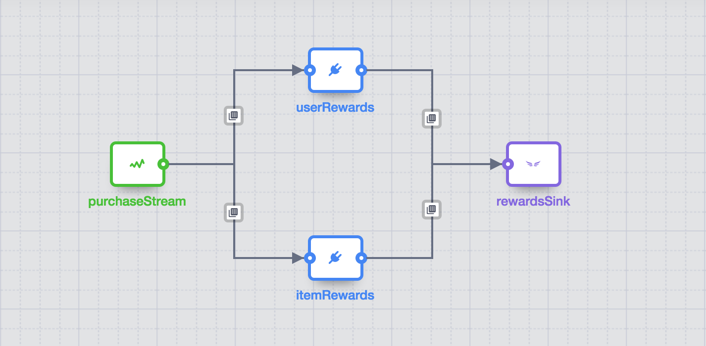

.. meta::
    :author: Cask Data, Inc.
    :copyright: Copyright © 2015-2016 Cask Data, Inc.

.. _cdap-apps-etl-creating:

===========================
Creating an ETL Application
===========================

.. highlight:: console

Applications can be created using the :ref:`Lifecycle RESTful API <http-restful-api-lifecycle-create-app>`,
the :ref:`CDAP CLI <cli>`, or the :ref:`CDAP UI <cdap-ui>`. In order to create an application,
an application configuration is required that specifies the source, transformations and sinks
along with their properties.  (In the CDAP UI, the interface prompts you for the required
information.)

.. _cdap-apps-etl-configuration-file-format:

Configuration File Format
=========================

Creating an ETL Batch Application
---------------------------------

With an ETL Batch Application, it requires a ``schedule`` property with a cron entry
specifying the frequency of the Batch job run, such as every day or every hour.

For example, this JSON (when in a file such as ``config.json``) provides a
configuration for a Batch Application that runs every minute, reading data from a stream
*myStream* and writing to a dataset (Table) called *myTable*, without any transformations:

.. container:: highlight

  .. parsed-literal::
    {
      "artifact": {
        "name": "cdap-etl-batch",
        "version": "|version|",
        "scope": "system"
      },
      "config": {
        "schedule": "\* \* \* \* \*",
        "source": {
          "name": "streamSource",
          "plugin": {
            "name": "Stream",
            "artifact": {
              "name": "core-plugins",
              "version": "|version|",
              "scope": "SYSTEM"
            },
            "properties": {
              "name": "myStream",
              "duration": "1m"
            }
          }
        },
        "transforms": [ ],
        "sinks": [
          {
            "name": "tableSink",
            "plugin": {
              "name": "Table",
              "properties": {
                "name": "myTable",
                "schema.row.field": "ts"
              }
            }
          }
        ],
        "connections": [
          {
            "from": "streamSource",
            "to": "tableSink"
          }
        ]
      }
    }

The application launches a MapReduce program that runs every minute, reads data from the
stream *myStream* and writes to a Table *myTable*. A Table Sink needs a row key field to
be specified and can use the timestamp of a Stream event for that.

A pipeline configuration consists of stages and connections. The stages consist of a single
source, zero (or) more transforms and one (or more) sink(s). Each of these stages is 
identified by a unique name and plugin.

A plugin object is specified by a plugin-name, a properties map and can optionally specify the artifact.
If the artifact is not specified, the application will choose the artifact with the highest version.

The connections field in the configuration defines the connections between the stages. 
The pipeline defined by these connections must be a directed acyclic graph (or DAG).

To create this application, called *streamETLApp*, you can use either the HTTP RESTful API or the CDAP CLI.

- Using the :ref:`Lifecycle RESTful API <http-restful-api-lifecycle-create-app>`::

    $ curl -w'\n' -X PUT localhost:10000/v3/namespaces/default/apps/streamETLApp \
        -H 'Content-Type: application/json' -d @config.json

- Using the :ref:`CDAP CLI <cli>`:

  .. container:: highlight

    .. parsed-literal::
      |$| cdap-cli.sh create app streamETLApp cdap-etl-batch |version| system <path-to-config.json>

where ``config.json`` is the file that contains the application configuration.

.. highlight:: console

Creating an ETL Real-Time Application
-------------------------------------

This next configuration creates a real-time application that reads from Twitter and writes to a
stream after performing a projection transformation:

.. container:: highlight

  .. parsed-literal::
    {
      "artifact": {
        "name": "cdap-etl-realtime",
        "version": "|version|",
        "scope": "system"
      },
      "config": {
        "instances": 1,
        "source": {
          "name": "twitterSource",
          "plugin": {
            "name": "Twitter",
            "properties": {
              "AccessToken": "xxx",
              "AccessTokenSecret": "xxx",
              "ConsumerKey": "xxx",
              "ConsumerSecret": "xxx"
            }
          }
        },
        "transforms": [
          {
            "name": "dropProjector",
            "plugin": {
              "name": "Projection",
              "properties": {
                "drop": "lang,time,favCount,source,geoLat,geoLong,isRetweet"
              }
            }
          }
        ],
        "sinks": [
          {
            "name": "streamSink",
            "plugin": {
              "name": "Stream",
              "properties": {
                "name": "twitterStream",
                "body.field": "tweet"
              }
            }
          }
        ],
        "connections": [
          {
            "from": "twitterSource",
            "to": "dropProjector"
          },
          {
            "from": "dropProjector",
            "to": "streamSink"
          }
        ]
      }
    }

An ETL Real-Time Application expects an instance property that will create *N* instances
of the worker that run concurrently. In Standalone CDAP mode, this is implemented as
multiple threads; in Distributed CDAP mode, it will create different YARN containers. The
number of worker instances of a real-time application should not (in general) be changed
during runtime. If the number of instances needs to be changed, the worker must be
stopped, then the application configuration must be updated to the new number of instances.

The ``instances`` property value needs to be greater than 0. Note that the ``instance``
property replaces the ``schedule`` property of an ETL Batch Application.

In the example code above, we will use a *ProjectionTransform* (a type of Transform) to drop certain
columns in the incoming data. A *StreamSink* in the final step needs a data field property
that it will use as the content for the data to be written.

Non-linear Executions in Pipelines
----------------------------------

ETL Applications support directed acyclic graphs in pipelines, which allows for the
non-linear execution of pipeline stages.

Fork in Pipeline
................
In this example, a pipeline reads from the stream ``purchaseStats``. It writes the stream events
to the table ``replicaTable``, while at the same time it writes just the ``userIds`` to the ``usersTable``
when a user's purchase price is greater than 1000. This filtering logic is applied using an included script
``spendingUsersScript``:

.. image:: ../_images/forkInPipeline.png
   :width: 6in
   :align: center

.. container:: highlight

  .. parsed-literal::
  
    {
      "artifact": {
        "name": "cdap-etl-batch",
        "version": "|version|",
        "scope": "SYSTEM"
      },
      "config": {
        "source": {
          "name": "purchaseStats",
          "plugin": {
            "name": "Stream",
            "properties": {
              "format": "csv",
              "schema": "{
                \"type\":\"record\",
                \"name\":\"etlSchemaBody\",
                \"fields\":[
                  {\"name\":\"userId\",\"type\":\"string\"},
                  {\"name\":\"purchaseItem\",\"type\":\"string\"},
                  {\"name\":\"purchasePrice\",\"type\":\"long\"}
                ]
              }",
              "name": "testStream",
              "duration": "1d"
            }
          }
        },
        "sinks": [
          {
            "name": "replicaTable",
            "plugin": {
              "name": "Table",
              "properties": {
                "schema": "{
                  \"type\":\"record\",
                  \"name\":\"etlSchemaBody\",
                  \"fields\":[
                    {\"name\":\"userId\",\"type\":\"string\"},
                    {\"name\":\"purchaseItem\",\"type\":\"string\"},
                    {\"name\":\"purchasePrice\",\"type\":\"long\"}
                  ]
                }",
                "name": "replicaTable",
                "schema.row.field": "userId"
              }
            }
          },
          {
            "name": "usersTable",
            "plugin": {
              "name": "Table",
              "properties": {
                "schema": "{
                  \"type\":\"record\",
                  \"name\":\"etlSchemaBody\",
                  \"fields\":[
                    {\"name\":\"userId\",\"type\":\"string\"}
                  ]
                }",
                "name": "targetCustomers",
                "schema.row.field": "userId"
              }
            }
          }
        ],
        "transforms": [
          {
            "name": "spendingUsersScript",
            "plugin": {
              "name": "Script",
              "properties": {
                "script": "function transform(input, context) {
                            if (input.purchasePrice > 1000) {
                              return {'userId' : input.userId};
                            }
                          }",
                "schema": "{
                  \"type\":\"record\",
                  \"name\":\"etlSchemaBody\",
                  \"fields\":[
                    {\"name\":\"userId\",\"type\":\"string\"}
                  ]
                }"
              }
            }
          }
        ],
        "connections": [
          {
            "from": "purchaseStats",
            "to": "replicaTable"
          },
          {
            "from": "purchaseStats",
            "to": "spendingUsersScript"
          },
          {
            "from": "spendingUsersScript",
            "to": "usersTable"
          }
        ],
        "schedule": "\* \* \* \* \*",
        "engine": "mapreduce"
      }
    }

Pipeline connections can be configured to fork from a stage, with the output of the stage sent to
two or more configured stages; in the above example,
the output record from ``purchaseStats`` will be sent to both ``replicaTable`` and ``spendingUsersScript`` stages.

Merging Stages in Pipeline
..........................
Forked transform stages can merge together at a transform or a sink stage.
A merge does not join, or modify records in any way. It simply means that multiple stages can write to the same stage.
The only requirement is that all stages must output records of the same schema to the merging stage. Note that
the order of records sent from the forked stages to the merging stage will not be defined.

In this next example, ``purchaseStream`` has purchase data with fields ``userid``, ``item``, ``count``, and ``price``.
The stream events source stage ``purchaseStream`` forks, and records are sent to both of the
transforms ``userRewards`` and ``itemRewards``.

The ``userRewards`` transform script looks up valued customers in the table ``hvCustomers``,
to check if ``userid`` is a valued customer and assigns higher rewards if they are.
After calculating the rewards, this transform sends an output record in the format ``userid(string), rewards(double)``.

The ``itemRewards`` transform script awards higher rewards for bulk purchases and sends output records in the 
same format, ``userid(string), rewards(double)``.

The rewards records are merged at the sink ``rewardsSink``; note that the incoming schema from the transforms
``userRewards`` and ``itemRewards`` are the same, and that the order of received records will vary.

.. container:: highlight

  .. parsed-literal::
  
    {
      "artifact": {
          "name": "cdap-etl-batch",
          "version": "|version|",
          "scope": "SYSTEM"
      },
      "name": "RewardsPipeline",
      "config": {
        "source": {
          "name": "purchaseStream",
          "plugin": {
            "name": "Stream",
            "properties": {
              "format": "csv",
              "schema": "{
                \"type\":\"record\",
                \"name\":\"etlSchemaBody\",
                \"fields\":[
                  {\"name\":\"userid\",\"type\":\"string\"},
                  {\"name\":\"item\",\"type\":\"string\"},
                  {\"name\":\"count\",\"type\":\"int\"},
                  {\"name\":\"price\",\"type\":\"long\"}
                ]
              }",
              "name": "purchases",
              "duration": "1d"
            }
          }
        },
        "sinks": [
          {
            "name": "rewardsSink",
            "plugin": {
              "name": "TPFSAvro",
              "properties": {
                "schema": "{
                  \"type\":\"record\",
                  \"name\":\"etlSchemaBody\",
                  \"fields\":[
                    {\"name\":\"userid\",\"type\":\"string\"},
                    {\"name\":\"rewards\",\"type\":\"double\"}
                  ]
                }"
              }
            }
          }
        ],
        "transforms": [
          {
            "name": "userRewards",
            "plugin": {
              "name": "Script",
              "properties": {
                "script": "function transform(input, context) {
                  var rewards = 5;
                  if (context.getLookup('hvCustomers').lookup(input.userid) !== null) {
                    context.getLogger().info(\"user \" + input.userid + \" is a valued customer\");
                    rewards = 100;
                  } else {
                    context.getLogger().info(\"user \" + input.userid + \" is not a valued customer\");
                  }
                  return {'userid': input.userid, 'rewards': rewards};
                }",
                "schema": "{
                  \"type\":\"record\",
                  \"name\":\"etlSchemaBody\",
                  \"fields\":[
                    {\"name\":\"userid\",\"type\":\"string\"},
                    {\"name\":\"rewards\",\"type\":\"double\"}
                  ]
                }",
                "lookup": "{\"tables\":{\"hvCustomers\":{\"type\":\"DATASET\",\"datasetProperties\":{}}}}"
              }
            }
          },
          {
            "name": "itemRewards",
            "plugin": {
              "name": "Script",
              "properties": {
                "script": "function transform(input, context) {
                  var rewards = 5;
                  if (input.count > 20) {
                    rewards = 50;
                  }
                  return {'userid':input.userid, 'rewards':rewards};
                }",
                "schema": "{
                  \"type\":\"record\",
                  \"name\":\"etlSchemaBody\",
                  \"fields\":[
                    {\"name\":\"userid\",\"type\":\"string\"},
                    {\"name\":\"rewards\",\"type\":\"double\"}
                  ]
                }"
              }
            }
          }
        ],
        "connections": [
          {
            "from": "purchaseStream",
            "to": "userRewards"
          },
          {
            "from": "userRewards",
            "to": "rewardsSink"
          },
          {
            "from": "purchaseStream",
            "to": "itemRewards"
          },
          {
            "from": "itemRewards",
            "to": "rewardsSink"
          }
        ],
        "comments": [],
        "schedule": "\* \* \* \* \*",
        "engine": "mapreduce"
      }
    }

Sample Application Configurations
---------------------------------

**Database:** Sample config for using a Database Source and a Database Sink:

.. container:: highlight

  .. parsed-literal::
    {
      "artifact": {
        "name": "cdap-etl-batch",
        "version": "|version|",
        "scope": "system"
      },
      "config": {
        "schedule": "\* \* \* \* \*",
        "source": {
          "name": "databaseSource",
          "plugin": {
            "name": "Database",
            "properties": {
              "importQuery": "select id,name,age from my_table",
              "countQuery": "select count(id) from my_table",
              "connectionString": "\jdbc:mysql://localhost:3306/test",
              "tableName": "src_table",
              "user": "my_user",
              "password": "my_password",
              "jdbcPluginName": "jdbc_plugin_name_defined_in_jdbc_plugin_json_config",
              "jdbcPluginType": "jdbc_plugin_type_defined_in_jdbc_plugin_json_config"
            }
          }
        },
        "sinks": [
          {
            "name": "databaseSink",
            "plugin": {
              "name": "Database",
              "properties": {
                "columns": "id,name,age",
                "connectionString": "\jdbc:mysql://localhost:3306/test",
                "tableName": "dest_table",
                "user": "my_user",
                "password": "my_password",
                "jdbcPluginName": "jdbc_plugin_name_defined_in_jdbc_plugin_json_config",
                "jdbcPluginType": "jdbc_plugin_type_defined_in_jdbc_plugin_json_config"
              }
            }
          }
        ],
        "transforms": [ ],
        "connections": [
          {
            "from": "databaseSource",
            "to": "databaseSink"
          }
        ]
      }
    }
  
**Kafka:** A Kafka cluster needs to be setup, and certain minimum properties specified when
creating the source:

.. container:: highlight

  .. parsed-literal::
    {
      "artifact": {
        "name": "cdap-etl-realtime",
        "version": "|version|",
        "scope": "system"
      },
      "config": {
        "instances": 1,
        "source": {
          "name": "kafkaSource",
          "plugin": {
            "name": "Kafka",
            "properties": {
              "kafka.partitions": "1",
              "kafka.topic": "test",
              "kafka.brokers": "localhost:9092"
            }
          }
        },
        "sinks": [
          {
            "name": "streamSink",
            "plugin": {
              "name": "Stream",
              "properties": {
                "name": "myStream",
                "body.field": "message"
              }
            }
          }
        ],
        "transforms": [ ],
        "connections": [
          {
            "from": "kafkaSource",
            "to": "streamSink"
          }
        ]
      }
    }

**Prebuilt JARs:** In a case where you'd like to use prebuilt third-party JARs (such as a
JDBC driver) as a plugin, please refer to the section on :ref:`Using Third-Party Jars
<cdap-apps-third-party-jars>`. 
