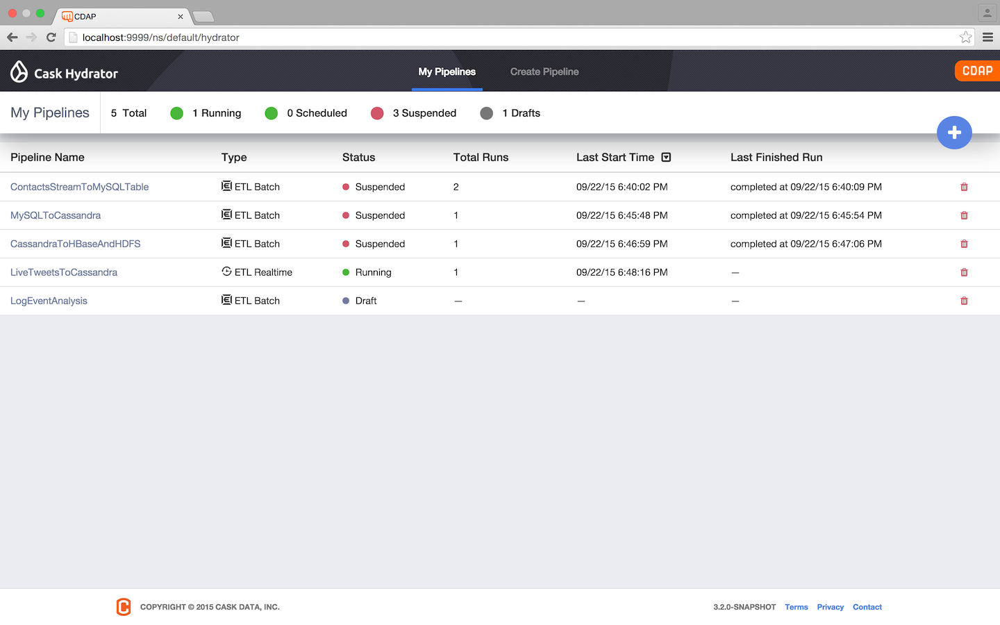

.. meta::
    :author: Cask Data, Inc.
    :description: Users' Manual
    :copyright: Copyright © 2015 Cask Data, Inc.

:hide-toc: true

.. _cdap-apps-hydrator-index:

===============================
Cask Hydrator and ETL Pipelines
===============================

.. toctree::
   :maxdepth: 1

    Overview <overview>
    Creating an ETL Application <creating>
    Creating Custom ETL Plugins <custom>
    ETL Plugins <hydrator-plugins/index>
    Upgrading ETL Applications <upgrade>
    
    
.. _cdap-apps-intro-hydrator:

ETL is **Extract**, **Transform** and **Load** of data, a common first-step in any data
application. CDAP endeavors to make performing ETL possible out-of-box without writing
code; instead, you just configure CDAP appropriately and operate it.

.. |overview| replace:: **ETL Overview:**
.. _overview: overview.html

- |overview|_ An introduction to ETL, ETL applications, and ETL plugins.

.. |etl-creating| replace:: **Creating an ETL Application:**
.. _etl-creating: creating.html

- |etl-creating|_ Covers using the system artifacts and ETL plugins included with CDAP to create an ETL application.

.. |etl-custom| replace:: **Creating Custom ETL Plugins:**
.. _etl-custom: custom.html

- |etl-custom|_ Intended for developers writing custom ETL plugins.

.. |etl-plugins| replace:: **ETL Plugins:**
.. _etl-plugins: hydrator-plugins/index.html

- |etl-plugins|_ Details on ETL plugins and exploring available plugins using RESTful APIs.

.. |etl-upgrade| replace:: **Upgrading ETL Applications:**
.. _etl-upgrade: upgrade.html

- |etl-upgrade|_ Instructions for upgrading old ETL applications.

..

- **Using Third-Party Jars:** A third-party JAR (such as a JDBC driver) :ref:`can be used as a plugin <cdap-apps-third-party-jars>`.

..

- **Lifecycle of ETL Applications:** This is managed using CDAP's :ref:`Lifecycle HTTP RESTful API <http-restful-api-lifecycle>`.

.. _cdap-apps-cask-hydrator:

.. rubric:: Cask Hydrator

CDAP supports users with self-service batch and real-time data ingestion combined with
ETL, expressly for the building of Hadoop data lakes. Called **Cask Hydrator**, it
provides CDAP users a seamless and easy way to configure and operate ingestion pipelines
from different types of sources and data.

*Cask Hydrator* provides an easy method of configuring *pipelines* using a visual editor.
You drag and drop sources, transformations, and sinks, configuring an ETL pipeline within
minutes. It provides an operational view of the resulting ETL pipeline that allows for
monitoring of metrics, logs, and other run-time information.

   **Cask Hydrator Pipelines:** Administration of created pipelines with current status

.. figure:: ../_images/hydrator-studio.png
   :figwidth: 100%
   :width: 6in
   :align: center
   :class: bordered-image-top-margin

   **Cask Hydrator Studio:** Visual editor showing the creation of an ETL pipeline
