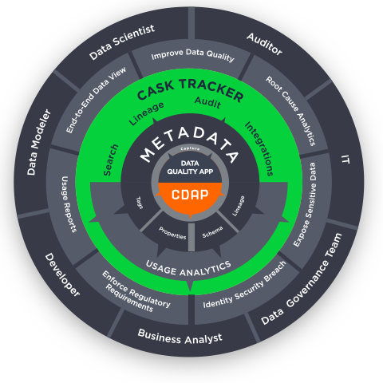

.. meta::
    :author: Cask Data, Inc.
    :description: Cask Tracker
    :copyright: Copyright © 2016 Cask Data, Inc.

:hide-toc: true

.. _cdap-apps-tracker-index:

============
Cask Tracker
============

.. 
.. .. toctree::
..    :maxdepth: 1
.. 
..     Overview <overview>
..     Creating an ETL Application <creating>
..     Creating Custom ETL Plugins <custom>
..     ETL Plugins <hydrator-plugins/index>
..     Upgrading ETL Applications <upgrade>
    

Introduction (can come from Tracker datasheet),  

how it is based off of the metadata system - add plenty of links
 

Introducing Cask Tracker

Cask Tracker is a self-service CDAP extension that automatically captures metadata and
lets you see how data is flowing into and out of datasets, streams, and stream views.

It allows you to perform impact and
root-cause analysis, and delivers an audit-trail for auditability and compliance. Tracker
furnishes access to structured information that describes, explains, locates, and makes it
easier to retrieve, use, and manage datasets.

Tracker also allows for the storage of metadata where it can be accessed and indexed. This
allows it to be is easily searched and provides consistent, high-quality metadata.

Harvest, Index, and Track Datasets

- Immediate, timely, and seamless capture of technical, business, and operational metadata,
  enabling faster and better traceability of all datasets.

- Quickly, reliably, and accurately indexes technical, business, and operational metadata
  to easily locate datasets.

- Lets you understand the impact of changing datasets on other datasets or processing, and queries
  using lineage.

- Tracks the flow of data across enterprise systems and data lakes, no matter which process or
  application is moving or transforming the data.

- Provides trusted and complete metadata on datasets, enabling easy traceability to resolve any data
  issues and to improve data quality.

Support for Standardization, Governance and Compliance Needs

- Provide IT with the traceability needed in governing datasets and in applying compliance
  rules through seamless integration with other extensions.

- Has consistent definitions of metadata-containing information about the data to reconcile
  difference in terminologies

- Empowers business users in understanding the lineage of their business-critical data.

Blend Metadata Analytics and Integrations

- Gain deep insights into how your datasets are being created, accessed, and processed
  with built-in usage analytics capabilities

- Valuable multi-dimensional usage analytics to understand complex interactions between
  users, application and datasets

- Extensible integrations with enterprise-grade MDM (master data management) systems such
  as Cloudera Navigator for centralizing metadata repository and the delivery of complete,
  accurate, and correct data.

Example Use Case

An example use case describes how Tracker was employed in the `data cleansing and validating of
three billion records <http://customers.cask.co/rs/882-OYR-915/images/tracker-casestudy1.pdf>`__.

installation doc - how to enable tracker thru the UI, how to disable

Installation

enable:

  the property in cdap-site.xml is required for Audit Log
  
  go to UI, press button
  go to cdap-cli
  
  load artifact target/tracker-<version>.jar
  
  create app TrackerApp tracker <version> USER appconfig.txt
  
  create app _TrackerApp tracker 0.1.0-SNAPSHOT SYSTEM appconfig.txt

  curl -w"\n" -X POST -d "{'url':'/index.html'}" "http://localhost:10000/v3/namespaces/default/apps/LogAnalysis/services/HitCounterService/methods/hitcount"
  
  curl -w"\n" -X POST -d "{'url':'/index.html'}" "http://localhost:10000/v3/namespaces/default/apps/LogAnalysis/services/HitCounterService/methods/hitcount"

{
  "config": {
    "auditLogKafkaConfig": {
      "zookeeperString": "localhost:2181/cdap/kafka"
    }
  }
}

disable
  stop flow
  stop service
  delete the app
  delete the datasets

overview of what does tracker provide? - how to navigate the UI, what is where etc
a little bit about the app itself - it has one REST API, two programs, how users don’t have to do anything to start them 
APIs
audit logs - TBD
metadata APIs 
search APIs?
