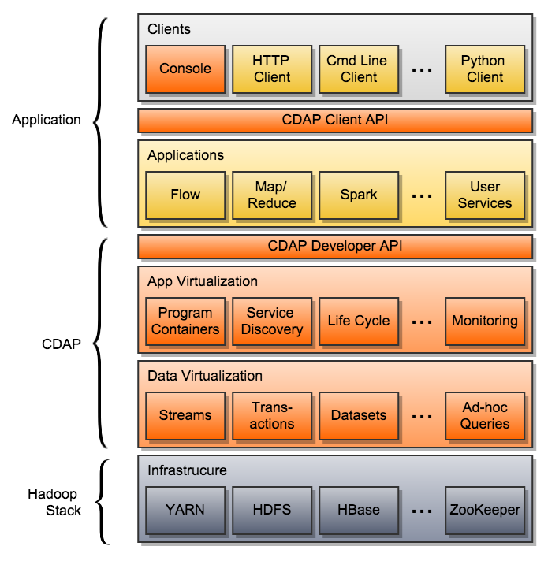
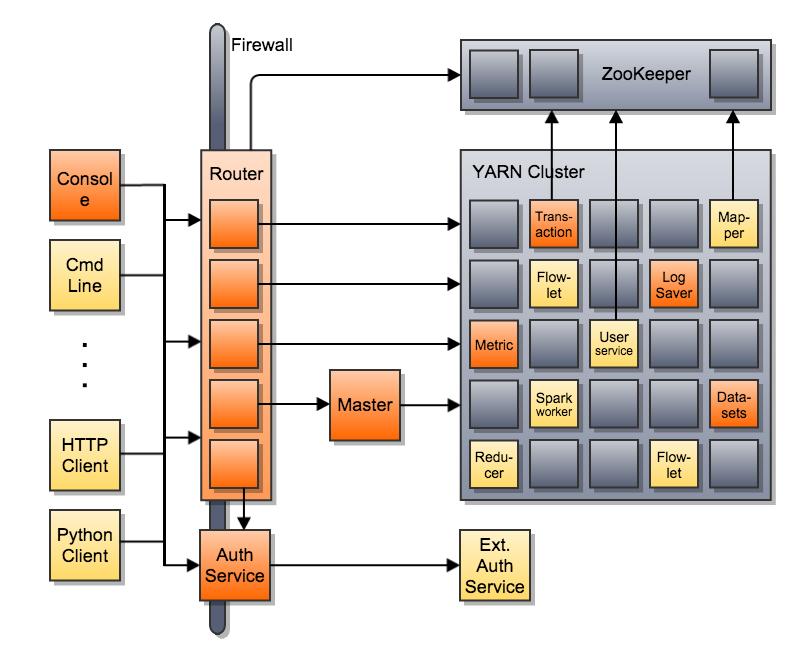

.. :author: Cask Data, Inc.
   :description: Architecture of the Cask Data Application Platform
     :copyright: Copyright © 2014 Cask Data, Inc.

========================================================
Cask Data Application Platform Architecture and Concepts
========================================================

Introduction
============

**Cask Data Application Platform (CDAP)** is a developer-centric middleware for developing and running
Big Data applications. Before you learn how to develop and operate applications, this section will
explain the concepts and architecture of CDAP.

Virtualization
==============

CDAP lets you virtualize your data and applications by injecting abstraction layers over the various components
of the Hadoop ecosystem. To access and manipulate data, you interact with CDAP's Datasets rather than actual
storage engines such as HDFS or HBase. Similarly, you write your applications using CDAP's developer interface
and run them inside application containers. These containers are a logical abstraction that can be realized
differently in several runtime environments, such as in-memory, single-node standalone, or distributed cluster.
Thus you can deploy and run in different environments without the need to change a single line of application
code.

Data Virtualization
-------------------

In CDAP applications, you interact with data through Datasets. Datasets provide virtualization through:

- Abstraction of the actual representation of data in storage. You can write your code or queries without
  having to know where and how your data is stored - be it in HBase, LevelDB or a relational database.
- Encapsulation of data access patterns and business logic as reusable, managed Java code.
- Consistency of your data under highly concurrent access using CDAP's transaction system provided by
  `Cask Tephra <http://github.com/continuuity/tephra/>`__
- Injection of datasets into different programming paradigms and runtimes: As soon as your data is in a
  dataset, you can instantly use it in real-time programs, batch processing such as Map/Reduce or Spark,
  and ad-hoc SQL queries.

Application Virtualization
--------------------------

CDAP's programming interfaces have multiple implementations in different runtime environments. You build
your applications against the CDAP developer API. This API hides the low-level details of individual
programming paradigms and execution environments. It also enriches the infrastructure with many useful
services that are typically needed by Big Data applications, such as service discovery, log and metrics
collection, and configuration. The environment-specific implementations of these services are injected
by CDAP into the program containers in which the application is run - the application itself does not
need to change based on the environment. This allows you develop applications in one environment - say,
on your laptop using a stand-alone CDAP for testing - and then seamlessly deploy them in a different
environment - say, your distributed staging cluster.

Deployment of an application as well as its life cycle management, monitoring and scaling are done
through CDAP's client API. Similarly to the developer API, it is the same in every environment. The
experience of managing your application does not change when moving from one environment to another.

Developer Focus
---------------

CDAP supports developers through the entire application development lifecycle:
development, debugging, testing, continuous integration and production. Using familiar
development tools such as *IntelliJ* and *Eclipse*, you can build, test and debug your
application right on your laptop with a *Standalone CDAP*. Utilize the application unit
test framework (which embeds an *In-Memory CDAP*, for continuous integration. Deploy
to a development cloud or production cloud (*Distributed CDAP*) with a push of a button.
No matter what environment you are in, the experience of managing the application remains
largely the same.

CDAP Programming Interfaces
===========================

We distinguish between the Developer interface and the Client interface.

- The Developer interface is used to build applications and exposes various Java APIs that are only available to
  code that runs inside application containers, for example the Dataset and Transaction APIs as well as the
  various supported programming paradigms.
- The Client interface is a RESTful API and the only way that external clients can interact with CDAP and
  applications. It includes APIs that are not accessible from inside containers, such as application
  lifecycle management and monitoring. As an alternative to HTTP, clients can also use the client libraries
  provided for different programming languages, including Java, JavaScript and Python.

.. image:: _images/arch_interfaces.png
   :width: 5in
   :align: center

Note that some interfaces are included in both the Developer and the Platform APIs, for example, Service Discovery
and Dataset Management.

Components of CDAP and their Interactions
=========================================

The following diagram illustrates the components that make up distributed CDAP and some of their interactions:

CDAP consists mainly of these components:

- The Router is the only public access point into CDAP for external clients. It forwards client requests to
  the appropriate system service or application. In a secure setup, the router also performs authentication;
  It is then complemented by an authentication service that allows clients to obtain credentials for CDAP.
- The Master controls and manages all services and applications.
- System Services provide vital platform features such datasets, transactions, service discovery logging,
  and metrics collection. System services run in application containers.
- Application containers provide virtualization and isolation for execution of application code (and, as a
  special case, system services). Application containers scale linearly and elastically with the underlying
  infrastructure.

In a Hadoop Environment, application containers are implemented as YARN containers and datasets use HBase and
HDFS for actual storage. In other environments, this implementation can be different. For example, the standalone
CDAP runs all services in a single JVM, application containers are implemented as threads, and data is stored in
the local file system.

Anatomy of a Big Data Application
=================================

As an application developer building a Big Data application, you are primarily concerned with four areas:

- Data Collection: A way to get data into the system, so that it can be processed. We distinguish these types
  of collecting data:

  - A system or application service may poll an external source for available data and then retrieve it ("pull"),
    or external clients may send data to a public endpoint of the platform ("push").
  - Data can come steadily, one event at a time ("realtime") or in bulk, many events at once ("batch").
  - Data can be acquired with a fixed schedule ("periodic") or whenever new data is available ("on-demand").

  CDAP provides streams as a means to push events into the platform in real-time. It also provides tools that
  pull data in batch, be it periodic or on-demand, from external sources.

  Streams are special type of dataset that are exposed as a push endpoint for external clients. They support
  ingesting events in realtime at massive scale. Events in the stream can then be consumed by applications in
  real-time or batch.

- Data Exploration: One of the most powerful paradigms of Big Data is "schema-on-write". This means the ability
  to collect and store data without knowing details about its schema or structure. These details are only needed
  a processing time. An important step between collecting the data and processing it exploration, that is,
  examining data with ad-hoc queries to learn about its structure and nature.

  NOTE: This is not exactly what CDAP allows! FIXME!

- Data Processing: After data is collected, we need to process it in various ways. For example:

  - Raw events are filtered and transformed into a canonical form, to ensure quality of input data for
    down-stream processing.
  - Events (or certain dimensions of the events) are counted or aggregated in other ways.
  - Events are annotated and used by an iterative algorithm to train a machine learned model.
  - Events from different sources are joined to find associations, correlations or other views across
    multiple sources.
  - Etc.

  Processing can happen in realtime, where a stream processor consumes events immediately after they are collected.
  Such processing provides has less expressive power than other processing paradigms but provides insights into the
  data in a very timely manner. CDAP offers Flows as the realtime processing framework.

  Processing can also happen in batch, where many events are processed at the same time to analyze an entire data
  corpus at once. Batch processing is more powerful than realtime processing, but due its very nature is always
  time-lagging and therefore often performed over historical data. In CDAP, batch processing can be done via
  Map/Reduce or Spark, and it can also be scheduled on a periodic basis as part of a workflow.

- Data Storage: The results of processing data must be stored in a persistent and durable way, that allows other
  programs or applications to further process or analyze this data. In CDAP, data is stored in datasets.

- Data Serving: The ultimate purpose of processing data is not to store the results, but to make these results
  available to other applications. For example, a web analytics application may find ways to optimize the traffic
  on a website. However, these insights are worthless without a way to feed them back to the actual web application.
  CDAP allows serving datasets to external clients through procedures and services.

Hence, a CDAP application consists of the following components:

- `Streams <dev-guide.html#streams>`__ for real-time data collection;
- Programs (`Flows <dev-guide.html#flows>`__, `MapReduce <dev-guide.html#mapreduce>`__,
  `Spark <dev-guide.html#spark>`__) for data processing in realtime or in batch;
- `Datasets <dev-guide.html#datasets>`__ for virtualized data storage; and
- `Procedures <dev-guide.html#procedures>`__ and `Services <dev-guide.html#services>`__
  for data serving to external clients.

The following diagram illustrates a typical Big Data application:

.. image:: _images/app_unified_batch_realtime.png
   :width: 8in
   :align: center

This also illustrates the power of data virtualization in CDAP: A stream is not only a means to collect data, it can
also be consumed by realtime and batch processing at the same time. Similarly, datasets allow sharing of data between
programs of different paradigms, be they in realtime or batch, without compromising the consistency of the data,
because all data access happens under ACID guarantees.

Where to Go Next
================
Now that you understand the concepts and the architecture of CDAP, you are ready to write an application:

- `Cask Data Application Platform Developer Guide <dev-guide.html>`__,
  which guides you through all the development of all the components of an application.

.. |(TM)| unicode:: U+2122 .. trademark sign
   :trim:
