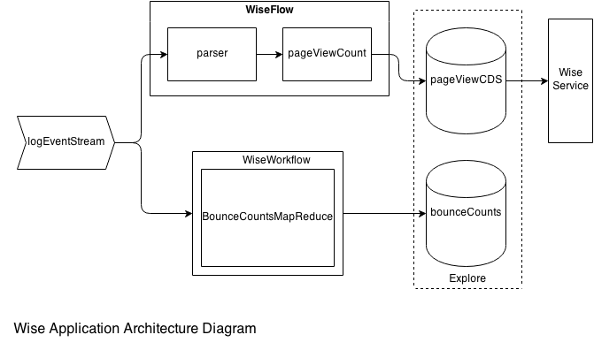

.. :author: Cask Data, Inc.
   :description: Advanced Cask Data Application Platform Features
   :copyright: Copyright © 2014 Cask Data, Inc.

===========================
CDAP Application Case Study
===========================

**Web Analytics using the Cask Data Application Platform (CDAP)**

Introduction
============
Performing analytics on a Web application using access logs is a common use case when managing a Web site.
A system that can do that needs to ingest logs, and implements real-time processing or batch processing  computations
to perform work on the data and extract information. The information has to be stored somewhere in the system, and
the system should expose ways to retrieve it. Even in the case where the system performs very simple analytics,
like counting the number of visits made to a website in a day, the components needed to make it possible demand
a lot of work.

With our Web Insights Engine Application, or *Wise*, we will show you how simple it is to build such a system on CDAP,
that is both easy and concise, and powerful. Wise extracts value from Web server access logs.
It counts visits made by different IP addresses seen in the logs in real-time,
and computes the bounce ratio of each Web page encountered using batch processing.

The Wise application uses the following Cask Data Application Platform (CDAP) constructs to analyze web server logs:

- **Stream**: Ingests log data in real-time
- **Flow**: Computes Web page visits counts per IP address based on the log data in real-time
- **Datasets**: Store Web page visits counts and bounce ratio based on custom data access patterns
- **MapReduce**: Computes the bounce ratio of each Web page present in the log data
- **Service**: Exposes HTTP APIs to query the page visit counts per IP address
- **Explore**: Runs SQL queries on the data stored in Datasets

Running Wise
============
Building and running Wise is easy. Simply download the source tarball from the following location::

  url

You can then expand the tarball and build the application by executing::

  $ tar -xzf cdap-wise-0.1.0.tar.gz
  $ cd cdap-wise-0.1.0
  $ mvn package

To deploy the application, first make sure CDAP standalone (*link*) is running, then execute::

  $ bin/deploy.sh

Overview of Wise
================
Throughout this case study, we are going to present and explain the different constructs that the Wise application
uses. Let's first have a look at a diagram showing a overview of the Wise application's architecture.

- The Wise application has one Stream - ``logEventStream`` - which receives Web server access logs. It sends the events
  it receives to two CDAP components: the ``WiseFlow`` Flow and the ``WiseWorkflow`` Workflow.

- ``WiseFlow`` has two Flowlets. The first one, ``parser``, extracts information out of the logs received from the
  stream. It then sends the information to the second Flowlet, ``pageViewCount``, which role is to store
  the information in a custom-defined Dataset, ``pageViewStore``.

- ``WiseWorkflow`` executes a Map/Reduce job every ten minutes. The input of this job are events from the Stream
  which have not yet been processed by the Workflow. For each Web page recorded in the access logs, this job counts
  the number of times people have "bounced" from it. A "bounce" is counted whenever a user's activity stops for a
  specified amount of time. The last page they visited is counted as a bounce. This information is stored in the
  Dataset ``bounceCountStore``.

- The Wise application contains a Service, the ``WiseService``. It exposes REST endpoints to query the ``pageViewStore``
  Dataset.

- Finally, both the ``pageViewStore`` and ``bounceCountStore`` Datasets expose a SQL interface.
  They can be queried using SQL queries through our ``Explore`` module in CDAP dashboard.

Let's now talk about each of these components in more detail.

Wise Data Patterns
==================
Let's look at a sample access log::

  47.41.156.173 - - [18/Sep/2014:12:52:52 -0400] "POST /index.html HTTP/1.1" 404 1490 " " "Mozilla/2.0 (compatible; Ask Jeeves)"

Wise is only interested in three parts of a log:

- The IP address: *47.41.156.173*
- The time the log was save:, *18/Sep/2014:12:52:52 -0400*; and
- The Web page visited: */index.html*.

Wise has two ``pageViewStore`` and ``bounceCountStore``, which both store information about the access logs,
but according to different access patterns.

The *pageViewStore* Dataset
---------------------------
The ``pageViewStore`` custom Dataset stores, for every IP address, the number of times it visited a web page.
For example, ``pageViewStore`` could contain the following entry::

  47.41.156.173 -> {
    /index.html -> 3,
    /career.html -> 1,
    /team.html -> 4
  }

``pageViewStore`` uses a ``Table`` object to store this information. ``Table`` is a class provided by the CDAP
system which has rows and columns. A row consists of a row key and one or more columns with values associated with
them. Two rows can have different sets of columns.
Using the Java ``Map`` interface, a ``Table`` can be seen as being of type ``Map<byte[], Map<byte[], byte[]>>``.

``pageViewStore`` uses a ``Table`` object with the pattern:

- The row key of the ``Table`` is an IP address;
- Each Web page visited byt the IP address is a column;
- The value of each column is the count of visits the IP address has made to the Web page URI.

``pageViewStore`` is a custom-defined Dataset. It is defined in the ``PageViewStore`` class.
Here is how to define it so that it includes the use of a ``Table`` to store the data::

  public class PageViewStore extends AbstractDataset
    ... {

    // Define the underlying table
    private Table table;

    public PageViewStore(DatasetSpecification spec, @EmbeddedDataset("tracks") Table table) {
      super(spec.getName(), table);
      this.table = table;
    }
    ...
  }

This is the common way of defining a custom Dataset. The next step is to define the APIs that this Dataset exposes
to store data and access data. Here is the API for storing data::

  public void incrementCount(LogInfo logInfo) {
    table.increment(new Increment(logInfo.getIp(), logInfo.getUri(), 1L));
  }

``incrememtCount()`` takes a ``LogInfo`` object containing the three parts of a log that we are interested in -
IP address, timestamp and Web page - and increments the number of visits of the Web page for that IP address.
We use the underlying ``Table`` API ``increment()`` to store this information.

Let's now see an example showing how to made data available through our ``pageViewStore`` Dataset::

  public long getCounts(String ipAddress) {
    Row row = this.table.get(Bytes.toBytes(ipAddress));
    if (row == null || row.isEmpty()) {
      return 0;
    }
    int count = 0;
    for (Map.Entry<byte[], byte[]> entry : row.getColumns().entrySet()) {
      count += Bytes.toLong(entry.getValue());
    }
    return count;
  }

This API returns the total number of visits an IP address has made. To do so, it uses the ``Table.get()`` method,
which returns a ``Row`` object containing all the columns associated to the row key passed as argument of
``Table.get()``.

The *bounceCountStore* Dataset
------------------------------
The ``bounceCountStore`` Dataset stores the total number of visits for each Web page, along with the number
of times users bounced off of them.

Data is stored in a ``Table`` object with the pattern:

- The row key is the Web page URI;
- Each row has two columns: the byte arrays ``COL_VISITS`` and ``COL_BOUNCES``;
- The ``COL_VISITS`` column stores the total number of visits for the Web page considered; and
- The ``COL_BOUNCES`` column stores the number of times users bounced off the Web page.

Let's detail the API exposed by the ``bounceCountStore`` Dataset to store this information::

  static final byte[] COL_VISITS = new byte[] { 'v' };
  static final byte[] COL_BOUNCES = new byte[] { 'b' };

  /**
   * Increment a bounce count entry with the specified number of visits and bounces.
   *
   * @param uri URI of the Web page
   * @param visits number of visits to add to the Web page
   * @param bounces number of bounces to add to the Web page
   */
  public void increment(String uri, long visits, long bounces) {
    table.increment(Bytes.toBytes(uri),
                    new byte[][] { COL_VISITS, COL_BOUNCES },
                    new long[] { visits, bounces });
  }

The ``increment()`` method adds to a Web page a number of `visits` and a number of `bounces`. It uses the
``Table.increment()`` API to do so.

To retrieve the number of "visits" and the number of "bounces" for one Web page, we define a ``get()`` API::

  /**
   * Retrieve a bounce counts entry from this {@link BounceCountsStore}.
   *
   * @param uri URI of the Web page.
   * @return the bounce counts entry associated to the Web page with the {@code uri}.
   */
  public PageBounce get(String uri) {
    Row row = table.get(Bytes.toBytes(uri), new byte[][] { COL_VISITS, COL_BOUNCES });
    if (row.isEmpty()) {
      return new PageBounce(uri, 0, 0);
    }
    long visits = Bytes.toLong(row.get(COL_VISITS));
    long bounces = Bytes.toLong(row.get(COL_BOUNCES));
    return new PageBounce(uri, visits, bounces);
  }

The ``get()`` API reads the two columns ``COL_VISITS`` and ``COL_BOUNCES`` of a Web page. Once again,
we use the ``Table.get()`` API which returns a ``Row`` object. From the information contained in the ``Row``
object, we build a ``PageBounce`` object, a simple POJO class, containing a ``uri``,
a ``visits`` count and a ``bounces`` count.

Ingesting Access Logs in Wise
=============================
CDAP has an extremely easy way to ingest data in real time into an application, using **Streams**. A Stream exposes
a simple `REST API <rest.html>`__ to ingest data events.

In Wise, each Web server access log is injected as a Stream event to the ``logEventStream`` Stream. It has this format::

  47.41.156.173 - - [18/Sep/2014:12:52:52 -0400] "POST /index.html HTTP/1.1" 404 1490 " " "Mozilla/2.0 (compatible; Ask Jeeves)"

We have already prepared a sample of Web server access logs for you to inject into ``logEventStream``.
On Unix systems, simply run the following command at the root of Wise application::

  $ bin/inject-data.sh

On Windows, run::

  $ bin/inject-data.bat

This requires that a CDAP standalone instance be running with the Wise application already deployed.

Real-time Log Analytics with WiseFlow
=====================================
The goal of ``WiseFlow`` is to perform real-time analytics on the Web server access logs received by ``logEventStream``.
For each IP address it sees in the logs, it counts the number of visits they made to different Web pages.

This work is realized by two Flowlets, ``parser`` and ``pageViewCount``.

The *parser* Flowlet
....................
``parser`` receives the raw log data from the Stream and extracts useful information from it.
Here is its implementation::

  public static class LogEventParserFlowlet extends AbstractFlowlet {
    private static final Logger LOG = LoggerFactory.getLogger(LogEventParserFlowlet.class);

    // Emitter for emitting a LogInfo instance to the next Flowlet
    private OutputEmitter<LogInfo> output;

    // Annotation indicates that this method can process incoming data
    @ProcessInput
    public void processFromStream(StreamEvent event) throws CharacterCodingException {

      // Get a log event in String format from a StreamEvent instance
      String log = Charsets.UTF_8.decode(event.getBody()).toString();

      try {
        LogInfo logInfo = LogInfo.parse(log);
        if (logInfo != null) {
          output.emit(logInfo, "ip", logInfo.getIp().hashCode());
        }
      } catch (IOException e) {
        LOG.info("Could not parse log event {}", log);
      }
    }
  }

A Flowlet class extends ``AbstractFlowlet``. The ``LogEventParserFlowlet`` class contains one method to process the
data it receives from ``logEventStream``.
This method can have any name. Here we call it ``processFromStream``. It has to bear the ``@ProcessInput``
annotation indicating that the method will be used to process incoming data.

Because the ``parser`` Flowlet receives data from a Stream, the ``processFromStream`` method has to take one and only
one argument of type ``StreamEvent``. A ``StreamEvent`` object contains the header and the body of a Stream event.
In the Wise application, the body of a ``StreamEvent`` will be an Web server access log.

The ``parser`` Flowlet parses every log it receives into one ``LogInfo`` object. Using an ``OutputEmitter<LogInfo>``
object, ``parser`` outputs those logs to the next Flowlet input - the ``pageViewCount`` Flowlet.
When a ``LogInfo`` object is emitted, it is hashed by IP address. We will see in a minute why this is useful.

The *pageViewCount* Flowlet
...........................
The ``pageViewCount`` Flowlet receives ``LogInfo`` objects and updates the ``pageViewStore`` Dataset with the
information they contained.

Its implementation is very brief::

  public static class PageViewCounterFlowlet extends AbstractFlowlet {
    @UseDataSet("pageViewStore")
    private PageViewStore pageViewStore;

    @Batch(10)
    @HashPartition("ip")
    @ProcessInput
    public void count(LogInfo logInfo) {
      // Increment the count of a logInfo by 1
      pageViewStore.incrementCount(logInfo);
    }
  }

Here are the things to note about the ``PageViewCounterFlowlet`` Flowlet class:

- The ``@ProcessInput`` annotation on the ``count()`` method indicates that ``count()`` will process incoming data.

- The ``@UseDataSet`` annotation gives a reference to the ``pageViewStore`` Dataset inside the ``pageViewStore``
  attribute. The Dataset APIs can then be used inside the ``count()`` method to store logs analytics.

- The ``@Batch`` annotation indicates that data is processed in batch of ``LogInfo`` objects,
  which increases the throughput of the Flolet.

- The ``@HashPartition`` annotation makes sure that, if several instance of this Flowlet are running, all
  ``LogInfo`` objects with the same IP address information will be sent to the same Flowlet instance.
  This prevents two Flowlet instances from writing to the same row key of the ``pageViewStore`` Dataset at the
  same time, which would cause a transaction conflict. See the `advanced <advanced.html>`__ chapter for more
  information about transactions.

Building the WiseFlow
.....................
Now that we have had a look at the core of the ``parser`` and ``pageViewCount`` Flowlets, let's see how
they are connected together and to ``logEventStream``.

The Flowlets are defined in the ``WiseFlow`` Flow, which is defined by this small class::

  public class WiseFlow implements Flow {
    @Override
    public FlowSpecification configure() {
      return FlowSpecification.Builder.with()
        .setName("WiseFlow")
        .setDescription("Wise Flow")
        .withFlowlets()
          .add("parser", new LogEventParserFlowlet())
          .add("pageViewCount", new PageViewCounterFlowlet())
        .connect()
          .fromStream("logEventStream").to("parser")
          .from("parser").to("pageViewCount")
        .build();
    }
  }

In the ``configure()`` method of the ``WiseFlow`` Flow, we define the Flowlets, giving them names:
- ``parser`` is of type ``LogEventParserFlowlet``.
- ``pageViewCount`` is of type ``PageViewCounterFlowlet``.
We also define the graph of their connection:
- The ``logEventStream`` Stream is connected to the ``parser`` Flowlet.
- The ``parser`` Flowlet is connected to the ``pageViewCount`` Flowlet.

``WiseFlow`` looks like this in CDAP Console:

.. image:: _images/wise_flow.png
   :width: 6in

Batch Processing of Logs with WiseWorkflow
==========================================
Wise implements a simple Workflow, which executes every 10 minutes a Map/Reduce job that computes the bounce
counts of the Web pages seen in the Web server access logs.

All this is done in the ``WiseWorkflow`` class::

  public class WiseWorkflow implements Workflow {
    @Override
    public WorkflowSpecification configure() {
      return WorkflowSpecification.Builder.with()
        .setName("WiseWorkflow")
        .setDescription("Wise Workflow")
        .onlyWith(new BounceCountsMapReduce())
        .addSchedule(new Schedule("TenMinuteSchedule", "Run every 10 minutes", "0/10 * * * *",
                                  Schedule.Action.START))
        .build();
    }
  }

The ``BounceCountsMapReduce`` class defines the Map/Reduce job to run. It extends
``AbstractMapReduce`` and overrides two methods, ``configure()`` and ``beforeSubmit()``.
The ``configure()`` method is defined as follows::

  @Override
  public MapReduceSpecification configure() {
    return MapReduceSpecification.Builder.with()
      .setName("BounceCountsMapReduce")
      .setDescription("Bounce Counts MapReduce job")
      .useDataSet("bounceCountsMapReduceLastRun")
      .useOutputDataSet("bounceCountStore")
      .build();
  }

It sets the ID of the Map/Reduce job, ``BounceCountsMapReduce``, and specifies what Datasets will be used in the job.
This job uses the ``bounceCountsMapReduceLastRun`` system Dataset - of type ``KeyValueTable`` - to
store the time of the last successful run of ``BounceCountsMapReduce``.

The ``useOutputDataset()`` method specifies that the Dataset with the given ID will be used as output of the job.
It means that the key/value couples outputted by the reducer of this job will be directly written to this Dataset.

To understand how this is possible, let's go back to the definition of the ``bounceCountStore`` Dataset::

  public class BounceCountsStore extends AbstractDataset
    implements BatchWritable<Void, PageBounce>, ... {
    ...
    @Override
    public void write(Void ignored, PageBounce pageBounce) {
      this.increment(pageBounce.getUri(), pageBounce.getTotalVisits(), pageBounce.getBounces());
    }
    ...
  }

This ``BatchWritable`` interface, defining a ``write()`` method, is meant to allow Datasets to be the output of
Map/Reduce jobs. The two generic types that it takes as parameters have to be the same as the types of key
and value that the Reduce part of the job outputs. Hence, the ``bounceCountStore`` Dataset can be
used as output of a Map/Reduce job where the output key is of type ``Void``, and the output value is of type
``PageBounce``.

Traditionally in a Map/Reduce job, a Job configuration is set before each run. This is done in the ``beforeSubmit()``
method of the ``BounceCountsMapReduce`` class::

  @Override
  public void beforeSubmit(MapReduceContext context) throws Exception {
    Job job = context.getHadoopJob();
    ...
    KeyValueTable lastRunDataset = context.getDataSet("bounceCountsMapReduceLastRun");
    ...
    StreamBatchReadable.useStreamInput(context, "logEventStream", startTime, endTime);
  }

As we said earlier, the input of the Map/Reduce job is the ``logEventStream``. This connection is done above using
the ``StreamBatchReadable.useStreamInput()`` method.

The ``startTime`` is computed using the last value stored in the ``bounceCountsMapReduceLastRun`` Dataset, which can
be accessed using the ``MapReduceContext.getDataSet()`` method.

Now that because the input of our Map/Reduce job is a Stream, it forces the key and value types of our Mapper to be
respectively ``LongWritable`` and ``Text``.

Our ``Mapper`` and ``Reducer`` are standard Hadoop classes. They have the following signatures::

  public static class BounceCountsMapper extends Mapper<LongWritable, Text, LogInfo, IntWritable> {
    ...
  }

  public static class BounceCountsReducer extends Reducer<LogInfo, IntWritable, Void, PageBounce> {
    ...
  }

Here is what each generic parameter of the ``Mapper`` and the ``Reducer`` contains:

- Mapper input key - ``LongWritable``: timestamp at which a Stream event has been received.
- Mapper input value - ``Text``: body of a Stream event, i.e. a log data.
- Mapper output key and Reducer input key - ``LogInfo``: POJO object containing information about
  one log line.
- Mapper output value and Reducer input value - ``IntWritable``: Simple placeholder, we actually
  don't use its content.
- Reducer output key - ``Void``: This is not used.
- Reducer output value - ``PageBounce``: bounce counts of a Web page.

Accessing Wise Data through WiseService
=======================================
``WiseService`` is a Wise component that exposes HTTP endpoints to retrieve the content of the ``pageViewStore``
Dataset. Endpoints are defined in a class that extends ``AbstractHttpServiceHandler``::

  public static class PageViewCountHandler extends AbstractHttpServiceHandler {
    @UseDataSet("pageViewStore")
    private PageViewStore pageViewStore;

    @GET
    @Path("/ip/{ip}/count")
    public void getIPCount(HttpServiceRequest request, HttpServiceResponder responder,
                           @PathParam("ip") String ipAddress) {
      long counts = pageViewStore.getCounts(ipAddress);
      responder.sendJson(200, counts);
    }
    ...
  }

The ``PageViewCountHandler`` class accesses the ``pageViewStore`` Dataset using the same ``@UseDataSet``
annotation used in the ``PageViewCounterFlowlet`` class.

The endpoint defined above in the ``getIPCount()`` method will retrieve the number of times a given IP address
has been seen in the access logs by using the APIs of the ``pageViewStore`` Dataset.

The ``@GET`` annotation specifies the HTTP method used to reach the endpoint. The ``@Path`` annotation defines
the URL path used to reach this endpoint. This path has one
user parameter, ``{ip}``, which is decoded as a ``String`` in the parameters of the ``getIPCount()`` method
with the help of the ``@PathParam`` annotation.

With a running CDAP standalone instance, the HTTP endpoint defined by the ``getIPCount()`` can be reached at::

  GET http://localhost:10000/v2/apps/Wise/services/WiseService/methods/ip/164.199.169.153/count

TODO: create mini app/script to reach endpoint

The ``PageViewCountHandler`` class is registered in the ``WiseService`` class, which has the
following implementation::

  class WiseService extends AbstractService {
    @Override
    protected void configure() {
      setName("PageViewService");
      useDataset("pageViewStore");
      addHandler(new PageViewCountHandler());
    }
  }

- The ID of the service is set, and it will be used in the URL to reach the endpoints defined by the service.
- The ``useDataset()`` method specifies a Dataset that will be used by the service.
- The handlers which will define the HTTP endpoints exposed by the Service are added with the ``addHandler()`` method.

Exploring Wise Datasets through SQL
===================================
With Wise, you can explore the Datasets using SQL queries. The SQL interface on CDAP is called Explore,
you will find it in CDAP dashboard:

#. After deploying Wise in your running CDAP standalone instance, go to the **Store** page,
   which is one of the five pages you can access from the left pane of CDAP dashboard.

   .. image:: _images/wise_store_page.png

#. Click on the **Explore** button in the top right corner of the page. You will land on this screen:

   .. image:: _images/wise_explore_page.png

This is the *Explore* page, where you can run SQL queries and see information about the Datasets that expose
a SQL interface.

You will notice that the Datasets have peculiar names, like *cdap_user_bouncecounts*. Those are the SQL table names
of the Datasets which have a SQL interface.

Here are some SQL queries that you can run::

  Retrieve the web pages from where IP addresses have bounced more than half of the time
  SELECT uri FROM cdap_user_bouncecounts WHERE bounces > 0.5 * totalvisits

  Retrieve all the IP addresses which visited the page '/contact.html'
  SELECT key FROM cdap_user_pageviewcds WHERE array_contains(map_keys(value), '/contact.html')=TRUE

Because the SQL engine that CDAP runs internally is Hive, the SQL language used to submit queries is HiveQL.
You can find more information on it in the `Hive language manual
<https://cwiki.apache.org/confluence/display/Hive/LanguageManual+DML#LanguageManualDML-InsertingdataintoHiveTablesfromqueries>`__.

Now, let's take a look at the schemas of the ``bounceCountStore`` Dataset. The *Explore* interface shows that
it has 3 columns, `uri`, `totalvisits` and `bounces`.

To understand how we managed to attach this schema to the ``bounceCountStore`` Dataset, let's have another look
at its class definition::

  public class BounceCountsStore extends AbstractDataset
    implements ..., RecordScannable<PageBounce> {
    ...
  }

The ``RecordScannable`` interface allows a Dataset to be queried using SQL. It exposes a Dataset as a table
of ``Record`` objects, and the schema of the ``Record`` defines the schema of the Dataset as seen like a
SQL table.

The ``bounceCountStore`` Dataset's ``Record`` type is ``PageBounce``, which is a POJO object containing 3 attributes,
`uri`, `totalVisits` and `bounces`. It explains where the schema of the ``bounceCountStore`` comes from.

Bringing Wise Components together
=================================
To create the Wise application with all the components mentioned above, simply define a class that extends
``AbstractApplication``::

  public class WiseApp extends AbstractApplication {
    @Override
    public void configure() {
      setName("Wise");
      setDescription("Web Insights Engine");
      addStream(new Stream("logEventStream"));
      createDataset("pageViewStore", PageViewStore.class);
      createDataset("bounceCountStore", BounceCountStore.class);
      createDataset("bounceCountsMapReduceLastRun", KeyValueTable.class);
      addFlow(new WiseFlow());
      addWorkflow(new WiseWorkflow());
      addService(new WiseService());
    }
  }

When the Wise application is deployed in CDAP, this class is read by the CDAP system. All the components
it defines are then installed, and can reference one another.

Unit-testing Wise
=================
Unit-tests are a major part of the development of an application. And as developers ourselves, we have created a
full unit-testing framework for CDAP applications. In CDAP applications unit-tests, all CDAP components run in memory.

The ``WiseAppTest`` class, which extends ``TestBase``, tests all the components of the WiseApp.
The first thing to do is to obtain an ``ApplicationManager`` object by doing with the following statement::

  ApplicationManager appManager = deployApplication(WiseApp.class);

With this object, we can:

- Test log event injection::

    StreamWriter streamWriter = appManager.getStreamWriter("logEventStream");
    streamWriter.send("1.202.218.8 - - [12/Apr/2012:02:03:43 -0400] " +
                      "\"GET /product.html HTTP/1.0\" 404 208 \"http://www.example.org\" \"Mozilla/5.0\"");

- Test the call to a Service endpoint::

    ServiceManager serviceManager = appManager.startService("WiseService");
    URL url = new URL(serviceManager.getServiceURL(), "ip/1.202.218.8/count");
    HttpRequest request = HttpRequest.get(url).build();
    HttpResponse response = HttpRequests.execute(request);
    Assert.assertEquals(200, response.getResponseCode());
    Assert.assertEquals("3", Bytes.toString(response.getResponseBody()));

- Start a Map/Reduce job::

    MapReduceManager mrManager = appManager.startMapReduce("WiseWorkflow_BounceCountsMapReduce");
    try {
      mrManager.waitForFinish(3, TimeUnit.MINUTES);
    } finally {
      mrManager.stop();
    }

- Test the output of the Map/Reduce job::

    DataSetManager<BounceCountStore> dsManager = appManager.getDataSet("bounceCounts");
    BounceCountStore bounceCountStore = dsManager.get();
    Assert.assertEquals(new PageBounce("/product.html", 3, 2), bounceCountStore.get("/product.html"));

- Test a SQL query on Datasets::

    Connection exploreConnection = getQueryClient();
    ResultSet resultSet =
      exploreConnection.prepareStatement("SELECT * FROM cdap_user_bouncecounts ORDER BY uri").executeQuery();

Where to Go Next
================
Where?
