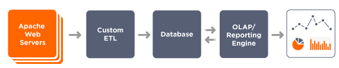
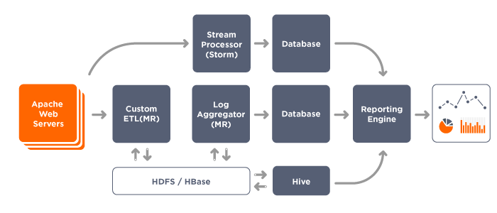
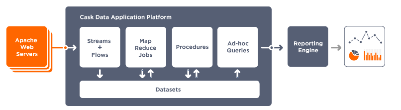

.. :author: Cask Data, Inc.
   :description: Introduction to the Cask Data Application Platform
   :copyright: Copyright © 2014 Cask Data, Inc.

==================================================
Introduction to the Cask Data Application Platform
==================================================

The Challenge of Big Data Applications
======================================

The amount of data being generated by businesses and consumers is compounding exponentially. 
Applications are becoming increasingly complex and data-intensive as developers try to 
extract value from this enormous trove of information. These applications—Big Data 
applications—need to scale with the unpredictable volume and velocity of incoming data 
without the need for the developer to re-architect the deployment infrastructure—even 
while dealing with hundreds of petabytes if not exabytes of data. Building Big Data 
applications is challenging on many fronts.

Steep learning curve
--------------------

As an application developer building a Big Data application,
you are primarily concerned with four areas:

 #. Data collection framework
 #. Data processing framework
 #. Data storage framework
 #. Data serving framework

There are many technology frameworks from which to choose in each of these four areas; 
data storage alone runs the gamut from open-source NoSQL projects to proprietary 
relational databases and can require you to learn CAP theorem concepts and understand 
distributed systems principles. Evaluating the pros and cons of each of these frameworks, 
becoming competent, making them work with disparate use cases from realtime to batch 
processing, learning to use them effectively, and operating them in production is a 
daunting task.

No integrated framework, numerous integration points
----------------------------------------------------

As an application developer, one of the main challenges of building a Big Data 
application is that you have to focus not only on the application layer of code but also 
on the the infrastructure layer. As highlighted above, you first make choices about the 
underlying technology frameworks, then spend time integrating the different pieces of 
technology together, all before you even start building your application. Each of the 
technology frameworks come with their own APIs making it harder to integrate them quickly.

Lack of development tools
-------------------------
Big data application development involves dealing with technology frameworks in a 
distributed system environment, and there is no development framework that makes it 
easy to develop, test and debug these types of applications. Debugging is especially 
difficult in a distributed environment. Sometimes you have no choice but to scan through 
hundred of lines of log files on multiple systems to debug your application.

No monitoring solutions
-----------------------

Once your application is ready for production, you'll need to monitor and manage it. 
Operability of each of the technology frameworks presents its own set of challenges. 
A lack of proper tools makes application operations a full-time job.

Why is Apache Hadoop hard?
--------------------------

Though Apache Hadoop |(TM)| has demonstrated its value in many use-cases, developers spend too much time
working with infrastructure issues instead of their core concerns. As a consequence,
Hadoop will never be a mainstream technology for data applications unless that can be changed.

If you are building a data application and managing enterprise-scale data, 
you will need to address:

- Consistency of data
- Scalability of performance and storage
- Monitoring and management
- Security of access and modification
- and so forth...

Consistency of data can be handled by using a platform providing transactions. 
Scalability requires elastic scale.
Monitoring and management requires logging, metrics and a testing and debugging framework.
Security requires authentication and the handling of credentials.

To do all of this, you'll need to build an entire platform that provides an infrastructure for Hadoop.

Cask Data Application Platform Overview
=======================================
Under the covers, **Cask Data Application Platform (CDAP)** is a Java-based middleware solution that 
abstracts the complexities and integrates the components of the Hadoop ecosystem (YARN, MapReduce, 
HBase, Zookeeper, etc.). Simply stated, CDAP behaves like a modern-day application 
server, distributed and scalable, sitting on top of a Hadoop distribution (such as CDH, 
HDP, or Apache). It provides a programming framework and scalable runtime environment 
that allows any Java developer to build Big Data applications without having to 
understand all of the details of Hadoop.

Integrated Framework
--------------------
Without a Big Data middleware layer, a developer has to piece together multiple open 
source frameworks and runtimes to assemble a complete Big Data infrastructure stack. 
CDAP provides an integrated platform that makes it easy to create all the elements of 
Big Data applications: collecting, processing, storing, and querying data. Data can be 
collected and stored in both structured and unstructured forms, processed in real-time 
and in batch, and results can be made available for retrieval, visualization, and 
further analysis.

Simple APIs
-----------
CDAP aims to reduce the time it takes to create and implement applications 
by hiding the complexity of these distributed technologies with a set of powerful yet 
simple APIs. You don’t need to be an expert on scalable, highly-available system 
architectures, nor do you need to worry about the low-level Hadoop and HBase APIs.

Full Development Lifecycle Support
----------------------------------
CDAP supports developers through the entire application development lifecycle: 
development, debugging, testing, continuous integration and production. Using familiar 
development tools such as *IntelliJ* and *Eclipse*, you can build, test and debug your 
application right on your laptop with a *Standalone CDAP*. Utilize the application unit 
test framework for continuous integration. Deploy it to a development cloud or production
cloud (*Distributed CDAP*) with a push of a button.

Easy Application Operations
---------------------------
Once your Big Data application is in production, CDAP is designed 
specifically to monitor your applications and scale with your data processing needs: 
increase capacity with a click of a button without taking your application offline. Use 
the CDAP Console or RESTful APIs to monitor and manage the lifecycle and scale of your 
application.

CDAP Components
===============
Now, let’s talk about the components within CDAP. There are four basic abstractions:

- `Streams <programming.html#streams>`__ for real-time data collection from any external system;
- `Flows <programming.html#flows>`__ for performing elastically scalable, real-time stream
  or batch processing;
- `Datasets <programming.html#datasets>`__ for storing data in simple and scalable ways without
  worrying about details of the storage schema; and
- `Procedures <programming.html#procedures>`__ for exposing data to external systems through
  stored queries.

These are grouped into Applications for configuring and packaging.

Applications are built in Java using the CDAP Core APIs. Once an application is 
deployed and running, you can easily interact with it from virtually any external system 
by accessing the Streams, Datasets, and Procedures using the Java APIs, RESTful or other 
network protocols.

CDAP functions as a middle-tier application platform. As seen in the diagram below,
it provides an interface (using either HTTP RESTful or Java APIs) to clients through a Router 
along with services and features that run inside YARN containers in Hadoop.

.. image:: _images/architecture_diagram_1.png
   :width: 6in
   :align: center

These services and features include:

- **Dataset Abstractions:** with globally consistent transactions provided by using 
  `Cask Tephra <http://github.com/continuuity/tephra/>`__, these 
  abstractions provide generic, reusable Java implementations of common data patterns;

- **Streams:** the means for ingesting data from external systems in real time;

- **Realtime Processing using Flows:** developer-implemented, real-time Stream processors,
  comprised of one or more *Flowlets* wired together into a directed acyclic graph;

- **Batch Processing:** using MapReduce and Workflow Schedules, as in conventional
  Hadoop systems;

- **Ad-Hoc SQL Queries:** for datasets that implement methods for obtaining the schema
  and scanning the data record by record, you can access and query data using SQL;

- **Stored Procedures:** allowing synchronous calls into the Server from an external system
  and the performance of server-side processing on-demand, similar to a stored procedure in
  a traditional database;

- **Metrics, Logging and Monitoring:** system and user-defined metrics, along with standard
  SLF4J logs, a testing framework and the ability to attach a remote debugger;

- **Management Console:** available for deploying, querying and managing the Server;

- **Different Runtimes:** standalone (useful for learning, prototyping and testing) and
  Distributed versions;

- **YARN containers:** services are run in YARN containers in Hadoop, providing access to
  HBase and HDFS, giving the scalability and performance of Hadoop without the complexity. 

In the next section, we will compare three application architectures and their pros and cons.
This will give you a good understanding of the benefit of architecting
Big Data applications using CDAP.

Architecture Comparison: Building A Big Data Application
============================================================
Consider the problem of building a real-time log analytic application that takes access 
logs from Apache™ web servers and computes simple analyses on the logs, such as computing 
throughput per second, error rates or finding the top referral sites.

Traditional Database Log Analysis Framework
-------------------------------------------
A traditional architecture will involve using a log collector (Custom ETL) that gathers 
logs from different application servers or sources and then writing to a database. A 
reporting framework OLAP/Reporting Engine) then acts as the processing layer to aggregate 
the log signals into meaningful statistics and information.

This is a good example of an application architecture that cannot scale with unpredictable 
volume and velocity of data. The custom ETL (extract, transform, load) framework includes 
a log collector to extract data, transformation of the logs with simple filtering and 
normalization, and performs the loading into the database of the events.

The disadvantages of this approach include:

- Complexity of the application increases when processing large volumes of data
- The architecture will not be horizontally scalable
- Producing results in realtime at high-volume rates is challenging

Apache Hadoop®-based Log Analysis Framework
-------------------------------------------
To achieve horizontal scalability, the database architecture of the preceding design
has evolved to include scalable log collection, processing and storage layers.

One of the most commonly-used architectural patterns consists of
custom ETL and log aggregators using map reduce, a realtime stream processor such as
`Storm <http://storm-project.net>`__ as a data processing layer,
`Apache HDFS/HBase™ <http://hbase.apache.org>`__ as a storage layer of results
and a custom reporting engine reading the computed results and
creating visualizations for a web browser.
This is just a summary of the many components required to implement this solution.
(Don’t worry if you are not familiar with these technology frameworks.)

The disadvantages of this approach include:

- Steep learning curve
- Difficult to integrate different systems
- Lack of development tools
- Operating the composite software stack
- No single unified architecture

CDAP Log Analysis Framework
------------------------------------------
Designing Big Data applications using the **Cask Data Application Platform** provides a clear
separation between infrastructure components and application code.

CDAP functions as a middle-tier application platform, exposing simple, high-level 
abstractions to perform data collection, processing, storage and query. Logs are collected
by `Streams <programming.html#streams>`__, while `Flows <programming.html#flows>`__
do basic aggregation and realtime analysis. Advanced, off-line
aggregation is performed by `MapReduce <programming.html#mapreduce>`__ and 
`Workflow <programming.html#workflows>`__ components. 
`Procedures <programming.html#procedures>`__ provide
stored queries, with `Ad-hoc Queries <query.html>`__ accessing the data using SQL. 
The application can now be scaled independent of the underlying infrastructure.

The advantages of this approach include:

- A single unified architecture to perform data collection, processing, storage and query,
  with interoperability designed into the framework.
- Horizontal scalability is derived from the underlying Apache Hadoop layer, while the
  **CDAP** APIs reduce the application complexity and development time.

Where to Go Next
================
Now that you've had an introduction to CDAP, take a look at:

- `Cask Data Application Platform Quick Start <quickstart.html>`__,
  which guides you through installing CDAP and running and modifying an example application.

.. |(TM)| unicode:: U+2122 .. trademark sign
   :trim: