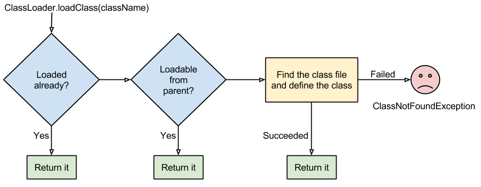
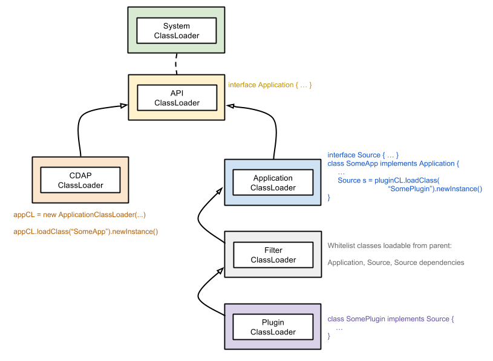

.. meta::
    :author: Cask Data, Inc.
    :copyright: Copyright © 2015-2017 Cask Data, Inc.

.. _class-loading:

=====================
Class Loading in CDAP
=====================

In this advanced section, we talk about how we used Java class loading to design an
extensible application framework with a flexible class loading strategy. In terms of class
loading strategy, we provide these properties for an application:

- an application can choose to use any library of any version;
- an application can define a custom plugin API for extending itself;
- plugins can be written for an application by implementing the application plugin API; and
- different plugins can choose to use any library of any version, yet all plugins are
  usable by the same application at the same time.

Parent Delegation Model
=======================
When a Java Virtual Machine (JVM) needs to load a class, by default it follows the
`parent delegation model 
<https://www-01.ibm.com/support/knowledgecenter/#!/SSYKE2_7.0.0/com.ibm.java.zos.70.doc/diag/understanding/cl_delegation.html>`__. 
The parent delegation model allows for one class to be loadable from multiple class
loaders, as long as those class loaders have the defining class loader of that class as a
common ancestor. This property enables one to define an extensible class loading
architecture that provides class isolation, yet at the same time they’re able to
inter-operate with a set of common API classes.

Class Loading in CDAP
=====================
The CDAP class loader hierarchy is based on the parent delegation model as follows:

..    :width: 82%
..    :scale: 75%

With this class loader hierarchy, the CDAP runtime system interacts with custom
applications only through classes and interfaces defined in the API class loader; hence,
libraries used by the CDAP system itself won’t interfere with applications. 

Moreover, CDAP allows an application to define its own plugin API for extending the
functionalities of the application itself. Each plugin implementation will be loaded
through a separate plugin class loader. The parent of each plugin class loader is a filter
class loader that ensures that only CDAP and plugin API classes are loaded from the
application class loader. All other classes required by the plugin are loaded by the
plugin class loader itself. This allows an application to use multiple plugins at the same
time, while providing class loading isolation between different plugins.

In CDAP, both applications and plugins are deployed as JAR files to the system. Instead of
a normal JAR file that contains a collection of class files, a bundle JAR file has content
similar to this example:

..    :width: 58%
..    :scale: 75%

Inside an application bundle JAR file, besides the class files for the application, are
the JAR files for third party libraries that are needed by the application. In the
application JAR manifest, a special attribute (“Export-Package”) can be added to instruct
the filter class loader which packages are contained in the application plugin API. Hence,
only classes under those packages will be available to the plugin. This is to avoid
libraries used by the application interfering with the ones used by the plugin. The plugin
JAR file is following a similar structure as an application JAR file.

Class Loading in Apache Hadoop MapReduce and Apache Spark
=========================================================
One of the major challenges faced when we integrate CDAP with data processing frameworks,
such as MapReduce and Spark, is the class loading. Both frameworks use a
flat classpath approach. For example, in MapReduce, all the job classes, the
libraries that the job needs, together with the Hadoop libraries and their dependencies,
are in one classpath. The classpath is used to create a single class loader, which loads
classes by sequentially searching through the classpath. This approach doesn’t provide the
class loading isolation that is desired. For example, if a MapReduce job requires a
different version of a library than the one used by the Hadoop framework in the cluster,
the job can fail with exceptions such as ``NoSuchMethodError`` or ``ClassNotFoundException``.

When launching a MapReduce or Spark job from CDAP, we want to provide the same class
isolation behavior as described in the previous section. To do so, we alter the classpath
of the YARN container for the job and make it first call the main method of our launcher
class. The launcher class will setup the class loader hierarchy as desired and then
delegate the call to the actual MapReduce or Spark task runner.

Libraries Provided by the CDAP Runtime
======================================
At runtime, CDAP provides access for required libraries to CDAP programs. The libraries
provided depend on the program type. 

All :ref:`program types <building-blocks>` have access to:

- the ``cdap-api`` classes :javadoc:`CDAP API classes <co/cask/cdap/api>` as well as the
  libraries that ``cdap-api`` depends on:

  - ``co.cask.cdap.cdap-api-common``
  - ``com.google.code.findbugs.jsr305``
  - ``com.google.code.gson.gson``
  - ``org.slf4j.slf4j-api``
  - ``org.apache.tephra.tephra-api``
  - ``org.apache.twill.twill-api``
  - ``javax.ws.rs.javax.ws.rs-api``
  - ``junit.junit``

- the Hadoop classes (classes in the package ``org.apache.hadoop``), with the exception of
  the HBase classes (classes in the package ``org.apache.hadoop.hbase``). Transitive
  dependencies from Hadoop are not made available.

Spark programs have, in addition to the above, access to:

- the Scala library ``org.scala-lang.scala-library``

- the Spark package ``org.apache.spark``
