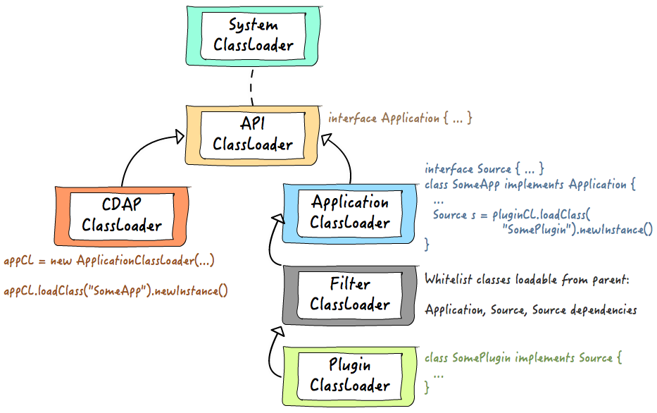

.. meta::
    :author: Cask Data, Inc.
    :copyright: Copyright © 2015 Cask Data, Inc.

.. _class-loading:

=============================================================
Java Class Loading and Distributed Data Processing Frameworks
=============================================================

Java class loading is one of the most fundamental and powerful concepts provided by the
Java Platform. Understanding the class loading mechanism helps you when designing and
building extensible application frameworks. You can also avoid spending many hours in
debugging exceptions such as ``ClassCastException`` and ``ClassNotFoundException``, among
others. In this advanced section, we talk about how we used Java class loading to
design an extensible application framework with a flexible class loading strategy.

In CDAP, we provide a platform with which application developers are free to write big
data applications without worrying about the underlying execution framework. In terms of
class loading strategy, we provide these properties for an application:

- Application can choose to use any library of any version;
- Application can define a custom plugin API for extending itself;
- Plugins can be written for an application by implementing the application plugin API; and
- Different plugins can choose to use any library of any version, yet all plugins are
  usable by the same application at the same time.

Parent Delegation Model
=======================

When a Java Virtual Machine (JVM) needs to load a class, by default it follows the
parent delegation model. In this model, when the ``loadClass(String className)`` method of
a class loader instance is called (it may be called implicitly by the JVM), it calls
its parent class loader first before trying to load the class itself, using this
logic to load the requested class:

.. image:: ../_images/class-loading/class-loading01.png
   :width: 7in
   :align: center

Each loaded class maintains a reference to the class loader instance which actually read
the class file and defined the class. We call that class loader the **defining class
loader** of that class. This is to differentiate from the **initiating class loader**, the
one whose ``loadClass`` method was called initially. Two classes are only considered the
same if, and only if, they have the same name and have the same defining class loader.
Understanding this is the key to writing a custom class loader correctly and to avoid
running into exceptions such as ``ClassCastException``, ``ClassNotFoundException``, and
``NoClassDefFoundError``.

The parent delegation model also gives control on which class loader is the defining one
for a given class. You may have the same class file available to multiple class loaders in
the hierarchy, but only the one highest in the hierarchy will be the defining class
loader. 

For example, class files for all core Java classes are in the ``$JAVA_HOME/lib/rt.jar``
file. The bootstrap class loader (one of the three JVM-created startup class loaders; the
other two being the extension and system class loaders) uses it to find class files when
loading core classes. If someone starts a JVM by running “``java -cp rt.jar...``”, the
same set of class files will be available to the system class loader as well. However,
because of the parent delegation model, all core Java classes will have the bootstrap
class loader as the defining class loader, and never the system class loader.

The parent delegation model allows for one class to be loadable from multiple class
loaders, as long as those class loaders have the defining class loader of that class as a
common ancestor. This property enables one to define an extensible class loading
architecture that provides class isolation, yet at the same time they’re able to
inter-operate with a set of common API classes.

Class Loading in CDAP
=====================

Based on the parent delegation model, we’ve come up with this class loader hierarchy in
CDAP:

.. image:: ../_images/class-loading/class-loading02.png
   :width: 7in
   :align: center

With this class loader hierarchy, the CDAP runtime system interacts with custom
applications only through classes and interfaces defined in the API class loader; hence,
libraries used by the CDAP system itself won’t interfere with applications. 

Moreover, CDAP allows an application to define its own plugin API for extending the
functionalities of the application itself. Each plugin implementation will be loaded
through a separate plugin class loader. The parent of each plugin class loader is a filter
class loader that ensures that only CDAP and plugin API classes are loaded from the
application class loader. All other classes required by the plugin are loaded by the
plugin class loader itself. This allows an application to use multiple plugins at the same
time, while providing class loading isolation between different plugins.

In CDAP, both applications and plugins are deployed as JAR files to the system. Instead of
a normal JAR file that contains a collection of class files, a bundle JAR file has content
similar to this example:

Inside an application bundle JAR file, besides the class files for the application, are
the JAR files for third party libraries that are needed by the application. In the
application JAR manifest, a special attribute (“Export-Package”) can be added to instruct
the filter class loader which packages are contained in the application plugin API. Hence,
only classes under those packages will be available to the plugin. This is to avoid
libraries used by the application interfering with the ones used by the plugin. The plugin
JAR file is following a similar structure as an application JAR file.

Class Loading in Hadoop MapReduce and Apache Spark
==================================================

One of the major challenges faced when we integrate CDAP with data processing frameworks,
such as Hadoop MapReduce and Apache Spark, is the class loading. Both frameworks use a
flat classpath approach. For example, in Hadoop MapReduce, all the job classes, the
libraries that the job needs, together with the Hadoop libraries and their dependencies,
are in one classpath. The classpath is used to create a single class loader, which loads
classes by sequentially searching through the classpath. This approach doesn’t provide the
class loading isolation that is desired. For example, if a Hadoop MapReduce job requires a
different version of a library than the one used by the Hadoop framework in the cluster,
the job can fail with exceptions such as ``NoSuchMethodError`` or ``ClassNotFoundException``.

When launching a MapReduce or Spark job from CDAP, we want to provide the same class
isolation behavior as described in the previous section. To do so, we alter the classpath
of the YARN container for the job and make it first call the main method of our launcher
class. The launcher class will setup the class loader hierarchy as desired and then
delegate the call to the actual MapReduce or Spark task runner.

Summary
=======

Java class loading is a powerful and important concept provided by the Java platform.
Understanding how it works has helped us in designing a CDAP class loading strategy that
provides isolation in class loading for applications and plugins, but with the flexibility
to handle different use cases. With it, application developers can avoid the complexity of
class loaders and the difficulty caused by different kinds of class loading errors.
