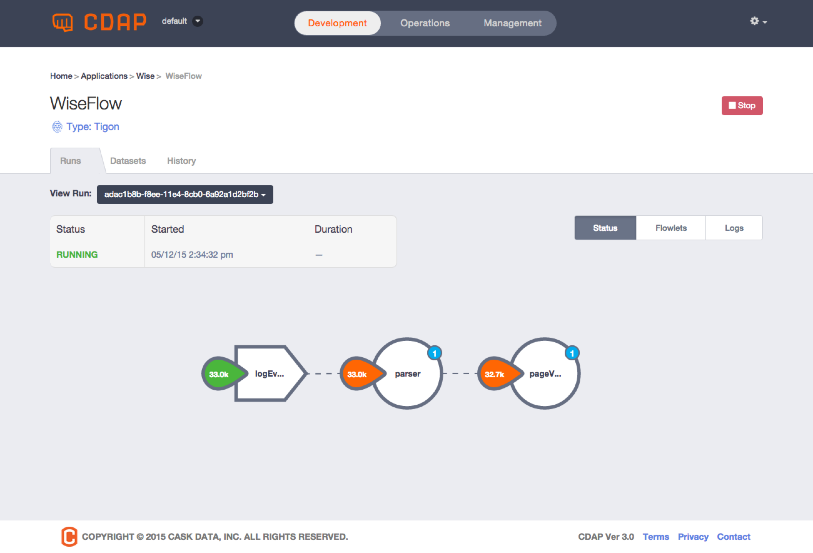

.. meta::
    :author: Cask Data, Inc.
    :copyright: Copyright © 2014-2015 Cask Data, Inc.

.. _quick-start:

============================================
Quick Start
============================================

These instructions will take you from downloading the CDAP SDK through the running of an application.

Download, Install and Start CDAP
================================
If you haven't already, download, install and start CDAP 
:doc:`following these instructions. <standalone/index>`

Your First CDAP Application
===========================
CDAP is a platform for developing and running big data applications. To get started, we
have a collection of pre-built applications available that will allow you to quickly
experience the power of CDAP.

In this example, we will use one of these applications to complete a very common Big Data
use case: web log analytics.

This `web log analytics application
<https://github.com/caskdata/cdap-apps/tree/develop/Wise>`__ will show you how CDAP can
aggregate logs, perform real-time and batch analytics of the logs ingested, and expose the
results using multiple interfaces. 

Specifically, this application processes web server access logs, counts page-views by IP
in real-time, and computes the bounce ratio of each web page encountered in batch. (The
bounce rate is the percentage of views that are not followed by another view on the same
site.)

.. highlight:: console

Downloading the Application
===========================
You can either download the application zip archive that we have built for you, or
you can pull the source code from GitHub. If you download the zip file, then the application
is already built and packaged::

  $ curl -O http://repository.cask.co/downloads/co/cask/cdap/apps/0.2.2/cdap-wise-0.2.2.zip
  $ unzip cdap-wise-0.2.2.zip
  $ cd cdap-wise-0.2.2

If you clone the source code from GitHub, you will need to build and package the
application with these commands::

  $ git clone https://github.com/caskdata/cdap-apps
  $ cd cdap-apps/Wise
  $ mvn package -DskipTests

In both cases, the packaged application is in the ``target/`` directory and the file name is
``cdap-wise-0.2.2.jar``.

**Learn More:** *A detailed description of the application and its implementation is
available in the* :ref:`Web Analytics Application documentation. <examples-web-analytics>`

Deploying the Application
=========================
You can deploy the application into your running instance of CDAP either by using the 
:ref:`CDAP Command Line Interface <reference:cli>`::

  $ <path-to-CDAP-SDK>/bin/cdap-cli.sh deploy app target/cdap-wise-0.2.2.jar

or using ``curl`` to directly make an HTTP request::

  $ curl -H "X-Archive-Name: cdap-wise-0.2.1.jar" localhost:10000/v3/namespaces/default/apps \
    --data-binary @target/cdap-wise-0.2.2.jar

**Learn More:** *You can also deploy apps* :ref:`using the CDAP Console. <cdap-console>`

Starting Realtime Processing
============================
Now that the application is deployed, we can start the real-time processing::

  $ <path-to-CDAP-SDK>/bin/cdap-cli.sh start flow Wise.WiseFlow
  Successfully started Flow 'WiseFlow' of application 'Wise'

This starts the Flow named *WiseFlow,* which listens for log events from web servers to
analyze them in realtime. Another way to start the flow is using ``curl``::

  $ curl -w'\n' -X POST localhost:10000/v3/namespaces/default/apps/Wise/flows/WiseFlow/start

At any time, you can find out whether the Flow is running::

  $ <path-to-CDAP-SDK>/bin/cdap-cli.sh get status flow Wise.WiseFlow
  RUNNING
  
  $ curl -w'\n' localhost:10000/v3/namespaces/default/apps/Wise/flows/WiseFlow/status
  {"status":"RUNNING"}

Injecting Data 
==============
The *WiseFlow* uses a Stream to receive log events from Web servers. The Stream has a REST
endpoint used to ingest data with HTTP requests, and you can do that using the
Command Line Interface::

  $ <path-to-CDAP-SDK>/bin/cdap-cli.sh send stream logEventStream \
    '255.255.255.185 - - [23/Sep/2014:11:45:38 -0400] \
    "GET /cdap.html HTTP/1.0" 401 2969 " " "Mozilla/4.0 (compatible; MSIE 7.0; Windows NT 5.1)"'

Or, you can use an HTTP request::

  $ curl localhost:10000/v3/namespaces/default/streams/logEventStream \
    -d '255.255.255.185 - - [23/Sep/2014:11:45:38 -0400] "GET /cdap.html HTTP/1.0" \ 
    401 2969 " " "Mozilla/4.0 (compatible; MSIE 7.0; Windows NT 5.1)"'

Because it is tedious to send events manually, a file with sample web log events is
included in the Wise application source, along with a script that reads it line-by-line
and submits the events to the Stream using REST. Use this script to send events to the
stream::

  $ bin/inject-data.sh

This will run for a number of seconds until all events are inserted.

Inspecting the Injected Data 
============================
Now that you have data in the Stream, you can verify it by reading the events back. Each
event is tagged with a timestamp of when it was received by CDAP. (Note: this is not the
same time as the date included in each event—that is the time when the event actually
occurred on the web server.) 

You can retrieve events from a Stream by specifying a time range and a limit on the number
of events you want to see. For example, using the Command Line Interface, this shows up to 5 events
in a time range of 3 minutes duration, starting 5 minutes ago::

  $ <path-to-CDAP-SDK>/bin/cdap-cli.sh get stream logEventStream -5m +3m 5
  +========================================================================================================+
  | timestamp     | headers | body size | body                                                             |
  +========================================================================================================+
  | 1412386081819 |         | 140       | 255.255.255.185 - - [23/Sep/2014:11:45:38 -0400] "GET /cdap.html |
  |               |         |           |  HTTP/1.0" 401 2969 " " "Mozilla/4.0 (compatible; MSIE 7.0; Wind |
  |               |         |           | ows NT 5.1)"                                                     |
  |--------------------------------------------------------------------------------------------------------|
  | 1412386081830 |         | 146       | 255.255.255.250 - - [23/Sep/2014:11:45:39 -0400] "POST /quicksta |
  |               |         |           | rt.html HTTP/1.1" 401 837 " " "Googlebot/2.1 ( http://www.google |
  |               |         |           | bot.com/bot.html)"                                               |
  |--------------------------------------------------------------------------------------------------------|
  | 1412386081841 |         | 141       | 255.255.255.158 - - [23/Sep/2014:11:45:40 -0400] "GET /index.htm |
  |               |         |           | l HTTP/1.0" 200 2565 " " "Googlebot/2.1 ( http://www.googlebot.c |
  |               |         |           | om/bot.html)"                                                    |
  |--------------------------------------------------------------------------------------------------------|
  | 1412386081851 |         | 139       | 255.255.255.211 - - [23/Sep/2014:11:45:41 -0400] "GET /cdap.html |
  |               |         |           |  HTTP/1.0" 200 135 " " "Googlebot/2.1 ( http://www.googlebot.com |
  |               |         |           | /bot.html)"                                                      |
  |--------------------------------------------------------------------------------------------------------|
  | 1412386081862 |         | 141       | 255.255.255.135 - - [23/Sep/2014:11:45:44 -0400] "POST /cdap.htm |
  |               |         |           | l HTTP/1.0" 401 3939 " " "Googlebot/2.1 ( http://www.googlebot.c |
  |               |         |           | om/bot.html)"                                                    |
  +========================================================================================================+

Note: you may have to adjust the time range according to when you injected the
events into the Stream. 

The same query can be made using curl with an HTTP request. However, you'll need to adjust the
start and end of the time range to milliseconds since the start of the Epoch::

  $ curl -w'\n' localhost:10000/v3/namespaces/default/streams/logEventStream/events?start=1412385622228\&end=1412386402228\&limit=5
  
The current time in seconds since the start of the Epoch can be found with::

  $ date +%s

Note that it is important to escape the ampersands in the URL to prevent the shell from
interpreting it as a special character. The RESTful API will return the events in a JSON
format; there are a `variety of tools available
<https://www.google.com/search?q=json+pretty+print>`__ to pretty-print it on the
Command Line.

Monitoring with the CDAP Console
================================
You may recall that before we started injecting data into the Stream, we started the
*WiseFlow* to process these events in real-time. You can observe the Flow while it is
processing events by retrieving metrics about how many events it has processed. For that,
we need to know the name of the Flowlet inside the *WiseFlow* that performs the actual
processing. 

In this case, it is a Flowlet named *parser*. Here is a ``curl`` command to retreive the
number of events it has processed (the number return will vary, depending on how many
events you have sent)::

  $ curl -w'\n' localhost:10000/v3/namespaces/default/metrics/system/apps/Wise/flows/WiseFlow/flowlets/parser/\
  process.events.processed\?aggregate=true
  {"data":3000}

A much easier way to observe the Flow is in the `CDAP Console: <http://localhost:9999>`__
it shows a `visualization of the Flow, <http://localhost:9999/#/flows/Wise:WiseFlow>`__
annotated with its realtime metrics:

In this screenshot, we see that the Stream has about three thousand events and all of them
have been processed by both Flowlets. You can watch these metrics update in realtime by
repeating the injection of events into the Stream::

  $ bin/inject-data.sh
  
You can change the type of metrics being displayed using the dropdown menu on the left. If
you change it from *Flowlet Processed* to *Flowlet Rate*, you see the current number of
events being processed by each Flowlet, in this case about 63 events per second:

.. image:: ../_images/quickstart/wise-flow2.png
   :width: 600px

.. *Learn More:* A complete description of the Flow status page can be found in the
.. :ref:`CDAP Console documentation. <admin-guide:cdap-console>`

Retrieving the Results of Processing 
====================================
The Flow counts URL requests by the origin IP address, using a Dataset called
*pageViewStore*. To make these counts available, the application implements a service called
*WiseService*. Before we can use this service, we need to make sure that it is running. We
can start the service using the Command Line Interface::

  $ <path-to-CDAP-SDK>/bin/cdap-cli.sh start service Wise.WiseService
  Successfully started Service 'WiseService' of application 'Wise'
  
Or, using a REST call::

  $ curl -X POST localhost:10000/v3/namespaces/default/apps/Wise/services/WiseService/start
  
  $ curl -w'\n' localhost:10000/v3/namespaces/default/apps/Wise/services/WiseService/status
  {"status":"RUNNING"}

Now that the service is running, we can query it to find out the current count for a
particular IP address. For example, the data injected by our script contains this line
(reformatted to fit)::

  255.255.255.239 - - [23/Sep/2014:11:46:05 -0400] "POST /home.html HTTP/1.1" 
    401 2620 " " "Opera/9.20 (Windows NT 6.0; U; en)"

To find out the total number of page views from this IP address, we can query the service
using a REST call::

  $ curl -w'\n' localhost:10000/v3/namespaces/default/apps/Wise/services/WiseService/methods/ip/255.255.255.249/count
  42

Or, we can find out how many times the URL "/home.html" was accessed from the same IP address::

  $ curl -w'\n' -d "/home.html" localhost:10000/v3/namespaces/default/apps/Wise/services/WiseService/methods/ip/255.255.255.249/count
  6

Note that this is a POST request, because we need to send over the URL of interest.
Because that URL contains characters that have special meaning within URLs, it is most
convenient to send it as the body of a POST request.

We can also use SQL to bypass the service and query the raw contents of the underlying
table (reformatted to fit)::

  $ <path-to-CDAP-SDK>/bin/cdap-cli.sh execute "\"SELECT * FROM cdap_user_pageviewstore WHERE key = '255.255.255.249'\""
  +===============================================================================================+
  | cdap_user_pageviewstore.key: STRING | cdap_user_pageviewstore.value: map<string,bigint>       |
  +===============================================================================================+
  | 255.255.255.249                     | {"/about.html":2,"/world.html":4,"/index.html":14,      |
  |                                     |  "/news.html":4,"/team.html":2,"/cdap.html":4,          |
  |                                     |  "/contact.html":2,"/home.html":6,"/developers.html":4} |
  +===============================================================================================+

Here we can see that the storage format is one table row per IP address, with a column for
each URL that was requested from that IP address. This is an implementation detail that
the service hides from external clients. However, there are situations where inspecting
the underlying table is useful; for example, when debugging a problem.

Processing in Batch
===================
The Wise application also processes the web log to compute the “bounce count” of each URL.
For this purpose, we consider it a “bounce” if a user views a page but does not view
another page within a time threshold: essentially, that means the user has left the web site. 

Bounces are difficult to detect with a Flow. This is because processing in a Flow is
triggered by incoming events; a bounce, however, is indicated by the absence of an event:
the same user’s next page view. 

It is much easier to detect bounces with a MapReduce. The Wise application includes a
MapReduce that computes the total number of bounces for each URL. It is part of a workflow
that is scheduled to run every 10 minutes; we can also start the job immediately using the
CLI::

  $ <path-to-CDAP-SDK>/bin/cdap-cli.sh start mapreduce Wise.WiseWorkflow_BounceCountsMapReduce
  Successfully started MapReduce 'WiseWorkflow_BounceCountsMapReduce' of application 'Wise'
  
or using a REST call::

  $ curl -X POST localhost:10000/v3/namespaces/default/apps/Wise/mapreduce/WiseWorkflow_BounceCountsMapReduce/start

Note that this MapReduce program processes the exact same data that is consumed by the
WiseFlow, namely, the log event stream, and both programs can run at the same time without
getting in each other’s way. 

We can inquire as to the status of the MapReduce::

  $ curl -w'\n' localhost:10000/v3/namespaces/default/apps/Wise/mapreduce/WiseWorkflow_BounceCountsMapReduce/status
  {"status":"RUNNING"}

When the job has finished, the returned status will be *STOPPED*. Now we can query the
bounce counts with SQL. Let's take a look at the schema first::

  $ <path-to-CDAP-SDK>/bin/cdap-cli.sh execute "\"DESCRIBE cdap_user_bouncecountstore\""
  Successfully connected CDAP instance at 127.0.0.1:10000
  +==========================================================+
  | col_name: STRING | data_type: STRING | comment: STRING   |
  +==========================================================+
  | uri              | string            | from deserializer |
  | totalvisits      | bigint            | from deserializer |
  | bounces          | bigint            | from deserializer |
  +==========================================================+

For example, to get the five URLs with the highest bounce-to-visit ratio (or bounce rate)::

  $ <path-to-CDAP-SDK>/bin/cdap-cli.sh execute "\"SELECT uri, bounces/totalvisits AS ratio \
    FROM cdap_user_bouncecountstore ORDER BY ratio DESC LIMIT 5\""
  +===================================+
  | uri: STRING | ratio: DOUBLE       |
  +===================================+
  | /cdap.html  | 0.18867924528301888 |
  | /world.html | 0.1875              |
  | /news.html  | 0.18545454545454546 |
  | /team.html  | 0.18181818181818182 |
  | /intro.html | 0.18072289156626506 |
  +===================================+

Apparently, the ``/cdap.html`` has the highest bounce rate of all the URLs. 

We can also use the full power of the `Hive query language
<https://cwiki.apache.org/confluence/display/Hive/LanguageManual>`__ in formulating our
queries. For example, Hive allows us to explode the page view counts into a table with
fixed columns::

  $ <path-to-CDAP-SDK>/bin/cdap-cli.sh execute "\"SELECT key AS ip, uri, count FROM cdap_user_pageviewstore \
    LATERAL VIEW explode(value) t AS uri,count ORDER BY count DESC LIMIT 10\""
  +====================================================+
  | ip: STRING      | uri: STRING      | count: BIGINT |
  +====================================================+
  | 255.255.255.113 | /home.html       | 9             |
  | 255.255.255.131 | /home.html       | 9             |
  | 255.255.255.246 | /quickstart.html | 8             |
  | 255.255.255.153 | /quickstart.html | 8             |
  | 255.255.255.236 | /quickstart.html | 8             |
  | 255.255.255.181 | /index.html      | 8             |
  | 255.255.255.198 | /index.html      | 7             |
  | 255.255.255.249 | /index.html      | 7             |
  | 255.255.255.194 | /cdap.html       | 7             |
  | 255.255.255.180 | /index.html      | 7             |
  +====================================================+

We can even join two datasets: the one produced by the realtime flow; and the other one
produced by the MapReduce. The query below returns, for each of the three URLs with the
highest bounce ratio, the IP addresses that have made more than three requests for that
URL. In other words: who are the users who are most interested in the least interesting
pages?

::

  $ <path-to-CDAP-SDK>/bin/cdap-cli.sh execute "\"SELECT views.uri, ratio, ip, count FROM \
       (SELECT uri, totalvisits/bounces AS ratio \
          FROM cdap_user_bouncecountstore ORDER BY ratio DESC LIMIT 3) bounce, \
       (SELECT key AS ip, uri, count \
          FROM cdap_user_pageviewstore LATERAL VIEW explode(value) t AS uri,count) views \
    WHERE views.uri = bounce.uri AND views.count >= 3\""
  +=========================================================================+
  | views.uri: STRING | ratio: DOUBLE     | ip: STRING      | count: BIGINT |
  +=========================================================================+
  | /contact.html     | 8.666666666666666 | 255.255.255.166 | 3             |
  | /contact.html     | 8.666666666666666 | 255.255.255.199 | 3             |
  | /contact.html     | 8.666666666666666 | 255.255.255.216 | 3             |
  | /about.html       | 7.333333333333333 | 255.255.255.227 | 3             |
  | /home.html        | 6.551724137931035 | 255.255.255.105 | 3             |
  | /home.html        | 6.551724137931035 | 255.255.255.106 | 6             |
  | /home.html        | 6.551724137931035 | 255.255.255.107 | 4             |
  | /home.html        | 6.551724137931035 | 255.255.255.111 | 5             |
  | /home.html        | 6.551724137931035 | 255.255.255.112 | 5             |
  | /home.html        | 6.551724137931035 | 255.255.255.113 | 9             |
  | /home.html        | 6.551724137931035 | 255.255.255.114 | 5             |
  | /home.html        | 6.551724137931035 | 255.255.255.115 | 4             |
  | /home.html        | 6.551724137931035 | 255.255.255.117 | 4             |
  | /home.html        | 6.551724137931035 | 255.255.255.118 | 3             |
  | /home.html        | 6.551724137931035 | 255.255.255.120 | 3             |
  | /home.html        | 6.551724137931035 | 255.255.255.123 | 5             |
  | /home.html        | 6.551724137931035 | 255.255.255.124 | 5             |
  | /home.html        | 6.551724137931035 | 255.255.255.126 | 5             |
  | /home.html        | 6.551724137931035 | 255.255.255.127 | 4             |
  | /home.html        | 6.551724137931035 | 255.255.255.129 | 4             |
  +=========================================================================+

Conclusion
==========
Congratulations! You've just successfully run your first Big Data log analytics application on CDAP. 

You can deploy the same application on a real cluster and experience the power of CDAP.

Additional :ref:`examples, <examples-index>` :ref:`guides, <guides-index>` and
:ref:`tutorials <tutorials>` on building CDAP applications are available. 

As a next step, we recommend reviewing all of these :ref:`training materials <examples-introduction-index>`
as being the easiest way to become familiar with CDAP.

If you want to begin writing your own application, continue with the instructions on the 
:ref:`Getting Started <getting-started-index>` page.
