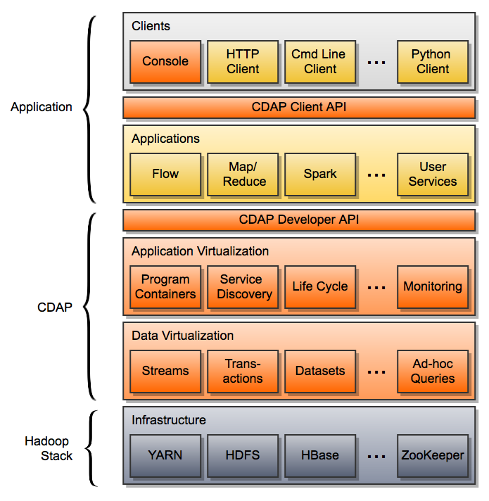

.. meta::
    :author: Cask Data, Inc.
    :copyright: Copyright © 2014 Cask Data, Inc.

============================================
CDAP Abstractions
============================================

CDAP abstractions provide portability by decoupling your data and applications from the underlying infrastructure.
CDAP lets you abstract your data and applications by injecting abstraction layers over various components
of the Hadoop ecosystem. To access and manipulate data, you use CDAP's Datasets rather than actual
storage engines such as HDFS or HBase. Similarly, you write your applications using CDAP's developer interface
and run them inside application containers. These containers are a logical abstraction that can be realized
differently in several runtime environments, such as in-memory, standalone, or distributed cluster.
You can deploy and run in different environments without the need to change a single line of application
code.

In this diagram, CDAP System components are in orange and non-system components are in yellow, with Hadoop 
infrastructure in grey.

Data Abstraction
----------------

In CDAP applications, you interact with data through Datasets. Datasets provide abstraction through:

- Abstraction of the actual representation of data in storage. You can write your code or queries without
  having to know where and how your data is stored—be it in HBase, LevelDB or a relational database.
- Encapsulation of data access patterns and business logic as reusable, managed Java code.
- Consistency of your data under highly concurrent access using Cask's 
  `Tephra™ transaction system <https://github.com/caskdata/tephra/>`__.
- Injection of datasets into different programming paradigms and runtimes. As soon as your data is in a
  dataset, you can immediately use it: in real-time programs; in batch processing applications such as Map/Reduce
  and Spark; in ad-hoc SQL queries.

Application Abstraction
-----------------------

CDAP's programming interfaces have multiple implementations in different runtime environments. You build
your applications against the CDAP Developer API. The API hides the low-level details of individual
programming paradigms and execution environments. It enriches the infrastructure with numerous useful
services that are typically needed by Big Data applications, such as service discovery, log and metrics
collection, and configuration. The environment-specific implementations of these services are injected
by CDAP into the program containers in which the application is run—the application itself does not
need to change based on the environment. This allows you to develop applications in one environment—on 
your laptop using a Standalone CDAP for testing—and then seamlessly deploy them in the different
environment of a distributed staging cluster.

Deployment of an application as well as its lifecycle management, monitoring and scaling are done
through CDAP's Client API. Similarly to the Developer API, it is the same in every environment. The
experience of managing your application does not change when moving from one environment to another.

Developer Focus
---------------

CDAP supports developers through the entire application development lifecycle:
development, debugging, testing, continuous integration and production. Using familiar
development tools such as *IntelliJ* and *Eclipse*, you can build, test and debug your
application right on your laptop with a *Standalone CDAP*. Utilize the application unit
test framework (which embeds an *In-Memory CDAP*) for continuous integration. Deploy
to a development cloud or production cloud (*Distributed CDAP*) with a push of a button.
No matter which environment you are in, the experience of managing the application remains
largely the same.
