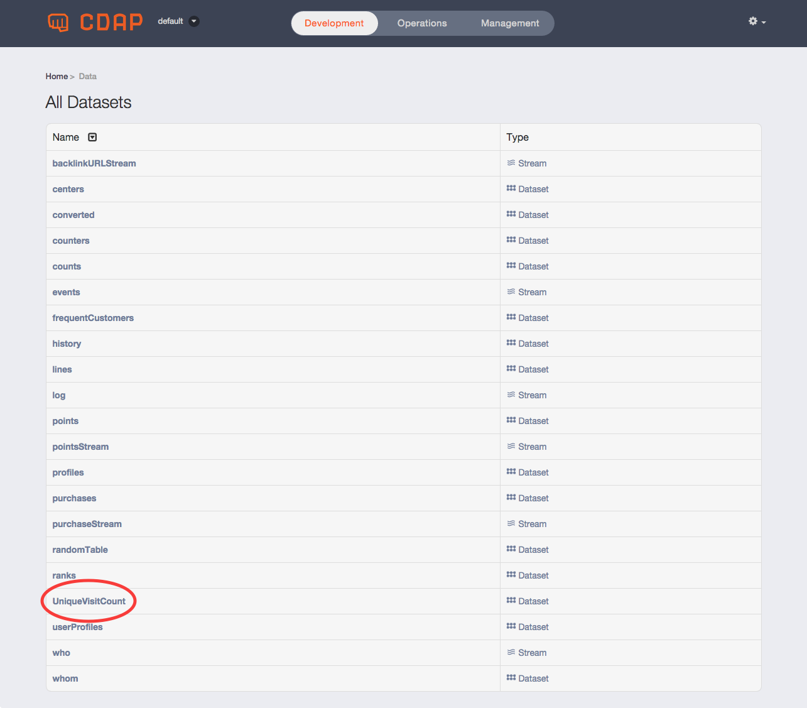
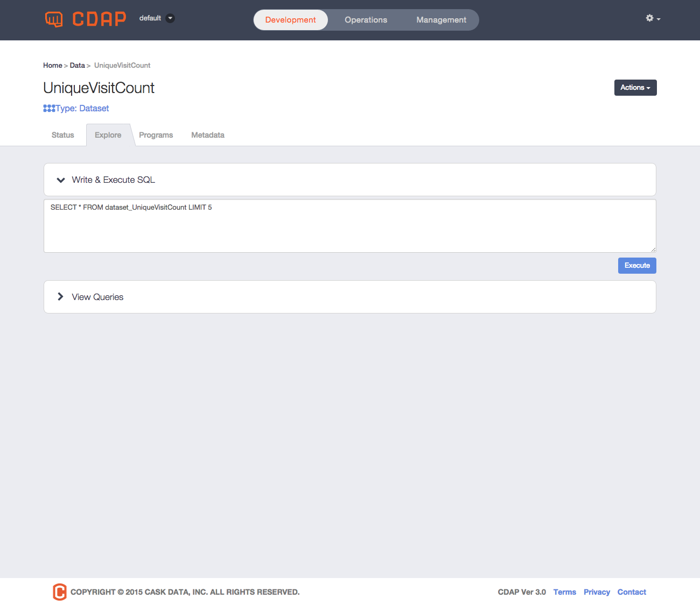
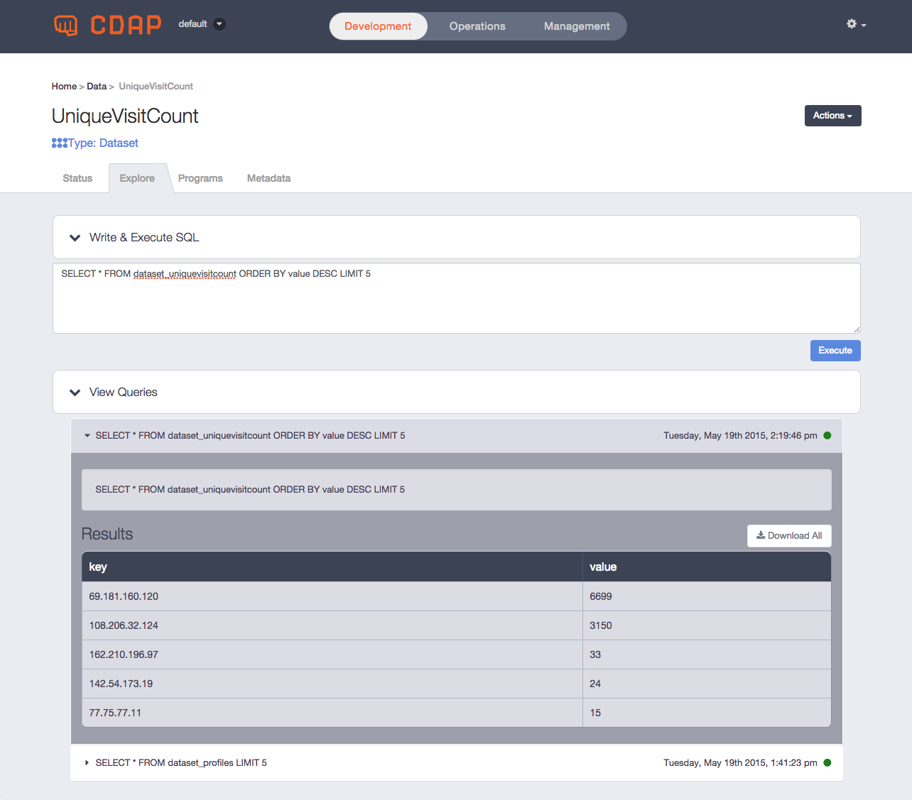

.. meta::
    :author: Cask Data, Inc.
    :description: An example Cask Data Application Platform application
    :copyright: Copyright © 2014 Cask Data, Inc.

.. _examples-web-analytics:

=========================
Web Analytics Application
=========================

A Cask Data Application Platform (CDAP) Tutorial demonstrating how to perform analytics
using access logs.

Overview
===========

This tutorial provides the basic steps for the development of a data application using the
Cask Data Application Platform (CDAP). We will use a Web Analytics Application to
demonstrate how to develop with CDAP and how CDAP helps when building data applications
that run in the Hadoop ecosystem.

Web analytics applications are commonly used to generate statistics and to provide insights
about web usage through the analysis of web traffic. A typical web analytics application
consists of three components:

- **Data Collection:** Collects and persists web logs for further processing;
- **Data Analysis:** Analyses the collected data and produces different measurements; and
- **Insights Discovery:** Extracts insights from the analysis results.

Additionally, it's important that the application be scalable, fault tolerant, and
easy-to-operate. It needs to support ever-increasing amounts of data as well as be flexible
in its design to accomodate new application requirements.

In this tutorial, we'll show how easy it is to build a web analytics application with CDAP.
In particular, we'll use these CDAP components:

- A **Stream** for web server log collection and persistence to the file system;
- A **Flow** for realtime data analysis over collected logs; and
- **SQL Queries** to explore and develop insights from the data.

How It Works
=============
In this section, we’ll go through the details about how to develop a Web Analytics Application using CDAP.

Data Collection with a Stream
---------------------------------------
The sole data source that the Web Analytics Application uses is web server logs. Log events are ingested to
a **Stream** called *log* using the RESTful API provided by CDAP.

Once an event is ingested into a Stream, it is persisted and available for processing.

Data Analysis using a Flow
---------------------------------------
The Web Analytics Application uses a **Flow**, the realtime data processor in CDAP,
to produce realtime analytics from the web server logs. A **Flow** contains one or more
**Flowlets** that are wired together into a directed acyclic graph or DAG.

To keep the example simple, we only compute the total visit count for each IP visiting the site.
We use a Flowlet of type ``UniqueVisitor`` to keep track of the unique visit counts from each client.
It is done in three steps:

1. Read a log event from the *log* Stream;
#. Parse the client IP from the log event; and
#. Increment the visit count of that client IP by 1 and persist the change.

The result of the increment is persisted to a custom **Dataset** ``UniqueVisitCount``.

Here is what the ``UniqueVisitor`` Flowlet looks like:

.. literalinclude:: /../../../cdap-examples/WebAnalytics/src/main/java/co/cask/cdap/examples/webanalytics/UniqueVisitor.java
   :language: java
   :lines: 35-

The ``UniqueVisitCount`` Dataset provides an abstraction of the data logic for incrementing the visit count for a
given IP. It exposes an ``increment`` method, implemented as:

.. literalinclude:: /../../../cdap-examples/WebAnalytics/src/main/java/co/cask/cdap/examples/webanalytics/UniqueVisitCount.java
   :language: java
   :lines: 60-63

The complete source code of the ``UniqueVisitCount`` class can be found in the example in
``src/main/java/co/cask/cdap/examples/webanalytics/UniqueVisitCount.java``

To connect the ``UniqueVisitor`` Flowlet to read from the *log* Stream, we define a ``WebAnalyticsFlow`` class
that specifies the Flow:

.. literalinclude:: /../../../cdap-examples/WebAnalytics/src/main/java/co/cask/cdap/examples/webanalytics/WebAnalyticsFlow.java
   :language: java
   :lines: 26-

Lastly, we bundle up the Dataset and the Flow we've defined together to form an ``Application`` that can be deployed
and executed in CDAP:

.. literalinclude:: /../../../cdap-examples/WebAnalytics/src/main/java/co/cask/cdap/examples/webanalytics/WebAnalytics.java
   :language: java
   :lines: 26-

Building and Starting
=================================

- You can either build the example (as described `below
  <#building-an-example-application>`__) or use the pre-built JAR file included in the CDAP SDK.
- Start CDAP, deploy and start the application as described below in 
  `Running CDAP Applications`_\ .
  Make sure you start the Flow as described below.
- Once the application has been deployed and started, you can `run the example. <#running-the-example>`__

Running CDAP Applications
============================================

.. include:: /../../developers-manual/build/_includes/building-apps-versioned.rst
   :start-line: 9

Running the Example
===================

Starting the Flow
------------------------------

Once the application is deployed:

- Click on the *Process* button in the left sidebar of the CDAP Console,
  then click ``WebAnalyticsFlow`` in the *Process* page to get to the
  Flow detail page, then click the *Start* button; or
- From the Standalone CDAP SDK directory, use the Command Line Interface:

  .. list-table::
    :widths: 20 80
    :stub-columns: 1

    * - On Linux:
      - ``$ ./bin/cdap-cli.sh start flow WebAnalytics.WebAnalyticsFlow``
    * - On Windows:
      - ``> bin\cdap-cli.bat start flow WebAnalytics.WebAnalyticsFlow``    

Injecting Log Events
---------------------------------------

To inject a log event, you can use the ``curl`` command::

  $ curl -d '192.168.252.135 - - [14/Jan/2014:00:12:51 -0400] "GET /products HTTP/1.1" 500 182 \
       "http://www.example.org" "Mozilla/5.0"' http://localhost:10000/v2/streams/log

**Note:** A version of ``curl`` that works with Windows is included in the CDAP Standalone
SDK in ``libexec\bin\curl.exe``

This sends the log event (formatted in the Common Log Format or CLF) to the CDAP instance located at
``localhost`` and listening on port ``10000``.

The Application includes sample logs, located in ``test/resources/access.log`` that you can inject by running
a provided script:

.. list-table::
  :widths: 20 80
  :stub-columns: 1

  * - On Linux:
    - ``$ ./bin/inject-data.sh``
  * - On Windows:
    - ``> bin\inject-data.bat``    

Query the Unique Visitor Page Views
---------------------------------------
Once the log data has been processed by the ``WebAnalyticsFlow``, we can explore the
Dataset ``UniqueVisitCount`` with a SQL query. You can easily execute SQL queries against
Datasets using the CDAP Console by simply selecting **Store** on the left sidebar, then
clicking the **Explore** button on the right, and then selecting the **UniqueVisitCount**
Dataset:

You can then run SQL queries against the Dataset. Let's try to find the top five IP
addresses that visited the site by running a SQL query::

  SELECT * FROM cdap_user_uniquevisitcount ORDER BY value DESC LIMIT 5

You can copy and paste the above SQL into the **Query** box as shown below (replacing the
default query that is there) and click the **Execute** button to run it. It may take a
while for the query to finish.

Once it's finished, click on the disclosure triangle on the left side of the **Results**
table line to expand the display and see the query results:

Stopping the Application
-------------------------------
Once done, you can stop the application as described above in `Stopping an Application. 
<#stopping-an-application>`__ Here is an example-specific description of the steps:

**Stopping the Flow**

- Click on the *Process* button in the left sidebar of the CDAP Console,
  then click *WebAnalyticsFlow* in the *Process* page to get to the
  Flow detail page, then click the *Stop* button; or
- From the Standalone CDAP SDK directory, use the Command Line Interface:

  .. list-table::
    :widths: 20 80
    :stub-columns: 1

    * - On Linux:
      - ``$ ./bin/cdap-cli.sh stop flow WebAnalytics.WebAnalyticsFlow``
    * - On Windows:
      - ``> bin\cdap-cli.bat stop flow WebAnalytics.WebAnalyticsFlow``    
