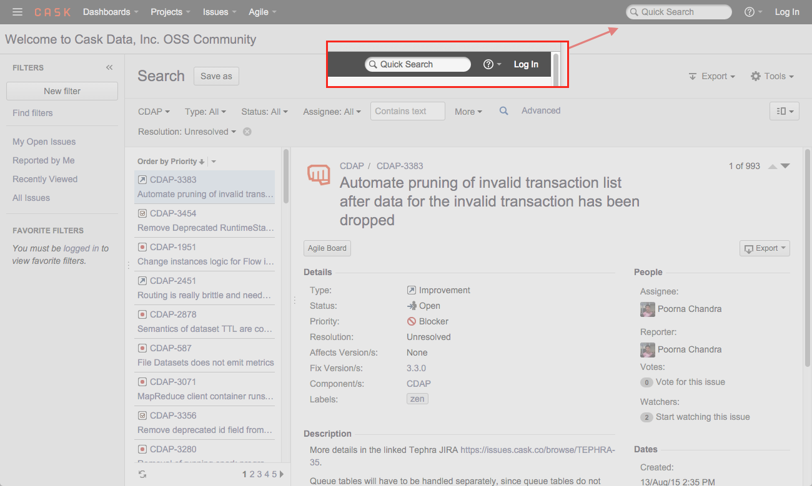

.. meta::
    :author: Cask Data, Inc.
    :copyright: Copyright © 2015 Cask Data, Inc.

.. :titles-only-toc: true

.. _faqs:
 
====
FAQs
====

.. toctree::
   :maxdepth: 2

    General Questions <general>
    CDAP <cdap>
    Cloudera Manager <cloudera-manager>

Additional Resources
====================

Check our Issues Database for known issues
------------------------------------------
When trying to solve an issue, one source of information is the CDAP Issues database. 
The `unresolved issues can be browsed
<https://issues.cask.co/issues/?jql=project%3DCDAP%20AND%20resolution%3DUnresolved%20ORDER%20BY%20priority%20DESC>`__; 
and using the search box in the upper-right, you can look for issues that contain a particular problem or keyword:

Ask the CDAP Community for assistance
-------------------------------------

.. include:: cdap-user-googlegroups.txt
