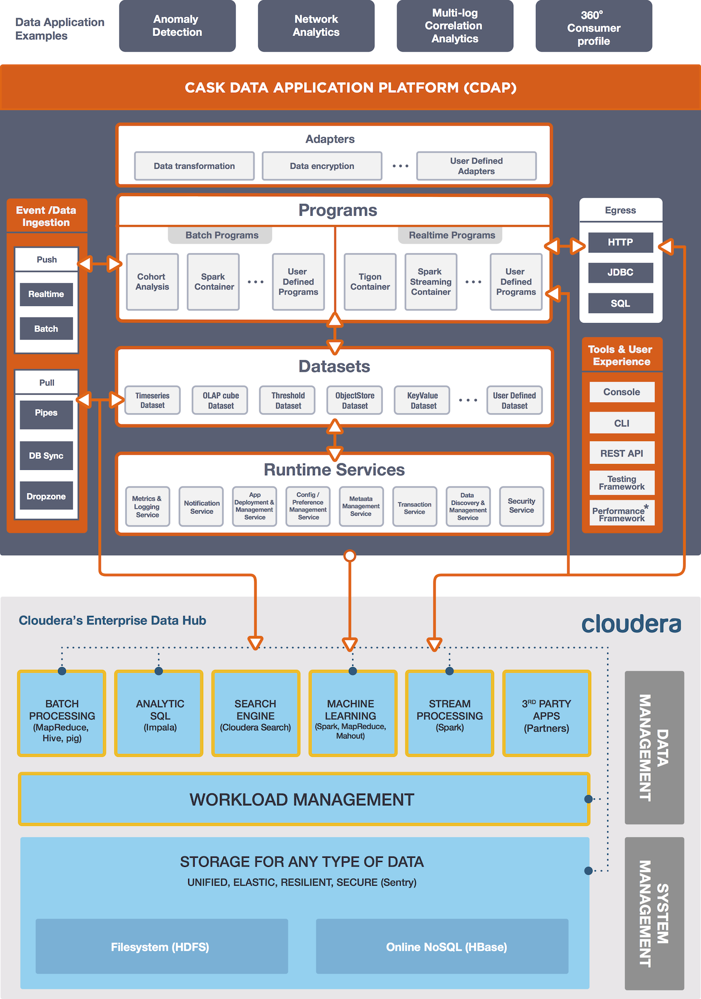

.. meta::
    :author: Cask Data, Inc.
    :copyright: Copyright © 2015 Cask Data, Inc.

:hide-toc: true

.. _cloudera-index:

==================================================
Cloudera
==================================================

.. toctree::
   :maxdepth: 1
   
    Configuring and Installing <configuring>
    Add Service Wizard <step-by-step-cloudera>
    Ingesting and Exploration <ingesting>

.. |cloudera-configuring| replace:: **Configuring and Installing:**
.. _cloudera-configuring: configuring.html

- |cloudera-configuring|_ Configuring and installing CDAP using Cloudera Manager

.. |cloudera-add-service| replace:: **Add Service Wizard:**
.. _cloudera-add-service: step-by-step-cloudera.html

- |cloudera-add-service|_ A **step-by-step guide** to installing CDAP using the Cloudera Manager *Add Service* Wizard

.. |cloudera-ingesting| replace:: **Ingesting and Exploration:**
.. _cloudera-ingesting: ingesting.html

- |cloudera-ingesting|_ Ingest and explore data using **Impala**

.. .. |cloudera-faq| replace:: **FAQ:**
.. .. _cloudera-faq: faq.html

.. .. - |cloudera-faq|_ for Cloudera and Impala

.. rubric:: Introduction to CDAP, Cloudera and Impala

The Cask™ Data Application Platform (CDAP) integrates with the `Cloudera Manager
<http://www.cloudera.com/content/cloudera/en/products-and-services/cloudera-enterprise/cloudera-manager.html>`__.
Configurations that include Cloudera Manager can be easily configured to ingest data into
a cluster, specify schema, or run interactive queries using Impala with CDAP for faster
results. 

.. rubric:: CDAP and Cloudera Architecture Schematic

