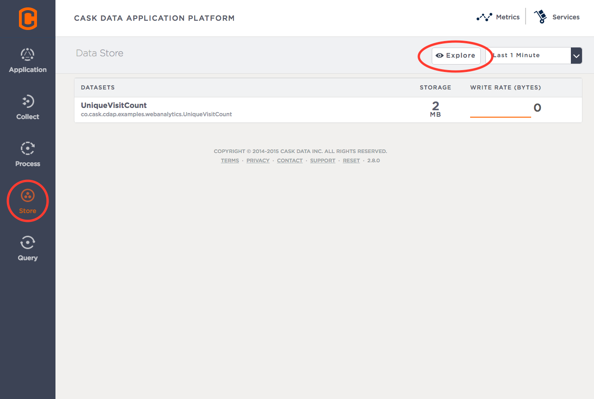
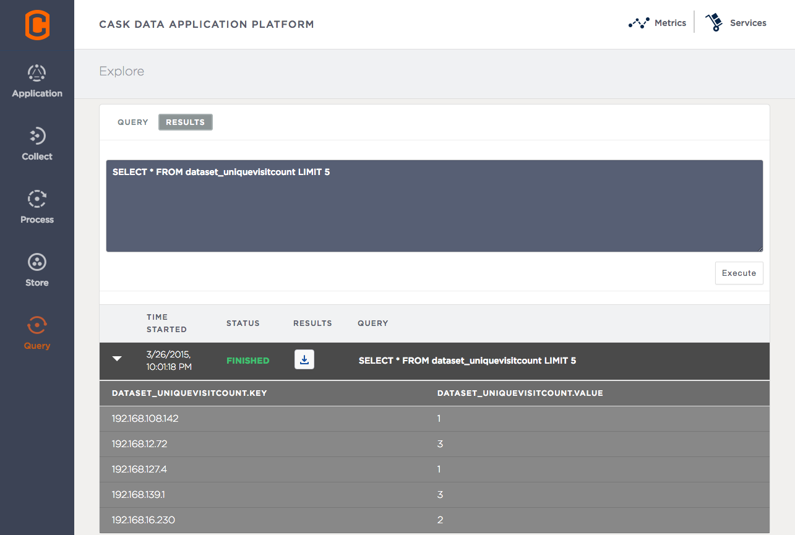

.. meta::
    :author: Cask Data, Inc.
    :description: Basic Tutorial, Web Analytics Application
    :copyright: Copyright © 2014-2015 Cask Data, Inc.

.. _cdap-tutorial-basic:

==================================================
Basic Tutorial: A Simple Web Analytics Application
==================================================

Introduction
=============
This tutorial provides the basic steps for the development of a data application using the
Cask Data Application Platform (CDAP). We will use a simple Web Analytics Application to
demonstrate how to develop with CDAP and how CDAP helps when building data applications
that run in the Hadoop ecosystem.

Web analytics applications are commonly used to generate statistics and to provide
insights about web usage through the analysis of web traffic. A typical web analytics
application consists of three components:

- **Data Collection:** Collects and persists web logs for further processing; 
- **Data Analysis:** Analyses the collected data and produces different measurements; and 
- **Insights Discovery:** Extracts insights from the analysis results. 

Additionally, it’s important that the application be scalable, fault tolerant, and
easy-to-operate. It needs to support ever-increasing amounts of data as well as be
flexible in its design to accomodate new application requirements.

In this tutorial, we’ll show how easy it is to build a web analytics application with
CDAP. In particular, we’ll use these CDAP components:

- A **Stream** for web server log collection and persistence to the file system; 
- A **Flow** for real-time data analysis over collected logs; and 
- A **SQL Query** to explore and develop insights from the data.

Conventions
-----------

In the examples and commands that follow, for brevity we will use these conventions:

- ``$CDAP_SDK_HOME`` is the directory that you have installed the CDAP Standalone SDK, either
  on a UNIX-type system or Windows.
- The `CDAP Command Line Interface (CLI) <http://docs.cask.co/cdap/current/en/reference-manual/cli-api.html>`__
  is included in the SDK in the ``bin`` directory, either at ``bin/cdap-cli.sh`` or |---|
  on Windows |---| ``bin\cdap-cli.bat``. In the examples given, substitute the actual path
  as appropriate. The CLI allows you to quickly access CDAP facilities from a command line
  environment.
- The ``curl`` command, common on UNIX-type systems, is included in the CDAP SDK in the
  ``libexec\bin`` directory as ``curl.exe``.
- Other scripts referenced below are included either in the SDK or downloaded zips as ``.bat``
  versions for Windows. Substitute these versions as appropriate in the examples below.

Build and Run
=============
.. highlight:: console

We’ll assume that you have already downloaded, installed, and have started an instance of
CDAP, as described in the :ref:Tutorial Introduction <tutorial-intro>`.

The source code of the Web Analytics Application for this tutorial is included in the CDAP
SDK, inside the ``examples/WebAnalytics`` directory. We assume that you'll run all
commands from the example’s base directory (``examples/WebAnalytics`` under the Standalone
CDAP SDK directory).

When the Standalone CDAP instance is running, you can build and start the Web Analytics
Application with these commands, starting from the directory where you have installed the
CDAP SDK Standalone:

.. container:: highlight

  .. parsed-literal::
    |$| cd $CDAP_SDK_HOME/examples/WebAnalytics 
    |$| mvn package
    |$| cd $CDAP_SDK_HOME
    |$| ./bin/cdap-cli.sh deploy app target/WebAnalytics-|version|.jar
    |$| ./bin/cdap-cli.sh start flow WebAnalytics.WebAnalyticsFlow 

On Windows, replace ``cdap-cli.sh`` with ``cdap-cli.bat`` in the above commands.

How It Works
============
In this section, we will go through the details about how to develop the Web
Analytics Application using CDAP.

Data Collection with a Stream 
-----------------------------
The sole data source that the Web Analytics Application uses is web server logs. Log
events are ingested to a **Stream** called ``log`` using the RESTful API provided by CDAP.

To ingest a log event, you can use the ``curl`` command (the example shown has been 
reformatted to fit):

.. container:: highlight

  .. parsed-literal::
    |$| curl -d '192.168.252.135 - - [14/Jan/2014:00:12:51 -0400] "GET /products HTTP/1.1" 500 182 
       "|http:|//www.example.org" "Mozilla/5.0"' |http:|//localhost:10000/v2/streams/log 

This sends the log event (formatted in the Common Log Format or CLF) to the CDAP instance
located at ``localhost`` and listening on port ``10000``.

The Application includes sample logs, located in ``test/resources/access.log`` that you can
inject by running a provided script::

  $ ./$CDAP_SDK_HOME/examples/WebAnalytics/bin/inject-data.sh
    
Once an event is ingested into a Stream, it is persisted and available for processing.

Data Analysis using a Flow 
--------------------------
The Web Analytics Application uses a **Flow**, the real-time data processor in CDAP, to
produce real-time analytics from the web server logs. A Flow contains one or more
**Flowlets** that are wired together into a directed acyclic graph or DAG.

To keep the example simple, we only compute the total visit count for each IP visiting the
site. We use a Flowlet of type ``UniqueVisitor`` to keep track of the unique visit counts
from each client. It is done in three steps:

  1. Read a log event from the *log* Stream; 
  #. Parse the client IP from the log event; and
  #. Increment the visit count of that client IP by 1 and persist the change. 

The result of the increment is persisted to a custom **Dataset** ``UniqueVisitCount``.

Here is what the ``UniqueVisitor`` Flowlet looks like:

.. literalinclude:: /../../../cdap-examples/WebAnalytics/src/main/java/co/cask/cdap/examples/webanalytics/UniqueVisitor.java
   :language: java
   :lines: 35-

The ``UniqueVisitorCount`` Dataset provides an abstraction of the data logic for incrementing
the visit count for a given IP. It exposes an ``increment`` method, implemented as:

.. literalinclude:: /../../../cdap-examples/WebAnalytics/src/main/java/co/cask/cdap/examples/webanalytics/UniqueVisitCount.java
   :language: java
   :lines: 60-63

The complete source code of the ``UniqueVisitorCount`` class can be found in the example in
``src/main/java/co/cask/cdap/examples/webanalytics/UniqueVisitCount.java``.

.. literalinclude:: /../../../cdap-examples/WebAnalytics/src/main/java/co/cask/cdap/examples/webanalytics/WebAnalyticsFlow.java
   :language: java
   :lines: 26-

Lastly, we bundle up the Dataset and the Flow we've defined together to form an ``Application`` that can be deployed
and executed in CDAP:

.. literalinclude:: /../../../cdap-examples/WebAnalytics/src/main/java/co/cask/cdap/examples/webanalytics/WebAnalytics.java
   :language: java
   :lines: 26-

Query the Unique Visitor Page Views
===================================
Once the log data has been processed by the ``WebAnalyticsFlow``, we can explore the Dataset
*UniqueVisitCount* with a SQL query. You can easily execute SQL queries against Datasets
using the CDAP Console (open `http://localhost:9999 <http://localhost:9999>`__ in your
browser) by simply selecting **Store** on the left sidebar, clicking the **Explore**
button on the right, and then selecting the *UniqueVisitCount* Dataset:

.. highlight:: console

You can then run SQL queries against the Dataset. Let’s try
to find the top five IP addresses that visited the site by running a SQL query::

  SELECT * FROM dataset_uniquevisitcount ORDER BY value DESC LIMIT 5

You can copy and paste the above SQL into the **Query** box as shown below (replacing the
default query that is there) and click the **Execute** button to run it. It may take a
while for the query to finish.

.. image:: _images/wa_explore_query.png 
   :width: 8in
   :align: center

Once it's finished, click on the disclosure triangle on the left side of the **Results**
table line to expand the display and see the query results:

Stopping the Application
========================
Once done, you can stop the application following these steps:

**Stopping the Flow**

- Click on the *Process* button in the left sidebar of the CDAP Console,
  then click *WebAnalyticsFlow* in the *Process* page to get to the
  Flow detail page, then click the *Stop* button; or
- From the Standalone CDAP SDK directory, use the Command Line Interface::

    $ ./bin/cdap-cli.sh stop flow WebAnalytics.WebAnalyticsFlow

Next Up
=======
Follow up this tutorial with the :ref:`Advanced Tutorial <cdap-tutorial-advanced>`.

