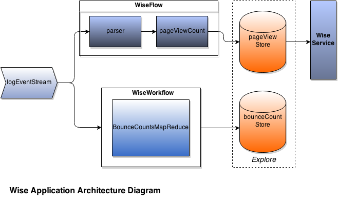
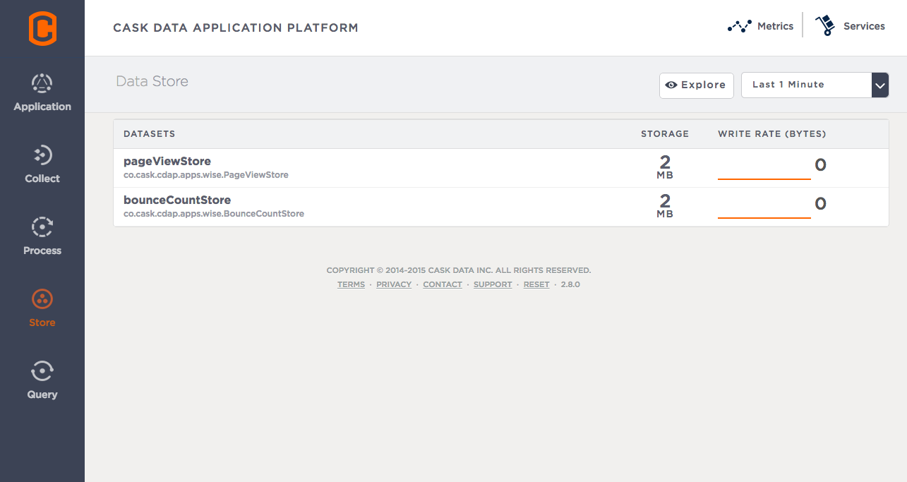
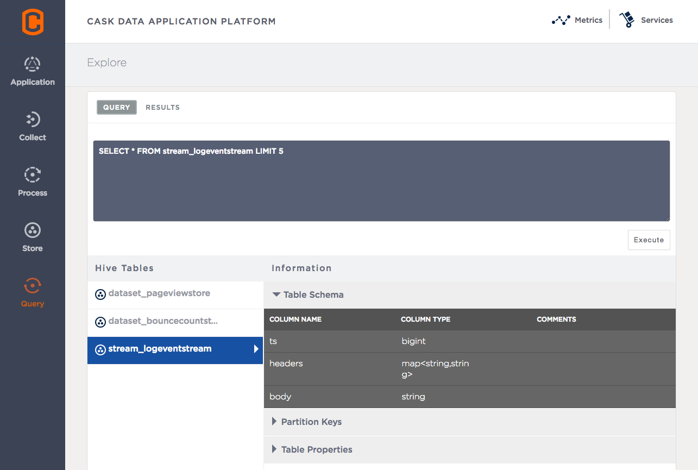

.. meta::
    :author: Cask Data, Inc.
    :description: Advanced Tutorial, Web Analytics Application
    :copyright: Copyright © 2014-2015 Cask Data, Inc.

.. _cdap-tutorial-advanced:

=========================================================
Advanced Tutorial: Wise (Web Insights Engine Application)
=========================================================

**A Case Study of Web Analytics using the Cask Data Application Platform (CDAP)**

Introduction
============
Performing analytics on a Web application using access logs is a common use
case when managing a Web site. A system capable of that needs to ingest logs, and
implement real-time or batch processing computations to process the data. The information
has to be stored somewhere in the system, and the system should expose ways to retrieve
it. Even in this case where the system performs very simple analytics, like counting the
number of visits made to a website in a day, the components needed to make it possible
demand a lot of work.

Using the **Web Insights Engine Application** or *Wise*, we’ll show you how to build
such a system on CDAP that is easy, concise, and powerful. Wise extracts value from Web
server access logs, counts visits made by different IP addresses seen in the logs in
real-time, and computes the bounce ratio of each web page encountered using batch
processing.

The Wise application uses these Cask Data Application Platform (CDAP) constructs to
analyze web server logs:

- **Stream:** Ingests log data in real-time 
- **Flow:** Computes web page visits counts per IP address based on the log data in real-time 
- **Datasets:** Store web page visits counts and bounce ratio based on custom data access patterns 
- **MapReduce:** Computes the bounce ratio of each web page present in the log data 
- **Service:** Exposes HTTP APIs to query the page visit counts per IP address 
- **Explore:** Runs SQL queries on the data stored in Datasets 

Running Wise 
============
.. highlight:: console

In the examples that follow, for brevity we will simply use ``cdap-cli.sh`` for the CDAP
Command Line Interface. Substitute the actual path for ``bin/cdap-cli.sh``, or
``bin\cdap-cli.bat`` on Windows, as appropriate. Similarly, other scripts referenced are
available in version for Windows, either as ``.bat`` files, or |---| in the case of the
``curl`` command |---| as an executable included in the Standalone CDAP SDK in its
``libexec\bin`` directory.

Building and running Wise is straightforward. We’ll assume that you have already
downloaded, installed, and have started an instance of CDAP, as described in the 
:ref:Tutorial Introduction <tutorial-intro>`.

Change to the directory where you have installed the CDAP SDK Standalone, and download the
Wise source code:

.. |wise-version| replace:: 0.1.0

.. container:: highlight

  .. parsed-literal::
    |$| cd $CDAP_SDK_HOME
    |$| curl --remote-name |http:|//repository.cask.co/downloads/co/cask/cdap/apps/|wise-version|/cdap-wise-|wise-version|.zip
    
Unzip the directory and build the application by executing:

.. container:: highlight

  .. parsed-literal::
    |$| unzip cdap-wise-|wise-version|.zip
    |$| cd cdap-wise-|wise-version|
    |$| mvn package 

To build without running the Wise Example Tests, you can use::

    $ mvn package -DskipTests
    
To deploy and start the application, make sure CDAP is running and then execute:

.. container:: highlight

  .. parsed-literal::
    |$| cd $CDAP_SDK_HOME
    |$| ./bin/cdap-cli.sh deploy app examples/cdap-wise-|wise-version|/target/Wise-|wise-version|.jar
    |$| ./bin/cdap-cli.sh start flow WebAnalytics.WebAnalyticsFlow 
  
  
Overview of Wise
================
Throughout this case study, we will present and explain the different constructs that the
Wise application uses. Let’s first have a look at a diagram showing an overview of the
Wise application’s architecture:

- The Wise application has one Stream, ``logEventStream``, which receives Web server
  access logs. It sends the events it receives to two CDAP components: the
  ``WiseFlow`` Flow and the ``WiseWorkflow`` Workflow.
  
- ``WiseFlow`` has two Flowlets. The first, ``parser``, extracts information from the logs
  received from the Stream. It then sends the information to the second Flowlet,
  ``pageViewCount``, whose role is to store the information in a custom-defined Dataset,
  ``pageViewStore``.
  
- ``WiseWorkflow`` executes a MapReduce every ten minutes. The input of this job are events
  from the Stream which have not yet been processed by the Workflow. For each web page
  recorded in the access logs, the MapReduce counts the number of times people have
  “bounced” from it. A “bounce” is counted whenever a user’s activity stops for a specified
  amount of time. The last page they visited is counted as a bounce. This information is
  stored in the Dataset ``bounceCountStore``.
  
- The Wise application contains the ``WiseService``, a Service which exposes RESTful endpoints
  to query the ``pageViewStore`` Dataset.
  
- Finally, both the ``pageViewStore`` and ``bounceCountStore`` Datasets expose a SQL interface. They
  can be queried using SQL queries through our Explore module in the CDAP Console. 

Now let’s talk about each of these components in more detail.

Wise Data Patterns
==================
Here’s a sample access log::

  47.41.156.173 - - [18/Sep/2014:12:52:52 -0400] "POST /index.html HTTP/1.1" 404 1490 " "
    "Mozilla/2.0 (compatible; Ask Jeeves)"
    
Wise is only interested in three parts of a log:

- The IP address: **47.41.156.173** 
- The time the log was saved: **18/Sep/2014:12:52:52 -0400**
- The web page visited: **/index.html**

Wise has two Datasets, *pageViewStore* and *bounceCountStore*, which both store
information about the access logs, but according to different patterns.

..rubric:: The *pageViewStore* Dataset 

The *pageViewStore* custom Dataset stores, for each IP address,
the number of times that address has visited a web page. For example, *pageViewStore* could
contain this entry::

  47.41.156.173  -> {
    /index.html  -> 3, 
    /career.html -> 1, 
    /team.html   -> 4,
    ...
  }
    
*pageViewStore* uses a ``Table`` object to store this information. ``Table`` is a class provided by
the CDAP system which has rows and columns. A row consists of a row key and one or more
columns with values associated with them. Two rows can have different sets of columns.
Using the ``Java Map`` interface, a ``Table`` can be seen as being of type ``Map<byte[], Map<byte[],
byte[]>>``.

*pageViewStore* uses a ``Table`` object with this pattern:

- The row key of the Table is an IP address; 
- Each web page visited by the IP address is a column; 
- The value of each column is the count of visits the IP address has made to the web page URI. 

.. highlight:: java

*pageViewStore* is a custom Dataset. It is defined in the ``PageViewStore`` class such
that it includes the use of a ``Table`` to store the data:

.. literalinclude:: /../build/_includes/PageViewStore.java
   :language: java
   :lines: 41-51   

This is the common way of defining a custom Dataset. The next step is to define the API
that this Dataset exposes to store and access data. The API for storing data will be a
single method:

.. literalinclude:: /../build/_includes/PageViewStore.java
   :language: java
   :lines: 57-59   

``incrememtCount()`` takes a ``LogInfo`` object, which contains those three parts of a log that we
are interested in |---| IP address, timestamp, and web page |---| and increments the number of
visits of the web page for that IP address. We use the underlying ``Table``‘s ``increment()``
method to store this information.

Let’s look at how to make the data available through our *pageViewStore* Dataset:
  
.. literalinclude:: /../build/_includes/PageViewStore.java
   :language: java
   :lines: 79-89   

This method returns the total number of visits an IP address has made. To do so, it uses
the ``Table.get()`` method, which returns a Row object containing all the columns associated
to the row key passed as argument of ``Table.get()``.

.. rubric:: The *bounceCountStore* Dataset 

The *bounceCountStore* Dataset stores the total number of visits for each web page, along
with the number of times users bounced off of them.

Data is stored in a ``Table`` object with the pattern:

- The row key is the web page URI; 
- Each row has two columns: the byte arrays COL_VISITS and COL_BOUNCES; 
- The COL_VISITS column stores the total number of visits for the web page considered; and 
- The COL_BOUNCES column stores the number of times users bounced off the web page. 

Let’s detail the API exposed by the *bounceCountStore* Dataset to store this information:

.. literalinclude:: /../build/_includes/BounceCountStore.java
   :language: java
   :lines: 39-63   

The ``increment()`` method adds to a web page the number of “visits” and “bounces”, using the
``Table.increment()`` method to do so.

To retrieve the number of “visits” and “bounces” for a particular web page, we define a
``get()`` method:

.. literalinclude:: /../build/_includes/PageViewStore.java
   :language: java
   :lines: 79-89   

The ``get()`` method reads the two columns ``COL_VISITS`` and ``COL_BOUNCES`` of a web page. Once
again, we use the ``Table.get()`` method which returns a ``Row`` object. From the information
contained in the ``Row`` object, we build a ``PageBounce`` object, a simple POJO class, containing
a uri, a visits count and a bounces count.

Ingesting Access Logs in Wise 
=============================
CDAP has an easy way to ingest data in real time into an application, using Streams. A
Stream exposes a simple RESTful API to ingest data events.

.. highlight:: console

In Wise, each Web server access log is injected as a Stream event to the *logEventStream* in
this format (broken on two lines to fit)::

  47.41.156.173 - - [18/Sep/2014:12:52:52 -0400] "POST /index.html HTTP/1.1" 404 1490 " "
    "Mozilla/2.0 (compatible; Ask Jeeves)" 
  
We have already prepared a sample of Web server access logs for you to inject into the
*logEventStream*. Run this command at the root of the Wise application::

  $ ./bin/inject-data.sh 

This requires that a Standalone CDAP instance be running with the Wise application already
deployed.

Real-time Log Analytics with WiseFlow 
=====================================
The goal of ``WiseFlow`` is to perform real-time analytics on the Web server access logs
received by *logEventStream*. For each IP address in the logs, ``WiseFlow`` counts the
number of visits they made to different web pages.

This work is realized by two Flowlets, *parser* and *pageViewCount*.

The parser Flowlet parser receives the raw log data from the Stream and extracts useful
information from it. Here is its implementation::

  public static class LogEventParserFlowlet extends AbstractFlowlet { private static final
  Logger LOG = LoggerFactory.getLogger(LogEventParserFlowlet.class);

    // Emitter for emitting a LogInfo instance to the next Flowlet
    private OutputEmitter<LogInfo> output;

    // Annotation indicates that this method can process incoming data
    @ProcessInput public void processFromStream(StreamEvent event) throws
    CharacterCodingException {

      // Get a log event in String format from a StreamEvent instance
      String log = Charsets.UTF_8.decode(event.getBody()).toString();

      try { LogInfo logInfo = LogInfo.parse(log); if (logInfo != null) {
      output.emit(logInfo, "ip", logInfo.getIp().hashCode());
        }
      } catch (IOException e) {
        LOG.info("Could not parse log event {}", log);
      }
      }  }
      }  }}

.. literalinclude:: /../build/_includes/WiseFlow.java
   :language: java
   :lines: 57-81   

A ``Flowlet`` class extends ``AbstractFlowlet``. The ``LogEventParserFlowlet`` class contains one
method to process the data it receives from *logEventStream*. This method can have any name;
here, we call it *processFromStream*. It has to bear the ``@ProcessInput`` annotation indicating
that the method will be used to process incoming data.

Because the *parser* Flowlet receives data from a Stream, the *processFromStream* method has
to take one and only one argument of type ``StreamEvent``. A ``StreamEvent`` object contains the
header and the body of a Stream event. In the Wise application, the body of a ``StreamEvent``
will be a Web server access log.

The *parser* Flowlet parses every log it receives into one ``LogInfo`` object. Using an
``OutputEmitter<LogInfo>`` object, *parser* outputs those logs to the next Flowlet input |---| the
*pageViewCount* Flowlet. When a ``LogInfo`` object is emitted, it is hashed by IP address. We’ll
see below why this is useful.

The *pageViewCount* Flowlet 
---------------------------
The *pageViewCount* Flowlet receives ``LogInfo`` objects and updates
the *pageViewStore* Dataset with the information they contain.

Its implementation is very brief::

  public static class PageViewCounterFlowlet extends AbstractFlowlet {
  @UseDataSet("pageViewStore") private PageViewStore pageViewStore;

    @Batch(10) @HashPartition("ip") @ProcessInput public void count(LogInfo logInfo) {
      // Increment the count of a logInfo by 1
      pageViewStore.incrementCount(logInfo);
    }
    }}

.. literalinclude:: /../build/_includes/WiseFlow.java
   :language: java
   :lines: 86-102   

Here’s what to note about the ``PageViewCounterFlowlet`` Flowlet class:

- The ``@ProcessInput`` annotation on the ``count()`` method indicates that ``count()`` will process
  incoming data. 
- The ``@UseDataSet`` annotation gives a reference to the *pageViewStore* Dataset
  inside the *pageViewStore* attribute. The Dataset APIs can then be used inside the ``count()``
  method to store logs analytics. 
- The ``@Batch`` annotation indicates that data is processed in batches of ten ``LogInfo`` 
  objects, which increases the throughput of the Flowlet.
- The ``@HashPartition`` annotation ensures, in the case that several instances of this Flowlet are
  running, all ``LogInfo`` objects with the same IP address information will be sent to
  the same Flowlet instance. This prevents two Flowlet instances from writing to the same
  row key of the pageViewStore Dataset at the same time, which would cause a transaction
  conflict. (See the advanced guide for more information about transactions and conflicts.)

Building the WiseFlow 
---------------------
Now that we have had a look at the core of the *parser* and *pageViewCount* Flowlets,
let’s see how they are connected together and to *logEventStream*.

The Flowlets are defined in the ``WiseFlow`` Flow, which is defined by this small class::

  public class WiseFlow implements Flow { @Override public FlowSpecification configure() {
  return FlowSpecification.Builder.with() .setName("WiseFlow") .setDescription("Wise Flow")
  .withFlowlets() .add("parser", new LogEventParserFlowlet()) .add("pageViewCount", new
  PageViewCounterFlowlet()) .connect() .fromStream("logEventStream").to("parser")
  .from("parser").to("pageViewCount") .build();
    }
    }}

.. literalinclude:: /../build/_includes/WiseFlow.java
   :language: java
   :lines: 38-51   

In the ``configure()`` method of the ``WiseFlow`` Flow, we define the Flowlets, giving them names:

- *parser*, of type ``LogEventParserFlowlet``; and 
- *pageViewCount*, of type ``PageViewCounterFlowlet``.

We also define the graph of their connections:

- *logEventStream* Stream is connected to the *parser* Flowlet; and 
- *parser* Flowlet is connected to the *pageViewCount* Flowlet. 

Here is how WiseFlow looks in the CDAP Console:

.. image:: _images/wise_flow.png
   :width: 8in
   :align: center

Batch Processing of Logs with WiseWorkflow
==========================================
Wise executes every ten minutes a MapReduce program that computes the bounce counts of the
web pages seen in the Web server access logs.

The BounceCountsMapReduce class defines the MapReduce to run. It extends
AbstractMapReduce and overrides the two methods configure() and beforeSubmit(). The
configure() method is defined as::

  @Override public MapReduceSpecification configure() { return
  MapReduceSpecification.Builder.with() .setName("BounceCountsMapReduce")
  .setDescription("Bounce Counts MapReduce job") .useDataSet("bounceCountsMapReduceLastRun")
  .useOutputDataSet("bounceCountStore") .build();
  }

.. literalinclude:: /../build/_includes/BounceCountsMapReduce.java
   :language: java
   :lines: 41-48   

It sets the name of the MapReduce program, *BounceCountsMapReduce*, and specifies which Datasets
will be used in the program. This program uses the *bounceCountStore* system Dataset |---| of
type ``KeyValueTable`` |---| to store xxx.

.. We will talk about the useOutputDataset() method in only a minute.

Plugging the Stream to the Input of the MapReduce Program
---------------------------------------------------------
Traditionally in a MapReduce program, a Job configuration is set before each run. This is
done in the beforeSubmit() method of the BounceCountsMapReduce class::

  @Override public void beforeSubmit(MapReduceContext context) throws Exception { Job job =
  context.getHadoopJob(); ... KeyValueTable lastRunDataset =
  context.getDataSet("bounceCountsMapReduceLastRun"); ...
  StreamBatchReadable.useStreamInput(context, "logEventStream", startTime, endTime);
  }

.. literalinclude:: /../build/_includes/BounceCountsMapReduce.java
   :language: java
   :lines: 50-79   

As mentioned earlier, the input of the MapReduce is the *logEventStream*. This
connection is made above using the ``StreamBatchReadable.useStreamInput()`` method.

The startTime is computed using the last value stored in the *bounceCountsMapReduceLastRun*
Dataset, which can be accessed using the ``MapReduceContext.getDataSet()`` method.

Writing to the *bounceCountStore* Dataset from the MapReduce Job 
----------------------------------------------------------------
In the ``BounceCountsMapReduce.configure()`` method seen earlier, the ``useOutputDataset``
method sets the Dataset with the specified ID that will be used as the output of the job.
It means that the key/value pairs output by the reducer of the job will be directly
written to that Dataset.

To understand how this is possible, let’s go back to the definition of the
*bounceCountStore* Dataset::

  public class BounceCountsStore extends AbstractDataset implements BatchWritable<Void,
  PageBounce>, ... { ... @Override public void write(Void ignored, PageBounce pageBounce) {
  this.increment(pageBounce.getUri(), pageBounce.getTotalVisits(), pageBounce.getBounces());
    }
    ...
  }

.. literalinclude:: /../build/_includes/BounceCountStore.java
   :language: java
   :lines: 39-41   

``. . .``

.. literalinclude:: /../build/_includes/BounceCountStore.java
   :language: java
   :lines: 96-99   

This ``BatchWritable`` interface, defining a ``write()`` method, is intended to allow Datasets to
be the output of MapReduce jobs. The two generic types that it takes as parameters must
match the types of the key and value that the Reduce part of the job outputs. In this
case, the *bounceCountStore* Dataset can be used as output of a MapReduce where the
output key is of type ``Void``, and the output value is of type ``PageBounce``.

MapReduce Structure 
-------------------
Because the input of our MapReduce is a Stream, it forces the key and value types of our
Mapper to be ``LongWritable`` and ``Text``, respectively.

Our Mapper and Reducer are standard Hadoop classes with these signatures::

  public static class BounceCountsMapper extends Mapper<LongWritable, Text, LogInfo,
  IntWritable> { ...
  }
  
  }
  public static class BounceCountsReducer extends Reducer<LogInfo, IntWritable, Void,
  PageBounce> { ...
  }

.. literalinclude:: /../build/_includes/BounceCountsMapReduce.java
   :language: java
   :lines: 84-100   

``. . .``

.. literalinclude:: /../build/_includes/BounceCountsMapReduce.java
   :language: java
   :lines: 105-132   

Each generic parameter of the Mapper and the Reducer contains:

- Mapper input key ``LongWritable``: the timestamp of when a Stream event has been received;
- Mapper input value ``Text``: body of a Stream event, in this case the log data; 
- Mapper output key and Reducer input key ``LogInfo``: a POJO object containing information 
  about one log line; 
- Mapper output value and Reducer input value ``IntWritable``: a simple placeholder as we
  don’t use its content; 
- Reducer output key ``Void``: this is not used; and 
- Reducer output value ``PageBounce``: bounce counts of a web page. 

Scheduling the MapReduce Job
----------------------------
To schedule the ``BounceCountsMapReduce`` job to run every ten minute, we define it in the
``WiseWorkflow`` as::

  public class WiseWorkflow implements Workflow { @Override public WorkflowSpecification
  configure() { return WorkflowSpecification.Builder.with() .setName("WiseWorkflow")
  .setDescription("Wise Workflow") .onlyWith(new BounceCountsMapReduce()) .addSchedule(new
  Schedule("TenMinuteSchedule", "Run every 10 minutes", "0/10 * * * *",
  Schedule.Action.START)) .build();
  }
  }}

.. literalinclude:: /../build/_includes/WiseWorkflow.java
   :language: java
   :lines: 24-32   

Accessing Wise Data through WiseService
---------------------------------------
``WiseService`` is a Wise component that exposes specific HTTP endpoints to retrieve the
content of the *pageViewStore* Dataset. For example, ``WiseService`` defines this endpoint
(re-formatted to fit)::

  GET http://localhost:10000/v2/apps/Wise/services/WiseService/methods/ip/164.199.169.153/count
  
This endpoint is defined in a class extending ``AbstractHttpServiceHandler``::

  public static class PageViewCountHandler extends AbstractHttpServiceHandler {
  @UseDataSet("pageViewStore") private PageViewStore pageViewStore;

    @GET @Path("/ip/{ip}/count") public void getIPCount(HttpServiceRequest request,
    HttpServiceResponder responder, @PathParam("ip") String ipAddress) { long counts =
    pageViewStore.getCounts(ipAddress); responder.sendJson(200, counts);
    }
    ...
  }

.. literalinclude:: /../build/_includes/WiseService.java
   :language: java
   :lines: 46-68   

The ``PageViewCountHandler`` class accesses the *pageViewStore* Dataset using the same
``@UseDataSet`` annotation used in the ``PageViewCounterFlowlet`` class.

The endpoint defined above in the ``getIPCount()`` method will retrieve the number of times a
given IP address has been seen in the access logs by using the APIs of the *pageViewStore*
Dataset.

The ``@GET`` annotation specifies the HTTP method used to reach the endpoint. The ``@Path``
annotation defines the URL path used to reach this endpoint. This path has a single user
parameter: ``{ip}``. It is decoded as a ``String`` in the parameters of the ``getIPCount()`` method
with the help of the ``@PathParam`` annotation.

The PageViewCountHandler class is registered in the ``WiseService`` class, which has the
implementation::

  class WiseService extends AbstractService { @Override protected void configure() {
  setName("PageViewService"); addHandler(new PageViewCountHandler());
    }
    }}

.. literalinclude:: /../build/_includes/WiseService.java
   :language: java
   :lines: 80-94   

- The class sets the ID of the service, and this ID will be used in the URL to reach the
  endpoints defined by the service. 
- The ``PageViewCountHandler`` that responds to the HTTP endpoint exposed by the Service 
  is specified by the ``addHandler()`` method. 

We have created a script to query the HTTP endpoints defined by the WiseService. In the
root of the Wise application, execute::

  $ bin/call-service.sh --ip 255.255.255.154 
  $ bin/call-service.sh --ip 255.255.255.154 --uri /index.html
  
  
Exploring Wise Datasets through SQL
-----------------------------------
With Wise, you can explore the Datasets using SQL
queries. The SQL interface on CDAP, called Explore, can be accessed through the CDAP
Console:

After deploying Wise in your Standalone CDAP instance, go to the Store page, which is one
of the five pages you can access from the left pane of CDAP Console:

Click on the Explore button in the top-right corner of the page. You will land on this
page:

This is the Explore page, where you can run ad-hoc SQL queries and see information about
the Datasets that expose a SQL interface.

You will notice that the Datasets have unusual names, such as cdap_user_bouncecounts.
Those are the SQL table names of the Datasets which have a SQL interface.

Here are some of the SQL queries that you can run:

- Retrieve the web pages from where IP addresses have bounced more than 50% of the time::

    SELECT uri FROM cdap_user_bouncecountstore WHERE bounces > 0.5 * totalvisits

- Retrieve all the IP addresses which visited the page ‘/contact.html’::

    SELECT key FROM cdap_user_pageviewstore WHERE array_contains(map_keys(value),‘/contact.html’)=TRUE

As the SQL engine that CDAP runs internally is Hive, the SQL language used to submit
queries is HiveQL. A description of it is in the Hive language manual.

Let’s take a look at the schemas of the bounceCountStore Dataset. The Explore interface
shows that it has three columns: uri, totalvisits, and bounces.

To understand how we managed to attach this schema to the bounceCountStore Dataset, let’s
have another look at the Dataset’s class definition::

  public class BounceCountsStore extends AbstractDataset implements ...,
  RecordScannable<PageBounce> { ...
  }

.. literalinclude:: /../build/_includes/BounceCountStore.java
   :language: java
   :lines: 39-41   

The RecordScannable interface allows a Dataset to be queried using SQL. It exposes a
Dataset as a table of Record objects, and the schema of the Record defines the schema of
the Dataset as seen as a SQL table.

The bounceCountStore Dataset’s Record type is PageBounce, which is a POJO object
containing three attributes: uri, totalVisits, and bounces. It explains where the schema
of the bounceCountStore is derived.

Bringing the Wise Components Together 
-------------------------------------
To create the Wise application with all these
components mentioned above, define a class that extends ``AbstractApplication``::

  public class WiseApp extends AbstractApplication { @Override public void configure() {
  setName("Wise"); setDescription("Web Insights Engine"); addStream(new
  Stream("logEventStream")); createDataset("pageViewStore", PageViewStore.class);
  createDataset("bounceCountStore", BounceCountStore.class);
  createDataset("bounceCountsMapReduceLastRun", KeyValueTable.class); addFlow(new
  WiseFlow()); addWorkflow(new WiseWorkflow()); addService(new WiseService());
    }
    }}

.. literalinclude:: /../build/_includes/WiseApp.java
   :language: java
   :lines: 25-47   

When the Wise application is deployed in CDAP, this class is read by the CDAP system. All
the components it defines are then installed, and can reference one another.

Unit testing Wise Unit tests are a major part of the development of an application. As
developers ourselves, we have created a full unit testing framework for CDAP applications.
In a CDAP application unit tests, all CDAP components run in-memory.

The WiseAppTest class, which extends the unit-testing framework’s TestBase, tests all the
components of the WiseApp. The first step is to obtain an ApplicationManager object::

  ApplicationManager appManager = deployApplication(WiseApp.class);
  
With this object, we can:

- Test log event injection::

    StreamWriter streamWriter = appManager.getStreamWriter("logEventStream");
    streamWriter.send("1.202.218.8 - - [12/Apr/2012:02:03:43 -0400] " + 
      "\"GET /product.html HTTP/1.0\" 404 208 \"http://www.example.org\" \"Mozilla/5.0\"");

- Test the call to a Service endpoint::

    ServiceManager serviceManager = appManager.startService("WiseService");
    URL url = new URL(serviceManager.getServiceURL(), "ip/1.202.218.8/count");
    HttpRequest request = HttpRequest.get(url).build(); 
    HttpResponse response = HttpRequests.execute(request);
    Assert.assertEquals(200, response.getResponseCode()); 
    Assert.assertEquals("3", Bytes.toString(response.getResponseBody()));

- Start a MapReduce::

    MapReduceManager mrManager = appManager.startMapReduce("WiseWorkflow_BounceCountsMapReduce");
    mrManager.waitForFinish(3, TimeUnit.MINUTES);

- Test the output of the MapReduce::

    DataSetManager<BounceCountStore> dsManager = appManager.getDataSet("bounceCountStore");
    BounceCountStore bounceCountStore = dsManager.get();
    Assert.assertEquals(new PageBounce("/product.html", 3, 2), bounceCountStore.get("/product.html"));

- Test a SQL query on Datasets::

    Connection exploreConnection = getQueryClient(); 
    ResultSet resultSet = exploreConnection.prepareStatement("SELECT * FROM cdap_user_bouncecountstore ORDER BY uri").executeQuery(); 

A complete example of the test is included in the downloaded zip.
