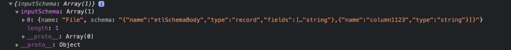
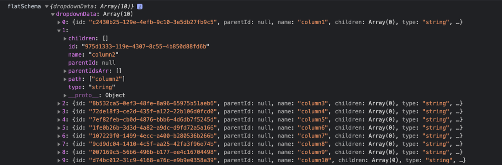
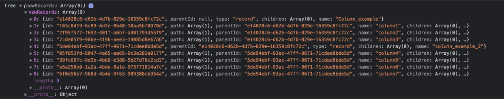
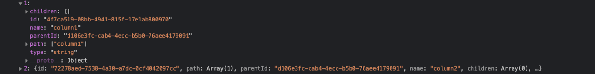
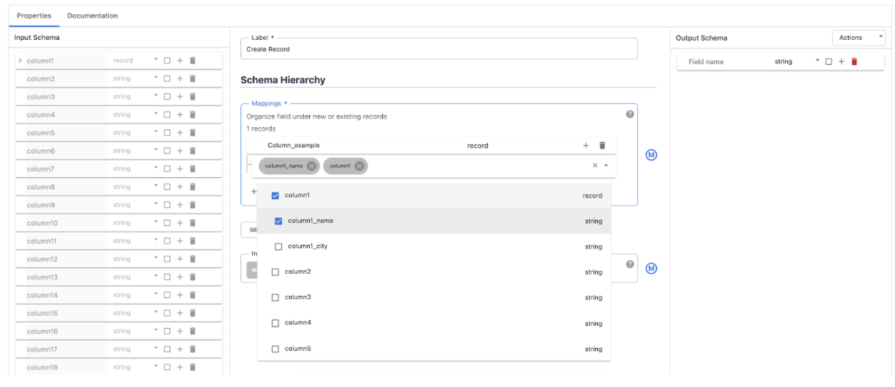
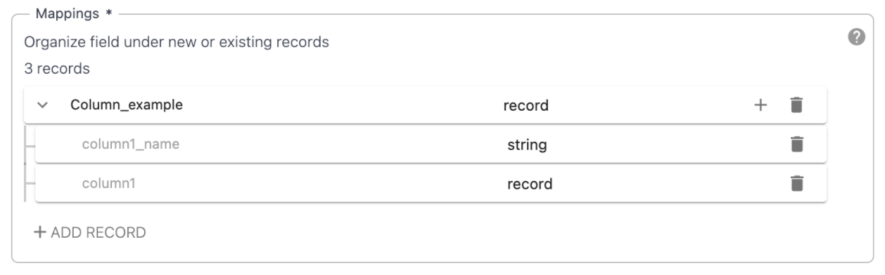
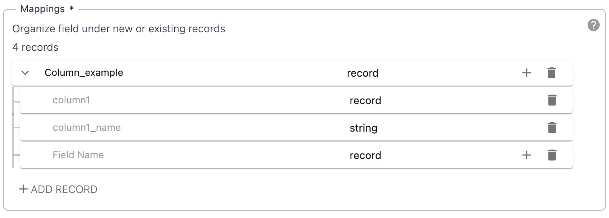
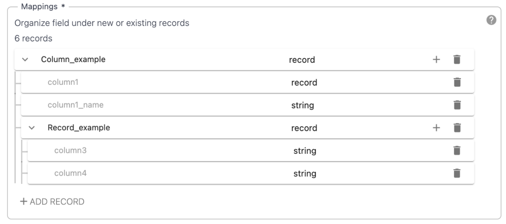
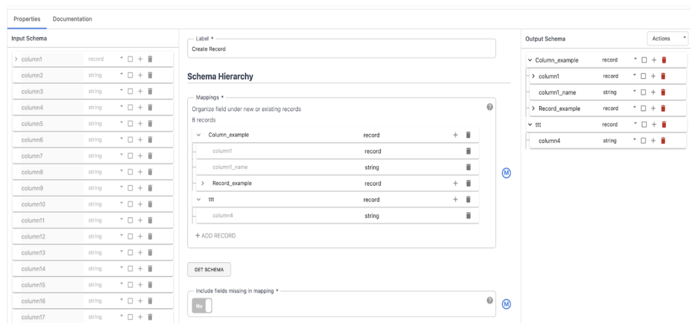

========================
Hierarchy Tree Generator
========================

Problem
-------
Cloud Data fusion, as a big data processing platform, handles large amounts of data with varying complexity of datasets. Currently, there is no way to transform the flat schemas in hierarchical structures.

Goal
----
The hierarchy widget will allow users to be able to collapse flat data into tree structures.

Approach
--------
The approach of hierarchy widget involves,

- Having the ability to represent the schema internally in an appropriate data structure.
- Reorganize the existing fields of the schema as children to the parent record, in the hierarchical data structure

Schema Tree in Hierarchical structure
=====================================

The input schema is converted to a flat structure, in which the user can add one or more records to organize the existing fields in a hierarchical structure (nested schema). In our case since we need to represent a hierarchy and rendering parents has higher priority than the children we do a Depth-First traversal of the tree.

The generic structure of a node in the tree is represented by,

::

    interface INodeProps {
    id: number;
    name: string;
    type: string;
    path?: string[];
    parentId?: number;
    children?: INodeProps[];
    }

`id` - Unique UUID for identifying the node.

`name` - The name of the field, node.

`path` - It is an array of fields identifying the depth of the tree, the hierarchy of the node.

`type` -  Valid schema type of the field that we display in UI.

`parentId` - Unique UUID for identifying the parent record of the tree. It is an indicator if the field is a parent or a child. If the parent is null it is the root of the tree, if not then it is a child of a particular parent.

`children` - It identifies the children of a particular node. Complex types such as record, map, enum, or union will have the children. 

The pictures attached are examples of how we get the input schema, and how we transform it to a flat schema.

Once we have a representation for the avro schema as a tree we can now traverse the tree to generate a list for rendering in UI.

::
 
    interface IHierarchyTreeNodeProps extends IHierarchyProps {
    node: INodeProps;
    records: INodeProps[];
    dropdownOptions: INodeProps[];
    disabled: boolean;
    setRecords: (value) => void;
    setTree: (value) => void;
    }

`node` - The current node listed.

`records` - Flattened records that are added.

`dropdownOptions` - The fields coming from the input schema rendered in the Autocomplete component.

`disabled`- A boolean value to identify the current state of the node.

`setRecords` - Handler to update the flat structure of the currently added records.

`setTree` - Handler to update the tree list from the flat structure given. 

Below is an example of the data structure when we call setRecords and setTree. 

All these records are displayed in the  Autocomplete component. The fields displayed in the dropdown are shown as a tree structure, children are slightly indented. The user can select the children without having to select the parent. 

Several operations interconnected must update the tree and the list in the quickest possible way and re-render the list.

::

    handleMultiSelectClose = () => void
    nameChangeHandler = (e) => void
    handleAddNewRecordToParent = () => void
    handleDeleteElement = () => void
    onChange?: (value) => void

`handleMultiSelectClose` - Handler for adding the selected elements from the dropdown in the organized tree.

`nameChangeHandler` - Handler for updating the name of the custom added records that are not part of the input schema.

`handleAddNewRecordToParent` - Handler for adding a new node of type record as a child to a custom parent node. These are the new fields added that are not part of the input schema.

`handleDeleteElement` - Handler for deleting the nodes.

`onChange` - Handler to update the structure that the backend will receive. Gets fired when the user adds, updates, or removes an element from records.

The user can select multiple fields by selecting the checkbox displayed next to each of them. The field selected will be displayed directly below the parent row. Options are listed after handleMultiSelectClose is triggered.

Adding a new node in the hierarchy structure is done by handleAddNewRecordToParent.  A new record field is displayed directly below the parent record. The input text for the field name is in focus so that the user can immediately start writing the name (nameChangeHandler), without any further action. New records are represented as editable rows, the same as adding a new record at the beginning of structuring the tree.

Each operation (add, remove, update) fires the appropriate handlers.

`add` - Requires generating a new record that is not part of the input schema, and will be represented as the root parent of the tree. Under the generating record, there are two possible options of add handler, first, is adding a child field from the input schema, to be part of the subtree, and the second one is adding a new record, represented as a child of the parent record in the data structure. Adding a new node is possible only if the field is not part of the input schema and is of type record.  Also, when adding a child, if the field in the input schema is of type record, it is possible to choose the child or the children without having to select the parent node.

`remove` - Deletion can be done in every node. Since the complex types are listed without their children, they can be deleted one by one. In the case where the node of type record is added by the user and is not part of the input schema, is deleted, all the subtree under that node is deleted.

`update` - Update is only allowed in the fields that are not part of the input schema, and that update includes changing the name of the node.
Get Schema and Validate

After structuring the hierarchical tree, the user will click the GetSchema or Validate button to Update the reorganized output schema. This operation will convert the flat structure of the added records into an acceptable JSON structure for the backend to receive.

