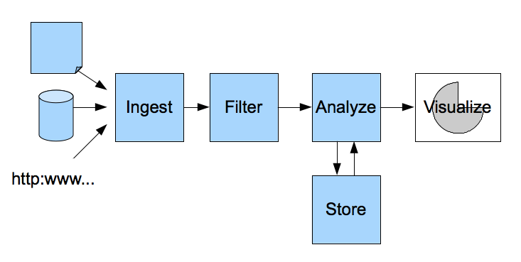
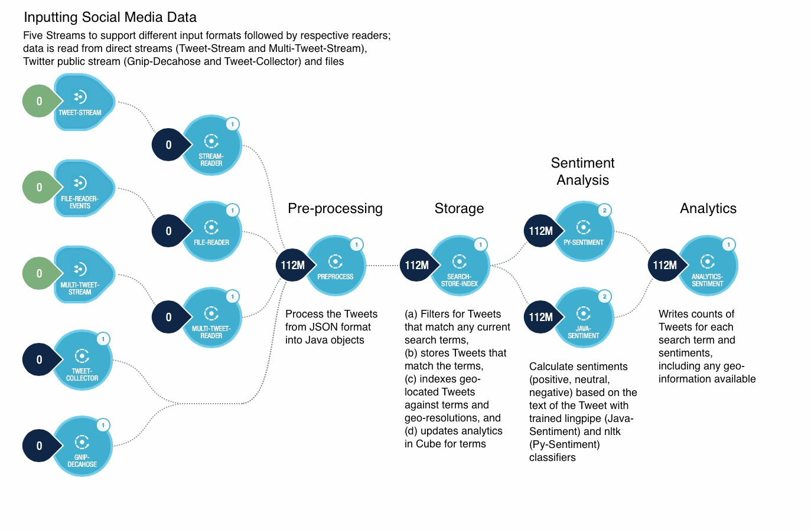

==============================================
Developing A Big Data Application with Reactor
==============================================

.. reST Editor: .. section-numbering::
.. reST Editor: .. contents::

.. Slide Presentation HTML Generation
.. landslide: theme ../_theme/slides-generation/
.. landslide: build ../../html/

.. include:: ../_slide-fragments/continuuity_logo.rst

.. |br_e00| raw:: html

    

----

Module Objectives
=================

- Introducing a Big Data Problem: |br_e00| 
  Realtime geo-sentiment analysis of social media
- Solving it using Continuuity Reactor
- Problems of alternative solutions

----

Introducing a Big Data Problem 1/3
==================================

**Why**

Companies want to know what is happening in realtime

- What are people saying about them?
- What are people saying about their products?
- How are these sentiments changing over time?
- How are these sentiments different in different parts of a country?

A large company launches a new mobile phone product, and wants to know:

- What are people in New York thinking about it?
- What are people in Seattle tweeting about it?
- What did people say yesterday about it? This morning?

----

Introducing a Big Data Problem 2/3
==================================

**What**

One approach is **Geo-Sentiment analysis of social media data**

- Primary source for data is Twitter Firehose
- Additional possible data sources

  - Call Detail Records
  - Wireless Network Traces and Logs
  - Other Social Networks

- Challenging problem

  - Large volumes of data: 5K average / 30K peak tweets per second
  - Realtime results required: answers a day later aren't useful

----

Introducing a Big Data Problem 3/3
==================================

**How:** Hadoop/HBase is at the core of Big Data reference architecture

- Ingest social media data from different sources
- Select and store tweets based on a filter
- Analyze tweets and calculate sentiments
- Store calculated results with geo-information
- Visualize results

----

Continuuity Reactor *Geo-sentiment*
===================================

.. image:: ../_images/Geo-sentiment-UI.jpg
   :height: 300px

A web user interface

- Displays the tweet sentiments on a map
- With counts over time

----

Continuuity Reactor *Geo-sentiment*
===================================

- An application for sentiment analysis of Twitter data
- Built on Continuuity Reactor
- Supports realtime processing of data at large volumes
- Incorporates geographic information by determining the
  relative sentiment of tweets in each area
- Data is persisted in a Hadoop-based system
- Permits time and geolocation of specific queries

----

Continuuity Reactor *Geo-sentiment*
===================================

- Input through numerous sources

  - GNIP Decahose API stream
  - Twitter API public stream
  - File input

- Sentiment analysis 

  - External natural language toolkit
  - Pluggable and customizable
  
- Term tracking

  - Users specify terms that they want the application to track
  - Tweets containing these terms are aggregated and summarized in the results

- Geolocation-based queries

  - Identify the relative sentiment
  - Identify the tweet count in user-defined geographic coordinate ranges

- Historical searches: time-based searches on previously tracked terms

----

Ingesting Data
==============

.. sourcecode:: shell-session

	curl -X POST -d "$line" 
	  http://$gateway:10000/v2/streams/MyInputStream;

-----

Processing Data: Filtering, Analyzing
=====================================

.. sourcecode:: java

	class MyFilterFlowlet implements Flowlet {

	  @Override
	  public FlowletSpecification configure() {
	    return FlowletSpecification.Builder.with().
	      setName("filter").
	      setDescription("A filtering Flowlet").
	      build();
	  }

	  OutputEmitter<Long> output;
	  @ProcessInput
	  public void round(Double number) {
	    output.emit(Math.round(number));
	  }

-----

Storing Data
========================

.. sourcecode:: java

	Class MyCountingFowlet extends AbstractFlowlet {
	  @UseDataSet("myCounters")
	  private KeyValueTable counters;
	  ...
	  void process(String key) {
	    counters.increment(key.getBytes());
	  }

-----

Visualizing Results
===================

.. sourcecode:: java

	class MyVisulization extends AbstractProcedure {

	  @Handle("visualizer")
	  public void wave(ProcedureRequest request,
	      ProcedureResponder responder) throws IOException {
	    String total = "Total " + request.getArgument("count");
	    ProcedureResponse.Writer writer =
	      responder.stream(new ProcedureResponse(SUCCESS));
	    writer.write(ByteBuffer.wrap(total.getBytes())).close();
	  }
	}

----

Continuuity Reactor *Geo-sentiment*
========================================================

*Geo-sentiment* as seen in the Continuuity Reactor *Dashboard*

----

How Continuuity Reactor Helps
=============================

- Supports realtime processing of data at large volumes
- Data is persisted in a Hadoop-based system on commodity hardware
- Integrated framework for the creation of applications
- Provides simple, powerful APIs to access and process data
- Full support for the development lifecycle, from development to production
- Eases of application operation

----

**Without** Continuuity Reactor
===============================

- Steep learning curve to decide which technologies to use
- Increasing concerns in both application and infrastructure areas
- Deep integration required between various distributed systems
- Long time required to develop the application
- Limited development tools for application development lifecycle
- Harder to integrate into CI 

----

Module Summary
==============

You've now:

- Looked at a Big Data problem: geo-sentiment analysis of social media
- Considered a Continuuity Reactor solution
- Examined difficulties of alternative solutions

----

Module Completed
================

`Chapter Index <return.html#m01>`__