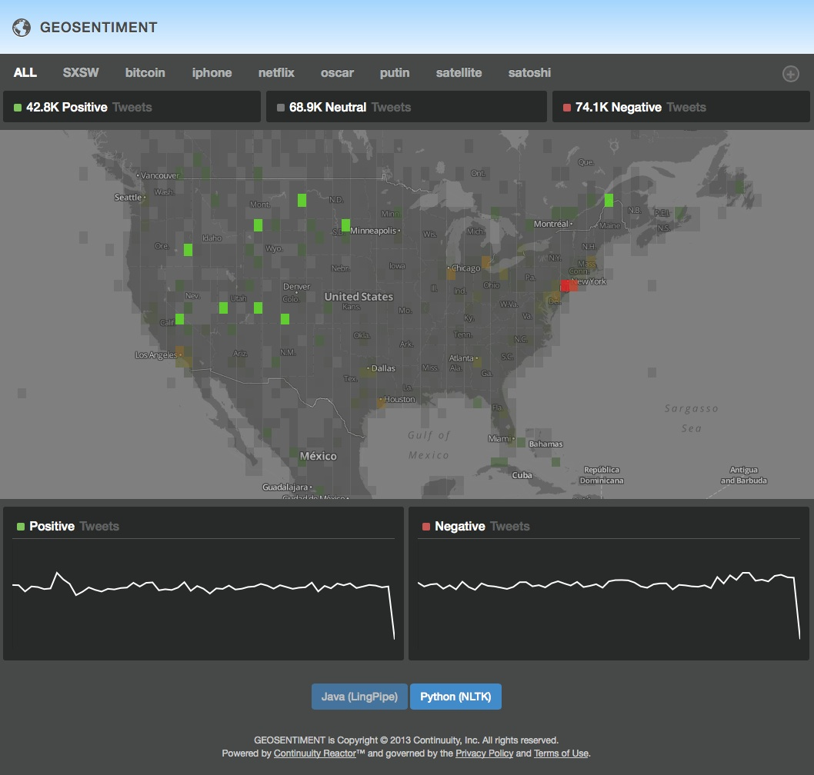
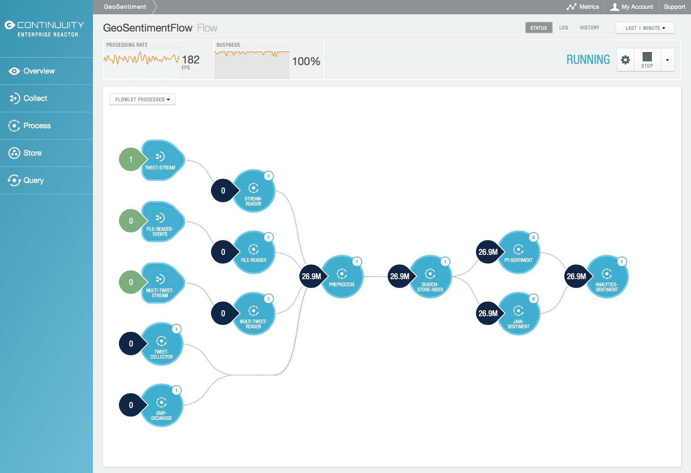

============================================
Introduction to Big Data Applications
============================================

.. include:: ../_slide-fragments/spaced_continuuity_copyright.rst

----

Module Objectives
=================

- Introducing a Big Data problem: Realtime sentiment analysis using the Twitter Firehose

- How would you solve it **without** Continuuity Reactor?
- How would you solve it **with** Continuuity Reactor?

----

Introducing a Big Data Problem
================================

**Sentiment analysis of social media data**

- Great value for enterprise businesses:

  - Feedback
  - Customer experience management
  - Identifying brand value
  - Competitive analysis

- Companies would like to analyze this data to in order to make
  informed decisions about their products:

  - Identify trends over time
  - Identify trends over different locales 

- Challenging problem due to:

  - Realtime nature
  - Large volume of data involved

----

How Would You Solve It **Without** Continuuity Reactor?
========================================================
.fx: center_title_slide

----

**Without** Continuuity Reactor
===============================

- Relational Database
- Custom process to ingest Twitter feed
- Batch processing

Constrained by:

- Realtime processing difficult if not impossible
- Large volumes of data

----

How Would You Solve It **With** Continuuity Reactor?
========================================================
.fx: center_title_slide

----

Continuuity Reactor *Geo-sentiment*
===================================

- An application for sentiment analysis of Twitter data
- Built on Continuuity Reactor
- Supports realtime processing of data at large volumes
- Incorporates geographic information by determining the
  relative sentiment of tweets in each area
- Data is persisted in a Hadoop-based system
- Permits time and geolocation of specific queries

----

Continuuity Reactor *Geo-sentiment*
===================================

A web user interface displays the tweet sentiments on a map and the counts over time:

----

Continuuity Reactor *Geo-sentiment*
===================================

- Input through:

  - GNIP Decahose API stream
  - Twitter API public stream
  - File input

- Sentiment analysis:

  - Linguistic Analysis Pipeline (Lingpipe version 4.1.0)
  - Natural Language Toolkit (NLTK version 2.0.4)
  - Models pre-trained on a tweet dataset
  
- Term tracking:

  - Users can specify terms that they want the application to track
  - Tweets containing these terms are aggregated and summarized in the results

- Geolocation-based queries: identify the relative sentiment and tweet count
  in user-defined geographic coordinate ranges
- Historical searches: time-based searches on previously tracked terms

----

Continuuity Reactor *Geo-sentiment*
===================================

*Geo-sentiment* as seen in the Continuuity Reactor *Dashboard*:

----

Continuuity Reactor *Geo-sentiment*
===================================

- Cube DataSet

  - Provides fast, flexible queries of tweet sentiment data
  - Across tracked terms over time and geographic ranges

- Resolution-based geofencing

  - Partitions areas by geographic coordinates
  - Resolution of geographic location fencing can be specified at runtime

- NLTK package

  - Implemented in Python
  - Executed externally as a system process

----

Module Summary
==============

You have looked at:

- A Big Data problem: *Geo-sentiment Analysis*
- A solution without using Continuuity Reactor
- A solution using Continuuity Reactor
