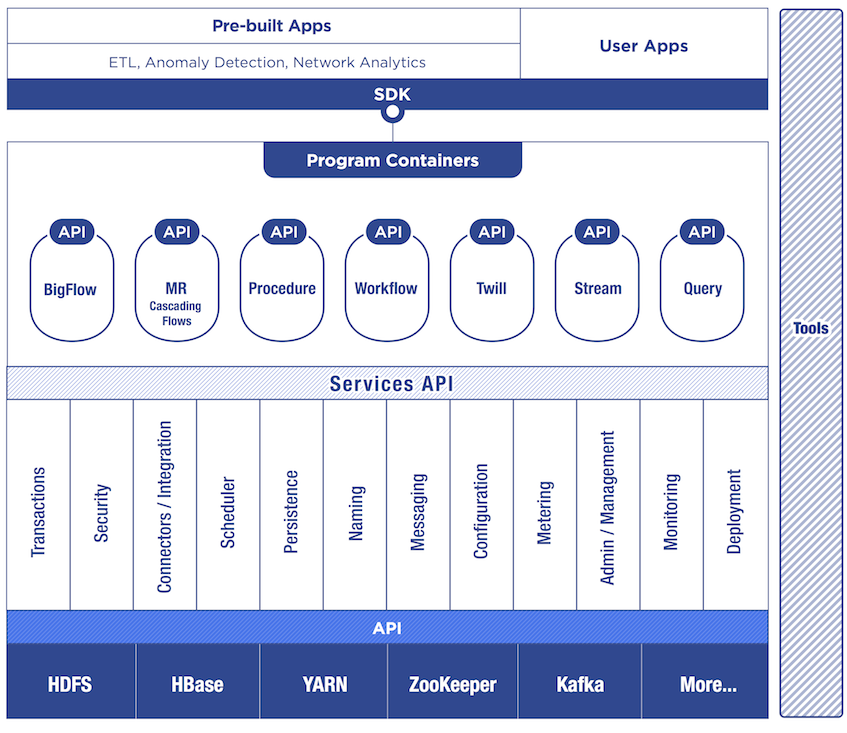
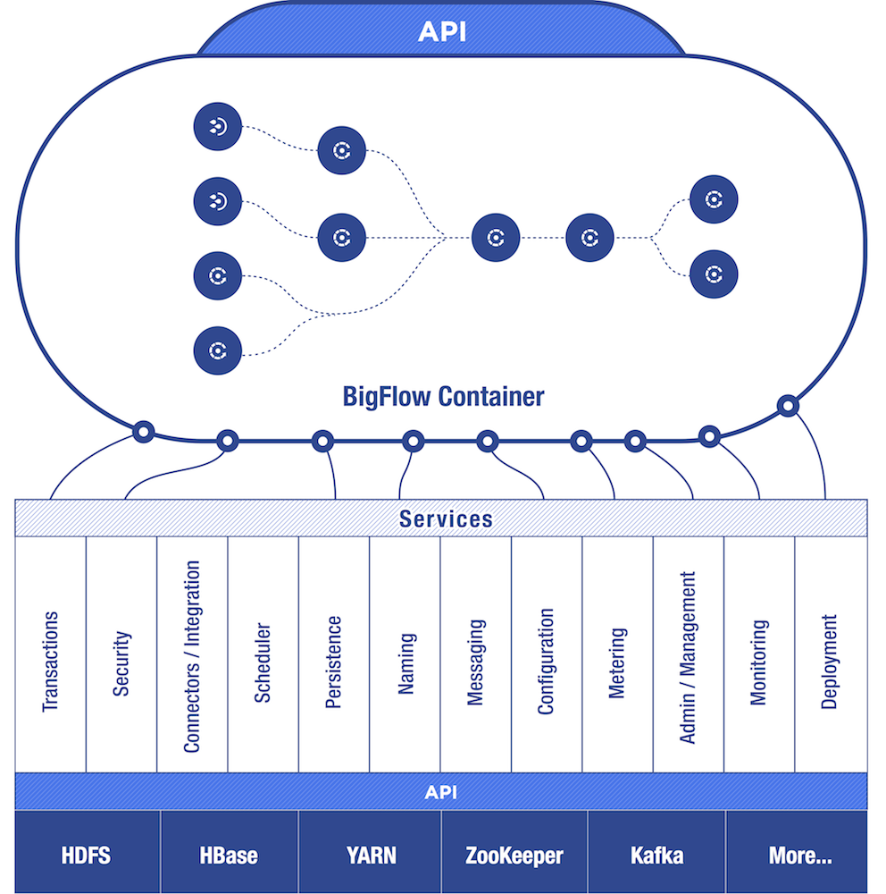
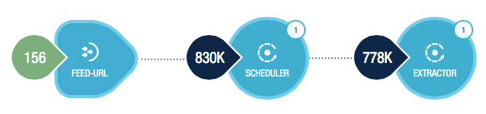
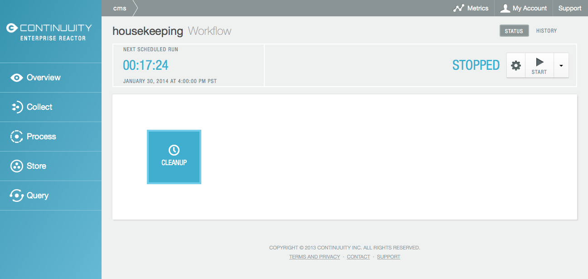

============================
Continuuity Reactor Overview
============================

.. reST Editor: .. section-numbering::
.. reST Editor: .. contents::

.. rst2pdf: CutStart
.. landslide: theme ../_theme/slides-generation/
.. landslide: build ../../html/

.. include:: ../_slide-fragments/continuuity_logo_copyright.rst

.. |br| raw:: html

    
.. rst2pdf: CutStop

.. rst2pdf: config ../../../developer-guide/source/_templates/pdf-config
.. rst2pdf: stylesheets ../../../developer-guide/source/_templates/pdf-stylesheet
.. rst2pdf: build ../../pdf/
.. rst2pdf: .. |br|  unicode:: U+0020 .. space

----

Module Objectives
=================

In this module, you will learn:

- Continuuity Reactor as an application server
- Continuuity Reactor architecture
- Basic functions of Reactor
- Basic elements of Reactor

----

Continuuity Reactor Application Server
======================================

----

Continuuity Reactor Architecture 
================================

.. image:: ../_images/hadoop_chart_01.png
   :width: 70%

----

Continuuity Reactor Flow (BigFlow Container)
============================================

----

Continuuity Reactor Functions
=================================

Basic functions of a Continuuity Reactor Application:

- Collecting
- Processing
- Storing
- Querying

----

Continuuity Reactor Elements
=================================

Basic elements of a Continuuity Reactor Application:

**Collecting:** Stream

**Processing:** Flow, Flowlet, Map Reduce Job & Workflow

**Storing:** DataSet

**Querying:** Procedure

----

**Collecting:** Stream
=================================

The primary means for bringing data from external systems into the Reactor in realtime

Streams must have unique names

Streams are shared across the Reactor by all Applications

Defined either in an Application or created programmatically

----

**Processing:** Flow
=================================

Flows are developer-implemented, real-time Stream processors

They are comprised of one or more Flowlets

Flowlets are wired together into a directed acyclic graph or DAG

The DAG comprises the Flow

.. image:: ../_images/dashboard_07_app_crawler_flow_out.png
   :width: 80%

----

**Processing:** Flowlets
=================================

Flowlets are the individual processing nodes within a Flow

Consume data objects from their inputs

Execute custom logic on each data object

Can perform data operations to a data store

Can emit data objects on their outputs

----

**Processing:** MapReduce Job
=================================

Used to process data in batch

Can be written as in a conventional Hadoop system

Reactor DataSets can be accessed from MapReduce jobs as both input and output

.. image:: ../_images/dashboard_26_mapreduce.png
   :width: 80%

----

**Processing:** Workflows
=================================

Workflows are used to execute a series of MapReduce jobs

A sequence of jobs that follow each other, with an optional schedule

Goes from job to job unless there is an error, in which case the Workflow is halted

----

**Storing:** DataSets
=================================

DataSets store and retrieve data

Read from and write data to the Reactor’s storage capabilities

Provide high-level abstractions

Provide generic, reusable Java implementations of common data patterns

Replace manipulating data with low-level APIs

.. image:: ../_images/dashboard_15_dataset.png
   :width: 80%

----

**Querying:** Procedures
=================================

Used to query data stored in Reactor

Allow you to make synchronous calls into Reactor from an external system

Allow you to perform server-side processing on-demand

Similar to a stored procedure in a traditional database

.. image:: ../_images/dashboard_17_procedure_ranker.png
   :width: 80%

----

Continuuity Reactor Elements
=================================

Basic elements of a Continuuity Reactor Application:

**Collecting:** Stream

**Processing:** Flow, Flowlet, Map Reduce Job & Workflow

**Storing:** DataSet

**Querying:** Procedure

----

Module Summary
==============

You should now:

- Have a basic understanding of Continuuity Reactor's architecture
- Know the four basic functions of Continuuity Reactor
- Know the main elements of Continuuity Reactor and their functions
- Be able to describe the functions of each element

----

Module Completed
================

`Chapter Index <return.html#m03>`__