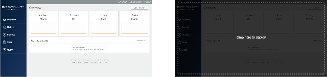
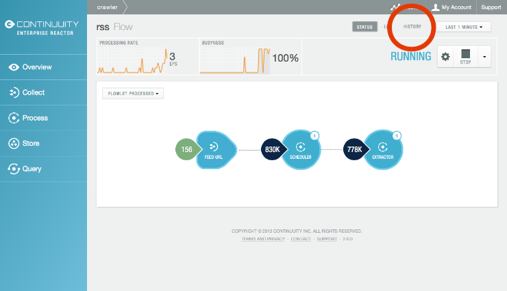
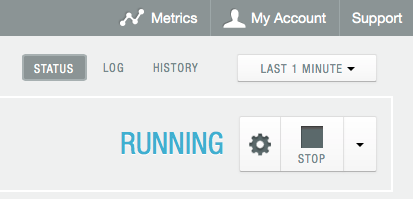
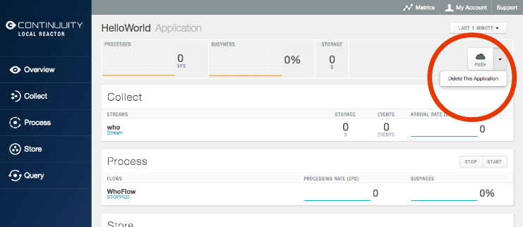

============================================
Application Lifecycle Management
============================================

.. reST Editor: .. section-numbering::

.. reST Editor: .. contents::

.. include:: ../_slide-fragments/continuuity_logo.rst

.. |br_m06| raw:: html

    

.. |br2_m06| raw:: html

     

----

Module Objectives
=================

In this module, you will look at:

- Deploying an Application
- Basic program operations for:

  - Continuuity Reactor: Start, Status, Restart, and Stop
  - Element History 
  - Flows, Procedures, MapReduce Jobs, and Workflows: Start, Stop and Configuration

- Deleting an Application

----

Deploying an Application
========================

1. Drag-and-drop application jar onto Dashboard

2. *Load An App* button on Dashboard

----

Deploying an Application
========================

3. Programatically using the REST API: |br2_m06|
   ``POST <base-url>/apps`` |br2_m06|
   with the name of the JAR file as a header: |br2_m06|
   ``X-Archive-Name: <JAR filename>`` |br2_m06|
   and its content as the body of the request: |br2_m06|
   ``<JAR binary content>``

----

Basic Program Operations
========================

- Start
- Status
- Restart
- Stop

----

Basic Program Operations: Start
===============================

::

	$ ./bin/reactor.sh start
	Starting Continuuity Reactor ........
	Continuuity Reactor started successfully
	Connect to dashboard at http://xxxxxx.local:9999

----

Basic Program Operations: Status
================================

::

	$ ./bin/reactor.sh status
	./bin/reactor.sh running as process 26078

----

Basic Program Operations: Restart
=================================

::

	$ ./bin/reactor.sh restart
	Stopping Continuuity Reactor .......
	Continuuity Reactor stopped successfully
	
	Starting Continuuity Reactor .......
	Continuuity Reactor started successfully
	Connect to dashboard at http://xxxxxx.local:9999

----

Basic Program Operations: Stop
=================================

::

	$ ./bin/reactor.sh stop
	Stopping Continuuity Reactor .......
	Continuuity Reactor stopped successfully

Scripts located in the Continuuity Reactor SDK::

	/bin/reactor.sh
	/bin/reactor.bat

----

Basic Program Operations: Element History
=========================================

1. Through Dashboard:

----

Basic Program Operations: Element History
=========================================

2. Through REST API: |br2_m06|
   ``GET <base-url>/apps/<app-id>/flows/<flow-id>/history``

where:

.. list-table::
   :widths: 20 80
   :header-rows: 1

   * - Parameter
     - Description
   * - ``<app-id>``
     - Name of the Application
   * - ``<flow-id>``
     - Name of the Flow

----

Flows, Procedures, MapReduce Jobs, Workflows
============================================

In the Dashboard, each of these elements can be

- Started
- Stopped
- Configured

using the management menu in the upper right corner:

----

Flows, Procedures, MapReduce Jobs, Workflows
============================================

The gear button brings up the Configuration menu for an element:

.. image:: ../_images/Dashboard_23_app_crawler_detail_config.png
   :width: 600px

----

Deleting an Application
========================

1. Using the *Delete This Application* button on the Dashboard:

----

Deleting an Application
========================

2. Programatically using the REST API: |br2_m06|
   ``DELETE <base-url>/apps/<application-name>`` |br2_m06|
   with ``<application-name>`` the name of Application to be deleted.

----

Deleting an Application
========================

``DELETE <base-url>/apps/<application-name>``

- ``<application-name>`` is the name of the Application as 
  configured by the Application Specification
- Not necessarily the same name as the JAR file that was used to deploy the Application
- Deleting the Application does not delete the Streams and DataSets
  associated with the Application
- They belong to your account, not the Application

----

Module Summary
==============

You should now be able to:

- Deploy an Application
- Perform basic program operations:

  - Continuuity Reactor: Start, Status, Restart, and Stop
  - Element History 
  - Flows, Procedures, MapReduce Jobs, and Workflows: Start, Stop and Confgure
  
- Delete an Application
