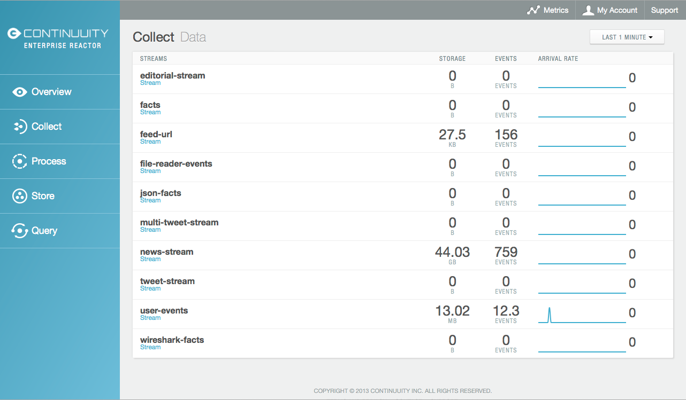
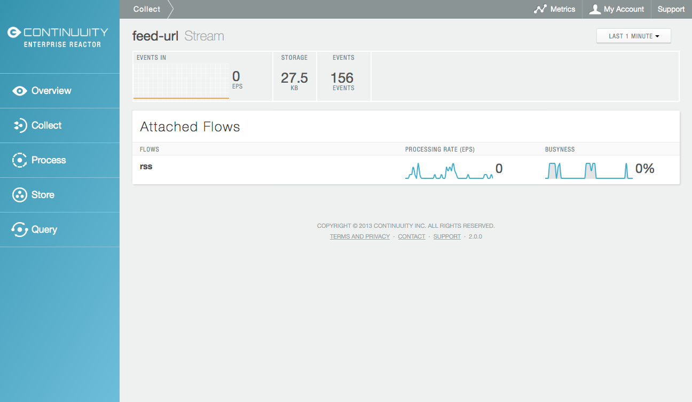

================
Creating Streams
================

.. reST Editor: .. section-numbering::
.. reST Editor: .. contents::

.. rst2pdf: CutStart
.. landslide: theme ../_theme/slides-generation/
.. landslide: build ../../html/

.. include:: ../_slide-fragments/continuuity_logo_copyright.rst

.. |br| raw:: html

    
.. rst2pdf: CutStop

.. rst2pdf: config ../../../developer-guide/source/_templates/pdf-config
.. rst2pdf: stylesheets ../../../developer-guide/source/_templates/pdf-stylesheet
.. rst2pdf: build ../../pdf/
.. rst2pdf: .. |br|  unicode:: U+0020 .. space

----

Module Objectives
=================

In this module, you will look at:

- Creating Streams
- Naming conventions for Streams
- Display of Stream and their details in the Dashboard

----

Creating Streams
================

**Streams** are the primary means for bringing data
from external systems into the Reactor in realtime

They can be created two different ways:

- Within your Application's definition
- Using a command line tool and the REST API

Data written to a Stream can be consumed by *Flows* and processed in real-time

----

Stream Names
============

- Streams are shared between applications, so they require a **unique name**
- Names used for Streams need to be unique across the Reactor instance
- Stream names should only contain ASCII letters, digits and hyphens
  
----

Creating a Stream Programmatically
==================================

You specify a Stream in your Application's metadata::

	.withStreams()
	  .add(new Stream("myStream")) ...

specifies a new Stream named *myStream*

----

Creating a Stream Through the REST API
=======================================

A Stream can be created with an HTTP PUT method to the URL::

	PUT <base-url>/streams/<new-stream-id>
		
Parameter
  ``<new-stream-id>``
Description
  Name of the Stream to be created

HTTP Responses

Status Code
   ``200 OK``
Description
   The event either successfully created a Stream or the Stream already exists

----

Creating a Stream: Example
==========================

::

	PUT <base-url>/streams/mystream

- If the Stream already exists, no error is returned,
  and the existing Stream remains in place

----

Streams Displayed in the Dashboard
=============================================

----

Stream Details Displayed in the Dashboard
=============================================

----

Module Summary
==============

You should be able describe:

- The two methods for creating Streams
- Naming conventions for Streams

You should now be able to find:

- The display of Streams in the Dashboard
- The display of any particular Stream in the Dashboard

----

Module Completed
================

`Chapter Index <return.html#m09>`__

