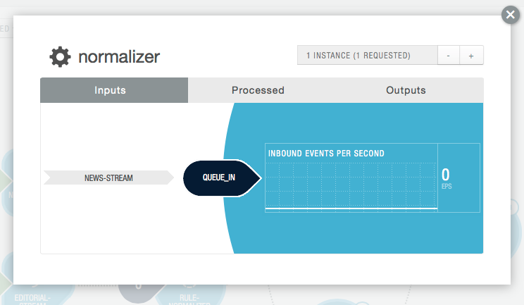

============================================
Flow Partitioning
============================================

.. reST Editor: .. section-numbering::
.. reST Editor: .. contents::

.. rst2pdf: CutStart
.. landslide: theme ../_theme/slides-generation/
.. landslide: build ../../html/

.. include:: ../_slide-fragments/continuuity_logo_copyright.rst

.. |br| raw:: html

    
.. rst2pdf: CutStop

.. rst2pdf: config ../../../developer-guide/source/_templates/pdf-config
.. rst2pdf: stylesheets ../../../developer-guide/source/_templates/pdf-stylesheet
.. rst2pdf: build ../../pdf/
.. rst2pdf: .. |br|  unicode:: U+0020 .. space

----

Module Objectives
=================

In this module, you will learn:

- Flowlet batch execution
- Instances and scaling of Flowlets
- Flow partitioning
- Different strategies for partitioning
- Configuring the number of Flowlet instances

----

Recap of the Flow System 1/2
============================

**Flows:**

- User-implemented real-time stream processors
- Comprised of one or more **Flowlets** wired together into a directed acyclic graph or DAG

**Flowlets:**

- Pass data between one another
- Able to perform custom logic 
- Execute data operations for each individual data object it processes
- Processes the data objects from its input one by one
- Multiple inputs are consumed (by default) in a round-robin fashion 

----

Recap of the Flow System 1/2
============================

When processing a single input object, all operations, including the removal of the object from the input, and emission of data to the outputs, are executed in a transaction

This provides:

- *Atomicity, Consistency, Isolation,* and *Durability* (ACID) properties
- Helps assure a unique and core property of the Flow system: 
  atomic and "exactly-once" processing of each input object by each Flowlet in the DAG

----

Flowlet Batch Execution
=======================

By default, a Flowlet processes a single data object at a time within a single transaction

Increase throughput by processing batches of data objects within the same transaction:

::

	@Batch(100)
	@ProcessInput
	public void process(Iterator<String> words) {
	  ...
	}

In this example, up to 100 data objects can be read from the input and processed at one time

----

Flowlets, Instances and Scaling
===============================

- Can have one or more instances of any given Flowlet
- Each consumes a disjoint partition of each input queue
- Enables you to scale your application to meet capacity at runtime
- Can control the number of instances, either:

  - Programmatically using the REST API, or via
  - The Continuuity Reactor Dashboard

- In the **Local Reactor**, multiple Flowlet instances are run in threads, 
  so in some cases actual performance may not be improved 
- In the **Hosted** and **Enterprise Reactors** each Flowlet instance 
  runs in its own Java Virtual Machine (JVM) with independent compute resources
- Scaling the number of Flowlets can improve performance and have a major impact 
  depending on the implementation

----

Flow Partitioning Strategies
=============================

With have multiple instances of a Flowlet, the input queue is partitioned among the Flowlets

A Flowlet can specify one of these three partitioning strategies:

- **First-in first-out (FIFO):** Default strategy 

- **Round-robin:** The number of items is distributed evenly among the instances

- **Hash-based:** The emitting Flowlet annotates each data object with a hash key

----

Details of Flow Partitioning Strategies 1/2
============================================

**First-in first-out (FIFO):**

- Every Flowlet instance receives the next available data object in the queue
- Since multiple consumers may compete for the same data object, 
  access to the queue must be synchronized
- This may not always be the most efficient strategy

**Round-robin:**

- The number of items is distributed evenly among the instances
- In general, the most efficient partitioning, more efficient than FIFO
- Not ideal when the application needs to group objects into buckets according to business logic

----

Details of Flow Partitioning Strategies 2/2
============================================

**Hash-based:**

- The emitting Flowlet annotates each data object with a hash key
- Ensures that all objects of a given key are received by the same consumer instance
- Useful for aggregating by key and can help reduce write conflicts

----

Example Flow Partitioning Strategy: FIFO
============================================

A Flowlet that counts words and uses the default strategy of FIFO::

	public class Counter extends AbstractFlowlet {

	  @UseDataSet("wordCounts")
	  private KeyValueTable wordCountsTable;

	  @ProcessInput("wordOut")
	  public void process(String word) {
	    this.wordCountsTable
	        .increment(Bytes.toBytes(word), 1L);
	  }
	}

----

Example Flow Partitioning Strategy: Round-robin 1/2
===================================================

To increase throughput when this Flowlet has many instances, 
specify round-robin partitioning::

	@RoundRobin
	@ProcessInput("wordOut")
	public void process(String word) {
	  this.wordCountsTable.increment(Bytes.toBytes(word), 1L);
	}

----

Example Flow Partitioning Strategy: Round-robin 2/2
===================================================

If we have three instances of this Flowlet, every instance will receive every third word

For the sequence of words in the sentence

**I scream, you scream, we all scream for ice cream:**

- The first instance receives: *I scream scream cream*
- The second instance receives: *scream we for*
- The third instance receives: *you all ice*

Potential problem: the first two instances might both attempt to increment the counter
for the word *scream* at the same time, leading to a write conflict

----

Example Flow Partitioning Strategy: Hash-based 1/3
==================================================

To avoid conflicts, use hash-based partitioning::

	@HashPartition("wordHash")
	@ProcessInput("wordOut")
	public void process(String word) {
	  this.wordCountsTable.increment(Bytes.toBytes(word), 1L);
	}

Only one of the Flowlet instances will receive the word *scream*, 
and there are no more write conflicts

----

Example Flow Partitioning Strategy: Hash-based 2/3
==================================================
To use, the emitting Flowlet must annotate each data object with the partitioning key::

	@Output("wordOut")
	private OutputEmitter<String> wordOutput;
	...
	public void process(StreamEvent event) {
	  ...
	  // emit the word with the partitioning 
	  // key name "wordHash"
	  wordOutput.emit(word, "wordHash", word.hashCode());
	}

----

Example Flow Partitioning Strategy: Hash-based 3/3
==================================================

- The emitter must use the same name ("wordHash") for the key 
  that the consuming Flowlet specifies as the partitioning key

- If the output is connected to more than one Flowlet, you can also annotate a 
  data object with multiple hash keys
  
- Each consuming Flowlet can then use different partitioning
  
- Useful if you want to aggregate by multiple keys, such as counting purchases by product ID
  as well as by customer ID

----

Combining Flow Partitioning and Batch Execution
==================================================

Partitioning can be combined with batch execution::

	@Batch(100)
	@HashPartition("wordHash")
	@ProcessInput("wordOut")
	public void process(Iterator<String> words) {
	   ...

----

Number of Flowlet Instances: REST API 1/3
==================================================

You can query and set the number of instances executing a given Flowlet
by using the ``instances`` parameter with HTTP GET and PUT methods:

.. sourcecode:: shell-session

	GET <base-url>/apps/<app-id>/flows/<flow-id>/flowlets/
	    <flowlet-id>/instances
	PUT <base-url>/apps/<app-id>/flows/<flow-id>/flowlets/
	    <flowlet-id>/instances

with the arguments as a JSON string in the body:

.. sourcecode:: shell-session

	{ "instances" : <quantity> }

Parameter : Description
  ``<app-id>`` : Name of the Application being called |br|
  ``<flow-id>`` : Name of the Flow |br|
  ``<flowlet-id>`` : Name of the Flowlet |br|
  ``<quantity>`` : Number of instances to be used

----

Number of Flowlet Instances: REST API 2/3
==================================================

Example

Find out the number of instances of the Flowlet *saver*
in the Flow *WhoFlow* of the Application *HelloWorld*

.. sourcecode:: shell-session

	GET <base-url>/apps/HelloWorld/flows/WhoFlow/flowlets/
         saver/instances

----

Number of Flowlet Instances: REST API 3/3
==================================================

Example

Set the number of instances of the Flowlet *saver*
in the Flow *WhoFlow* of the Application *HelloWorld*

.. sourcecode:: shell-session

	PUT <base-url>/apps/HelloWorld/flows/WhoFlow/flowlets/
         saver/instances

with the arguments as a JSON string in the body:

.. sourcecode:: json

    { "instances" : 2 }

----

Setting Number of Flowlet Instances: Dashboard 1/2
======================================================

A Flowlet icon in the DAG shows:

- The name of the Flowlet
- The number of events processed in the current sampling period
- The number of instances of that Flowlet in the small circle in the upper right of the icon:

.. image:: ../../../developer-guide/source/_images/dashboard/dashboard_13_flowlet_icon.png
   :width: 40%

----

Setting Number of Flowlet Instances: Dashboard 2/2
======================================================

Clicking on a Flowlet’s icon in the DAG brings up the configuration dialog for setting
the number of instance of the Flowlet:

-----

Module Summary
==============

You should now be able to:

- Specify Flowlet batch execution
- Describe the different Flow partitioning strategies
- Select and specify an appropriate Flow partitioning strategy
- Configure the number of Flowlet instances

----

Module Completed
================

`Chapter Index <return.html#m12>`__