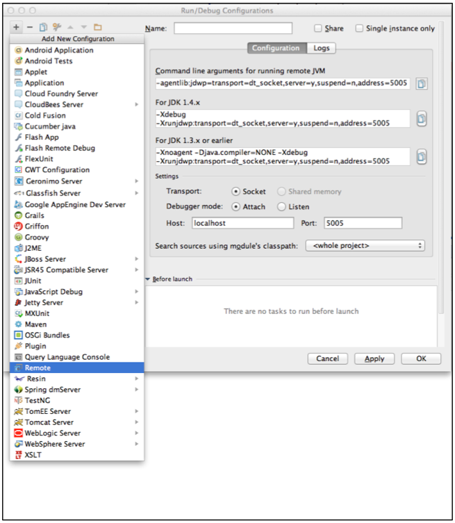
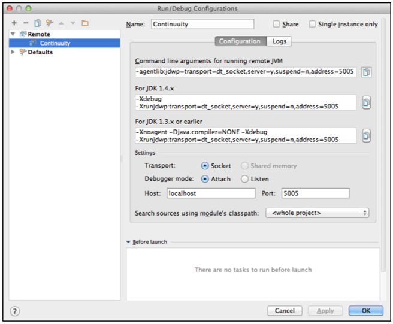
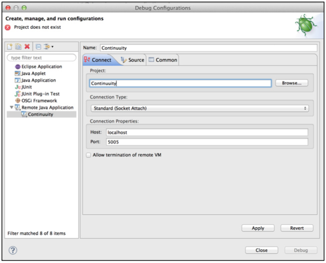

============================================
Debugging Reactor Applications
============================================

.. reST Editor: .. section-numbering::
.. reST Editor: .. contents::

.. rst2pdf: CutStart
.. landslide: theme ../_theme/slides-generation/
.. landslide: build ../../html/

.. include:: ../_slide-fragments/continuuity_logo_copyright.rst

.. |br| raw:: html

    
.. rst2pdf: CutStop

.. rst2pdf: config ../../../developer-guide/source/_templates/pdf-config
.. rst2pdf: stylesheets ../../../developer-guide/source/_templates/pdf-stylesheet
.. rst2pdf: build ../../pdf/
.. rst2pdf: .. |br|  unicode:: U+0020 .. space

----

Module Objectives
=================

In this module, you will learn:

- Debugging in both local and distributed Reactors
- Attaching debuggers for different IDEs

----

Debugging in a Local Reactor (1 of 2)
====================================================

Any Continuuity Reactor Application can be debugged in the Local Reactor
by attaching a remote debugger to the Reactor JVM

To enable remote debugging:

- Start the Local Reactor with the ``--enable-debug`` option specifying ``port 5005``:

.. sourcecode:: shell-session

	  $ bin/reactor.sh start --enable-debug 5005

- The Reactor should confirm that the debugger port is open with a message confirming
  that the debugger was started on the requested port:

.. sourcecode:: shell-session

	  Starting Continuuity Reactor ................
	  Remote debugger agent started on port 5005.
	  Continuuity Reactor started successfully
	  Connect to dashboard at http://localhost:9999

----

Debugging in a Local Reactor (2 of 2)
====================================================

- Deploy an Application (for example, *HelloWorld*) to the Reactor by dragging and dropping the
  ``HelloWorld.jar`` file from the ``/examples/HelloWorld`` directory onto the Reactor
  Dashboard

- Open the *HelloWorld* Application in an IDE and connect to the remote debugger

- Note: Currently, debugging is not supported under Windows

----

Debugging in Distributed Reactor (1 of 6)
========================================================

- In distributed mode, an application does not run in a single JVM
- Its programs are dispersed over multiple—if not many—containers in the Hadoop cluster
- There is no single place to debug the entire application
- You can debug an individual container by attaching a remote debugger to it
- This is supported for each Flowlet of a Flow and each instance of a Procedure

To debug a container, you need to start the element with debugging enabled by making 
an HTTP request to the element’s URL

----

Debugging in Distributed Reactor (2 of 6)
========================================================

The following will start a Flow for debugging::

	POST <base-url>/apps/WordCount/flows/WordCounter/debug

This URL differs from the URL for starting the Flow only by the last path
component (``debug`` instead of ``start``)

- You can pass in runtime arguments in the exact same way as you normally would start a Flow
- Once the Flow is running, each Flowlet will detect an available port in its container
  and open that port for attaching a debugger

To find out the address of a container’s host and the container’s debug port, you can query
the Reactor for the Flow’s live info via HTTP::

	GET <base-url>/apps/WordCount/flows/WordCounter/live-info

The response is formatted in JSON and can be pretty-printed

----

Debugging in Distributed Reactor (3 of 6)
========================================================

.. sourcecode:: json

  {
    "app": "WordCount",
    "containers": [
      {
        "container": "container_1397069870124_0010_01_000002",
        "debugPort": 42071,
        "host": "node-1004.my.cluster.net",
        "instance": 0,
        "memory": 512,
        "name": "unique",
        "type": "flowlet",
        "virtualCores": 1
      },
      {
        "container": "container_1397069870124_0010_01_000005",
        "debugPort": 37205,
        "host": "node-1003.my.cluster.net",
        "instance": 0,
        "memory": 512,
        "name": "splitter",
        "type": "flowlet",
        "virtualCores": 1
      }
    ],

----

Debugging in Distributed Reactor (4 of 6)
========================================================

(pretty-printed response continued)

.. sourcecode:: json

  {
    "id": "WordCounter",
    "runtime": "distributed",
    "type": "Flow",
    "yarnAppId": "application_1397069870124_0010"
  }

Response includes:

- YARN application id
- YARN container IDs of each Flowlet
- Host name and debugging port for each Flowlet

----

Debugging in Distributed Reactor (5 of 6)
========================================================

For example, the only instance of the splitter Flowlet is running on |br|  
``node-1003.my.cluster.net`` and the debugging port is 37205:

.. sourcecode:: json

  {
        "debugPort": 37205,
        "host": "node-1003.my.cluster.net",
        "instance": 0,
        "memory": 512,
        "name": "splitter",
        "type": "flowlet",
  }

You can now attach your debugger to this container’s JVM

----

Debugging in Distributed Reactor (6 of 6)
========================================================

The corresponding HTTP requests for the ``RetrieveCounts`` 
Procedure of this application would be::

	POST <base-url>/apps/WordCount/procedures/RetrieveCounts/debug

	GET <base-url>/apps/WordCount/procedures/RetrieveCounts/live-info

Analysis of the response would give you the host names and debugging ports 
for all instances of the Procedure

----

Attaching a Debugger: IntelliJ (1 of 4)
===============================================

1. From the *IntelliJ* toolbar, select ``Run->Edit Configurations``
2. Click ``+`` and choose ``Remote Configuration``:

----

Attaching a Debugger: IntelliJ (2 of 4)
===============================================

3. Create a debug configuration by entering a name, for example, ``Continuuity``
4. Enter the host name, for example, ``localhost`` or |br|
   ``node-1003.my.cluster.net`` in the Host field

----

Attaching a Debugger: IntelliJ (3 of 4)
===============================================

5. Enter the debugging port, for example, ``5005`` in the Port field:

----

Attaching a Debugger: IntelliJ (4 of 4)
===============================================

6. To start the debugger, select ``Run->Debug->Continuuity``
7. Set a breakpoint in any code block, for example, a Flowlet method:

.. image:: ../../../developer-guide/source/_images/IntelliJ_3.png
   :width: 80%

8. Start the Flow in the Dashboard
9. Send an event to the Stream

The control will stop at the breakpoint and you can proceed with debugging

----

Attaching a Debugger: Eclipse (1 of 3)
===============================================

1. In Eclipse, select ``Run->Debug`` configurations
2. In the pop-up, select ``Remote Java application``
3. Enter a name, for example, ``Continuuity``
4. Enter the host name, for example, ``localhost`` or |br|
   ``node-1003.my.cluster.net`` in the Host field
5. Enter the debugging port, for example, ``5005`` in the Port field

----

Attaching a Debugger: Eclipse (2 of 3)
===============================================

6. Click ``Debug`` to start the debugger:

----

Attaching a Debugger: Eclipse (3 of 3)
===============================================

7. Set a breakpoint in any code block, for example, a Flowlet method:

.. image:: ../../../developer-guide/source/_images/Eclipse_2.png
   :width: 70%

8. Start the Flow in the Dashboard
9. Send an event to the Stream

The control stops at the breakpoint and you can proceed with debugging

----

Module Summary
==============

You should be able to:

- Debugging in both local and distributed Reactors
- Attach a  debuggers in both IntelliJ and Eclipse

----

Module Completed
================

`Chapter Index <return.html#m27>`__