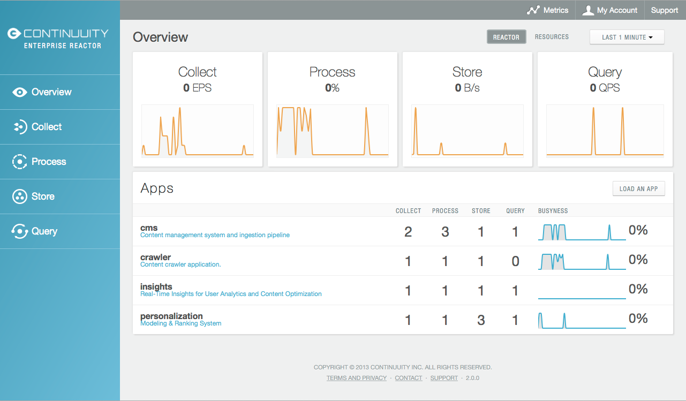
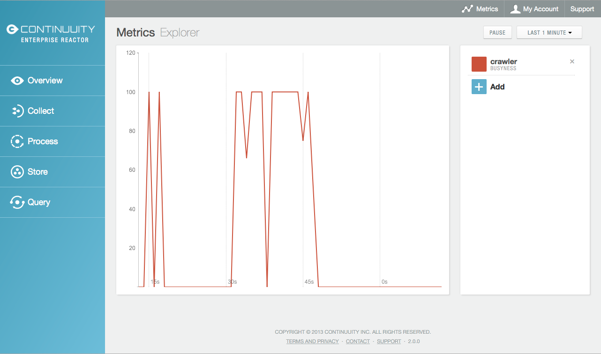

============================================
Instrumenting Application Health via Metrics
============================================

.. reST Editor: .. section-numbering::
.. reST Editor: .. contents::

.. rst2pdf: CutStart
.. landslide: theme ../_theme/slides-generation/
.. landslide: build ../../html/

.. include:: ../_slide-fragments/continuuity_logo_copyright.rst

.. |br| raw:: html

    
.. rst2pdf: CutStop

.. rst2pdf: config ../../../developer-guide/source/_templates/pdf-config
.. rst2pdf: stylesheets ../../../developer-guide/source/_templates/pdf-stylesheet
.. rst2pdf: build ../../pdf/
.. rst2pdf: .. |br|  unicode:: U+0020 .. space

----

Module Objectives
=================

In this module, you will learn:

- How to use metrics to instrument Applications and monitor their health
- How to make a metrics request
- What are the available contexts and metrics
- How to use the Metrics Explorer

----

Instrumenting Application Health via Metrics
============================================

As applications process data, Continuuity Reactor collects metrics about the application’s behavior and performance

1. System (or "Reactor") metrics: the same for every application

- How many events were processed?; or
- How many data operations were performed?, etc.

System metrics are either:

- Application metrics (about Applications and their Flows, Procedures, MapReduce jobs and WorkFlows); or
- Data metrics (relating to Streams or DataSets)

2. User-defined (or "custom") metrics: differ from application to application

- User metrics are always in the Application context

----

Making a Metrics Requests
=========================

General form of a metrics request is::

	GET <base-url>/metrics/<scope>/<context>/<metric>?<time-range>

Parameter
  ``<scope>``
Description
  Either ``reactor`` (for System metrics) or ``user`` (user-defined or custom metrics)

..

Parameter
  ``<context>``
Description
  Hierarchy of context, one of the available contexts

..

Parameter
  ``<metric>``
Description
  Metric being queried; one of the available metrics

..

Parameter
  ``<time-range>``
Description
  Either a *Time Range* or ``aggregate=true`` for all since the Application was deployed

----

Example Metrics Requests
=========================

Using a *System* metric, *process.bytes*:

.. sourcecode:: shell-session

	GET <base-url>/metrics/reactor/apps/HelloWorld/flows/
	     WhoFlow/flowlets/saver/process.bytes?aggregate=true

Using a *User-Defined* metric, *names.bytes*:

.. sourcecode:: shell-session

	GET <base-url>/metrics/reactor/apps/HelloWorld/flows/
	     WhoFlow/flowlets/saver/names.bytes?aggregate=true

To retrieve the number of input data objects (“events”) processed by a Flowlet named *splitter*, in the Flow *CountRandomFlow* of the Application *CountRandom*, over the last 5 seconds:

.. sourcecode:: shell-session

	GET <base-url>/metrics/reactor/apps/CountRandom/flows/CountRandomFlow/flowlets/
          splitter/process.events?start=now-5s&count=5

----

Example Metrics Request: Response
=================================

A JSON response that has one entry for every second in the requested time interval. It will have values only for the times where the metric was actually emitted (shown here "pretty-printed", unlike the actual responses):

.. sourcecode:: shell-session

	HTTP/1.1 200 OK
	Content-Type: application/json

.. sourcecode:: json

	{"start":1382637108,"end":1382637112,"data":[
	{"time":1382637108,"value":6868},
	{"time":1382637109,"value":6895},
	{"time":1382637110,"value":6856},
	{"time":1382637111,"value":6816},
	{"time":1382637112,"value":6765}]}

----

Example Metrics Requests: Flows
================================

Number of input objects processed across all Flowlets of a Flow, using the Flow context:

.. sourcecode:: shell-session

	GET <base-url>/metrics/reactor/apps/CountRandom/flows/
		CountRandomFlow/process.events?start=now-5s&count=5

Context of all flows of an Application, an entire Application, or the entire Reactor:

.. sourcecode:: shell-session

	GET <base-url>/metrics/reactor/apps/CountRandom/
		flows/process.events?start=now-5s&count=5

	GET <base-url>/metrics/reactor/apps/CountRandom/
		process.events?start=now-5s&count=5

	GET <base-url>/metrics/reactor/process.events?start=now-5s&count=5

----

Metrics Requests: User-defined
==============================

To request user-defined metrics instead of system metrics:

- Specify ``user`` instead of ``reactor`` in the URL and
- Specify the user-defined metric at the end of the request

To request a user-defined metric for the *HelloWorld* Application's *WhoFlow* Flow:

.. sourcecode:: shell-session

	GET <base-url>/metrics/user/apps/HelloWorld/flows/
		WhoFlow/flowlets/saver/names.bytes?aggregate=true

----

Metrics Requests: Multiple Metrics
==================================

To retrieve multiple metrics at once, instead of a GET:

- Issue an HTTP POST, with a
- JSON list as the request body that enumerates the name and attributes for each metrics

.. sourcecode:: shell-session

	POST <base-url>/metrics

with the arguments as a JSON string in the body:

.. sourcecode:: shell-session

	Content-Type: application/json

.. sourcecode:: json

	[ "/reactor/collect.events?aggregate=true",
	"/reactor/apps/HelloWorld/process.events?start=1380323712&count=6000" ]

----

Metrics Requests: Time Range
============================

The time range of a metric query can be specified in different ways:

.. list-table::
   :header-rows: 1
   :widths: 35 65

   * - Time Range
     - Description
   * - ``start=now-30s&end=now``
     - The last 30 seconds |br| The begin time is given in seconds relative to the current time |br| 
       You can apply simple math, using:  |br| ``now`` for the current time  |br| 
       ``s`` for seconds  |br| ``m`` for minutes  |br| ``h`` for hours and  |br| ``d`` for days |br| 
       For example: ``now-5d-12h`` is 5 days and 12 hours ago
   * - ``start=1385625600&end=1385629200``
     - From ``Thu, 28 Nov 2013 08:00:00 GMT`` |br| to ``Thu, 28 Nov 2013 09:00:00 GMT``, |br| 
       both given as since the start of the Epoch
   * - ``start=1385625600&count=3600``
     - The same as before, but with the count given as a number of seconds

----

Metrics Requests: Aggregate over Time
=====================================

Instead of getting the values for each second of a time range, you can also retrieve the
aggregate of a metric over time

For the total number of input objects processed since the Application *CountRandom* was deployed, assuming that the Reactor has not been stopped or restarted (you cannot specify a time range for aggregates):

.. sourcecode:: shell-session

	GET <base-url>/metrics/reactor/apps/CountRandom/process.events?aggregate=true

----

Available Contexts (1 of 2)
===========================

The context of a metric is typically enclosed into a hierarchy of contexts

- Example: the Flowlet context is enclosed in the Flow context, which in turn is enclosed in the
  Application context

- A metric can always be queried (and aggregated) relative to any enclosing context

- These are the available Application contexts of the Continuuity Reactor:

.. list-table::
   :header-rows: 1
   :widths: 37 63

   * - System Metric
     - Context
   * - One Flowlet of a Flow
     - ``/apps/<app-id>/flows/<flow-id>/flowlets/<flowlet-id>``
   * - All Flowlets of a Flow
     - ``/apps/<app-id>/flows/<flow-id>``
   * - All Flowlets of all Flows of an Application
     - ``/apps/<app-id>/flows``
   * - One Procedure
     - ``/apps/<app-id>/procedures/<procedure-id>``
   * - All Procedures of an Application
     - ``/apps/<app-id>/procedures``
   * - All Mappers of a MapReduce
     - ``/apps/<app-id>/mapreduce/<mapreduce-id>/mappers``
   * - All Reducers of a MapReduce
     - ``/apps/<app-id>/mapreduce/<mapreduce-id>/reducers``
   * - One MapReduce
     - ``/apps/<app-id>/mapreduce/<mapreduce-id>``
   * - All MapReduce of an Application
     - ``/apps/<app-id>/mapreduce``
   * - All elements of an Application
     - ``/apps/<app-id>``
   * - All elements of all Applications
     - ``/``

----

Available Contexts (2 of 2)
===========================

Stream metrics are only available at the Stream level and the only available context is:

.. list-table::
   :header-rows: 1
   :widths: 30 70

   * - Stream Metric
     - Context
   * - A single Stream
     - ``/streams/<stream-id>``

DataSet metrics are available at the DataSet level, but they can also be queried down to the
Flowlet, Procedure, Mapper, or Reducer level:

.. list-table::
   :header-rows: 1
   :widths: 18 82

   * - DataSet Metric
     - Context
   * - A single DataSet in the context of a single Flowlet
     - ``/datasets/<dataset-id>/apps/<app-id>/flows/<flow-id>/flowlets/<flowlet-id>``
   * - A single DataSet in the context of a single Flow
     - ``/datasets/<dataset-id>/apps/<app-id>/flows/<flow-id>``
   * - A single DataSet in the context of a specific Application
     - ``/datasets/<dataset-id>/<any application context>``
   * - A single DataSet across all Applications
     - ``/datasets/<dataset-id>``
   * - All DataSets across all Applications
     - ``/``

----

Available Metrics (1 of 3)
==========================

- For Continuuity Reactor metrics, the available metrics depend on the context
- User-defined metrics will be available at whatever context that they are emitted from

These metrics are available in the Flowlet context:

.. list-table::
   :header-rows: 1
   :widths: 40 60

   * - Flowlet Metric
     - Description
   * - ``process.busyness``
     - A number from 0 to 100 indicating how “busy” the Flowlet is;
       note that you cannot aggregate over this metric
   * - ``process.errors``
     - Number of errors while processing
   * - ``process.events.processed``
     - Number of events/data objects processed
   * - ``process.events.in``
     - Number of events read in by the Flowlet
   * - ``process.events.out``
     - Number of events emitted by the Flowlet
   * - ``store.bytes``
     - Number of bytes written to DataSets
   * - ``store.ops``
     - Operations (writes and read) performed on DataSets
   * - ``store.reads``
     - Read operations performed on DataSets
   * - ``store.writes``
     - Write operations performed on DataSets

----

Available Metrics (2 of 3)
==========================

Metrics available in the Mappers and Reducers context:

.. list-table::
   :header-rows: 1
   :widths: 40 60

   * - Mappers and Reducers Metric
     - Description
   * - ``process.completion``
     - A number from 0 to 100 indicating the progress of the Map or Reduce phase
   * - ``process.entries.in``
     - Number of entries read in by the Map or Reduce phase
   * - ``process.entries.out``
     - Number of entries written out by the Map or Reduce phase

Metrics available in the Procedures context:

.. list-table::
   :header-rows: 1
   :widths: 40 60

   * - Procedures Metric
     - Description
   * - ``query.requests``
     - Number of requests made to the Procedure
   * - ``query.failures``
     - Number of failures seen by the Procedure

----

Available Metrics (3 of 3)
==========================

Metrics available in the Streams context:

.. list-table::
   :header-rows: 1
   :widths: 40 60

   * - Streams Metric
     - Description
   * - ``collect.events``
     - Number of events collected by the Stream
   * - ``collect.bytes``
     - Number of bytes collected by the Stream

Metrics available in the DataSets context:

.. list-table::
   :header-rows: 1
   :widths: 40 60

   * - DataSets Metric
     - Description
   * - ``store.bytes``
     - Number of bytes written
   * - ``store.ops``
     - Operations (reads and writes) performed
   * - ``store.reads``
     - Read operations performed
   * - ``store.writes``
     - Write operations performed

----

Adding User-defined Metrics
===========================

- Embed user-defined metrics in the methods defining the elements of your application

- They then emit their metrics and they can be retrieved

- Retrieved via:

  - `Metrics Explorer` in the Dashboard; or
  - Continuuity Reactor’s `REST interfaces`

----

Adding User-defined Metrics: Flowlet Example
============================================

::

	public static class NameSaver extends AbstractFlowlet {
	  static final byte[] NAME = { 'n', 'a', 'm', 'e' };

	  @UseDataSet("whom")
	  KeyValueTable whom;
	  Metrics flowletMetrics; // Declare the custom metrics

	  @ProcessInput
	  public void processInput(StreamEvent event) {
	    byte[] name = Bytes.toBytes(event.getBody());
	    if (name != null && name.length > 0) {
	      whom.write(NAME, name);
	    }
	    if (name.length > 10) {
	      flowletMetrics.count("names.longnames", 1);
	    }
	    flowletMetrics.count("names.bytes", name.length);
	  }
	}

Example of user-defined metrics: **PageViewAnalytics** example

----

Metrics Explorer
================

Use the Continuuity Reactor Dashboard to view metrics

In the top portion of the Overview you can see the **Metrics** button

This takes you to the *Metrics Explorer*

----

Using the Metrics Explorer (1 of 3)
===================================

Monitor a variety of different statistics for elements of the Reactor

----

Using the Metrics Explorer (2 of 3)
===================================

- Add a metric by clicking the *Add* button
- Gives a dialog where you specify an element and then pick from a list of appropriate metrics.
- As with other Dashboard realtime graphs, specify the sampling rate through a pop-down menu 
  in the upper-right
- *Pause* the sampling to prevent excessive load on the Reactor

.. image:: ../../../developer-guide/source/_images/dashboard/dashboard_20_metrics_explorer3.png
   :width: 40%

----

Using the Metrics Explorer (3 of 3)
===================================

As you mouse over the graph, you will get detailed information about the statistics presented

.. image:: ../../../developer-guide/source/_images/dashboard/dashboard_19_metrics_explorer2.png
   :width: 80%

----

Module Summary
==============

You should be able to:

- Use metrics to instrument Applications and monitor their health
- Make a metrics request
- Select from the available contexts and metrics
- Use the Metrics Explorer

----

Module Completed
================

`Chapter Index <return.html#m28>`__