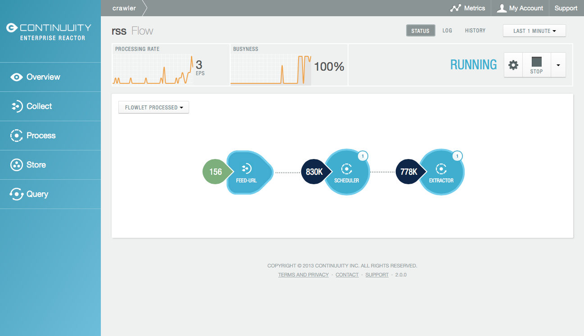
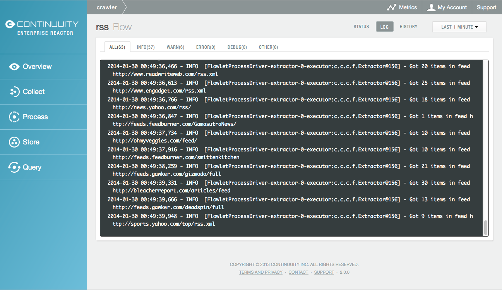

====================================================
Collecting Critical Application Information via Logs
====================================================

.. reST Editor: .. section-numbering::
.. reST Editor: .. contents::

.. rst2pdf: CutStart
.. landslide: theme ../_theme/slides-generation/
.. landslide: build ../../html/

.. include:: ../_slide-fragments/continuuity_logo_copyright.rst

.. |br| raw:: html

    
.. rst2pdf: CutStop

.. rst2pdf: config ../../../developer-guide/source/_templates/pdf-config
.. rst2pdf: stylesheets ../../../developer-guide/source/_templates/pdf-stylesheet
.. rst2pdf: build ../../pdf/
.. rst2pdf: .. |br|  unicode:: U+0020 .. space

----

Module Objectives
=================

In this module, you will learn how to:

- Create log messages in your Applications
- Two methods for viewing log messages
- Downloading log messages using REST
- Viewing messages through the Reactor Dashboard

----

Logging
=======

- The Reactor supports logging through standard |br| **SLF4J (Simple Logging Facade for Java)** APIs
- API described at http://www.slf4j.org/manual.html

In a Flowlet you can write:

::

	private static Logger LOG = LoggerFactory.getLogger(WordCounter.class);

	// ...
	@ProcessInput
	public void process(String line) {
	  LOG.info(this.getContext().getName() + ": Received line " + line);

	  // ... processing
	  LOG.info(this.getContext().getName() + ": Emitting count " + wordCount);
	  output.emit(wordCount);
	}

----

Viewing Log Messages
====================

Log messages emitted by Application code can be viewed in two different ways

1. Using the Continuuity Reactor **HTTP REST interface**

- The REST interface details the available contexts that can be called to retrieve
  log messages
- Available for *Flows*, *MapReduce* jobs or *Procedures*

2. Using The Continuuity Reactor **Dashboard**

- All log messages of an Application can be viewed in the Continuuity Reactor Dashboard
  by clicking the *Logs* button in the Flow, MapReduce or Procedure screens
- This launches the Log Explorer for the Flow, MapReduce job or Procedure

----

Downloading Logs using REST
===========================

Logs that are emitted by any of the *Flows*, *MapReduce* jobs or *Procedures*
running in the Continuuity Reactor can be downloaded using REST

Send an HTTP GET request:

.. sourcecode:: shell-session

	GET <base-url>/apps/<app-id>/<element-type>/<element-id>/logs?start=<ts>&stop=<ts>

Parameter
  ``<app-id>``
Description
  Name of the Application being called

..

Parameter
  ``<element-type>``
Description
  One of ``flows``, ``mapreduce``, or ``procedures``

..

Parameter
  ``<element-id>``
Description
  Name of the element (*Flow*, *MapReduce*, or *Procedure*) being called

..

Parameter
  ``<ts>``
Description
  *Start* and *stop* time, given as seconds since the start of the Epoch

----

Example of Downloading Logs using REST
======================================

Return the logs for all the events from the Flow *CountTokensFlow* of the *CountTokens* Application,
beginning ``Thu, 24 Oct 2013 01:00:00 GMT`` and ending ``Thu, 24 Oct 2013 01:05:00 GMT`` (five minutes later)

.. sourcecode:: shell-session

	GET <base-url>/apps/CountTokens/flows/CountTokensFlow/
	    logs?start=1382576400&stop=1382576700

----

Example Log Output
==================

A line of the log may look like this:

.. sourcecode:: shell-session

	2013-10-23 18:03:09,793 - INFO [FlowletProcessDriver-source-0-
        executor:c.c.e.c.StreamSource@-1] – source: Emitting line: this is an &amp; character

- The context of the log line shows the name of the Flowlet (*source*), its instance number (0) as well as 
  the original line in the Application code
- The output is formatted as HTML-embeddable text
- Characters that have a special meaning in HTML will be escaped
- The character *&* is escaped as ``&amp;``; turn off escaping by adding the parameter ``&escape=false`` 
  to the request URL

----

Launching The Dashboard's *Log Explorer*
========================================

To launch, visit the element (*Flow*, *Procedure*, *MapReduce*) of interest:

Use the *Log* button in the upper right to launch the *Log Explorer*

----

Using The Dashboard's *Log Explorer*
====================================

The *Log Explorer* pane shows a sample from the logs, with filters for a standard set of filters: *Info*, *Warn*, *Error*, *Debug*, and *Other:*

----

Module Summary
==============

You should now be able to:

- Create log messages in your Applications
- Download log messages using REST
- View messages using the Reactor Dashboard

----

Module Completed
================

`Chapter Index <return.html#m29>`__