.. :Author: Continuuity, Inc.
   :Description: Operating a Continuuity Reactor and its Dashboard

====================================
Continuuity Reactor Operations Guide
====================================

**Introduction to Running Applications and Operating the Continuuity Reactor**

.. reST Editor: .. section-numbering::
.. reST Editor: .. contents::

Putting Continuuity Reactor into Production
===========================================

The Continuuity Reactor can be run in different modes: in-memory mode for unit testing, Local Reactor for testing on a developer's laptop, and Hosted or Enterprise Reactor for staging and production. In addition, you have the option to get a free Sandbox Reactor in the cloud.

Regardless of the runtime edition, the Reactor is fully functional and the code you develop never changes. However performance and scale are limited when using in-memory, local mode or Sandbox Reactors.

In-memory Continuuity Reactor
-----------------------------
The in-memory Continuuity Reactor allows you to easily run the Reactor for use in unit tests. In this mode, the underlying Big Data infrastructure is emulated using in-memory data structures and there is no persistence. The Dashboard is not available in this mode.

Local Continuuity Reactor
-------------------------

The Local Continuuity Reactor allows you to run the entire Reactor stack in a single Java Virtual Machine on your local machine and includes a local version of the Reactor Dashboard. The underlying Big Data infrastructure is emulated on top of your local file system. All data is persisted.

The Local Reactor only binds to the localhost address, and is not available for remote access by any outside process or application.

.. See the *Continuuity Reactor Getting Started Guide* included in
.. the *Continuuity Reactor SDK* for information on how to start and manage your Local Reactor.

Sandbox Continuuity Reactor
---------------------------
The Sandbox Continuuity Reactor is a free version of the Reactor that is hosted and operated in the cloud. However, it does not provide the same scalability and performance as either the Hosted Reactor or the Enterprise Reactor. The Sandbox Reactor is an excellent way to evaluate all of the features of the “push-to-cloud” functionality of a Hosted Reactor or Enterprise Reactor without charge.

To self-provision a free Sandbox Reactor, login to your account at the
`Account Home page <https://accounts.continuuity.com>`__. On the *Overview* tab, you can start the provisioning of a Sandbox Continuuity Reactor.

To use the Reactor, you'll need an API key, which can be found (and generated) on the *Profile* tab of your account.

Hosted and Enterprise Continuuity Reactors
------------------------------------------

The Hosted Continuuity Reactor and the Enterprise Continuuity Reactor both run in fully distributed mode. In addition to the system components of the Reactor, distributed and highly available deployments of the underlying Hadoop infrastructure are included. Production applications should always be run on either a Hosted Reactor or an Enterprise Reactor.

To learn more about getting your own Hosted Reactor or Enterprise Reactor, see
`Continuuity Products <http://continuuity.com/products>`__.

.. _dashboard:

Continuuity Reactor Dashboard
=============================

Overview
--------

The **Continuuity Reactor Dashboard** is available for deploying, querying and managing the Continuuity
Reactor in all modes of the Reactor except an 
`in-memory Continuuity Reactor <#in-memory-continuuity-reactor>`__.

.. image:: _images/dashboard/dashboard_01_overview.png
   :width: 600px

Here is a screen-capture of the Dashboard running on an Enterprise Continuuity Reactor.

Down the left sidebar, underneath the **Continuuity** logo, is the Reactor mode identifier (in this case, *Enterprise Reactor*), followed by four buttons:
*Application*, `Process`_, `Store`_ and `Query`_. These buttons gives you access to Dashboard facilities for managing each of these Reactor elements.

In the far upper-right are two buttons: the `Metrics <#metrics-explorer>`__ and
`Services <#services-explorer>`__ buttons, which take you to their respective explorers.

.. _sampling-menu:

In the upper right portion of the display are two buttons (*Reactor* and *Resources*) and a menu.
The menu is the **Sampling Menu**, which appears on almost every pane of the
Dashboard. 

The menu determines how much data is sampled in the presentation shown on the Dashboard in
realtime:

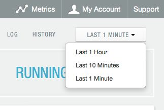

By default, the sampling menu is set at "Last 1 Minute", indicating that the graphs are showing
the last one minute of activity. Be aware that changing the menu to a longer period (such as "Last 
1 Hour") can adversely affect the performance of the Continuuity Reactor and should only be used for short sessions before returning the setting to the default "Last 1 Minute".

The **Reactor** button gives you this starting overview, showing which Applications (*Apps*) are currently
installed, and realtime graphs of *Collect*, *Process*, *Store*, and *Query*.
Each statistic is per unit of time—events per second, bytes (or larger) per second, queries per second—and
are sampled and reported based on the sampling menu in the upper right.

The lower portion of the screen shows all the Apps along with their name, description, and what is happening with each:

- *Collect*, the number of Streams consumed by the Application;

- *Process*, the number of Flows created by the Application;

- *Store*, the number of DataStores used by the Application;

- *Query*, the number of Procedures in the Application; and

- *Busyness*, the percentage of time spent processing events by the Application.

.. _busyness:

Busyness—the percentage of time spent processing events—is a concept that is used extensively in the Reactor Dashboard.

Clicking on the name of an Application will take you to the `App's pane <#application>`__, with details about the application.

:Note: Because of the interconnections in the Dashboard, you can arrive at the same pane by different paths.
       Remember that the left pane buttons will always take you back to the initial summary panes.

The **Resources** button gives a look at what is being used by the Reactor:

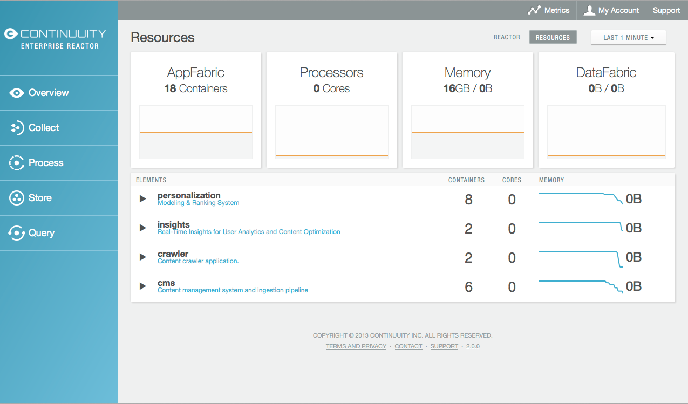

Once again, the top half shows four different elements, all in realtime:
*AppFabric* consumption (in Yarn containers),
*Processors* used (in the number of cores),
*Memory* consumption (total bytes available and used memory), and
*DataFabric* storage (total bytes available and used disk space).

*Containers* refers to the number of Yarn containers; for example, each Flowlet instance uses a single container.

Statistics and graphs are sampled based on the setting of the sampling menu in the upper-right.

The lower half shows the list of deployed applications, their descriptions, along with each app's container, core and memory use in realtime.

The triangles to the left of each application turn to reveal the hierarchy of resources being used by each application's Flows and Flowlets. You can use this tree to drill down into any part of the Reactor.

The footer of each pane gives—below the Continuuity Inc. copyright—five buttons
and the version of the Reactor that you are using.

.. _reset:

The five buttons provide access to the `terms of use <http://www.continuuity.com/terms>`__,
the `privacy policy <http://www.continuuity.com/privacy>`__,
contacting `Continuuity <http://www.continuuity.com/contact-us>`__,
contacting Continuuity support, and *Reset*, for resetting the Reactor.

*Reset* deletes all data and applications from the
Reactor, is irreversible, and returns the Reactor to an original state. The button is only visible and
available if the Reactor has been started with the system property ``enable.unrecoverable.reset`` as ``True``. 

Metrics Explorer
----------------

In the top portion of the `Overview image <#dashboard>`__ you can see the **Metrics** button, which takes you to the *Metrics Explorer:*

.. image:: _images/dashboard/dashboard_18_metrics_explorer1.png
   :width: 600px

Here you can monitor a variety of different statistics for elements of the Reactor.
You add a metric by clicking the *Add* button; it will give you a dialog
where you can specify an element and then pick from a list of appropriate metrics.

.. image:: _images/dashboard/dashboard_20_metrics_explorer3.png
   :width: 200px

As with other Dashboard realtime graphs, you specify the sampling rate through a pop-down menu in the
upper-right. You can *Pause* the sampling to prevent excessive load on the Reactor.

If you move your mouse over the graph, you will get detailed information about the statistics presented:

.. image:: _images/dashboard/dashboard_19_metrics_explorer2.png
   :width: 600px

Services Explorer
-----------------
In the top portion of the `Overview image <#dashboard>`__, to the right of the **Metrics** button is the
**Services** button, which takes you to the *Services Explorer:*

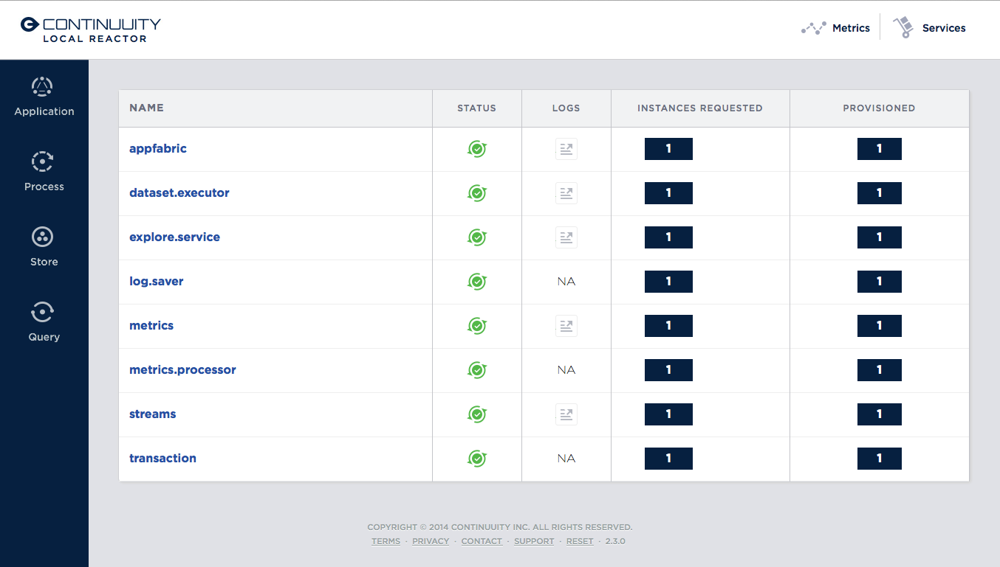

Here you can monitor a variety of different System Services of the Reactor. For each service name, status
is given, if logs are available (and link to them if so), the number of instances requested and
provisioned.

.. _Process:

Process
-------

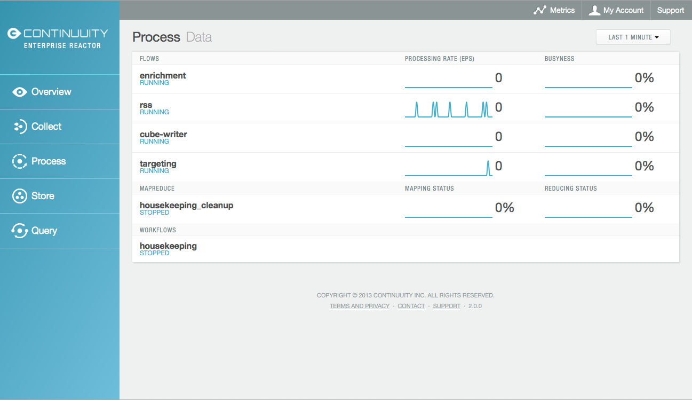

The **Process** pane shows all the
`Flows <#flow>`__,
`MapReduce <#mapreduce>`__ and
`Workflows <#workflow>`__ in the Reactor
with their name and status (either *Running* or *Stopped*).
Each name links to the individual elements detail pane.
Graphs show statistics based on the sampling rate menu setting.

In the case of Flows, it shows the processing rate in events per second and `busyness`_. For MapReduce, it shows the mapping status and the reducing status.

.. _Store:

Store
-----

.. image:: _images/dashboard/dashboard_05_store.png
   :width: 600px

The **Store** pane shows all the Datasets currently specified in the Reactor, along with their name
(a link to the detail pane for the Dataset), type (the Java class), storage in use,
a realtime write-rate graph and the current write rate (bytes per second).

.. _Query:

Query
-----
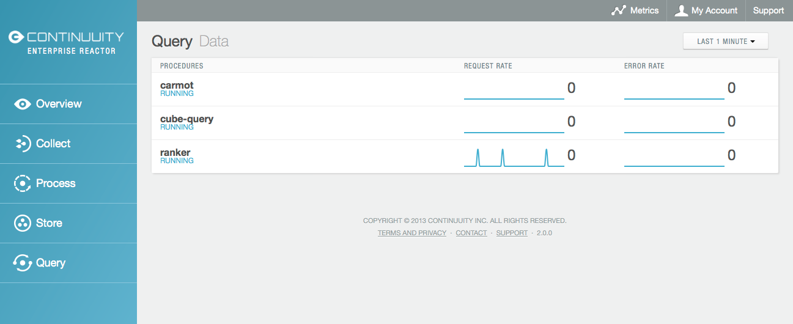

The **Query** pane shows all the Procedures currently specified in the Reactor, along with their name
(a link to the detail pane for the Procedure), status and realtime graphs
of their request and error rates.

.. _application:

Application
-----------

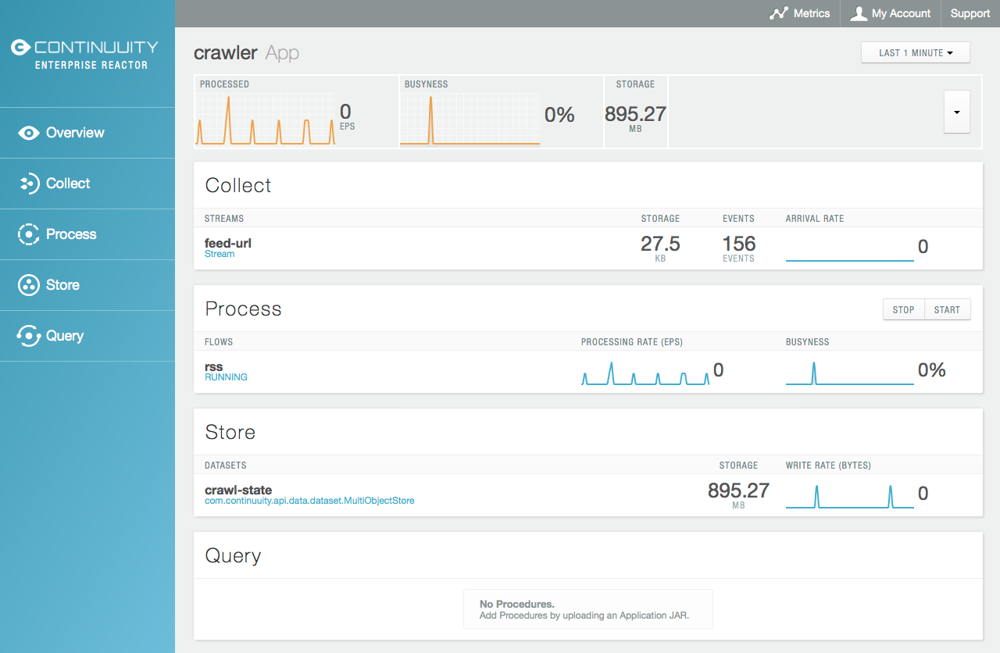

The Application pane shows details for an individual application deployed in the Reactor:

- **Summary graphs:** across the top, left to right, a summary of events per second processed,
  `busyness`_ and storage;

- **Collect:** Streams, with name (a link to details) and summary statistics;

- **Process:** Flows, with name (a link to details), summary statistics,
  and a management button to start and stop all the Flows associated with this app;

- **Store:** Datasets defined by this Application, with name (a link to details)
  and summary statistics; and

- **Query:** Procedures, with name (a link to details) and summary statistics.

Deleting an Application
.......................

The button in the upper right of the pane allows you to delete the current Application:

.. image:: _images/dashboard/dashboard_22_app_crawler_detail_delete.png
   :width: 200px

However, before an Application can be deleted, all Process—Flows and MapReduce Jobs—and Queries (Procedures), must be stopped.
An error message will be given if you attempt to delete an Application with running components.

Note that Streams and Datasets, even though they are specified and created at the time of deployment of the Application,
are persistent and are not deleted when an Application is deleted.

To delete these, the Reactor needs to be reset using the `Reset button <#reset>`__ located at the bottom of each pane.

.. _Stream:

Stream
------

Clicking on a Stream's name will take you to the Stream's pane:

.. image:: _images/dashboard/dashboard_21_stream.png
   :width: 600px

The Stream pane shows the details of the number of events per second currently in the Stream,
the storage and a graph of events over the last sampling period, and a list of all the Flows
that are attached to the Stream, with processing rate and `busyness`_ for each Flow.
Clicking on a Flow name will take you to that `Flow's pane <#flow>`__.

.. _flow:

Flow
----

Each Flow has a management pane, which shows the status, log and history of a Flow.

Flow Status
...........
Start by looking at the status of a Flow:

.. image:: _images/dashboard/dashboard_07_app_crawler_flow_rss.png
   :width: 600px

It shows all of the Streams and Flowlets of the Flow with their connections and icons arranged in a
directed acyclic graph or DAG.

Across the top are two realtime graphs of processing rate and `busyness`_ with
current Flow status and management controls.

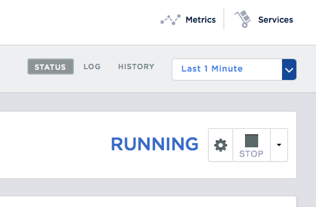

The upper-right portion has a cluster of buttons:

- Status, Log and History buttons that switch you between the panes of the Flow presentation;

- `Sampling menu <#sampling-menu>`__;

- Current status (*Running* or *Paused*);

- Gear icon for runtime configuration settings; and

- Start and stop buttons for the Flow.

The gear icon brings up a dialog for setting the runtime configuration parameters
that have been built into the Flow:

.. image:: _images/dashboard/dashboard_23_app_crawler_detail_config.png
   :width: 400px

The directed acyclic graph (DAG) shows all the Streams and Flowlets:

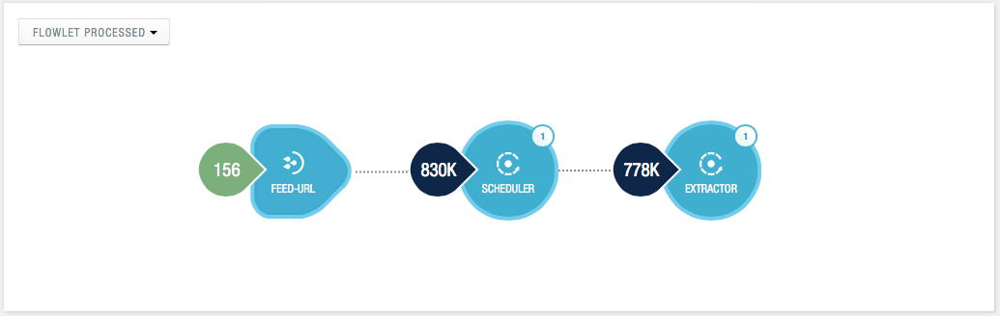

A Stream icon shows the name of the Stream and the number of events processed in the current sampling period:

.. image:: _images/dashboard/dashboard_12_stream_icon.png
   :width: 200px

A Flowlet icon shows the name of the Flowlet, the number of events processed
in the current sampling period,
and—in a small circle in the upper right of the icon—the number of instances of that Flowlet:

.. image:: _images/dashboard/dashboard_13_flowlet_icon.png
   :width: 200px

DAG Icon Dialogs
................

Clicking on an icon in the DAG brings up the icon's dialog. This dialog contains numerous buttons and panes,
and allows you to traverse the DAG completely by selecting appropriate inputs and outputs.

.. image:: _images/dashboard/dashboard_27_dag1.png
   :width: 400px

Here we have clicked on a Flowlet named *counter*, and are seeing the first
(*Inputs*) of three panes in this dialog. On the left is a list of inputs to the Flowlet,
in this case a single input Stream named *parser*, and realtime statistics for the flowlet.

Clicking the name *parser* would take you—without leaving the dialog—backwards on the path
of the DAG, and allow you to traverse towards the start of the path.

If you go all the way to the beginning of the path, you will reach a Stream, and the dialog will change:

.. image:: _images/dashboard/dashboard_30_dag4.png
   :width: 400px

Here, you can inject an Event into the Stream simply by typing and pressing the *Inject* button.
(Notice that once you have reached a Stream, there is no way to leave on the DAG. There
is no list of consumers of the Stream.)

Returning to the `original dialog <#dag-icon-dialogs>`__, clicking the "Processed" button in the center takes you to the second pane of the dialog.

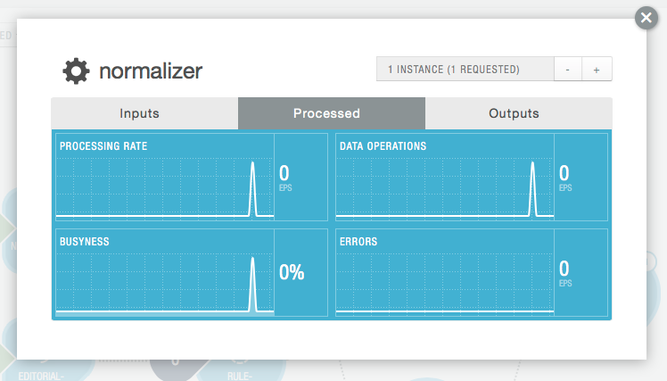

Here are realtime statistics for the processing rate, `busyness`_, data operations and errors.

Clicking the "Outputs" button on the right takes you to the third pane of the dialog.

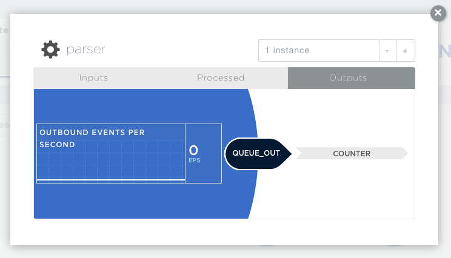

On the right are all the output connections of the Flowlet, if any, and clicking any of
the names would take you to that Flowlet’s input pane, allowing you to traverse the graph
in the direction of data flow. The realtime statistics for the outbound events are shown.

In the upper right portion of this dialog you can set the requested number of instances.
The current number of instances is shown for reference.

.. _log-explorer:

Flow Log Explorer
.................

The Flow Log Explorer pane shows a sample from the logs, with filters for a standard set of filters: *Info*, *Warning*, *Error*, *Debug*, and *Other:*

.. image:: _images/dashboard/dashboard_08_app_crawler_flow_rss_log.png
   :width: 600px

Flow History
................

The Flow History pane shows started and ended events for the Flow and the results:

.. image:: _images/dashboard/dashboard_09b_app_crawler_flow_rss_history.png
   :width: 600px

MapReduce
---------
For a MapReduce, the Mapping and Reducing activity is shown, along with status and management controls for starting, stopping and configuration. Buttons for logs and history, similar to those for 
`Flows <#flow-history>`__ and `Workflows <#workflow>`__, are also available:

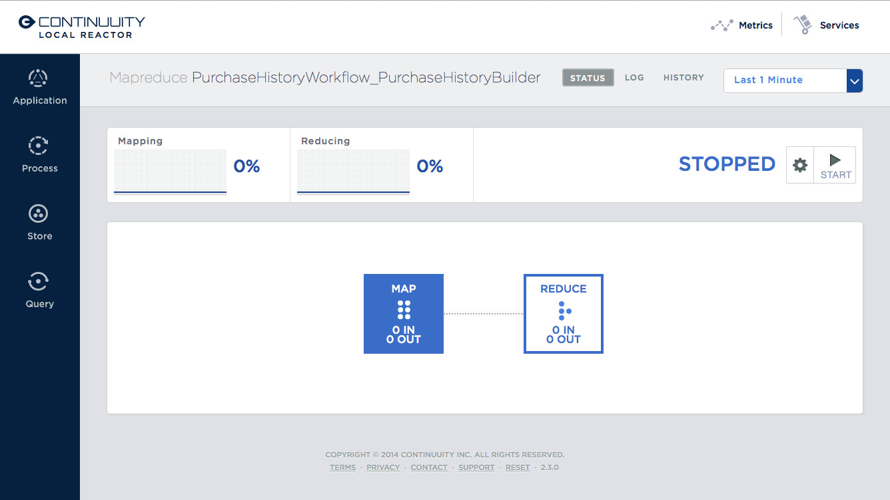

Workflow
--------
For a Workflow, the time until the next scheduled run is shown, along with status and management controls for starting, stopping and configuration.

.. image:: _images/dashboard/dashboard_25_workflow.png
   :width: 600px

Workflow History
................
The Workflow History pane shows started and ended events for the Workflow and the results:

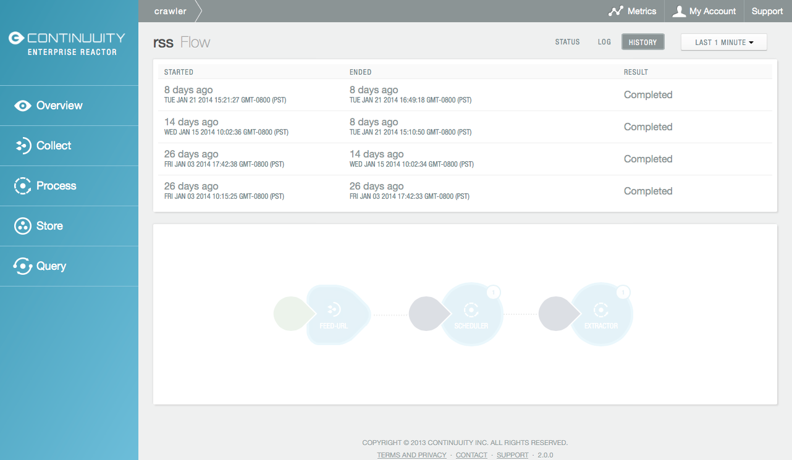

Dataset
-------
For a Dataset, write rate (in both bytes and operations per second), read rate and total storage is shown
along with a list of Flows attached to the Dataset, their processing rate, and `busyness`_.

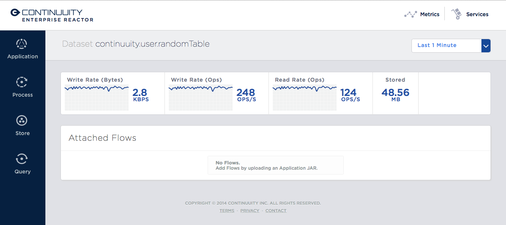

Procedure
---------
For a Procedure, request statistics are shown, along with status and management controls for starting, stopping and configuration. The dialog box shown allows for the sending of requests to Procedures, where
JSON string parameters are passed to the Procedure when calling its methods.

For details of making requests and using Procedures, including configuring the parameters and calling
methods, see the `Continuuity Reactor HTTP REST API Guide <rest.html>`__.

In a fashion similar to the `Flow Log Explorer`_, you can examine the logs associated with each Procedure.

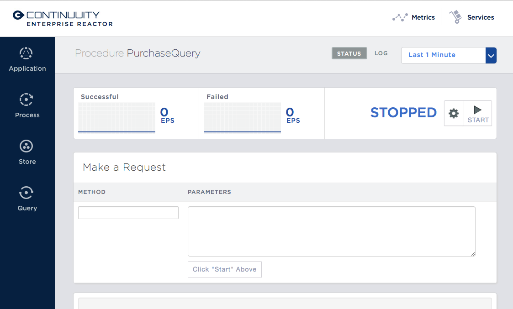

Logging
=======

The Reactor supports logging through standard
`SLF4J (Simple Logging Facade for Java) <http://www.slf4j.org/manual.html>`__ APIs.
For instance, in a Flowlet you can write::

	private static Logger LOG = LoggerFactory.getLogger(WordCounter.class);
	...
	@ProcessInput
	public void process(String line) {
	  LOG.info(this.getContext().getName() + ": Received line " + line);
	  ... // processing
	  LOG.info(this.getContext().getName() + ": Emitting count " + wordCount);
	  output.emit(wordCount);
	}

The log messages emitted by your Application code can be viewed in two different ways.

- Using the `Continuuity Reactor HTTP REST interface <rest.html>`__.
  The `REST interface <rest.html#logging-http-api>`__ details all the available contexts that
  can be called to retrieve different messages.
- All log messages of an Application can be viewed in the Continuuity Reactor Dashboard
  by clicking the *Logs* button in the Flow or Procedure screens.
  This launches the `Log Explorer <#log-explorer>`__.

See the `Flow Log Explorer <#log-explorer>`__ in the
`Continuuity Reactor Dashboard <#dashboard>`__
for details of using it to examine logs in the Reactor.
In a similar fashion, `Procedure Logs <#procedure>`__ can be examined from within the Dashboard.

Metrics
=======

As applications process data, the Continuuity Reactor collects metrics about the application’s behavior and performance. Some of these metrics are the same for every application—how many events are processed, how many data operations are performed—and are thus called system or Reactor metrics.

Other metrics are user-defined or "custom" and differ from application to application.
To add user-defined metrics to your application, read this section in conjunction with the
details on available system metrics in the
`Continuuity Reactor HTTP REST API Guide <rest.html#metrics-http-api>`__.

You embed user-defined metrics in the methods defining the elements of your application.
They will then emit their metrics and you can retrieve them
(along with system metrics) via the `Metrics Explorer`_ in the Dashboard or
via the Continuuity Reactor’s `REST interfaces <rest.html>`__.
The names given to the metrics (such as ``names.longnames`` and ``names.bytes`` as in the example below)
should be composed only of alphanumeric characters.

To add metrics to a Flowlet *NameSaver*::

	public static class NameSaver extends AbstractFlowlet {
	  static final byte[] NAME = { 'n', 'a', 'm', 'e' };

	  @UseDataSet("whom")
	  KeyValueTable whom;
	  Metrics flowletMetrics; // Declare the custom metrics

	  @ProcessInput
	  public void processInput(StreamEvent event) {
	    byte[] name = Bytes.toBytes(event.getBody());
	    if (name != null && name.length > 0) {
	      whom.write(NAME, name);
	    }
	    if (name.length > 10) {
	      flowletMetrics.count("names.longnames", 1);
	    }
	    flowletMetrics.count("names.bytes", name.length);
	  }
	}

An example of user-defined metrics is in the `PageViewAnalytics example <examples/PageViewAnalytics/index.html>`_.

For details on available system metrics, see the `Metrics section <rest.html#metrics-http-api>`__
in the `Continuuity Reactor HTTP REST API Guide <rest.html>`__.

Using Metrics Explorer
----------------------
See the `Metrics Explorer`_ in the `Continuuity Reactor Dashboard <#dashboard>`__
for details of using it to examine and set metrics in the Reactor.

Runtime Arguments
=================

Flows, Procedures, MapReduce and Workflows can receive runtime arguments:

- For Flows and Procedures, runtime arguments are available to the ``initialize`` method in the context.

- For MapReduce, runtime arguments are available to the ``beforeSubmit`` and ``onFinish`` methods in the context.
  The ``beforeSubmit`` method can pass them to the Mappers and Reducers through the job configuration.

- When a Workflow receives runtime arguments, it passes them to each MapReduce in the Workflow.

The ``initialize()`` method in this example accepts a runtime argument for the
``HelloWorld`` Procedure. For example, we can change the greeting from
the default “Hello” to a customized “Good Morning” by passing a runtime argument::

	public static class Greeting extends AbstractProcedure {

	  @UseDataSet("whom")
	  KeyValueTable whom;
	  private String greeting;

	  public void initialize(ProcedureContext context) {
	    Map<String, String> args = context.getRuntimeArguments();
	    greeting = args.get("greeting");
	    if (greeting == null) {
	      greeting = "Hello";
	    }
	  }

	  @Handle("greet")
	  public void greet(ProcedureRequest request,
	                    ProcedureResponder responder) throws Exception {
	    byte[] name = whom.read(NameSaver.NAME);
	    String toGreet = name != null ? new String(name) : "World";
	    responder.sendJson(greeting + " " + toGreet + "!");
	  }
	}

Scaling Instances
=================

Scaling Flowlets
----------------
You can query and set the number of instances executing a given Flowlet
by using the ``instances`` parameter with HTTP GET and PUT methods::

	GET /v2/apps/<app-id>/flows/<flow-id>/flowlets/<flowlet-id>/instances
	PUT /v2/apps/<app-id>/flows/<flow-id>/flowlets/<flowlet-id>/instances

with the arguments as a JSON string in the body::

	{ "instances" : <quantity> }

Where:
	:<app-id>: Name of the application
	:<flow-id>: Name of the Flow
	:<flowlet-id>: Name of the Flowlet
	:<quantity>: Number of instances to be used

Example: Find out the number of instances of the Flowlet *saver* in
the Flow *WhoFlow* of the application *HelloWorld*::

	GET /v2/apps/HelloWorld/flows/WhoFlow/flowlets/saver/instances

Example: Change the number of instances of the Flowlet *saver*
in the Flow *WhoFlow* of the application *HelloWorld*::

	PUT /v2/apps/HelloWorld/flows/WhoFlow/flowlets/saver/instances

with the arguments as a JSON string in the body::

	{ "instances" : 2 }

Scaling Procedures
------------------
In a similar way to `Scaling Flowlets`_, you can query or change the number of instances of a Procedure
by using the ``instances`` parameter with HTTP GET and PUT methods::

	GET /v2/apps/<app-id>/procedures/<procedure-id>/instances
	PUT /v2/apps/<app-id>/procedures/<procedure-id>/instances

with the arguments as a JSON string in the body::

	{ "instances" : <quantity> }

Where:
	:<app-id>: Name of the application
	:<procedure-id>: Name of the Procedure
	:<quantity>: Number of instances to be used

Example: Find out the number of instances of the Procedure *saver*
in the Flow *WhoFlow* of the application *HelloWorld*::

	GET /v2/apps/HelloWorld/flows/WhoFlow/procedure/saver/instances

Example: Change the number of instances of the Procedure *saver*
in the Flow *WhoFlow* of the application *HelloWorld*::

	PUT /v2/apps/HelloWorld/flows/WhoFlow/procedure/saver/instances

with the arguments as a JSON string in the body::

	{ "instances" : 2 }

Where to Go Next
================
Now that you've seen how to operate a Continuuity Reactor, take a look at:

- `Continuuity Reactor HTTP REST API <rest.hml>`__,
  a guide to programming Continuuity Reactor's HTTP interface.
