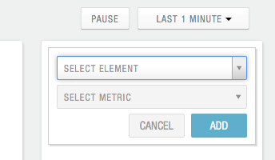
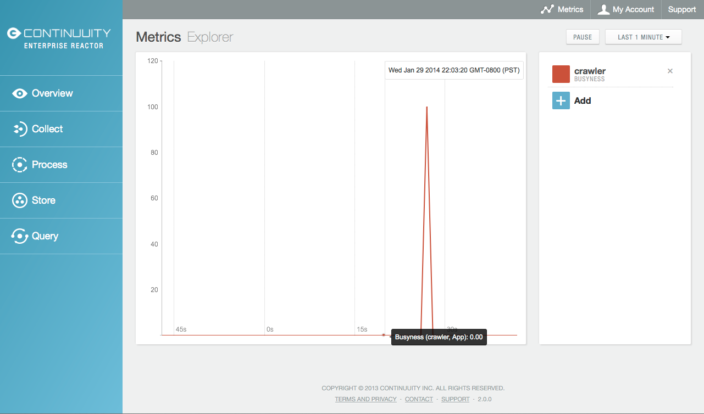
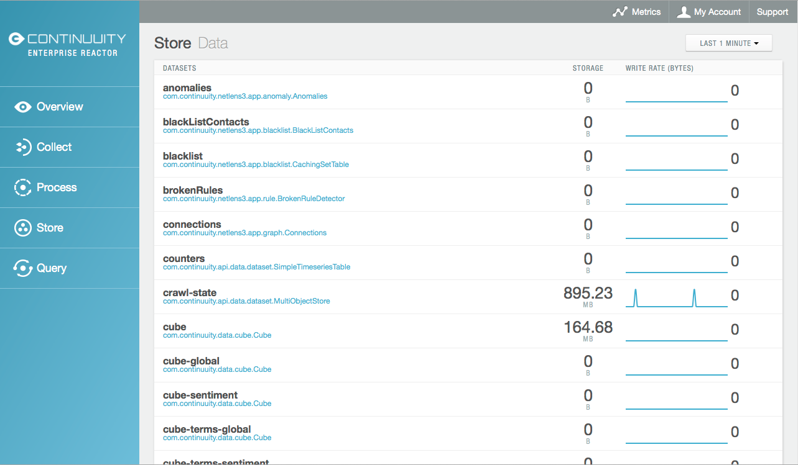
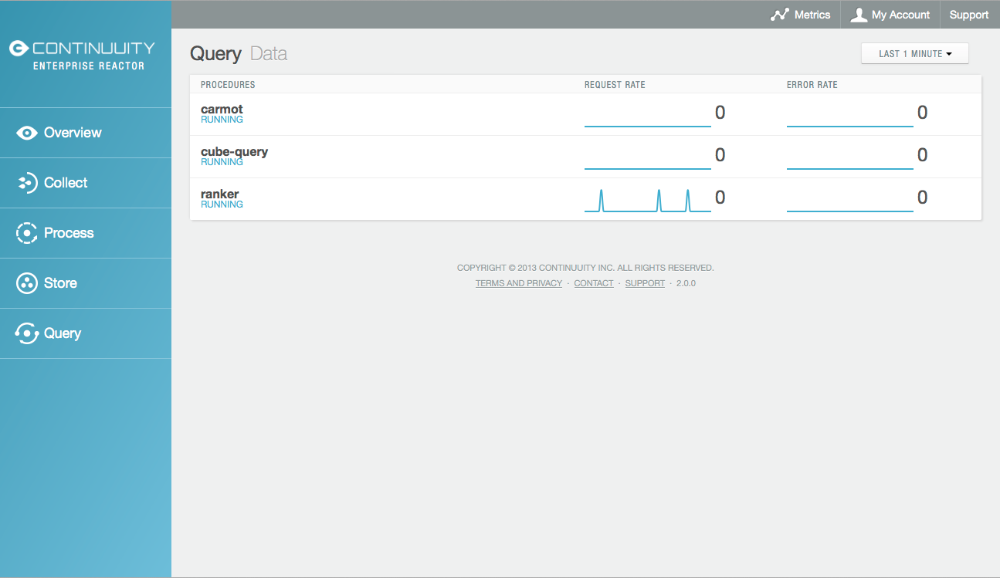
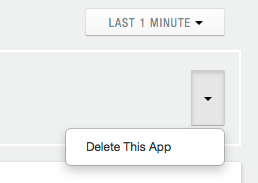
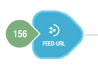

.. :Author: John Jackson
   :Description: Operating a Continuuity Reactor and its Dashboard

===================================
Operating a Continuuity Reactor
===================================

------------------------------
Running Big Data Applications
------------------------------

.. reST Editor: section-numbering::

.. reST Editor: contents::

Putting Continuuity Reactor into Production
===========================================

The Continuuity Reactor can be run in different modes: in-memory mode for unit testing, Local Reactor for local testing, and Hosted or Enterprise Reactor for staging and production. In addition, you have the option to get a free Sandbox Reactor in the cloud.

Regardless of the runtime edition, the Reactor is fully functional and the code you develop never changes. However performance and scale are limited when using in-memory, local mode or Sandbox Reactors.

In-memory Continuuity Reactor
-----------------------------
The in-memory Continuuity Reactor allows you to easily run the Reactor for use in unit tests. In this mode, the underlying Big Data infrastructure is emulated using in-memory data structures and there is no persistence. The Dashboard is not available in this mode.

Local Continuuity Reactor
-------------------------

The Local Continuuity Reactor allows you to run the entire Reactor stack in a single Java Virtual Machine on your local machine and includes a local version of the Reactor Dashboard. The underlying Big Data infrastructure is emulated on top of your local file system. All data is persisted.

See the *Continuuity Reactor Getting Started Guide* included in 
the *Continuuity Reactor SDK* for information on how to start and manage your Local Reactor.

Sandbox Continuuity Reactor
---------------------------
The Sandbox Continuuity Reactor is a free version of the Reactor that is hosted and operated in the cloud. However, it does not provide the same scalability and performance as either the Hosted Reactor or the Enterprise Reactor. The Sandbox Reactor is an excellent way to evaluate all of the features of the “push-to-cloud” functionality of a Hosted Reactor or Enterprise Reactor without charge.

To self-provision a free Sandbox Reactor, login to your account at the 
`Account Home page <https://accounts.continuuity.com>`_. On the *Overview* tab, you can start the provisioning of a Sandbox Continuuity Reactor. 

To use the Reactor, you'll need an API key, which can be found (and generated) on the *Profile* tab of your account.

Hosted and Enterprise Continuuity Reactors
------------------------------------------

The Hosted Continuuity Reactor and the Enterprise Continuuity Reactor both run in fully distributed mode. This includes distributed and highly available deployments of the underlying Hadoop infrastructure in addition to the other system components of the Reactor. Production applications should always be run on either a Hosted Reactor or an Enterprise Reactor.

To learn more about getting your own Hosted Reactor or Enterprise Reactor, see
`Continuuity Products <http://www.continuuity.com/products>`_.

Runtime Arguments
-----------------

Flows, Procedures, MapReduce and Workflows can receive runtime arguments:

- For Flows and Procedures, runtime arguments are available to the initialize method in the context.

- For MapReduce, runtime arguments are available to the ``beforeSubmit`` and ``onFinish`` methods in the context. The ``beforeSubmit`` method can pass them to the mappers and reducers through the job configuration.

- When a Workflow receives runtime arguments it passes them to each MapReduce in the Workflow.

The ``initialize()`` method in this example accepts a runtime argument for the HelloWorld Procedure. For example, we can change the greeting from “Hello”, to “Good Morning” by passing a runtime argument::

	public static class Greeting extends AbstractProcedure {
	
	  @UseDataSet("whom")
	  KeyValueTable whom;
	  private String greeting;
	
	  public void initialize(ProcedureContext context) {
	    Map<String, String> args = context.getRuntimeArguments();
	    greeting = args.get("greeting");
	    if (greeting == null) {
	      greeting = "Hello";
	    }
	  }
	
	  @Handle("greet")
	  public void greet(ProcedureRequest request,
	                    ProcedureResponder responder) throws Exception {
	    byte[] name = whom.read(NameSaver.NAME);
	    String toGreet = name != null ? new String(name) : "World";
	    responder.sendJson(greeting + " " + toGreet + "!");
	  }
	}

Scaling Instances
------------------

[DOCNOTE: FIXME!] Missing information see page 59 current Reactor guide

.. _dashboard:

Continuuity Reactor Dashboard
=============================

Overview
--------

The **Continuuity Reactor Dashboard** is available for deploying, querying and managing the Continuuity Reactor
in all modes of the Reactor except an `in-memory Continuuity Reactor <#in-memory-continuuity-reactor>`_.

.. image:: /doc-assets/_images/dashboard/dashboard_01_overview.png
   :width: 600px

Here is a screen-capture of the Dashboard running on an Enterprise Continuuity Reactor.

Down the left sidebar, underneath the **Continuuity** logo, is the Reactor mode identifier (in this case, *Enterprise Reactor*), followed by five buttons: 
*Overview*, `Collect`_, `Process`_, `Store`_ and `Query`_. These buttons gives you access to Dashboard facilities for managing each of these Reactor elements.

In the upper right portion of the display are two buttons: *Reactor* and *Resources*.

.. _sampling-menu:

To the right of the *Resources* button is the **Sampling Menu**, which appears on almost every pane of the Dashboard.
The menu determines how much data is sampled in the presentation shown on the Dashboard in realtime:

.. image:: doc-assets/_images/dashboard/dashboard_10_app_crawler_detail_menu.png
   :width: 200px

By default, the sampling menu is set at "Last 1 Minute", indicating that the graphs are showing
the last one minute of activity. Be aware that changing the menu to a longer period (such as "Last 1 Hour")
can adversely affect the performance of the Continuuity Reactor and should be used only for short sessions before returning the setting to the default "Last 1 Minute".

**Reactor** gives you this starting overview, showing which Applications (*Apps*) are currently installed,
and realtime graphs of *Collect*, *Process*, *Store* and *Query*. 
Each statistic is per unit of time—events per second, bytes (or larger) per second, queries per second—and
are sampled and reported based on the sampling menu in the upper right. 

The lower portion of the screen shows all the Apps, with their name, description, and what is happening with each:

- *Collect* gives the number of Streams used by the App;

- *Process* gives the number of Flows used by the App;

- *Store* is the number of DataStores used by the App;

- *Query* is the number of Procedures in the App; and

- *Busyness* is the percentage of busyness of the App.

Clicking on the name of an App will take you to the `App's pane <#app-pane>`_, with details about the application.

:Note: Because of the interconnections in the Dashboard, you can arrive at the same pane by different paths.
       Remember that the left pane buttons will always take you back to the initial summary panes.

**Resources** gives a look at what is being used by the Reactor:

.. image:: doc-assets/_images/dashboard/dashboard_02_overview_resources.png
   :width: 600px

Once again, the top half shows four different elements, all in real-time:
*AppFabric* consumption (in Yarn containers), 
*Processors* used (in the number of cores),
*Memory* consumption (total bytes available and used memory), and
*DataFabric* storage (total bytes available and used disk space).

*Containers* refers to the number of Yarn containers; for example, each flowlet instance uses a single container.

Statistics and graphs are sampled based on the setting of the sampling menu in the upper-right.

The lower half shows the list of deployed applications, their descriptions, along with each app's container, core and memory use in real-time.

The triangles to the left of each application turn to reveal the hierarchy of resources being used by each applications flows and flowlets. You can use this tree to drill down into any part of the Reactor.

Metrics Explorer
----------------

In the top portion of the `Overview image <#dashboard>`_ you can see the **Metrics** button, which takes you to the *Metrics Explorer*:

.. image:: doc-assets/_images/dashboard/dashboard_18_metrics_explorer1.png
   :width: 600px

Here you can monitor a variety of different statistics for elements of the Reactor.
You add a metric by clicking the *Add* button; it will give you a dialog
where you can specify an element and then pick from a list of appropriate metrics.

As with other Dashboard real-time graphs, you specify the sampling rate through a pop-down menu in the upper-right.
You can *Pause* the sampling to prevent excessive load on the Reactor.

If you move your mouse over the graph, you will get detailed information about the statistics presented:

.. _Collect:

Collect
-------
.. image:: doc-assets/_images/dashboard/dashboard_03_collect.png
   :width: 600px

The **Collect** pane shows all the Streams collecting data and their details: name, storage, number of events and the arrival rate, with a graph showing arrivals based on the sampling rate menu setting.

.. _Stream:

Clicking on a Stream's name will take you to the Stream's pane:

.. image:: doc-assets/_images/dashboard/dashboard_21_stream.png
   :width: 600px

The Stream pane shows the details of the number of events per second currently in the Stream, the storage and a graph of events over the last sampling period, and a list of all the Flows that are attached to the Stream, with processing rate and busyness for each Flow. Clicking on a Flow name will take you to that `Flow's pane <#Flow>`_.

.. _Process:

Process
-------

.. image:: doc-assets/_images/dashboard/dashboard_04_process.png
   :width: 600px

The **Process** pane shows all the 
`Flows <#flow>`_, 
`MapReduce <#mapreduce>`_ and 
`Workflows <#workflow>`_ in the Reactor
with their name and status (either *running* or *stopped*).
Each name links to the individual elements detail pane.
Graphs show statistics based on the sampling rate menu setting.

In the case of Flows, it shows the processing rate in events per second and busyness. For MapReduce, it shows the mapping status and the reducing status.

.. _Store:

Store
-----

The **Store** pane shows all the DataSets currently specified in the Reactor, along with their name
(a link to the detail pane for the DataSet), type (the Java class), storage in use,
current write rate (bytes) and a real-time write-rate graph.

.. [DOCNOTE: FIXME!] current write rate lacking time

.. _Query:

Query
-----

The **Query** pane shows all the Procedures currently specified in the Reactor, along with their name
(a link to the detail pane for the Procedure), status and real-time graphs
of their request and error rates.

.. _app-pane:

App
---

.. image:: doc-assets/_images/dashboard/dashboard_14_app_crawler.png
   :width: 600px

The App pane shows details for an individual application deployed in the Reactor:

- **Summary graphs**: across the top, left to right, a summary of events per second processed, busyness and storage;

- **Collect**: Streams, with name (a link to details) and summary statistics;

- **Process**: Flows, with name (a link to details), summary statistics, 
  and a management button to start and stop all the Flows associated with this app;

- **Store**: Datasets defined by this App, with name (a link to details) and summary statistics; and

- **Query**: Procedures, with name (a link to details) and summary statistics.

The button in the upper right of the pane allows you to delete the current App:

.. [DOCNOTE: FIXME!] Provide details on deleting applications

.. _flow:

Flow
------

Each Flow has a management pane, which shows the status, log and history of a flow.

Flow Status
...........
Start by looking at the status of a Flow:

.. image:: doc-assets/_images/dashboard/dashboard_07_app_crawler_flow_rss.png
   :width: 600px

It that shows all the Streams, and Flowlets, connections, and icons arranged in a
directed acyclic graph or DAG.

Across the top are two real-time graphs of processing rate and busyness with
current flow status and management controls.

.. image:: doc-assets/_images/dashboard/dashboard_11_app_crawler_detail.png
   :width: 200px

The upper-right portion has a cluster of buttons: 

- Status, Log and History buttons that switch you between the panes of the Flow presentation;

- `Sampling menu <#sampling-menu>`_;

- Current status (*Running* or *Paused* [DOCNOTE: FIXME! what are they?]);

- Gear icon for runtime configuration settings; and

- Start and stop buttons for the Flow.

The gear icon brings up a dialog for setting the runtime configuration parameters
that have been built into the Flow:

.. image:: doc-assets/_images/dashboard/dashboard_23_app_crawler_detail_config.png
   :width: 400px

The directed acyclic graph (DAG) shows all the Streams and Flowlets:

.. image:: doc-assets/_images/dashboard/dashboard_24_app_crawler_detail_dag.png
   :width: 600px

A Stream icon shows the name of the Stream and the number of events processed in the current sampling period:

A Flowlet icon shows the name of the Flowlet, the number of events processed  in the current sampling period,
and—in a small circle in the upper right of the icon—the number of instances of that Flowlet:

.. image:: doc-assets/_images/dashboard/dashboard_13_flowlet_icon.png
   :width: 200px

DAG Icons
.........

Clicking on a icon in the DAG brings up the dialog.

..[DOCNOTE: FIXME!] add flowlet snapshots, show dialog, show how it works back to the other items in the DAG. 

Flow Log
........

The Flow Log pane shows a sample from the logs, with filters for a standard set of filters: *info*, *warning*, *error*, *debug*, and *others*:

.. image:: doc-assets/_images/dashboard/dashboard_08_app_crawler_flow_rss_log.png
   :width: 600px

Flow History
............

The Flow History pane shows a starting and stopping events for the FLow and the results:

.. image:: doc-assets/_images/dashboard/dashboard_09_app_crawler_flow_rss_history.png
   :width: 600px

MapReduce
---------

[DOCNOTE: FIXME!] Add a MapReduce: need to find one

Workflow
--------

[DOCNOTE: FIXME!] Add a Workflow: need to find one

DataSet
-------

.. image:: doc-assets/_images/dashboard/dashboard_15_dataset.png
   :width: 600px

Procedure
---------

.. image:: doc-assets/_images/dashboard/dashboard_17_procedure_ranker.png
   :width: 600px

Logging
=======

The Reactor supports logging through standard
`SLF4J (Simple Logging Facade for Java) <http://www.slf4j.org/manual.html>`_ APIs. 
For instance, in a Flowlet you can write::

	private static Logger LOG = LoggerFactory.getLogger(WordCounter.class);
	...
	@ProcessInput
	public void process(String line) {
	  LOG.info(this.getContext().getName() + ": Received line " + line);
	  ... // processing
	  LOG.info(this.getContext().getName() + ": Emitting count " + wordCount);
	  output.emit(wordCount);
	}

The log messages emitted by your Application code can be viewed in two different ways:

- All log messages of an Application can be viewed in the Continuuity Reactor Dashboard
  by clicking the *Logs* button in the Flow or Procedure screens.
- Using the `Continuuity Reactor HTTP REST interface <rest.html>`_ .

.. include:: includes/footer.rst
