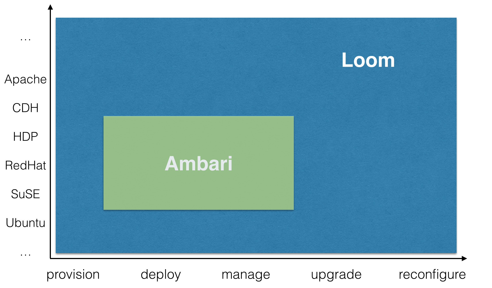

:orphan:

.. _faq_toplevel:
.. include:: /toplevel-links.rst

====================================
General
====================================

What are the differences between Loom and Ambari/Savannah?
----------------------------------------------------------

What are the differences between Loom and Amazon EMR?
----------------------------------------------------------------
Amazon EMR provides a subset of Hadoop services (Hive, Pig, HBase, and MapReduce) and manages 
jobs and workflows on top of those services.  Loom is a software agnostic, generic system for 
creating clusters of any layout and any type.  Being software agnostic, Loom has no support
for managing jobs on clusters, as its focus is on cluster creation and management. 

Does Loom work with Ambari?
-------------------------------------------------
Loom is designed to be able to support importing the instance of template as Apache Ambari
Blueprint once it's available in Ambari. Please refer to 
`AMBARI-1783 <https://issues.apache.org/jira/browse/AMBARI-1783>`_ for more information.

How long has Loom been used in a production enviroment and where is it being used?
----------------------------------------------------------------------------------
Previous version of Loom has been running in production since Feb 2012 at Continuuity.

Is Loom designed only for provisioning compute and storage?
-----------------------------------------------------------
It's a generic provisioning coordination system and can be used for provisioning more than 
just compute and storage. It's not been tested but the architecture supports provisioning 
and configuring of other resources. Please refer to :doc:`Administration </guide/admin/index>` 
for more details of you can write plugins for provisioner to support different Provider
and Automator for provisioning and configuring different resources.

What is the recommended setup for Loom in terms of hardware and configuration?
------------------------------------------------------------------------------
We recommend the following :doc:`deployment </guide/recommended-deployment>` for production envionment that includes
HA for  persistence store, multiple nodes for zookeeper, HA proxy for traffic distribution across UI and provisioners.
