.. _guide_admin_ui:

.. index::
   single: User Interface
=============================
Administration User Interface
=============================

.. include:: /guide/admin/admin-links.rst

This guide describes the different interfaces and functions of the administrator UI.

Each screen in the administration interface provides ways to create and edit settings for cluster provisioning.

Login as an Administrator
=========================

The Loom Admin UI can be accessed at ``http://<loom-host>:<loom-ui-port>/``. Login using the admin credentials to access the administrator interface.
The default administrator login credentials are 'admin,' for both username and password.

.. figure:: /guide/quickstart/quickstart-screenshot-1.png
    :align: center
    :width: 800px
    :alt: Admin login screen
    :figclass: align-center

The Overview Screen
===================

An administrator is redirected to the overview screen after log in. This home page displays all the cluster configuration
elements that have already been defined. (However, upon logging for the first time, this page will be empty).
Clicking on the name of each element allows an administrator to enter its management page, where they can examine the element in detail and modify its configuration.

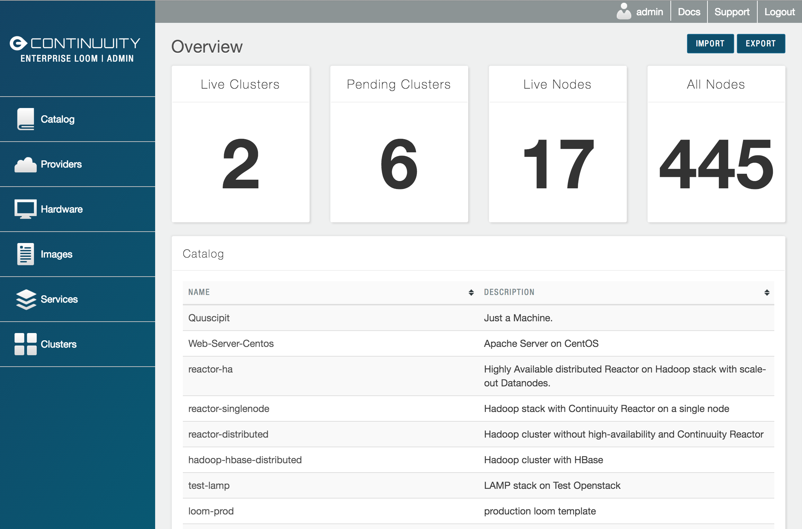

.. _provision-templates:
Managing Cluster Templates
============================

Loom templates allow the administrator to define blueprints describing how different types of clusters should be laid out.
For example, there may be a template for Hadoop clusters, a template for LAMP clusters, a template for Solr clusters, etc. 
Templates contain enough information that an end user only needs to specify a template and a number of machines to create a cluster. 
This is done by first describing the set of services, hardware types, and image types that a cluster is compatible with. 
Next, default values for provider, services, and configuration are given, with optional defaults for cluster-wide hardware and image type. 
Finally, a set of constraints are defined that describe how services, hardware, and images should be placed on a cluster.

The Catalog Home Screen
^^^^^^^^^^^^^^^^^^^^^^^

The Catalog screen lists the existing templates that the administrator has created. The page also provides a way
to delete, view, and edit each template.

Clicking on a template name will take you to the 'Edit template' page, where you can view or edit template details.

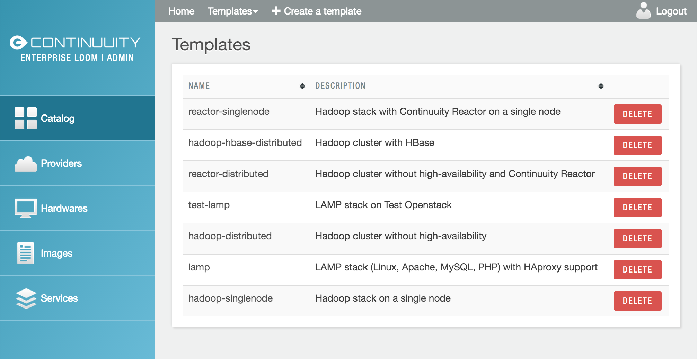

Creating a Template
^^^^^^^^^^^^^^^^^^^

To create a new **Template**, click on 'Create a template' on the top-left of the home screen. This action will display the Templates' creation page.
In addition to specifying a name and description for the template, the initialization screen allows you to set parameters
for the 'Lease Duration'. This field allows an administrator to specify the initial and maximum lease durations to be applied
to clusters created using this template, as well as a step size for use when extending a cluster lease.

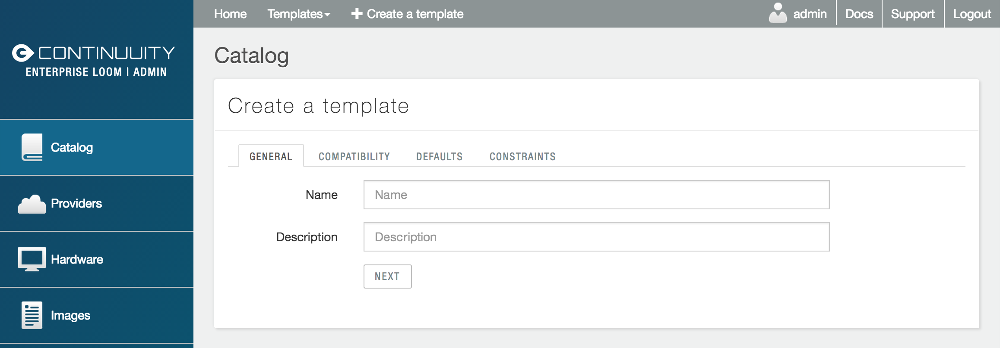

The **Compatibility** tab defines sets of services, hardware types, and image types that are allowed for use in a cluster.
Services not in the list specified in this section cannot be placed on the cluster.
Loom will not automatically pull in service dependencies, so the full set of compatible services must be defined.
Hardware types not in the list specified in this section cannot be used in the cluster. Similarly, image types 
not in the list specified in this section cannot to be used in the cluster.
Services, hardware types, and image types can all be added by selecting an element from the drop down menu and clicking the 
button next to the box. To remove an element, press the '-' next to the element you want removed. 

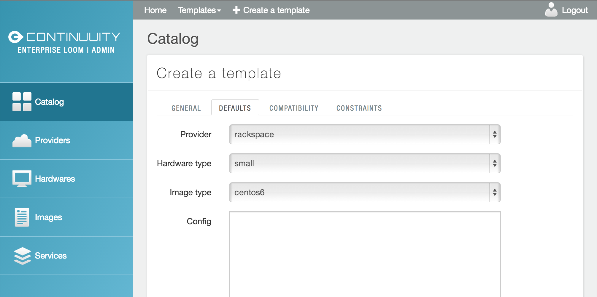

The **Defaults** tab screen defines the default services and provider, and optionally a cluster wide image type
or hardware type, to use when a cluster is initially created. The provider, hardware type, and image type can be
selected from the drop down menu among those defined in their corresponding sections. The 'Config' field allows
the admin to specify cluster configuration as JSON-formatted input.  Generally, all service configuration settings
should go in this section. Configuration is consumed as is, except for some macros which allow you to reference 
other nodes in the cluster (for more information, see :doc:`Macros </guide/admin/macros>`).

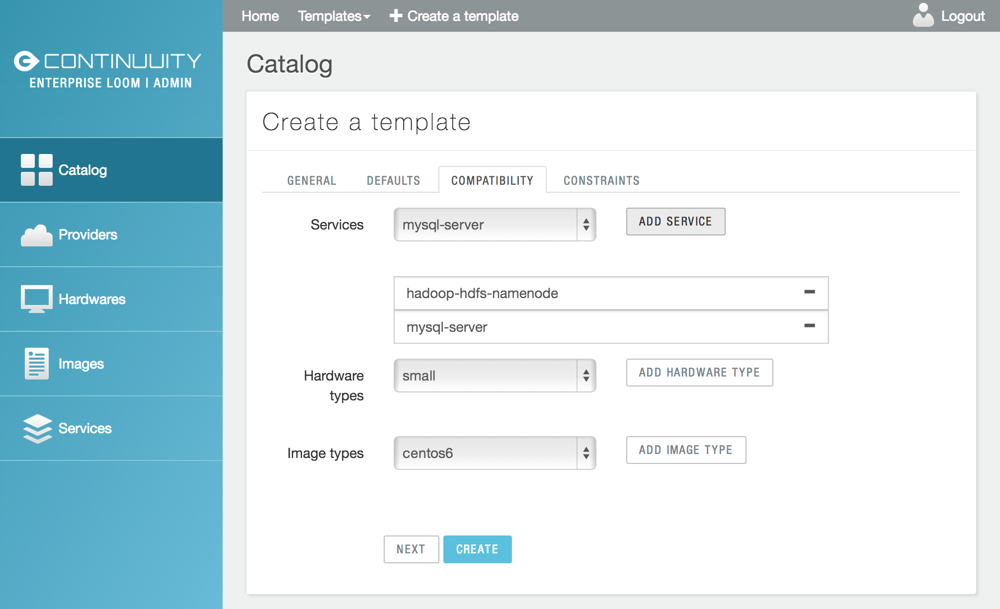

Multiple services can be placed on a cluster by default. Select a service from the drop down menu and click
'Add service' to add. To remove a service, press the '-' next to the service you want removed.
Everything in this section can be overwritten by the user during cluster creation time, though it is likely that 
only advanced users will want to do so. (In future releases, we'll have more granular access control capabilities so
that novice users may not change default configurations.)

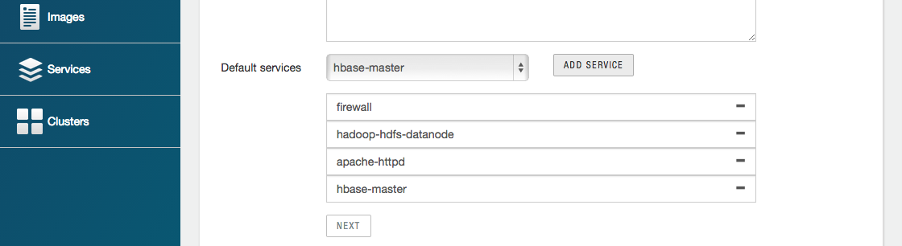

The **Constraints** tab allows the administrator to set rules for the sets of services that are installed on a cluster.
The 'Must coexist' is used to specify services that must be placed together on the same node. For example, in a Hadoop
cluster, you generally want datanodes, regionservers, and nodemanagers to all be placed together, so
you would put all 3 services in the same 'Must coexist' constraint. The 'Must coexist' constraints are not transitive. 
If there is one constraint saying service A must coexist with service B, and another constraint saying service B must
coexist with service C, this does not mean that service A must coexist with service C. Loom was designed to
prevent unintended links between services, especially as the number of 'Must coexist' constraints increase. If a 'Must
coexist' rule contains a service that is not on the cluster, it is shrunk to ignore the service not on the
cluster. For example, your template may be compatible with datanodes, nodemanagers, and regionservers. However, by
default you only put datanodes and nodemanagers on the cluster. At cluster creation time, a constraint stating that datanodes, nodemanagers,
and regionservers must coexist on the same node will get transformed into a constraint that just says datanodes and
nodemanagers must coexist on the same node.

The other type of layout constraint are 'Can't coexist' constraints, which are also given as an array of arrays. Each
inner array is a set of services that cannot all coexist together on the same node. For example, in a Hadoop cluster,
you generally do not want your namenode to be on the same node as a datanode. Specifying more than 2 services in a
'Can't coexist' rule means the entire set cannot exist on the same node. For example, if there is a constraint that
service A, service B, and service C 'Can't coexist,' service A and service B can still coexist on the same node. Though
supported, this can be confusing, so the best practice is to keep 'Can't coexist' constraints binary. Anything not mentioned
in the must or can't coexist constraints are allowed.

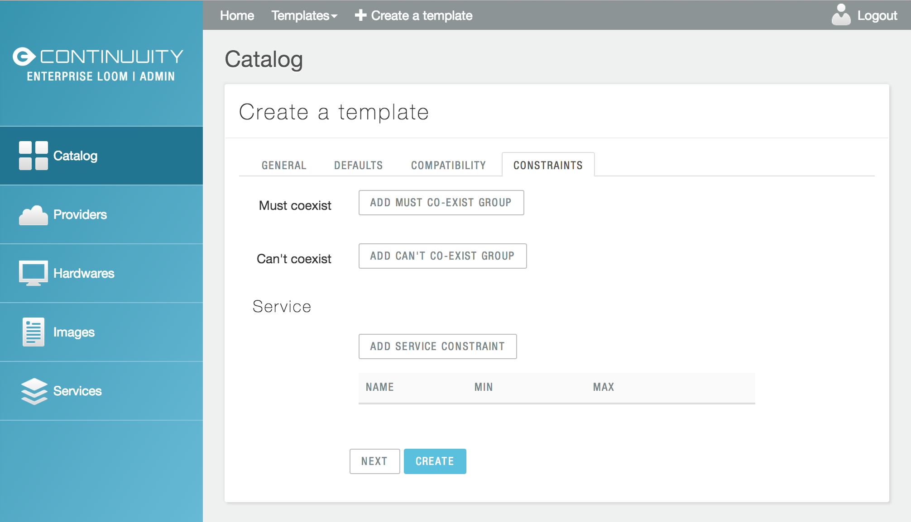

To create a constraint, click on either 'Add must co-exist group' or 'Add can't co-exist group', select a
service you want to add to the group and select 'Add Service'. Services can be removed from the group by pressing the
'-' next to the name of the service. Once all the required services are added, select 'Add Group'.

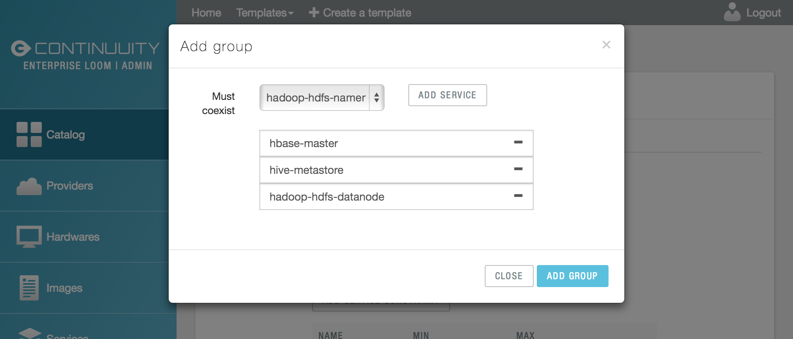

|

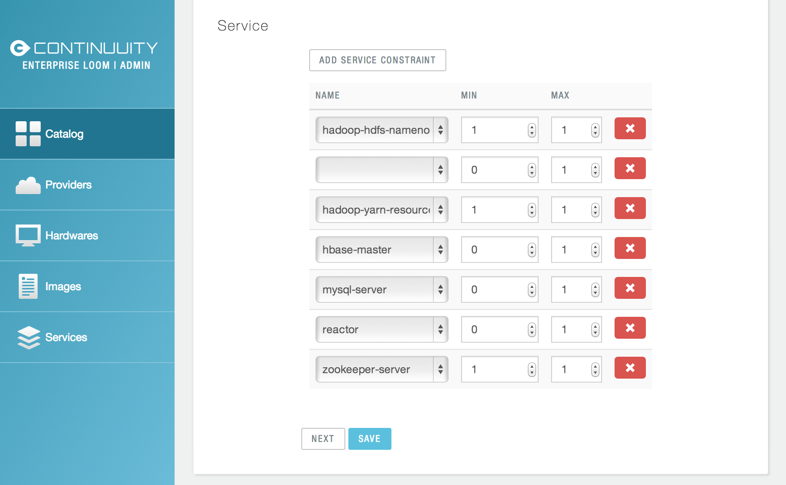

Additionally, administrators can limit the number of instances of each service. An example of this is to limit the
number of instances of HDFS name node and Yarn resource manager to one in a Hadoop cluster. To do so, click 'Add
service constraint', choose the item you want to limit from the drop down list, and set the maximum and minimum
number of instances permitted. The constraint itself or the number of instances can be changed from the list of
service constraints. A service constraint can also specify a set of hardware types that a service is allowed to be
placed on an instance. Any node with that service must use one of the hardware types in the array. If nothing is given, the
service can go on a node with any type of hardware. Similarly, a service constraint can specify a set of image types
that it is allowed to be placed on an instance. Any node with that service must use one of the image types in the array. If
nothing is given, the service can go on a node with any type of image.

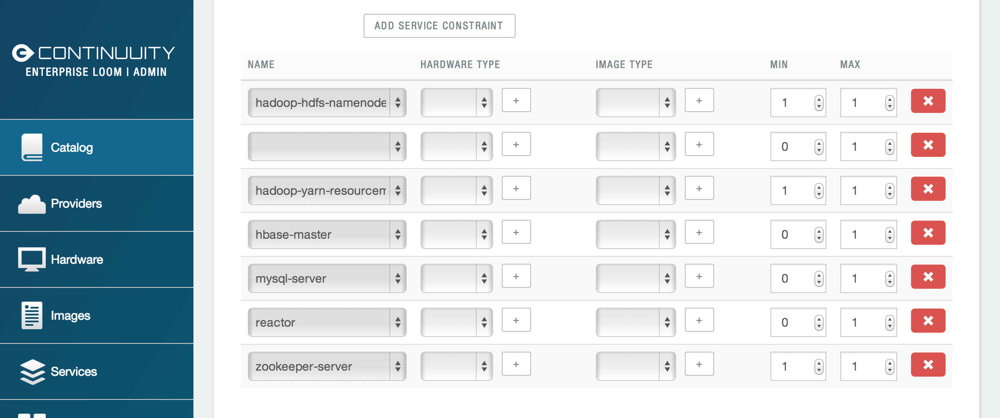

|

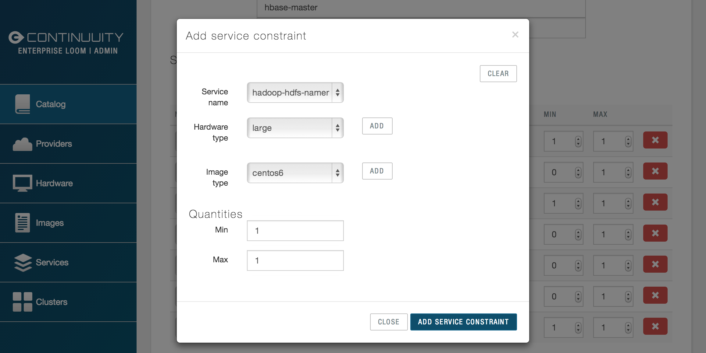

To add the new setting to the list of templates, click 'Create'.

Managing Existing Templates
^^^^^^^^^^^^^^^^^^^^^^^^^^^^
A user can view/edit a template by clicking on the template's name on the Home screen, or selecting 'Templates'
**->** <name of the template> on the top-left of the page.

The edit template page provides a similar interface to the 'Create a template' screen. Current settings for the
template can be modified and deleted accordingly.

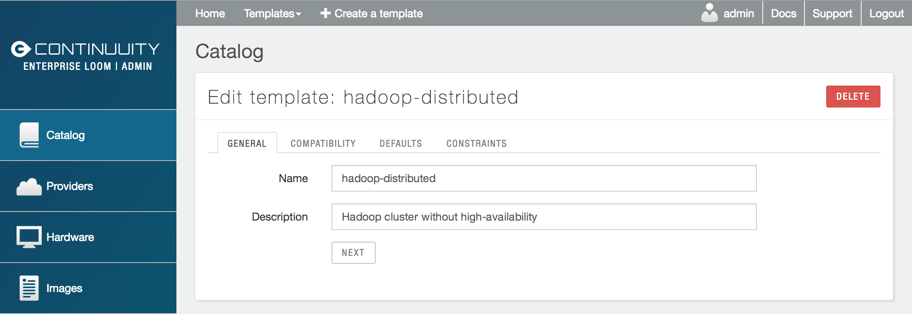

.. _infrastructure-providers:
Managing Infrastructure Providers
=================================

Loom provides functionality to provision servers across a number of infrastructure providers, including but not
limited to Amazon Web Services, Rackspace, and Joyent. Loom also supports OpenStack to enable integration with
custom infrastructures for both public and private cloud.

The Providers interface allows administrators to add available cloud providers and manage their credentials.

The Providers Home Screen
^^^^^^^^^^^^^^^^^^^^^^^^^

The Providers home screen lists the existing providers currently supported by the administrators. The page also
provides a way to delete, view, and edit each provider.

Clicking on a provider's name will take you to the 'Edit provider' page for viewing provider details and
editing provider configurations.

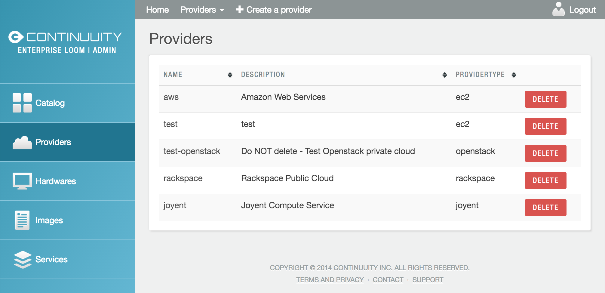

Creating a Provider
^^^^^^^^^^^^^^^^^^^

Click on 'Create a provider' on the top-left of the home screen to go to the Providers creation
page. On this page, administrators can configure the Name, Description, and Provider type of the service.

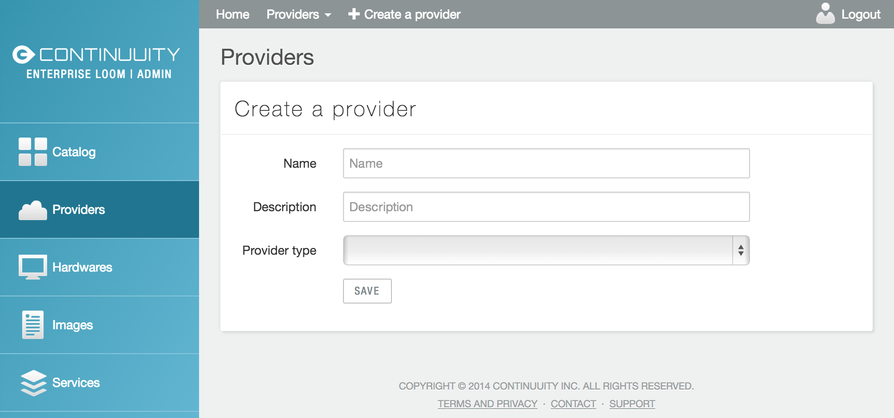

When selecting a Provider type, additional parameters will appear on a provider specific screen, where an administrator can
manage its credentials.

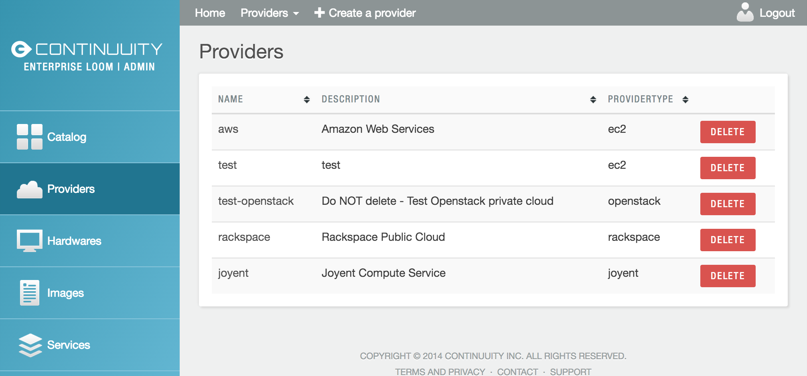

To add the new configuration to the list of providers, click 'Create'.

.. _manage-existing-providers:
Managing Existing Providers
^^^^^^^^^^^^^^^^^^^^^^^^^^^

A user can view/edit a provider by clicking on the provider's name on the Home screen, or selecting 'Providers' **->**
<name of the provider> on the top-left of the page.

The provider edit page renders a similar interface to the 'Create a provider' screen. Current settings for the
provider can be modified and deleted accordingly.

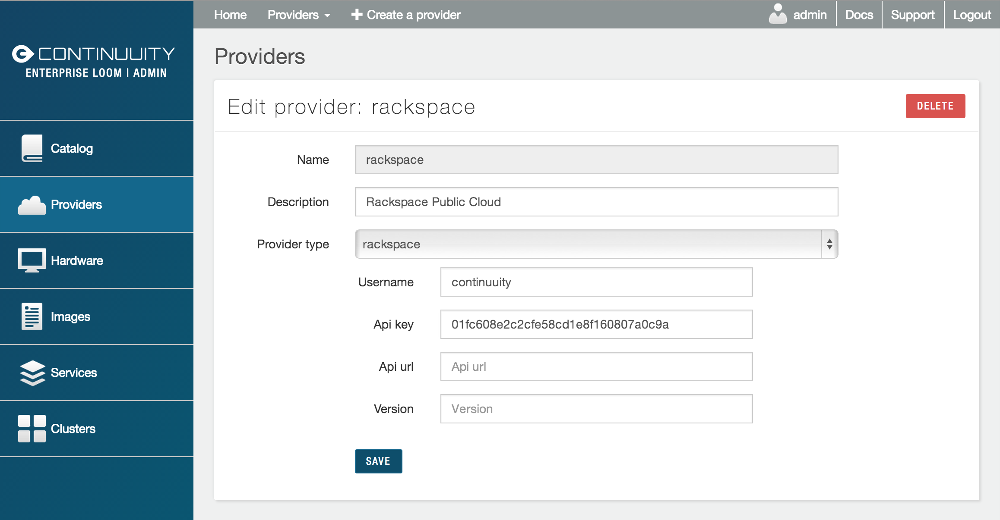

.. _hardware-configs:
Managing Hardware Configurations
================================

The hardware types section allows administrators to explicitly manage the hardware configurations available to users and
how the configurations are specified in each provider.

The Hardware Home Screen
^^^^^^^^^^^^^^^^^^^^^^^^

The hardware home screen lists the hardware types currently managed by the administrators. The page
also provides operations to delete and view/edit each hardware type.

Clicking on an item's name will take you to the 'Edit hardware type' page for viewing hardware type details
and for editing its configurations.

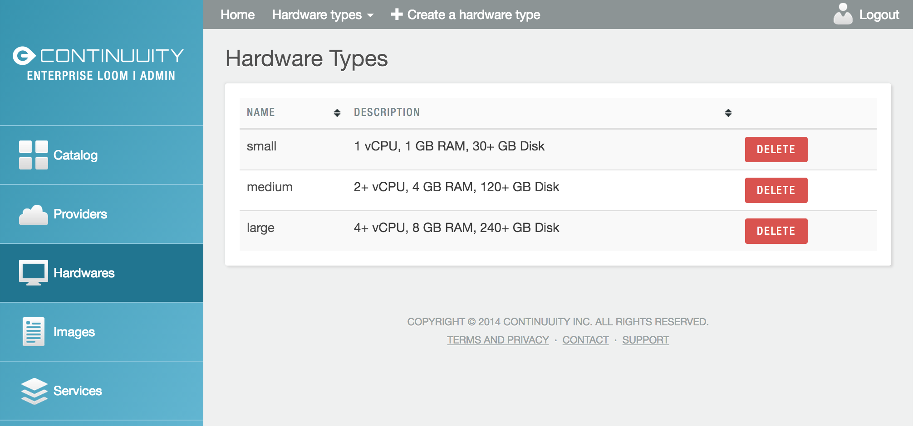

Creating a Hardware Configuration
^^^^^^^^^^^^^^^^^^^^^^^^^^^^^^^^^

Click on 'Create a hardware type' on the top-left of the home screen to go to the Hardware
types creation page.

On this page, administrators can configure the Name, Description, and how the hardware setting is specified on a provider.
The 'Providers' section define how the hardware setting maps to the identifiers used on each of the cloud infrastructure providers. 
Note that hardware settings on the provider side are specified using virtual hardware templates called flavors.

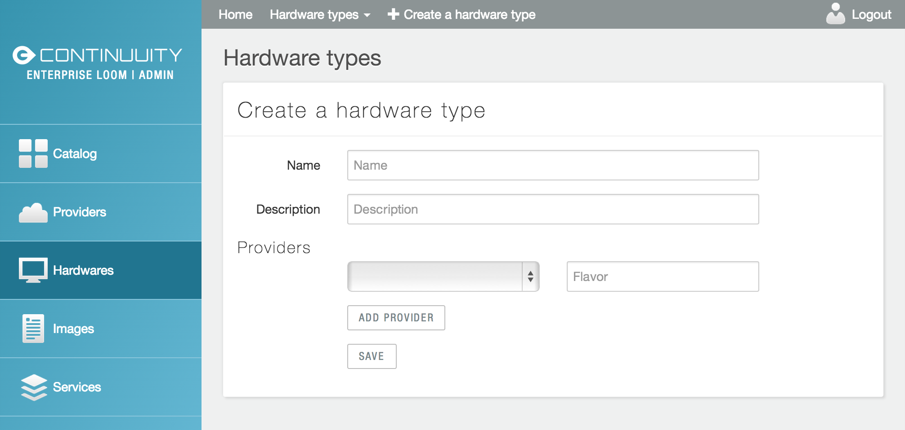

Values specified in 'Providers' must map to a valid flavor on the corresponding provider. Below is a list of flavor
identifier codes commonly used by providers.

        `OpenStack <http://docs.openstack.org/trunk/openstack-ops/content/flavors.html>`_

        `Amazon Web Services <http://aws.amazon.com/ec2/instance-types/index.html>`_

        `Rackspace <http://docs.rackspace.com/servers/api/v2/cs-releasenotes/content/supported_flavors.html>`_

        `Joyent <http://serverbear.com/9798/joyent>`_

As these codes are subject to change, please ensure the values reflect correctly with the provider's system.

To add the new configuration to the list of hardware types, click 'Create'.

Managing Existing Hardware Configurations
^^^^^^^^^^^^^^^^^^^^^^^^^^^^^^^^^^^^^^^^^

A user can view/edit a hardware type by clicking on the hardware type's name on the Home screen or by selecting
'Hardware types' **->** <name of the hardware type> on the top-left of the page.

The edit hardware type page provides a similar interface to the 'Create a hardware type' screen. Current
settings for the hardware type can be modified and deleted accordingly.

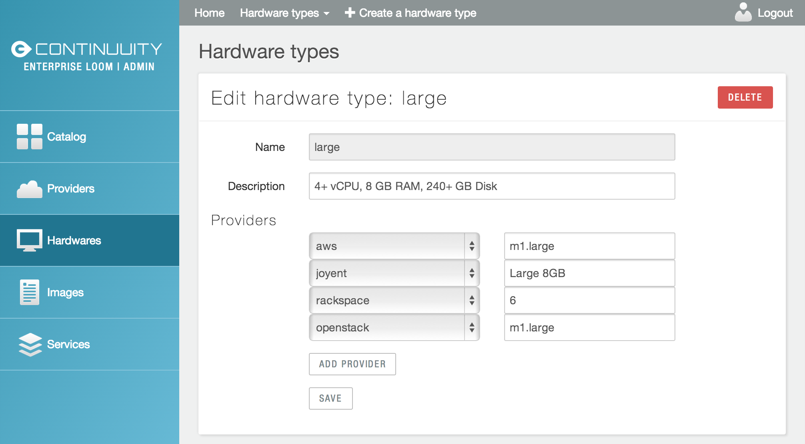

.. _image-types:
Managing Image Types
====================

The image types interface allows administrators to configure the options for basic disk images on the clusters
provisioned by end users.

The Images Home Screen
^^^^^^^^^^^^^^^^^^^^^^
The images home screen lists the image types currently configured by the administrators. The page also provides delete and view/edit 
operations on each image type.

Clicking on an item's name will take you to the 'Edit image type' page for viewing more image type details and
editing its configurations.

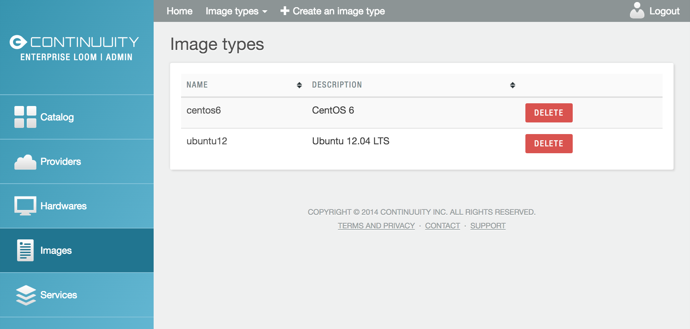

Creating an Image Type
^^^^^^^^^^^^^^^^^^^^^^
Click on 'Create an image type' on the top-left of the home screen to go to the Image types creation page.

On this page, administrators can configure the Name, Description, and how the image type is specified on a provider. The
'Providers' section can be used to define how the image type maps to the identifiers used on each provider.

Image settings are specified by a unique ID code on different providers. Values specified in
'Providers' must map to a valid image on the corresponding provider. As the list may change over time,
the most current list of IDs for images should be queried directly from the provider.

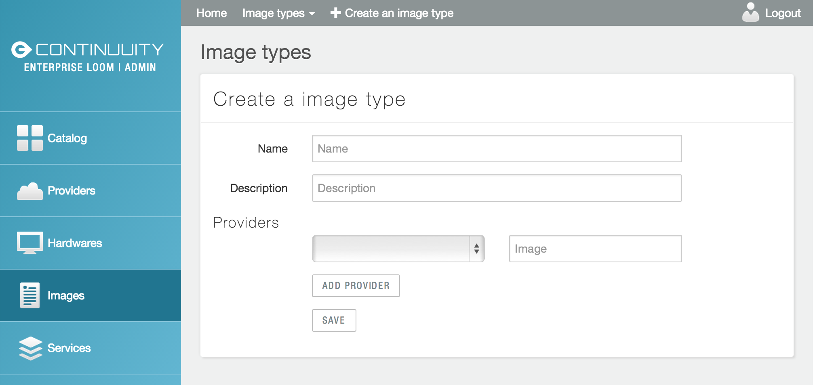

To add the new configuration to the list of image types, click 'Create'.

Managing Existing Images
^^^^^^^^^^^^^^^^^^^^^^^^

An administrator can view/edit an image type by clicking on the image type's name on the Home screen or by selecting 'Image types'
**->** <name of the image type> on the top-left of the page.

The edit image type page provides a similar interface to the 'Create an image type' screen. Current settings for the
image type can be modified and deleted accordingly.

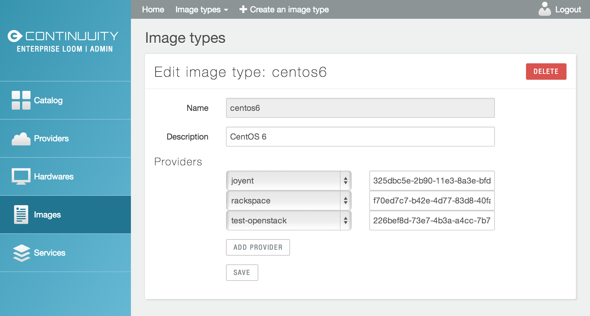

.. _cluster-services:
Managing Services
=================

The Services interface allows the administrator to select the software features and services that can be installed on a cluster.

The Services Home Screen
^^^^^^^^^^^^^^^^^^^^^^^^

The services' home screen lists the services currently configured by the administrators. The page also provides
delete and view/edit operations for each service.

Clicking on an item's name will take you to the 'Edit service' page for viewing more service details and
editing its configurations.

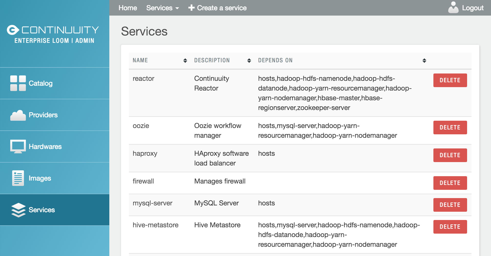

Creating a Service 
^^^^^^^^^^^^^^^^^^

Click on 'Create a service' on the top-left of the home screen to go to the Service creation page.
When adding a service, an administrator specifies the dependencies of the service on other services. In the
'Depends on' section, add each of the services which the current service depends upon. For example, Hadoop HDFS
DataNode requires a working Hadoop HDFS NameNode.

The administrator then defines the list of actions to occur or execute in order to make the service available
and operational on a cluster. Such actions may include install, remove, initialize, start, and stop. Loom currently supports
actions being performed through Chef recipes and shell scripts. You enter the location/name of the script or recipe 
in the text field labeled 'Script,' including any parameters script expects in the text field labeled 'Data'.
To add another action, click on 'Add,' and an additional section will be added below. Follow the same steps.

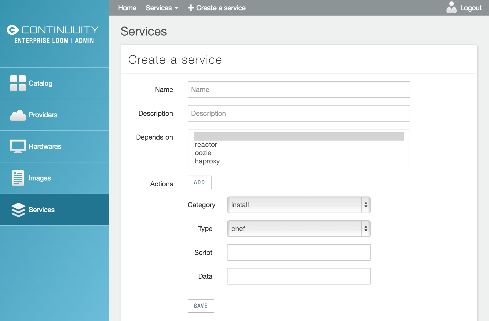

To add the new configuration to the list of services, click 'Create'.

Managing Existing Services
^^^^^^^^^^^^^^^^^^^^^^^^^^

An administrator can view/edit a provider by clicking on the service's name on the Home screen, or selecting 'Services'
**->** <name of the service> on the top-left of the page.

The edit service page provides a similar interface to the 'Create a service' screen. Current
settings for the service can be modified and deleted accordingly.

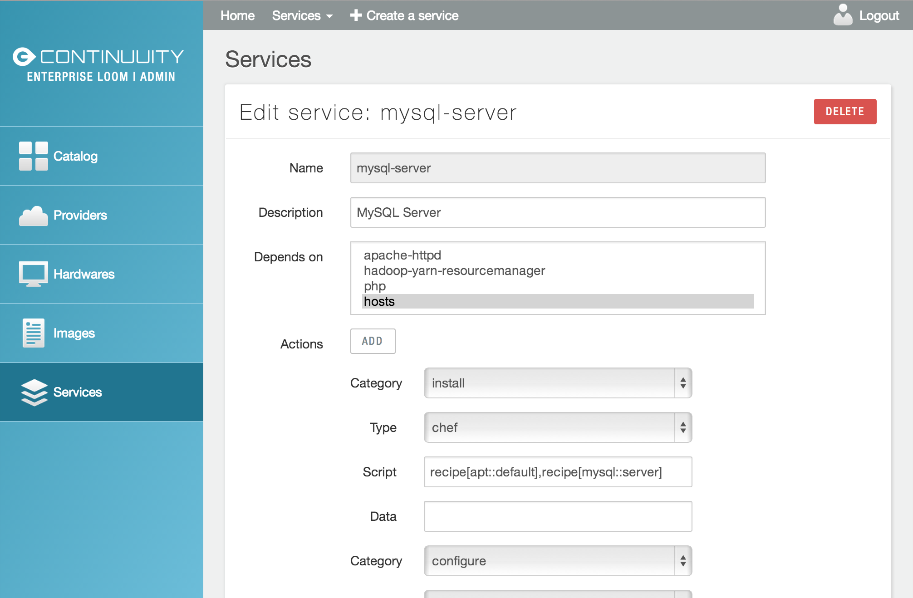

The Cluster Management Interface
================================

The Cluster page provides administrators a way to create, delete, and monitor the clusters created on their system.
The management page is virtually identical to that of the :doc:`User Home Screen </guide/user/index>`. The only
difference between the two pages is that the administrator's page shows all clusters across all users, while a user's
page shows only clusters they own.

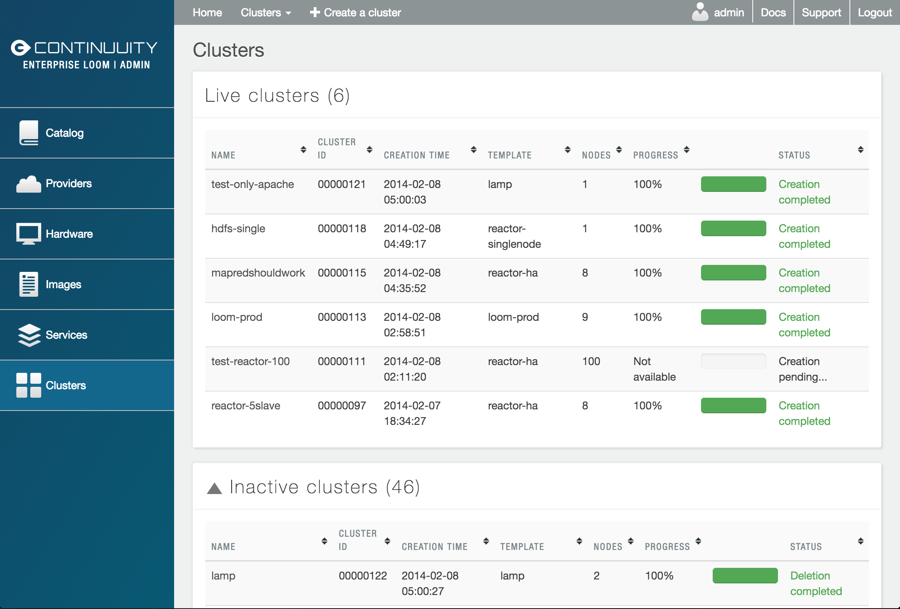

For more information on how to view, create, and delete clusters, please see the :doc:`User Guide </guide/user/index>`
page.
