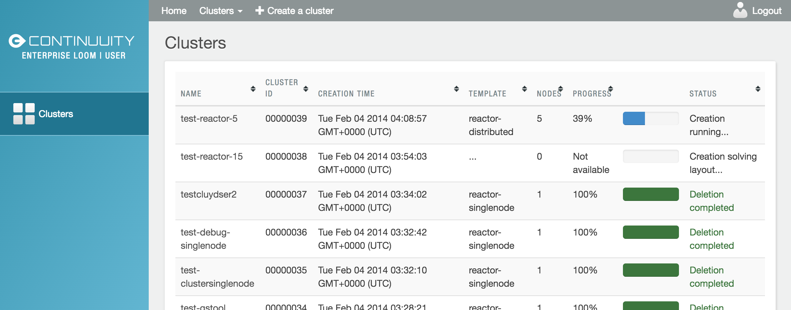
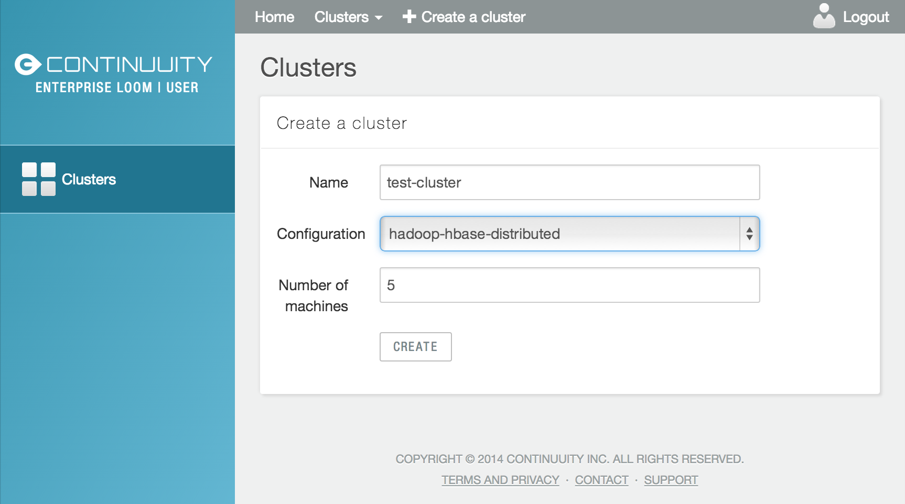
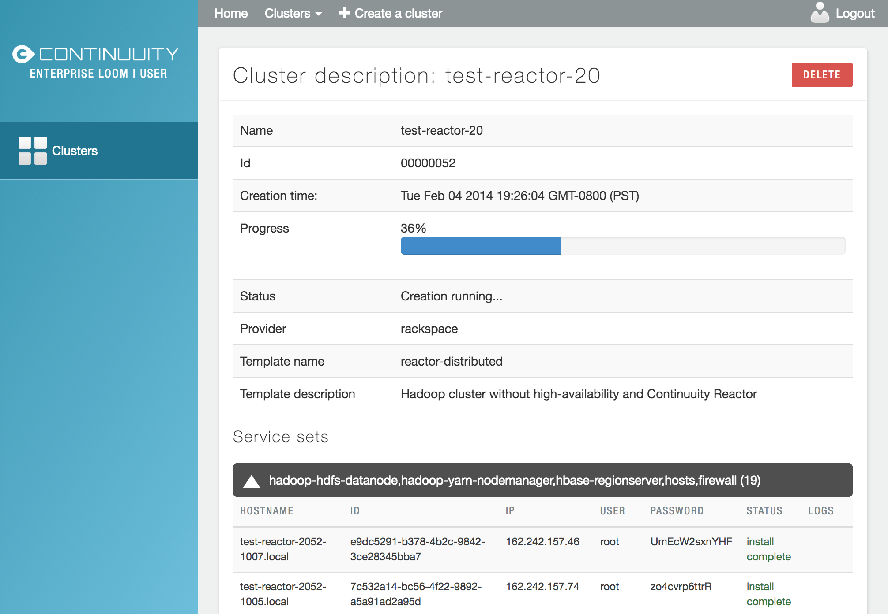
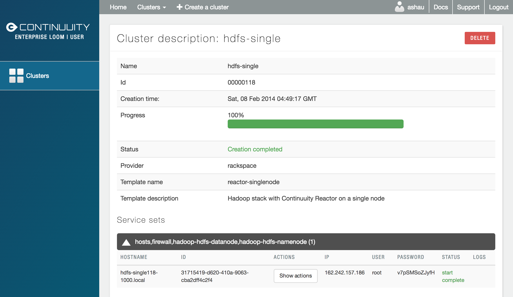
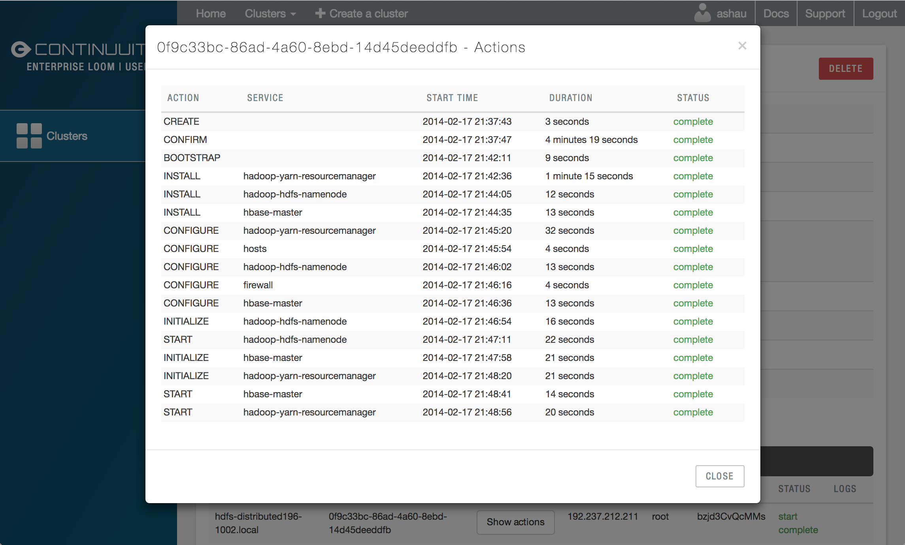

.. _guide_user_toplevel:

.. index::
   single: User Guide
==========
User Guide
==========

This page describes the different interfaces and functions that end users can use to manage their own set of clusters within Loom.
As mentioned earlier in the administration guide, all clusters and nodes within clusters are dictated by templates created by
the administrator, made accessible to individual users (or developers), and displayed in the Catalog. These accessible templates  
are users' blueprint for their individual cluster instantiation.

The User Home Screen
====================
Login to the Loom UI using your user credentials at ``http://<loom-host>:<loom-ui-port>/``.
This will take you to the user home screen, which shows a list of all clusters provisioned by a user. This page displays basic information for each cluster owned
by the user, such as current clusters, clusters under construction, and deleted clusters. Active and deleted clusters, however, 
are shown separately in this interface. Clicking on each of these items launches a separate screen with individual cluster 
description and detailed cluster information.

Provisioning a new Cluster
==========================
Users can provision a machine by selecting 'Create a cluster' on the top menu bar. Through this page, a user
can create a cluster with a given name and template setting (as defined by the system administrator), and specify the
number of nodes to allocate to the cluster.

For more information on how administrators can set templates for provisioning a cluster, see the :doc:`Administration
Guide </guide/admin/index>`).

Advanced Settings
-----------------

The Loom user interface has a number of advanced configuration options.
To access the advanced options, Click on the gray triangle next to the label 'Advanced'. This exposes the options to
explicitly specify the provider and image type to be used for the current cluster. The 'Config' field allows the user
to specify additional custom configurations in a JSON-formatted input (for more information, see
:doc:`Macros </guide/admin/macros>`). In addition, the 'Lease Duration' field allows the user to specify the duration,
in days, hours and minutes, that they want to lease the cluster for.

To start creating the cluster, click the 'Create' button at the bottom on the page.

The Cluster Description Screen
==============================
A user can view more details of a cluster by clicking on the cluster name on the Home screen, or by selecting
'Clusters' -> <name of the cluster> on the top-left of the screen. The cluster description page provides an up-to-date
status report of a cluster as well as a description of a cluster, including the template used
to create the cluster, the infrastructure provider, and the list of services installed.

To abort a cluster that is currently being created, click on 'Abort' next to the progress bar on this screen.

Examining and Accessing the Cluster
===================================
On the cluster description screen, nodes are grouped together by the set of services that are available on them.

To view the individual nodes under each service set, click on the white triangle next to the services. From the expanded
list, a user can obtain attributes about each node, including its hostname and ID. For certain providers, the list may
also show authentication credentials for accessing the nodes, through a service such as SSH.

To view the actions that have been performed on a particular node, click on the 'Show actions' button.

.. figure:: user-screenshot-6.png
    :align: center
    :width: 800px
    :alt: Show actions
    :figclass: align-center

The expanded list shows a list of attributes for each node. These nodes can now be
accessed using the corresponding IP addresses, usernames and passwords (through a service such as SSH).

Deleting a Cluster
------------------
The 'Delete' button on the cluster description page deletes the data on the cluster and decommissions the associated
nodes. Clusters that are successfully deleted are moved from the 'Live clusters' list to 'Inactive clusters' on the
user's home screen.
