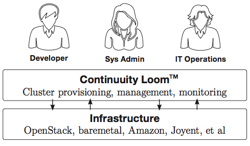

.. _overview_toplevel:

.. include:: ../toplevel-links.rst
========
Overview
========

.. _overview:

Loom is a cluster provisioning system designed bottom up with the intent of supporting current and future day
complex clusters and their lifecycle management within public and private clouds. Loom streamlines the process
of cluster provisioning, reducing the amount of work necessary for system administrators and developers within
an IT organization by making it seamless to configure complex cluster templates and their instantiation by the users.

Loom exposes two main interfaces, namely 

* Administrative or Provider interfaces &
* User or Developer interface. 

Administrative or Provider interface makes it easy for creating and mantaining complex cluster templates (think 
of them as cluster blueprints) across multiple cloud (IaaS) providers. Cluster templates configured by system 
administrators are exposed to Developers or Users allowing them to seamless build complex clusters on fly. It's 
supports a complete self-service model.

Loom was designed bottom-up with Cluster as the basic indivisible element supported by operations like create, delete, 
amend, update & monitor. Inspite of system being complex, it expose simpler to use web services that allows easy 
integrations with language or UI assets of your choice. It's also built with DevOps and IT tools in mind, it's highly 
flexible (in terms of lifecycle hooks) and pluggable (integrates with chef, puppet or that matter any automation tool in mind).

.. _why-loom:
Who needs Loom ?
====================

Cluster management is one of the fastest growing and most complex areas of Big Data. Loom is the next-generation 
provisioning, management, monitoring, metering and elastic scaling software for any type of cluster.
It’s easy, fast and secure to manage cluster lifecycle right from a developer workstation, whether the cluster 
is physical, virtual or in the cloud. Loom gives developers and operations control by delivering frictionless ways
to provision and manage clusters. No more filing tickets or fighting to configure complicated clusters - supports total 
self service model. It allows developers to go from zero to a working cluster in less than 10 minutes. Loom makes 
developers, system administrators and IT more productive than ever. 

Loom can also be used in a cloud environment for providing higher order services to end users. Rather than talking 
in terms of individual machines, Loom talks in terms of clusters and services. Current and future problems will 
be more focused around not manging individual machines, but more around managing clusters of machines or clusters 
of cluster.

.. _history-of-loom:
History of Loom
===============

Loom came out of the problem that we were facing within Continuuity in terms of 

.. _where-is-loom-deployed:
Where is Loom deployed
=======================
Loom currently runs in production for cloud provisioning of Reactor Sandboxes at Continuuity and also as an internal 
IT tool used by developers for testing new and incremental features on daily basis. It is also used within Continuuity 
build system through Web service APIs for provisioning multi-node reactor clusters for performing functional tests.
