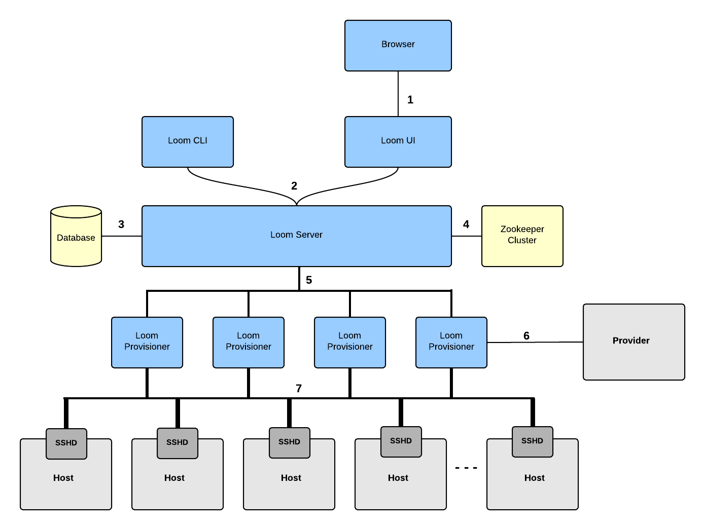

:orphan:

.. _plugin-reference:

.. index::
   single: Security
===================
Security
===================

At Continuuity, we take security very seriously and invest a lot of time to make sure we secure communication between 
different aspects of any system that we build. Loom beta release does not include a lot of much needed security features, 
but upcoming releases of Loom will make it secure and more reliable for provisioning clusters. This document describes how 
we are planning to secure different aspects of Loom.

Communication Channels
======================

 * 1 - Browser to Loom UI (Node.js)
  * Uses TLS/SSL.
 * 2 - User REST APIs
  * Uses TLS/SSL.
 * 3 - Loom Server to Database
  * Uses TLS/SSL.
  * We recommend firewalling databases
 * 4 - Loom Server to Zookeeper.
  * Uses SASL.
  * We recommend firewalling Zookeeper.
 * 5 - Loom Server to Provisioners
  * Uses mutual authentication with TLS/SSL. 
 * 6 - Provisioners to Providers
  * Provider specific security settings.
 * 7 - Provisioners to Nodes
  * All communication is pushed from provisioner to nodes with SSH.
 * 8 - Intra-Node
  * We recommend firewalling nodes to limit cross cluster communication.  
  * Configurable firewall support included out of the box through a firewall service.  Different clusters can be configured differently through configuration changes when a cluster is requested.

Data Stores
===========

 * Zookeeper
  * Kerberos support.
  * ACLs set on znodes so only loom user can read/write.

 * Database
  * Setup permissions so only loom user from Loom server hosts can read/write from the database.
  * Encryption of sensitive data.

Loom Components
===============

 * Loom Server
  * Database password encryption in configuration file.
  * Integration with external user management systems like LDAP.  
  * User REST APIs require a user ID in the headers, used for authentication and authorization.
  * User REST APIs use group level ACLs on Loom resources (providers, templates, clusters, etc) to authorize actions.
  * ACLs modifiable by admin or users with grant level access on Loom resources. 
  * All cluster tasks are persistently stored to support audit logging of full details of all user actions and resource allocations. 
 * Loom Provisioner
  * Encryption of provider credentials.
  * Shell provisioners only allowed to run pre-defined set of scripts and not arbitrary commands.
  * Provisioner REST APIs require mutual authentication with TLS/SSL to ensure only valid provisioners can take tasks from the server.
 * Loom UI
  * XSS protection.
  * CSRF protection.
